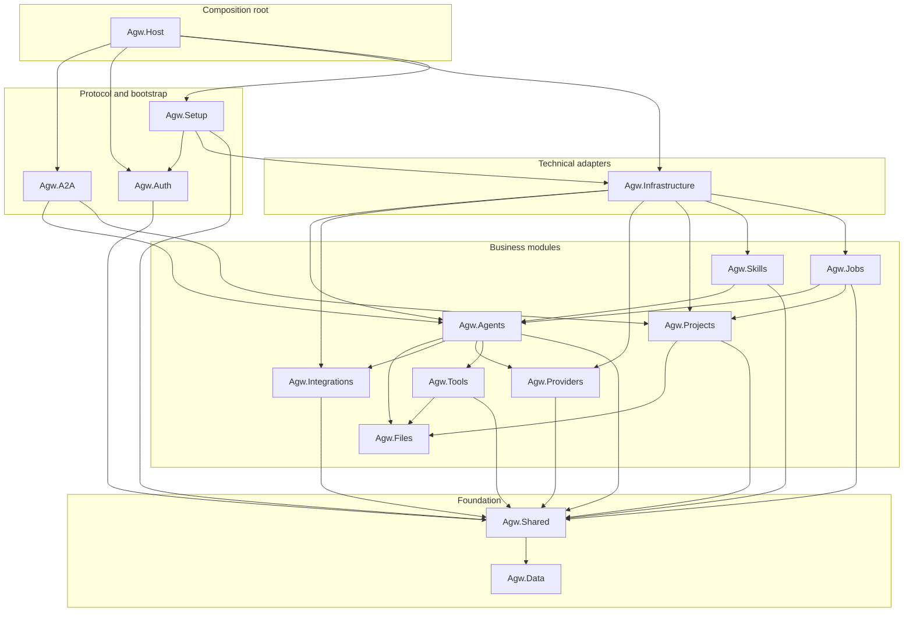

# Agw

[中文文档](README.zh-CN.md) | [Documentation](README.md)

[](https://github.com/zxyao145/agw/releases)
[](https://github.com/zxyao145/agw/pkgs/container/agw)

Agw is a self-hosted backend engineering agent hub for individuals and small R&D teams, as well as an AaaS (Agent as a Service) platform and agent gateway. It lets users work with multiple agents from a single UI:

- Create custom agents
- Integrate external agents, such as Claude Code and Codex

Agw also provides Jobs and Agent Workflow (Agentflow) capabilities for creating scheduled and recurring tasks and orchestrating agents.

This project is primarily built on [MAF](https://github.com/microsoft/agent-framework).

## Use Cases

### Multi-Agent Collaboration Workflows (Agentflows)

Agentflows are suitable for relatively well-defined, decomposable knowledge work, such as:

```
Research Agent
        ↓
Analysis Agent
        ↓
Content Generation Agent
        ↓
Human Approval
        ↓
Publishing/Archiving Agent
```

> [!NOTE]
> The current orchestration capabilities are still fairly basic. They work best for sequential, parallel, handoff, and human-approval workflows, and are less suitable for highly dynamic groups of agents that require deep autonomous planning.

### Human-Agent Collaboration Platform

The Jobs capability can support workflows such as:

```
Human: Creates a task
        ↓
Agent: Claims the task
        ↓
Agent: Executes the task
        ↓
Human: Reviews the task
```

### Task Automation Platform

With Jobs, Integrations, and project context, Agw can automate:

- Daily operational data summaries
- GitHub issue and pull request classification and summaries
- Periodic checks for dependencies, security issues, or documentation drift
- Customer service record organization
- Weekly reports, daily reports, and release notes
- Scheduled information retrieval and updates to internal systems

Jobs combine agent reasoning, tool permissions, context, and persistent execution records, making them more valuable than ordinary Cron jobs.

### Cloud Desktop Environments

Agw can serve as an agent control plane for Cloud Desktop environments, allowing AI to continuously and securely perform development and automation tasks in isolated cloud workspaces while centrally managing models, tools, scheduling, approvals, and execution records.

## Tech Stack

Backend:

- .NET 10
- ASP.NET Core
- Entity Framework Core
- Microsoft.Agents.AI
- Serilog + OpenTelemetry

Frontend:

- Next.js 16 App Router
- React 19
- Tailwind CSS 4
- Shadcn 4 (Radix UI)

Desktop:

- Electron 43 + Electron Forge
- Full installers with a current-user Server daemon, or Client-only installers
- Windows x64 Setup and portable Client packages, macOS x64/arm64 DMGs, and Ubuntu x64 DEBs

## Usage

Start the backend from the repository root:

```bash
dotnet restore Agw.slnx
dotnet run --project src/server/Agw.Host
```

The development backend listens on `http://localhost:30816` by default. On the first run, open `http://localhost:30816/setup` to choose Standalone or Cluster deployment, enter structured SQLite or PostgreSQL settings, and create the administrator password. Unattended deployments may provide the same fields under the `Setup` configuration section when no `server-state.json` exists; inject passwords through environment variables or Secrets. Cluster deployment requires PostgreSQL and a Server restart after setup. All runtime data is stored in an `agw` directory under the current user's home directory. Setup through a domain name also requires the one-time setup code printed in the server startup logs.

Start the frontend in another terminal:

```bash
cd src/clients
pnpm install
pnpm dev:web
```

The `src/clients` pnpm Workspace contains independent `@agw/web` and `@agw/desktop` applications plus shared infrastructure and business domains under `src/clients/packages/`, with Turborepo orchestrating their tasks. Neither application imports, builds, or consumes artifacts from the other. Each application owns its own thin Next.js route shell; reusable business UI comes from `packages/*`. The Expo mobile app remains a separate npm workspace. After the backend and Web are running, open `http://localhost:3001`. Web proxies `/api/*` and `/openapi/*` to the backend. The proxy target is resolved from `BACKEND_API_BASE_URL`, then `NEXT_PUBLIC_API_BASE_URL`, and defaults to `http://localhost:30816`.

Production packages embed the static Web UI in ASP.NET Core and serve it from a single server process. See the deployment guide below for details.

Agw Desktop owns a secure Electron main/preload implementation and an independent React renderer under `src/clients/desktop/renderer/`. The renderer composes the same business packages as Web, while the Electron bridge contracts remain internal to Desktop under `src/shared/contracts/`. Desktop builds and packages its own static export without locating `web/`. See [`src/clients/desktop/README.md`](src/clients/desktop/README.md) for its runtime model, package variants, and release workflow.

A typical local workflow is:

1. If the backend redirects to `/setup`, complete the first-run setup.
2. Configure providers, models, and model-provider links under `Providers`, `Models`, and `Model Providers`.
3. Create an agent under `Agents`, then attach MCP tool servers, tools, skills, or integrated apps as needed.
4. Use `Chat` or `Projects` to run agent sessions and review the persisted task history.
5. Use `Agentflows` for multi-agent orchestration and `Jobs` for scheduled or recurring tasks.

### Project workspaces

Each `Project.Workspace` must be a directory visible to the Agw Server process. The file API, Git operations, Claude Code, and Codex use the same local working tree. To use network storage, mount it through the operating system or container platform first and configure the mount path as the Workspace; Agw does not provide an application-level SFTP backend. Restart the Server after changing a Workspace that has already been used.

## Development

Install the .NET 10 SDK, Node.js 24, and pnpm 11.7.0. Docker with Buildx is needed only when building container images. After cloning the repository, configure the Git hooks and install both backend and client dependencies:

```bash
git config core.hooksPath .githooks
dotnet restore Agw.slnx

cd src/clients
pnpm install
```

Run the backend with hot reload from the repository root, then start Web from `src/clients` in another terminal:

```bash
dotnet watch --project src/server/Agw.Host
```

```bash
cd src/clients
pnpm dev:web
```

To develop Desktop instead of Web, keep the backend running and use `pnpm dev:desktop` from `src/clients`. The Desktop renderer runs on `http://localhost:3000`; it does not require the Web development server.

Run the main verification commands before submitting a change:

```bash
# Repository root
dotnet build Agw.slnx
dotnet test Agw.slnx
dotnet format Agw.slnx --verify-no-changes

# src/clients
pnpm build
pnpm lint
pnpm test
pnpm fmt:check
```

After changing a backend API contract, run `pnpm gen:api` from `src/clients` to regenerate the typed client. See the [Development Guide](docs/1.Development.md) for focused test commands, code conventions, EF Core migration commands, and package-specific tasks.

## Debugging

- **Backend:** Start `src/server/Agw.Host` with the `http` or `https` launch profile in a .NET debugger. Both profiles set `ASPNETCORE_ENVIRONMENT=Development`; the Development-only OpenAPI and Scalar endpoints are then available from the backend. Server logs are written to the console and to `$AGW_DATA_DIR/logs/application-*.log`, or `~/agw/logs/` when `AGW_DATA_DIR` is not set.
- **Web:** Run `pnpm dev:web`, use the browser developer tools for client code and network requests, and inspect the Next.js terminal for server-side output. To target another backend, start Web with `BACKEND_API_BASE_URL=http://host:port pnpm dev:web`.
- **Desktop:** Run `pnpm dev:desktop`. Main-process logs and build output appear in the terminal; preload and renderer code can be inspected with Electron DevTools. The development renderer uses `http://localhost:3000`.
- **Focused tests:** Use `dotnet test tests/<Project> --filter "FullyQualifiedName~MethodName"` for a backend test, or `pnpm exec turbo run test --filter=@agw/web` (replace the package filter as needed) from `src/clients`.

## Publishing

Run the verification commands above before producing artifacts. Local Server and container builds are driven by `publish.sh` from the repository root:

```bash
# Self-contained Server archive for one runtime
PUBLISH_MODE=portable APP_VERSION=0.1.0 RIDS=linux-x64 ./publish.sh

# Loadable Docker archive for one platform
PUBLISH_MODE=docker \
APP_VERSION=0.1.0 \
IMAGE_NAME=agw:0.1.0 \
DOCKER_PLATFORMS=linux/amd64 \
./publish.sh
```

Artifacts are written below `artifacts/publish/`. Omit `RIDS` or `DOCKER_PLATFORMS` to build the default platform matrices, or use `PUBLISH_MODE=all` to build both portable Server packages and Docker images.

Build a Desktop release installer from `src/clients` with Node.js 24:

```bash
pnpm release:desktop -- --flavor full --arch x64 --version 0.1.0
pnpm release:desktop -- --flavor client --arch x64 --version 0.1.0
```

Desktop artifacts are collected under `src/clients/desktop/release-artifacts/`. Windows and Linux currently support x64; macOS supports x64 and arm64.

The `flavor` identifies what is included:

- `full`: Desktop plus a bundled self-contained Server installed as a current-user daemon.
- `client`: Desktop only. It connects to an existing Server. On Windows, this flavor is available as both a Setup EXE and a portable ZIP; extract the ZIP and run `agw-desktop.exe` without installing it.

GitHub Release Asset names use this format:

```text
Agw-Desktop-{version}-{flavor}-{platform}-{arch}{variant}.{extension}
```

`version` omits the leading `v`; `platform` is `windows`, `macos`, or `linux`; and `arch` is `x64` or `arm64`. Windows uses the `-Setup.exe` variant, while the portable Client uses `-Portable.zip`. DMG and DEB assets have no variant suffix. Examples:

```text
Agw-Desktop-0.2.0-preview.1-full-windows-x64-Setup.exe
Agw-Desktop-0.2.0-preview.1-client-windows-x64-Portable.zip
Agw-Desktop-0.2.0-preview.1-client-macos-arm64.dmg
```

The same release publishes the multi-platform Server image as `ghcr.io/zxyao145/agw:{version}` for `linux/amd64` and `linux/arm64`.

For an official stable release, push a `vX.Y.Z` tag, for example:

```bash
git tag v0.1.0
git push origin v0.1.0
```

The [release workflow](.github/workflows/release.yml) publishes Linux amd64/arm64 images to GHCR and creates a GitHub Release containing all Desktop assets. A manual release requires a valid `release_tag`. The [Desktop build workflow](.github/workflows/build-desktop.yml) builds temporary Desktop assets on pushes to `main` and manual runs. See the [Deployment Guide](docs/4.Deployment.md) for image loading, registry publishing, data directories, reverse proxies, and upgrades.

## Screenshots

The following screenshots show the main Agw interfaces:

### Providers


### Agents


### Tools & MCP


### Skills


### Integrations


### Chat


### Chat Workspace Files


### Projects


### Jobs


### Agentflows


## Architecture

Agw uses a domain-based modular monolith architecture. `src/server/Agw.Host` is the ASP.NET Core application entry point and assembles the modules. The pnpm Workspace at `src/clients` contains the Web and Electron Desktop applications plus shared business and infrastructure packages, while the Expo mobile client remains separate in `src/clients/mobile`.

A typical backend flow is:

```text
Controller -> AppService / RuntimeService -> DomainService -> IRepository / IUnitOfWork -> EF Core
```

Module overview (direct in-repository project references; `A --> B` means A references B):



- Agw.Providers
  Manages models and their providers.

- Agw.Agents
  Integrates external agents, such as Claude Code and Codex, and manages custom agents. Custom agents can integrate tools, MCP, and skills.

- Agw.Tools
  Manages built-in tools and MCP tools.

- Agw.Skills
  Manages skills.

- Agw.Integrations
  Manages external app integrations.

- Agw.Projects
  Manages agent conversation history and sessions. In Agw, a session corresponds to a task, and every task is associated with a project.

- Agw.Files
  Provides project-scoped file APIs and Git operations over the host-visible local Workspace.

- Agw.Jobs
  Provides scheduled, recurring, and one-time tasks, with support for Cron expressions.

- One-time tasks: Run once after they are created and are then disabled.

- Scheduled tasks: Run at a specified time and are disabled after that execution.

- Recurring tasks: Run repeatedly on a fixed schedule at specified times.

- Agw.A2A

Exposes the system through the A2A protocol.

## Documentation

- [Deployment Guide](docs/4.Deployment.md): Single-process server, local packages, Docker, domain proxying, data directories, and upgrades.

Detailed project documentation is available under [`docs/`](docs/):

- [Development Guide](docs/1.Development.md): Local environment setup, build/test/lint/format commands, and Git hook configuration.
- [Architecture](docs/2.Architecture.md): System overview, backend and frontend architecture, and core domain concepts.
- [Module Organization](docs/3.Module%20Organization.md): Layering principles used within modules.
- [Chat Suggestions Design](docs/5.Chat%20Suggestions.md): Agent-aware slash commands, Claude init commands, file suggestions, and failure fallback behavior.
- [Agent Execution Flow](docs/ws-flow.md): SignalR commands, turn messages, runtime lifecycle, and disconnection behavior.
- [Execution Subsystem](src/server/Agw.Agents/Execution/README.md): Directory responsibilities, data flow, and command extension methods.
- [Files Module](src/server/Agw.Files/README.zh-CN.md): Project workspace resolution, path boundaries, Git behavior, and mount requirements.

## Configuration

Primary backend settings are located in [`src/server/Agw.Host/appsettings.json`](src/server/Agw.Host/appsettings.json):

```json
{
  "Database": {
    "Provider": "sqlite",
    "ConnectionString": "Data Source=agw.db"
  },
  "DistributedLock": {
    "Provider": null,
    "ConnectionString": ""
  },
  "OpenTelemetry": {
    "ServiceName": "Agw",
    "ServiceVersion": "1.0.0",
    "OtlpEndpoint": "http://localhost:4317"
  }
}
```

- Supported database providers are `sqlite` and `postgres`.
- Supported distributed execution lock providers are `inmemory` and `postgres`. When `DistributedLock:Provider` is `null` or absent, SQLite uses an in-process lock, while PostgreSQL uses an advisory lock. If the PostgreSQL lock connection string is empty, it reuses `Database:ConnectionString`.
- Do not store secrets in static configuration files; prefer environment variable overrides.

## License

Additional restrictions have been added on top of the Apache License 2.0. Personal use and internal enterprise use are unrestricted. See [LICENSE](LICENSE) for details.
