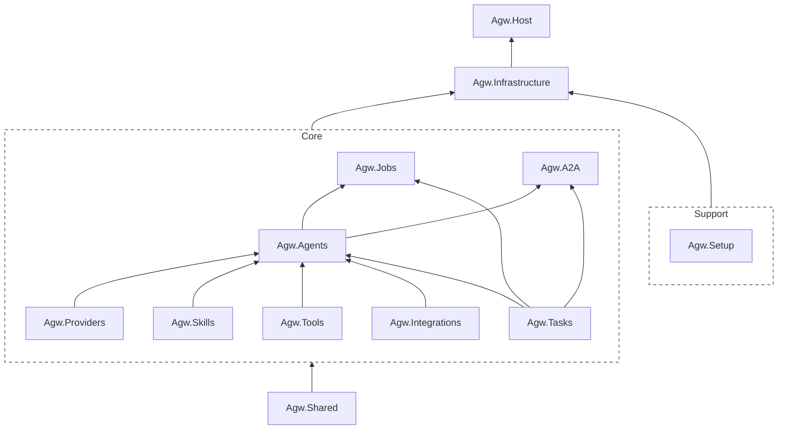

# Agw

[中文文档](README.zh-CN.md) | [Documentation](README.md)


Agw is an AssS (Agent as a Service) platform and agent gateway that allows users to create custom agents and integrate existing external agents (such as Claude Code and Codex).

In addition, Agw offers Cron Job and Agent Workflow capabilities, which can be used to create scheduled tasks, recurring tasks, and orchestrate Agents (currently, only simple orchestration is supported).

This project is primarily based on [MAF](https://github.com/microsoft/agent-framework).

## Tech Stack

Backend:

- .NET 10
- ASP.NET Core
- Entity Framework Core
- Microsoft.Agents.AI
- Serilog + OpenTelemetry

Frontend:

- Next.js 16 App Router
- React 19
- Tailwind CSS 4
- Shadcn 4 （Radix UI）

## Architecture

Agw uses a domain-based, modular monolithic architecture. `src/backend/Agw.Host` serves as the entry point for the ASP.NET Core application and is responsible for assembling the various modules; the frontend is located in the `src/frontend/web` directory.

A typical backend flow is:

```text
Controller -> AppService / RuntimeService -> DomainService -> IRepository / IUnitOfWork -> EF Core
```

Module Overview:



- [x] Agw.Providers  
  Used to manage models and their providers.

- [x] Agw.Agents  
  Integrate external agents (such as Claude Code and Codex) and manage custom agents. 
  Custom agents can support the integration of tools, MCPs, and skills.

- [x] Agw.Tools  
  Includes built-in Tool and MCP Tool management modules.

- [x] Agw.Skills  
  Skill Management Module.

- [x] Agw.Integrations  
  External App Integration Module.

- [x] Agw.Tasks  
  Agent Conversation and Session Management Module. 
  In AGW, each session corresponds to a task, and each task is associated with a project.

- [x] Agw.Jobs  
  Provides the ability to schedule recurring, periodic, and one-time tasks, with support for Cron expressions.
  
  - One-time task: Once created, it will be disabled after being executed once.
  
  - Scheduled task: Runs at a specified time and is disabled after execution.
  
  - Scheduled tasks: Tasks that are repeated at specified times on a regular basis.

- [ ] Agw.A2A

Provides an interface for the A2A protocol to external systems.

## Documentation

The detailed project docs live under [`docs/`](docs/):

- [Development Guide](docs/1.%20Development.md): local setup, build/test/lint/format commands, and git hook configuration.
- [Architecture](docs/2.%20Architecture.md): system overview, backend/frontend structure, and core domain concepts.
- [Module Organization](docs/3.%20Module%20Organization.md): layering principles used inside modules.

## Configuration

Primary backend settings are in [`src/backend/Agw.Host/appsettings.json`](src/backend/Agw.Host/appsettings.json):

```json
{
  "Database": {
    "Provider": "sqlite",
    "ConnectionString": "Data Source=agw.db"
  },
  "OpenTelemetry": {
    "ServiceName": "Agw",
    "ServiceVersion": "1.0.0",
    "OtlpEndpoint": "http://localhost:4317"
  }
}
```

- Supported database providers are `sqlite` and `postgres`.
- Keep secrets out of committed config files; prefer environment-variable overrides.
- After backend contract changes, regenerate `src/frontend/web/src/api/openapi.d.ts` with `pnpm gen:openapi`.
