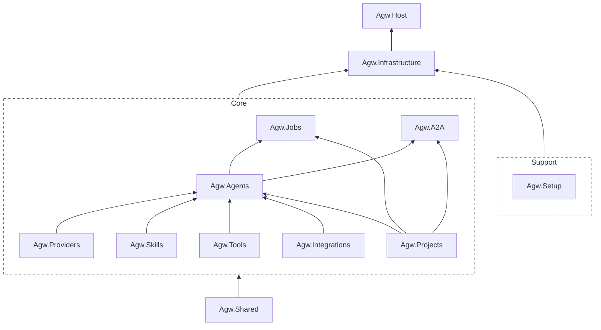

# Agw

[中文文档](README.zh-CN.md) | [Documentation](README.md)

Agw is a self-hosted backend engineering agent hub for individuals and small R&D teams, as well as an AssS (Agent as a Service) platform and agent gateway. It lets users work with multiple agents from a single UI:

- Create custom agents
- Integrate external agents, such as Claude Code and Codex

Agw also provides Jobs and Agent Workflow (Agentflow) capabilities for creating scheduled and recurring tasks and orchestrating agents.

This project is primarily built on [MAF](https://github.com/microsoft/agent-framework).

## Use Cases

### Multi-Agent Collaboration Workflows (Agentflows)

Agentflows are suitable for relatively well-defined, decomposable knowledge work, such as:

```
Research Agent
        ↓
Analysis Agent
        ↓
Content Generation Agent
        ↓
Human Approval
        ↓
Publishing/Archiving Agent
```

> [!NOTE]
> The current orchestration capabilities are still fairly basic. They work best for sequential, parallel, handoff, and human-approval workflows, and are less suitable for highly dynamic groups of agents that require deep autonomous planning.

### Human-Agent Collaboration Platform

The Jobs capability can support workflows such as:

```
Human: Creates a task
        ↓
Agent: Claims the task
        ↓
Agent: Executes the task
        ↓
Human: Reviews the task
```

### Task Automation Platform

With Jobs, Integrations, and project context, Agw can automate:

- Daily operational data summaries
- GitHub issue and pull request classification and summaries
- Periodic checks for dependencies, security issues, or documentation drift
- Customer service record organization
- Weekly reports, daily reports, and release notes
- Scheduled information retrieval and updates to internal systems

Jobs combine agent reasoning, tool permissions, context, and persistent execution records, making them more valuable than ordinary Cron jobs.

### Cloud Desktop Environments

Agw can serve as an agent control plane for Cloud Desktop environments, allowing AI to continuously and securely perform development and automation tasks in isolated cloud workspaces while centrally managing models, tools, scheduling, approvals, and execution records.

## Tech Stack

Backend:

- .NET 10
- ASP.NET Core
- Entity Framework Core
- Microsoft.Agents.AI
- Serilog + OpenTelemetry

Frontend:

- Next.js 16 App Router
- React 19
- Tailwind CSS 4
- Shadcn 4 (Radix UI)

## Usage

Start the backend from the repository root:

```bash
dotnet restore Agw.slnx
dotnet run --project src/server/Agw.Host
```

The development backend listens on `http://localhost:5015` by default. On the first run, open `http://localhost:5015/setup` to choose the database provider, connection string, and administrator password. All runtime data is stored in an `agw` directory under the current user's home directory. Setup through a domain name also requires the one-time setup code printed in the server startup logs.

Start the frontend in another terminal:

```bash
cd src/clients/web
pnpm install
pnpm dev
```

After both services are running, open `http://localhost:3000`. The Next.js development server proxies `/api/*` and `/openapi/*` to the backend. The proxy target is resolved from `BACKEND_API_BASE_URL`, then `NEXT_PUBLIC_API_BASE_URL`, and defaults to `http://localhost:5015`.

Production packages embed the static Web UI in ASP.NET Core and serve it from a single server process. See the deployment guide below for details.

A typical local workflow is:

1. If the backend redirects to `/setup`, complete the first-run setup.
2. Configure providers, models, and model-provider links under `Providers`, `Models`, and `Model Providers`.
3. Create an agent under `Agents`, then attach MCP tool servers, tools, skills, or integrated apps as needed.
4. Use `Chat` or `Projects` to run agent sessions and review the persisted task history.
5. Use `Agentflows` for multi-agent orchestration and `Jobs` for scheduled or recurring tasks.

## Screenshots

The following screenshots show the main Agw interfaces:

### Providers


### Agents


### Tools & MCP


### Skills


### Integrations


### Chat


### Chat Workspace Files


### Projects


### Jobs


### Agentflows


## Architecture

Agw uses a domain-based modular monolith architecture. `src/server/Agw.Host` is the ASP.NET Core application entry point and assembles the modules. The Web client is located in `src/clients/web`, and the Expo mobile client is in `src/clients/mobile`.

A typical backend flow is:

```text
Controller -> AppService / RuntimeService -> DomainService -> IRepository / IUnitOfWork -> EF Core
```

Module overview:



- Agw.Providers
  Manages models and their providers.

- Agw.Agents
  Integrates external agents, such as Claude Code and Codex, and manages custom agents. Custom agents can integrate tools, MCP, and skills.

- Agw.Tools
  Manages built-in tools and MCP tools.

- Agw.Skills
  Manages skills.

- Agw.Integrations
  Manages external app integrations.

- Agw.Projects
  Manages agent conversation history and sessions. In Agw, a session corresponds to a task, and every task is associated with a project.

- Agw.Jobs
  Provides scheduled, recurring, and one-time tasks, with support for Cron expressions.

- One-time tasks: Run once after they are created and are then disabled.

- Scheduled tasks: Run at a specified time and are disabled after that execution.

- Recurring tasks: Run repeatedly on a fixed schedule at specified times.

- Agw.A2A

Exposes the system through the A2A protocol.

## Documentation

- [Deployment Guide](docs/4.Deployment.md): Single-process server, local packages, Docker, domain proxying, data directories, and upgrades.

Detailed project documentation is available under [`docs/`](docs/):

- [Development Guide](docs/1.Development.md): Local environment setup, build/test/lint/format commands, and Git hook configuration.
- [Architecture](docs/2.Architecture.md): System overview, backend and frontend architecture, and core domain concepts.
- [Module Organization](docs/3.Module%20Organization.md): Layering principles used within modules.
- [Chat Suggestions Design](docs/5.Chat%20Suggestions.md): Agent-aware slash commands, Claude init commands, file suggestions, and failure fallback behavior.
- [Agent Execution Flow](docs/ws-flow.md): SignalR commands, turn messages, runtime lifecycle, and disconnection behavior.
- [Execution Subsystem](src/server/Agw.Agents/Execution/README.md): Directory responsibilities, data flow, and command extension methods.

## Configuration

Primary backend settings are located in [`src/server/Agw.Host/appsettings.json`](src/server/Agw.Host/appsettings.json):

```json
{
  "Database": {
    "Provider": "sqlite",
    "ConnectionString": "Data Source=agw.db"
  },
  "DistributedLock": {
    "Provider": null,
    "ConnectionString": ""
  },
  "OpenTelemetry": {
    "ServiceName": "Agw",
    "ServiceVersion": "1.0.0",
    "OtlpEndpoint": "http://localhost:4317"
  }
}
```

- Supported database providers are `sqlite` and `postgres`.
- Supported distributed execution lock providers are `inmemory` and `postgres`. When `DistributedLock:Provider` is `null` or absent, SQLite uses an in-process lock, while PostgreSQL uses an advisory lock. If the PostgreSQL lock connection string is empty, it reuses `Database:ConnectionString`.
- Do not store secrets in static configuration files; prefer environment variable overrides.

## License

Additional restrictions have been added on top of the Apache License 2.0. Personal use and internal enterprise use are unrestricted. See [LICENSE](LICENSE) for details.
