# Agw

[中文文档](README.zh-CN.md) | [Documentation](README.md)

[](https://github.com/zxyao145/agw/releases)
[](https://github.com/zxyao145/agw/pkgs/container/agw)

Agw is a self-hosted backend engineering agent hub for individuals and small R&D teams, as well as an AaaS (Agent as a Service) platform and agent gateway. It lets users work with multiple agents from a single UI:

- Create custom agents
- Integrate external agents: Claude Code, Codex, and Pi

Agw also provides Jobs and Agent Workflow (Agentflow) capabilities for creating scheduled and recurring tasks and orchestrating agents.

This project is primarily built on [MAF](https://github.com/microsoft/agent-framework). Visit the [website](https://agw-ai.dev/) and [documentation](https://docs.agw-ai.dev/).

> [!NOTE]
> Agw currently has no sandbox isolation and is intended only for trusted small teams or deployments in trusted environments.

## Features

- **Custom agents:** Combine a model, instructions, Tools, MCP tool servers, Skills, and Integration connections. A Response Schema makes the final reply a JSON object, and the Mode ToolBlock adds Plan and Execute modes.
- **External agents:** Run Claude Code, Codex, or Pi, optionally through a Model Provider configured in Agw.
- **Chat and Projects:** Conversations belong to Projects. Chat accepts images, lets you switch agents within one conversation, asks for tool approval according to the permission mode, and queues new input while a turn is running. The Files view browses the Project Workspace, shows Git changes, and sends line comments back to the agent.
- **Agentflows:** Connect Agents, nested Agentflows, Human Gates, and concurrent, handoff, group-chat, and Magentic blocks into an executable graph with checkpoints.
- **Jobs:** Run an Agent or Agentflow once, at a fixed interval, or on a Cron schedule evaluated in UTC, with retries and per-attempt execution logs.
- **Integrations:** Create per-user Connections from built-in Integrations (OAuth 2.0, API Key, or AK/SK), including GitHub, and bind them to Agents and Projects.
- **Memory:** User Memory and Project Memory let agents save and reuse preferences and project knowledge.
- **Authentication:** Administrator password, named API Tokens, and optional OIDC or OAuth2 sign-in. Each third-party account becomes an isolated local user.
- **A2A:** Agents are available through the A2A protocol.
- **Clients:** Web, Electron Desktop (Windows, macOS, Linux), and Expo Mobile (iOS, Android).
- **Deployment:** A Standalone Server, or separate Control Plane and Data Plane Hosts that share PostgreSQL.

## Use Cases

### Multi-Agent Collaboration Workflows (Agentflows)

Agentflows are suitable for relatively well-defined, decomposable knowledge work, such as:

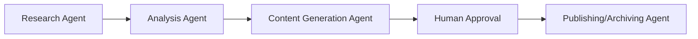
```mermaid
flowchart LR
    research["Research Agent"] --> analysis["Analysis Agent"]
    analysis --> content["Content Generation Agent"]
    content --> approval["Human Approval"]
    approval --> publish["Publishing/Archiving Agent"]
```

### Human-Agent Collaboration Platform

The Jobs capability can support workflows such as:

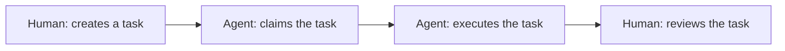
```mermaid
flowchart LR
    create["Human: creates a task"] --> claim["Agent: claims the task"]
    claim --> execute["Agent: executes the task"]
    execute --> review["Human: reviews the task"]
```

### Task Automation Platform

With Jobs, Integrations, and project context, Agw can automate:

- Daily operational data summaries
- GitHub issue and pull request classification and summaries
- Periodic checks for dependencies, security issues, or documentation drift
- Customer service record organization
- Weekly reports, daily reports, and release notes
- Scheduled information retrieval and updates to internal systems

Jobs combine agent reasoning, tool permissions, context, and persistent execution records, making them more valuable than ordinary Cron jobs.

### Cloud Desktop Environments

Agw can serve as an agent control plane for Cloud Desktop environments, allowing AI to continuously and securely perform development and automation tasks in isolated cloud workspaces while centrally managing models, tools, scheduling, approvals, and execution records.

## Getting Started

### Installation

- **Desktop:** Download an installer from [GitHub Releases](https://github.com/zxyao145/agw/releases). `full` installs Desktop plus a Server that runs as a current-user daemon; `client` installs Desktop only and connects to an existing Server. Windows and Linux support x64, and macOS supports x64 and arm64. Installers are currently unsigned and not notarized.
- **Docker:** Each release publishes the Standalone image `ghcr.io/zxyao145/agw`, which includes the Server and the Web UI:

  ```bash
  docker run -d --name agw -p 127.0.0.1:30816:8080 -v agw-data:/data ghcr.io/zxyao145/agw:latest
  ```

  The image does not include Claude Code, Codex, or Pi; install and configure them in the container when needed. [`deploy/compose.yaml`](deploy/compose.yaml) is a Compose example for use behind a reverse proxy.
- **Portable Server:** Build it with `publish.sh` (see [Publishing](#publishing)), then run `agw-server serve` (`agw-server.exe serve` on Windows). It listens on `http://127.0.0.1:30816` unless `ASPNETCORE_URLS` is set.
- **Source:** See [Development](#development).

The split Control Plane and Data Plane deployment is described in the [Deployment Guide](docs/4.Deployment.md), with examples in [`deploy/compose.cluster.yaml`](deploy/compose.cluster.yaml), [`deploy/nginx.split.conf.example`](deploy/nginx.split.conf.example), and [`deploy/k8s/`](deploy/k8s/README.md).

### First Run

1. Open the Server's `/setup` page, for example `http://localhost:30816/setup`.
2. Set the administrator password (8 to 256 characters). Direct access through `localhost` or a loopback address needs nothing else. Access through a domain, a reverse proxy, another host, or a port mapped from a container also requires the one-time Setup Code printed in the startup log (for Docker, `docker logs agw`).
3. Submit the form. Setup migrates and seeds the configured database, stores the administrator record in the database, and opens the application without a restart.

Unattended deployments inject the initial password through `Setup__AdminPassword`. After initialization, Setup settings are ignored. To reset a forgotten password, stop the Server and run `agw-server auth reset-password`.

### Connecting Clients

- Web signs in with the administrator password, or with a configured OIDC/OAuth2 provider.
- Desktop Client, Mobile, and automation use named API Tokens sent as `Authorization: Bearer agw_...`. Create them in Web under **Settings → Server access**; the plaintext is shown only once.
- Desktop Full creates its own API Token after local setup and protects it with the operating system credential store.

### Typical Workflow

1. Configure providers, models, and model-provider links under `Providers`, `Models`, and `Model Providers`. Set each model's context-window and maximum-output token limits to the provider's actual specifications: Definition Agents use those limits to reserve response capacity and compact model requests automatically. The `256,000 / 64,000` values assigned to newly discovered models are fallback defaults, not guaranteed provider limits.
2. Create an agent under `Agents`, then attach Tools, MCP tool servers, Skills, or Integration connections as needed.
3. Use `Chat` or `Projects` to run agent conversations and review the persisted history.
4. Use `Agentflows` for multi-agent orchestration and `Jobs` for scheduled or recurring tasks.

### Usage Notes

- Chat on Web, Desktop, and Mobile accepts text plus up to five JPEG, PNG, GIF, or WebP images. Each image may be at most 5 MB, with a 10 MB combined limit per message.
- Management tables can copy Agents, complete Agentflow graphs, and non-built-in Projects.
- Claude Code, Codex, and Pi may optionally select a Model Provider. Claude Code requires Anthropic, Codex requires OpenAI Responses, and Pi supports OpenAI Chat Completions, OpenAI Responses, and Anthropic; clearing the selection uses the external tool's own configuration.
- Agent definition edits take effect at the next turn while preserving the conversation.
- Chat offers only the permission modes the target supports. Claude Code and custom agents support Always ask, Allow same arguments, and Full access; Codex and Pi support Full access only. See the [execution protocol](docs/ws-flow.md) for permission capabilities, the input queue, and reconnect behavior.

### Project Workspaces

Each `Project.Workspace` must be a directory visible to the Agw Server process. The file API, Git operations, Claude Code, and Codex use the same local working tree. To use network storage, mount it through the operating system or container platform first and configure the mount path as the Workspace; Agw does not provide an application-level SFTP backend. Restart the Server after changing a Workspace that has already been used.

## Configuration

Backend settings follow the standard ASP.NET Core configuration chain, from lowest to highest priority: built-in defaults, [`src/server/Agw.Host/appsettings.json`](src/server/Agw.Host/appsettings.json), environment-specific JSON, Development User Secrets, environment variables, and command-line arguments. The effective defaults for the main deployment settings are:

```json
{
  "AgwDataDir": "~/agw",
  "AgwLogDir": "./logs",
  "Database": {
    "Provider": "sqlite",
    "ConnectionString": "Data Source=agw.db"
  },
  "Execution": {
    "Provider": "InProcess"
  },
  "DistributedLock": {
    "Provider": null,
    "ConnectionString": ""
  },
  "OpenTelemetry": {
    "OtlpEndpoint": ""
  }
}
```

- `AgwDataDir` holds the database, `skills/`, and Data Protection `keys/`. It defaults to `~/agw` (`%USERPROFILE%\agw` on Windows) and to `/data` in containers. A relative SQLite path resolves under its `database/` folder.
- `AgwLogDir` defaults to `./logs` relative to the process working directory and is independent of `AgwDataDir`.
- Supported database providers are `sqlite` and `postgres`. Overrides apply per key, so a database change needs both `Database:Provider` and `Database:ConnectionString`.
- `Execution:Provider` supports `InProcess` and `Distributed`. Distributed execution requires PostgreSQL for the database and lock. Its event stream uses PostgreSQL by default and can use Redis through `Execution:Distributed:EventStream:Provider`.
- Supported lock providers are `inmemory` and `postgres`. When `DistributedLock:Provider` is `null` or absent, SQLite uses an in-process lock and PostgreSQL uses an advisory lock. An empty PostgreSQL lock connection string reuses `Database:ConnectionString`.
- A blank `OpenTelemetry:OtlpEndpoint` disables OTLP export. Set it to a collector address to export traces, metrics, and logs. The Development settings use `http://localhost:4317`.
- The Host template flushes conversation history every 10 seconds; omitting the interval uses a 5-second code fallback. See [conversation persistence](src/server/Agw.Agents.Execution/Persistence/README.md).
- Do not store secrets in static configuration files; supply them through environment variables, User Secrets, or a secret manager.

The [Deployment Guide](docs/4.Deployment.md) covers split deployments, reverse proxies, OIDC login, backups, and upgrades.

## Development

Install the .NET 10 SDK, Node.js 24, and pnpm 12.5.1. Docker with Buildx is needed only when building container images. After cloning the repository, configure the Git hooks and install both backend and client dependencies:

```bash
git config core.hooksPath .githooks
dotnet restore Agw.slnx
dotnet tool restore

cd src/clients
pnpm install
```

Run the backend with hot reload from the repository root. It listens on `http://localhost:30816`:

```bash
dotnet watch --project src/server/Agw.Standalone.Host
```

Start Web from `src/clients` in another terminal, then open `http://localhost:3001`:

```bash
cd src/clients
pnpm dev:web
```

Web proxies `/api/*` and `/openapi/*` to the backend. The proxy target is resolved from `BACKEND_API_BASE_URL`, then `NEXT_PUBLIC_API_BASE_URL`, and defaults to `http://localhost:30816`.

- **Desktop:** Keep the backend running and run `pnpm dev:desktop` from `src/clients`. The Desktop renderer runs on `http://localhost:3000`; it does not require the Web development server.
- **Mobile:** Run `pnpm dev:mobile`, `pnpm android:mobile`, or `pnpm ios:mobile` from `src/clients`. Its native projects are generated through Expo CNG and are not hand-maintained.
- **Split Hosts:** `dotnet run --project src/server/Agw.ControlPlane.Host` and `dotnet run --project src/server/Agw.DataPlane.Host` (Data Plane on `http://localhost:30817`). They require PostgreSQL and `Execution:Provider=Distributed`.

Run the main verification commands before submitting a change:

```bash
# Repository root
dotnet build Agw.slnx
dotnet test Agw.slnx
dotnet csharpier check .

# src/clients
pnpm build
pnpm lint
pnpm test
pnpm fmt:check
```

After changing a backend API contract, run `pnpm gen:api` from `src/clients` to regenerate the typed client. After changing project references, module boundaries, persistence access, entities, or Behaviors, run `dotnet test tests/Agw.Architecture.Tests`. See the [Development Guide](docs/1.Development.md) for focused test commands, EF Core migration commands, PostgreSQL-backed tests, and package-specific tasks.

### Debugging

- **Backend:** Start `src/server/Agw.Standalone.Host` with its launch profile in a .NET debugger. It sets `ASPNETCORE_ENVIRONMENT=Development`; the Development-only OpenAPI and Scalar endpoints are then available. Server logs are written to the console and to role-specific files in `AgwLogDir`.
- **Web:** Run `pnpm dev:web`, use the browser developer tools for client code and network requests, and inspect the Next.js terminal for server-side output. To target another backend, start Web with `BACKEND_API_BASE_URL=http://host:port pnpm dev:web`.
- **Desktop:** Run `pnpm dev:desktop`. Main-process logs and build output appear in the terminal; preload and renderer code can be inspected with Electron DevTools.
- **Focused tests:** Use `dotnet test tests/<Project> --filter "FullyQualifiedName~MethodName"` for a backend test, or `pnpm exec turbo run test --filter=@agw/web` (replace the package filter as needed) from `src/clients`.

## Publishing

Run the verification commands above before producing artifacts. Local Server and container builds are driven by `publish.sh` from the repository root:

```bash
# Self-contained Server archive for one runtime
PUBLISH_MODE=portable APP_VERSION=0.1.0 RIDS=linux-x64 ./publish.sh

# Loadable Docker archives for one platform
PUBLISH_MODE=docker \
APP_VERSION=0.1.0 \
IMAGE_NAME=agw:0.1.0 \
DOCKER_PLATFORMS=linux/amd64 \
./publish.sh
```

Artifacts are written below `artifacts/publish/`. Omit `RIDS` or `DOCKER_PLATFORMS` to build the default platform matrices, or use `PUBLISH_MODE=all` to build both portable Server packages and Docker images. A Docker build produces Standalone, Control Plane, and Data Plane images.

Build a Desktop release installer from `src/clients` with Node.js 24:

```bash
pnpm release:desktop -- --flavor full --arch x64 --version 0.1.0
pnpm release:desktop -- --flavor client --arch x64 --version 0.1.0
```

Desktop artifacts are collected under `src/clients/desktop/release-artifacts/`. Windows and Linux currently support x64; macOS supports x64 and arm64.

The `flavor` identifies what is included:

- `full`: Desktop plus a bundled self-contained Server installed as a current-user daemon.
- `client`: Desktop only. It connects to an existing Server. On Windows, this flavor is available as both a Setup EXE and a portable ZIP; extract the ZIP and run `agw-desktop.exe` without installing it.

GitHub Release Asset names use this format:

```text
Agw-Desktop-{version}-{flavor}-{platform}-{arch}{variant}.{extension}
```

`version` omits the leading `v`; `platform` is `windows`, `macos`, or `linux`; and `arch` is `x64` or `arm64`. Windows uses the `-Setup.exe` variant, while the portable Client uses `-Portable.zip`. DMG and DEB assets have no variant suffix. Examples:

```text
Agw-Desktop-0.2.0-preview.1-full-windows-x64-Setup.exe
Agw-Desktop-0.2.0-preview.1-client-windows-x64-Portable.zip
Agw-Desktop-0.2.0-preview.1-client-macos-arm64.dmg
```

The same release publishes Standalone, Control Plane, and Data Plane images for `linux/amd64` and `linux/arm64` as `ghcr.io/zxyao145/agw:{version}`, `ghcr.io/zxyao145/agw-control-plane:{version}`, and `ghcr.io/zxyao145/agw-data-plane:{version}`. Stable releases also receive minor, major, `latest`, and commit-SHA image tags; prereleases receive only the exact version and commit-SHA tags.

For an official stable release, push a `vX.Y.Z` tag, for example:

```bash
git tag v0.1.0
git push origin v0.1.0
```

Prereleases use `vX.Y.Z-preview.N`, `vX.Y.Z-alpha.N`, or `vX.Y.Z-beta.N`. The [release workflow](.github/workflows/release.yml) publishes Linux amd64/arm64 images to GHCR and creates a GitHub Release containing all Desktop assets for supported tags or a manually supplied `release_tag`. The [Desktop build workflow](.github/workflows/build-desktop.yml) builds temporary Desktop assets for relevant pull requests, pushes to `main`, and manual runs. The [site workflow](.github/workflows/site.yml) builds the documentation site in [`site/`](site/README.md) and deploys it to GitHub Pages on pushes to `main`.

## Architecture

### Tech Stack

- **Backend:** .NET 10, ASP.NET Core, SignalR, Entity Framework Core (SQLite and PostgreSQL), Microsoft Agent Framework (`Microsoft.Agents.AI`), the MCP C# SDK, the A2A .NET SDK, Serilog, and OpenTelemetry.
- **Web and shared UI:** Next.js 16 App Router, React 19, Tailwind CSS 4, shadcn/ui (Radix UI), TanStack Query 5, and React Flow.
- **Desktop:** Electron 44 and Electron Forge.
- **Mobile:** Expo SDK 57, Expo Router, and React Native.
- **Client tooling:** pnpm Workspace, Turborepo, oxlint, and oxfmt.

### Backend

Agw uses a domain-based modular monolith architecture. `src/server/Agw.Host` is the shared Hosting Module that composes every module's registration. The executable Hosts are:

- `Agw.ControlPlane.Host`: Setup, authentication management, management APIs, OpenAPI, the static Web UI, and Job scheduling.
- `Agw.DataPlane.Host`: the SignalR execution hub `/api/hubs/exec`, A2A routes, and durable execution workers.
- `Agw.Standalone.Host`: both roles in one process (assembly `agw-server`), defaulting to SQLite and InProcess execution.

Each business module follows `Api → Application → Domain ← Infrastructure` and creates only the layers it needs. Application coordinates use cases and persistence. A Behavior handles rules within one Aggregate; a DomainService handles rules that require facts beyond it. Simple CRUD uses the persistence seam directly:

```text
Controller -> Application -> I<Module>DbContext / persistence adapter -> EF Core
```

Cross-module calls go through interfaces in `Agw.<Module>.Contracts`. Entity types live centrally in `Agw.Data`, while each table has exactly one owning module.

Simplified dependency overview for the backend and Pi SDK. Contracts projects, `Agw.Tools.Abstractions`, the `Agw.Tools.Generators` source generator, and their references are omitted, along with redundant references already represented by other paths. Test projects and NuGet packages are excluded. The diagram runs from top to bottom; `A --> B` means A references B:

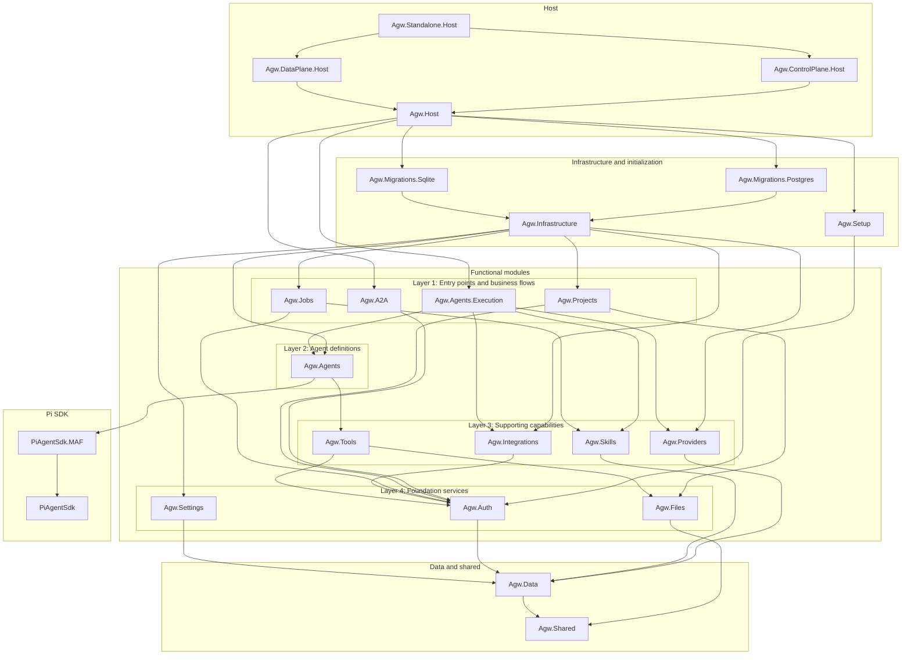
```mermaid
flowchart TB
    subgraph hosts["Host"]
        agwStandaloneHost["Agw.Standalone.Host"]
        agwControlPlaneHost["Agw.ControlPlane.Host"]
        agwDataPlaneHost["Agw.DataPlane.Host"]
        agwHost["Agw.Host"]
    end

    subgraph persistence["Infrastructure and initialization"]
        agwInfrastructure["Agw.Infrastructure"]
        agwMigrationsPostgres["Agw.Migrations.Postgres"]
        agwMigrationsSqlite["Agw.Migrations.Sqlite"]
        agwSetup["Agw.Setup"]
    end

    subgraph modules["Functional modules"]
        subgraph entryLayer["Layer 1: Entry points and business flows"]
            agwA2A["Agw.A2A"]
            agwAgentsExecution["Agw.Agents.Execution"]
            agwProjects["Agw.Projects"]
            agwJobs["Agw.Jobs"]
        end

        subgraph definitionLayer["Layer 2: Agent definitions"]
            agwAgents["Agw.Agents"]
        end

        subgraph capabilityLayer["Layer 3: Supporting capabilities"]
            agwIntegrations["Agw.Integrations"]
            agwProviders["Agw.Providers"]
            agwTools["Agw.Tools"]
            agwSkills["Agw.Skills"]
        end

        subgraph serviceLayer["Layer 4: Foundation services"]
            agwAuth["Agw.Auth"]
            agwFiles["Agw.Files"]
            agwSettings["Agw.Settings"]
        end
    end

    subgraph foundation["Data and shared"]
        agwData["Agw.Data"]
        agwShared["Agw.Shared"]
    end

    subgraph sdk["Pi SDK"]
        piAgentSdkMAF["PiAgentSdk.MAF"]
        piAgentSdk["PiAgentSdk"]
    end

    agwStandaloneHost --> agwControlPlaneHost & agwDataPlaneHost
    agwControlPlaneHost --> agwHost
    agwDataPlaneHost --> agwHost
    agwHost --> agwMigrationsPostgres & agwMigrationsSqlite & agwSetup
    agwHost --> agwA2A & agwAgentsExecution
    agwMigrationsPostgres --> agwInfrastructure
    agwMigrationsSqlite --> agwInfrastructure
    agwInfrastructure --> agwAgents & agwProjects & agwJobs
    agwInfrastructure --> agwIntegrations & agwProviders & agwSettings
    agwSetup --> agwAuth
    agwA2A --> agwAuth
    agwAgentsExecution --> agwAgents & agwIntegrations & agwProviders & agwSkills
    agwProjects --> agwFiles & agwAuth
    agwJobs --> agwSkills & agwAuth
    agwAgents --> agwTools & piAgentSdkMAF
    agwIntegrations --> agwAuth
    agwProviders --> agwData
    agwTools --> agwFiles & agwAuth
    agwSkills --> agwData
    agwAuth --> agwData
    agwSettings --> agwData
    agwFiles --> agwShared
    agwData --> agwShared
    piAgentSdkMAF --> piAgentSdk
```

- **Agw.Agents:** Custom agent definitions, external agents (Claude Code, Codex, and Pi), Agentflows, MCP tool servers, and traces.
- **Agw.Agents.Execution:** Agent and Agentflow execution, external-agent runtimes, the SignalR hub, human interaction, and InProcess or Distributed execution. It references `Agw.Agents` one way, and the two form one logical Agents module.
- **Agw.Providers:** Models, providers, model-provider links, and provider authentication settings.
- **Agw.Tools:** The unified Tool and ToolBlock catalog, runtime tool materialization, and User Memory.
- **Agw.Skills:** Skill definitions, local and remote content, and execution adapters.
- **Agw.Integrations:** The built-in Integration catalog, per-user installations and Connections, OAuth, and connection-bound native and MCP tools.
- **Agw.Projects:** Projects, conversations, and chat history. Every conversation belongs to a Project.
- **Agw.Files:** Project-scoped file APIs and Git operations over the host-visible local Workspace.
- **Agw.Jobs:** Scheduled Agent and Agentflow runs with Once, Interval, and Cron triggers, retries, and execution logs.
- **Agw.A2A:** Exposes agents through the A2A protocol.
- **Agw.Auth:** Administrator and OIDC/OAuth2 authentication, local users, API Tokens, CSRF protection, and authorization.
- **Agw.Setup:** First-run administrator setup and database-backed initialization state.
- **Agw.Settings:** Audited global and per-user configuration groups, such as authentication state and quick prompts.

### Clients

The pnpm Workspace at `src/clients` contains the `@agw/web`, `@agw/desktop`, and `@agw/mobile` applications plus shared packages under `src/clients/packages/`, with Turborepo orchestrating their tasks.

- `@agw/web` holds only routes, layouts, global CSS, and shell composition; business UI comes from `packages/*`.
- `@agw/desktop` owns a secure Electron main/preload implementation and an independent React renderer under `desktop/renderer/`, with bridge contracts kept inside Desktop. Web and Desktop do not import, build, or consume artifacts from each other. See [`src/clients/desktop/README.md`](src/clients/desktop/README.md).
- `@agw/mobile` is an Expo Router application that consumes only React Native-safe packages. See [`src/clients/mobile/README.md`](src/clients/mobile/README.md).
- Chat is divided into `@agw/chat-core` (message semantics), `@agw/chat-runtime` (SignalR execution and Conversation state), `@agw/chat` (Web and Desktop renderer), and `@agw/chat-native` (React Native renderer). `@agw/api` provides the typed API client generated from OpenAPI.

## Screenshots

### Desktop

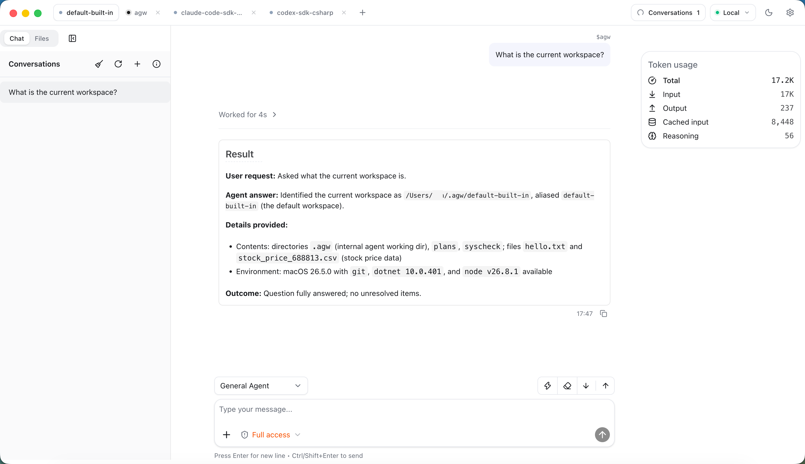

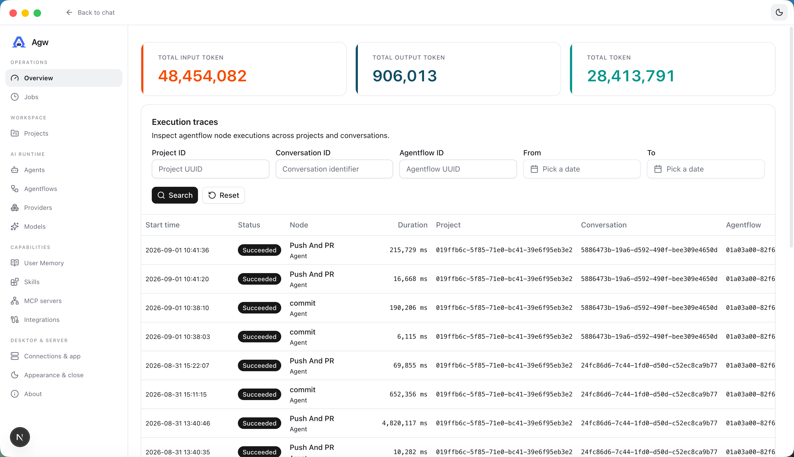

### Providers

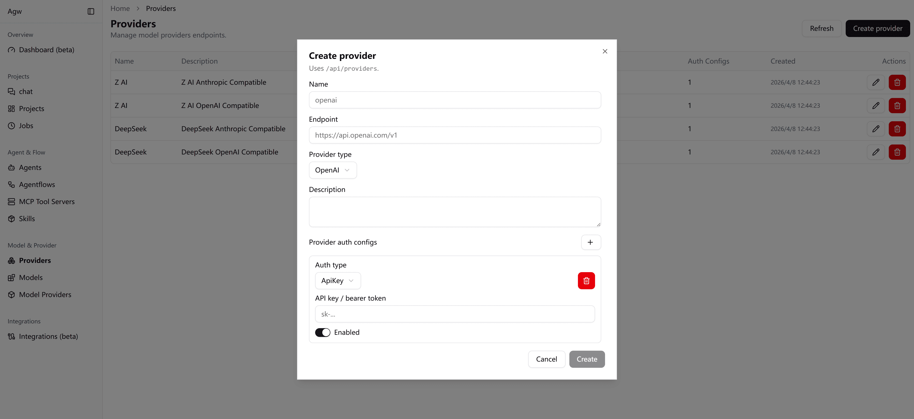

### Agents

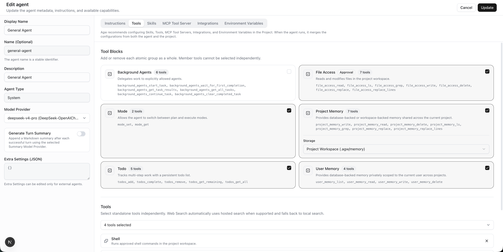

### Tools & MCP

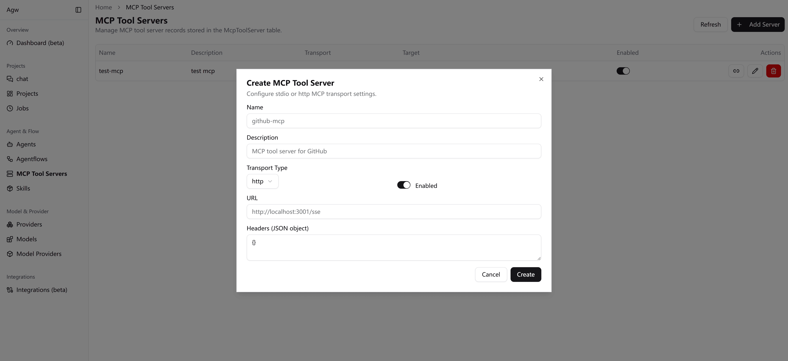

### Skills

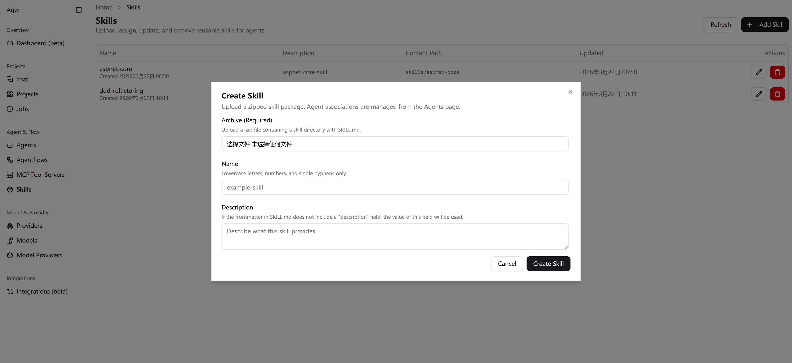

### Integrations

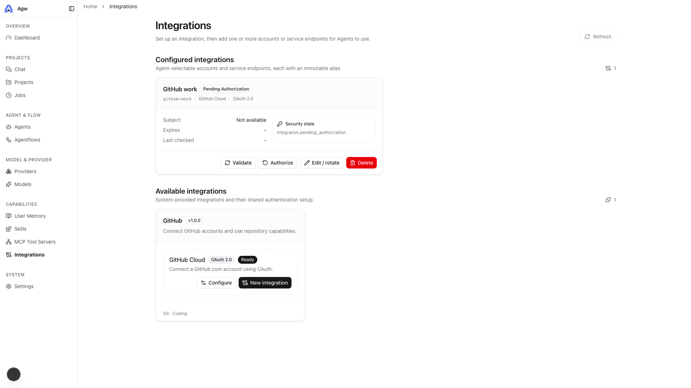

### Chat

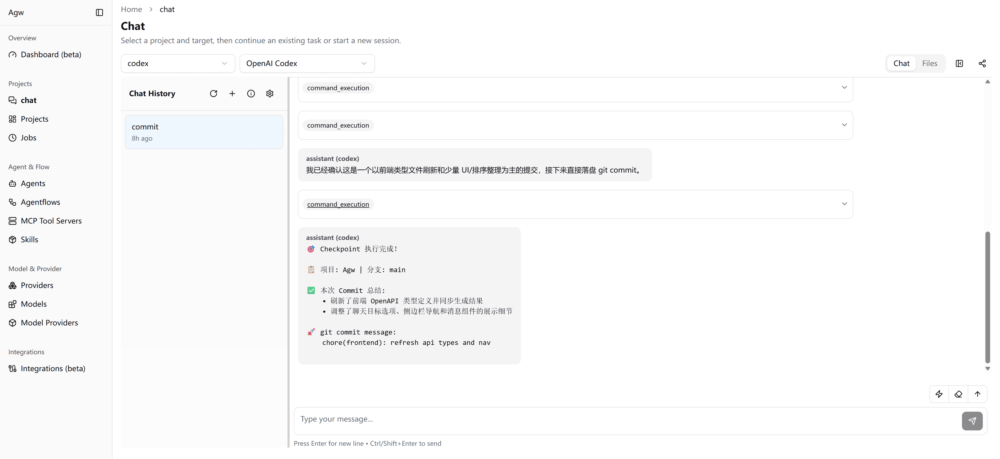

### Chat Workspace Files

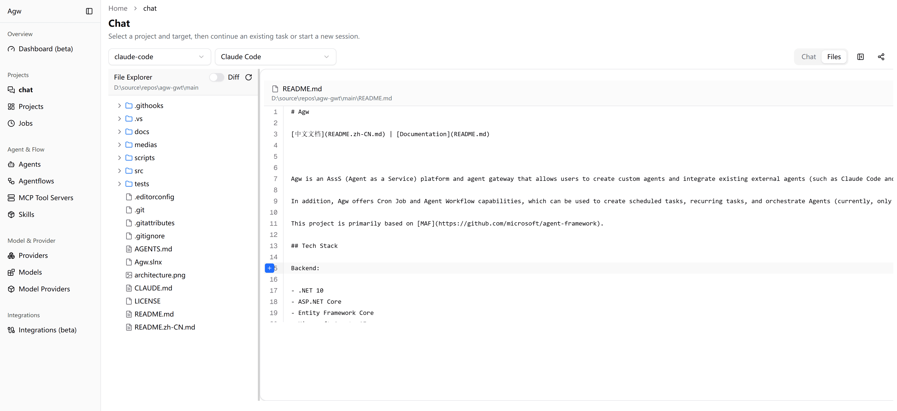

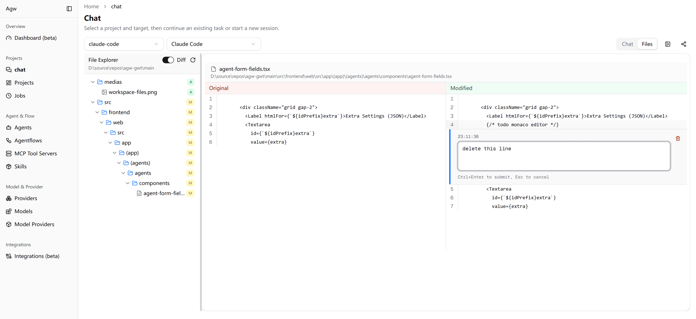

### Projects

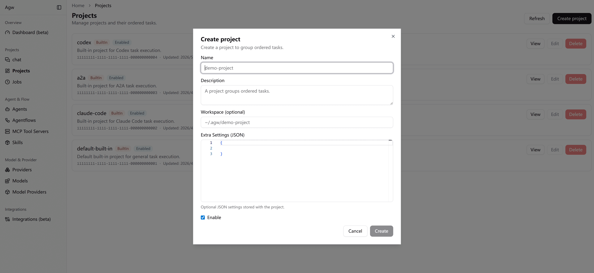

### Jobs

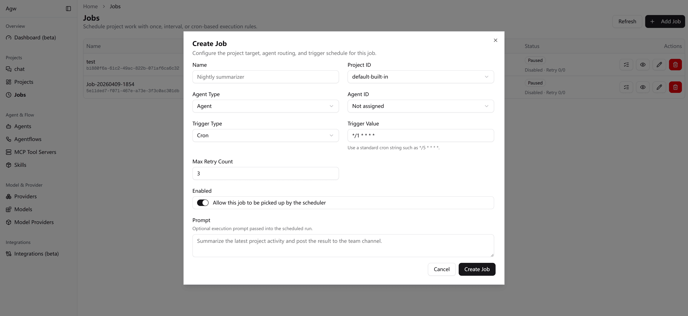

### Agentflows

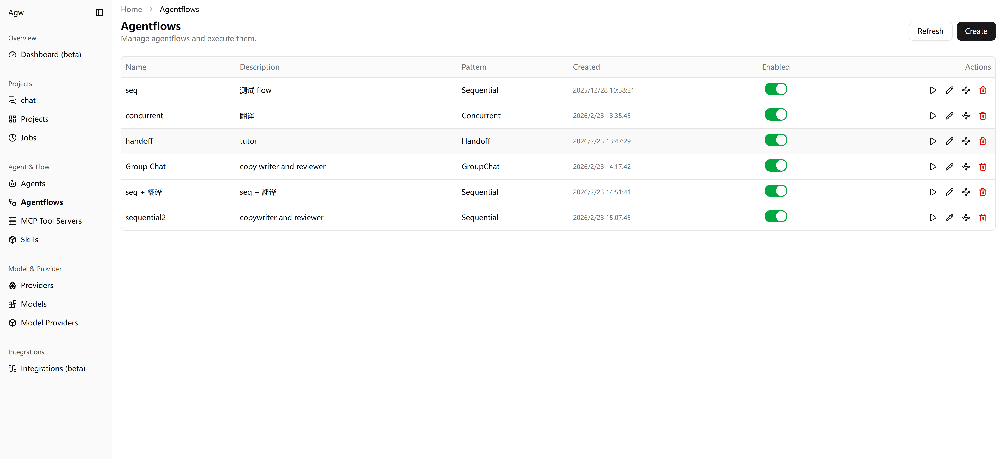

### Mobile

<p align="center">
  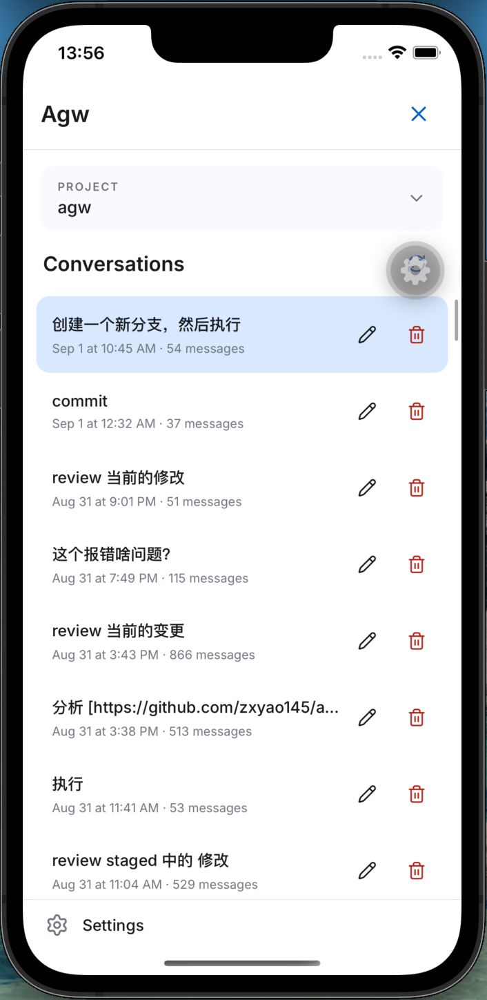
  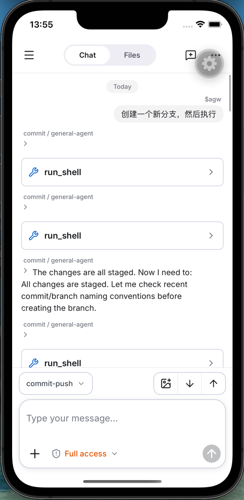
  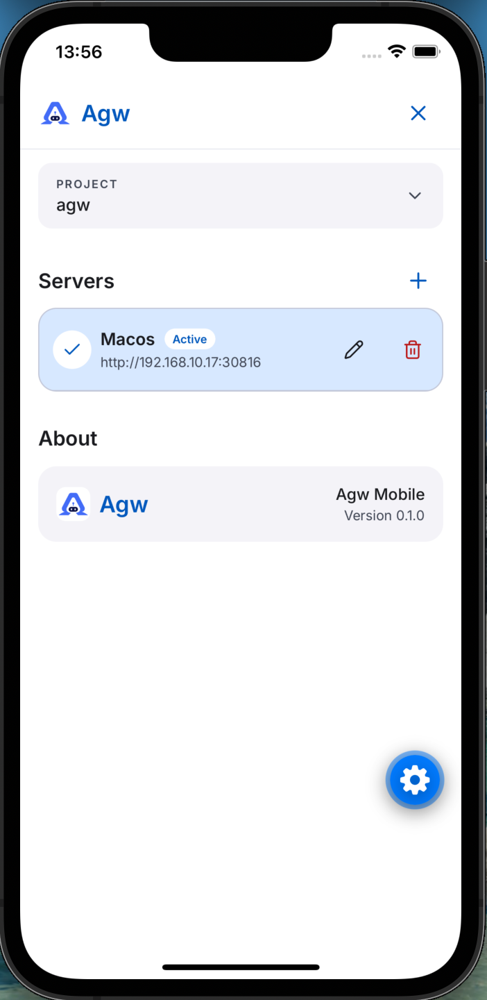
</p>

## Documentation

- [Documentation site](https://docs.agw-ai.dev/): Installation, first conversation, feature guides, operations, and development, in English and Chinese.
- [Deployment Guide](docs/4.Deployment.md): Data directories, Standalone and split deployments, Docker, reverse proxies, distributed execution, OIDC login, and upgrades.
- [Development Guide](docs/1.Development.md): Build, test, lint, and format commands, EF Core migrations, and error-code rules.
- [Architecture](docs/2.Architecture.md): Backend project graph, Host roles, entity relationships, and client packages.
- [Module Organization](docs/human/4.module-organization.md): Layering principles used within modules.
- [Domain Architecture](docs/human/5.domain-architecture.md): Behavior, DomainService, and ApplicationService responsibilities.
- [Agent Execution Protocol](docs/ws-flow.md): SignalR commands, permission capabilities, turn messages, the input queue, and disconnection behavior.
- [Execution Subsystem](src/server/Agw.Agents.Execution/README.md): In-process and distributed execution, data flow, Definition Agent compaction, and Human-in-the-loop.
- [Chat Suggestions Design](docs/approachs/1.Chat%20Suggestions.md): Agent-aware slash commands, Claude init commands, file suggestions, and failure fallback behavior.
- [Agentflow Guide](docs/approachs/2.Agentflow.md): Graph routing and cycle rules, checkpoint branching, editor Undo and dirty state, and Chat message attribution.
- Module READMEs: [Auth](src/server/Agw.Auth/README.md), [Setup](src/server/Agw.Setup/README.md), [Settings](src/server/Agw.Settings/README.md), [Tools](src/server/Agw.Tools/README.md), [Integrations](src/server/Agw.Integrations/README.md), [Jobs (Chinese)](src/server/Agw.Jobs/README.zh-CN.md), and [Files (Chinese)](src/server/Agw.Files/README.zh-CN.md).
- Clients: [Desktop](src/clients/desktop/README.md) and [Mobile](src/clients/mobile/README.md).

## License

Additional restrictions have been added on top of the Apache License 2.0. Personal use and internal enterprise use are unrestricted. See [LICENSE](LICENSE) for details.
