# Agw

[中文文档](README.zh-CN.md) | [Documentation](README.md)

Agw 是一个 AssS (Agent as a Service) 平台和 Agent Gateway，可以自定义创建 Agent 和集成外部已有的 Agent（例如 Claude Code、Codex）。

除此之外，Agw 还具备 Job 和 Agent Workflow 能力，可以用于创建定时任务、周期任务、对 Agent 进行编排（目前仅能实现简单的编排）。

本项目主要基于 [MAF](https://github.com/microsoft/agent-framework) 开发。

## 技术栈

Backend:

- .NET 10
- ASP.NET Core
- Entity Framework Core
- Microsoft.Agents.AI
- Serilog + OpenTelemetry

Frontend:

- Next.js 16 App Router
- React 19
- Tailwind CSS 4
- Shadcn 4 （Radix UI）

## 使用

在仓库根目录启动后端：

```bash
dotnet restore Agw.slnx
dotnet run --project src/backend/Agw.Host
```

开发环境后端默认监听 `http://localhost:5015`。首次运行时，打开 `http://localhost:5015/setup`，选择数据库 Provider、连接字符串和管理员密码。运行数据统一保存在当前用户主目录下的 `agw`；通过域名初始化还需要 Server 启动日志中的一次性 Setup Code。

在另一个终端启动前端：

```bash
cd src/clients/web
pnpm install
pnpm dev
```

两个服务都启动后，打开 `http://localhost:3000`。Next.js 开发服务器会将 `/api/*` 和 `/openapi/*` 代理到后端，代理目标按顺序读取 `BACKEND_API_BASE_URL`、`NEXT_PUBLIC_API_BASE_URL`，默认使用 `http://localhost:5015`。

生产发布包会把静态 Web UI 嵌入 ASP.NET Core，由单一 Server 进程提供服务，详见下方部署指南。

典型本地使用流程：

1. 如果后端跳转到 `/setup`，先完成首次初始化。
2. 在 `Providers`、`Models`、`Model Providers` 中配置供应商、模型和模型供应商关联。
3. 在 `Agents` 中创建 Agent，并按需关联 MCP Tool Servers、Tools、Skills 或集成应用。
4. 通过 `Chat` 或 `Projects` 运行 Agent Session，并查看持久化的 Task 历史。
5. 使用 `Agentflows` 进行多 Agent 编排，使用 `Jobs` 执行定时或周期任务。

## 界面截图

以下是 Agw 主要界面的截图：

### Providers（供应商）
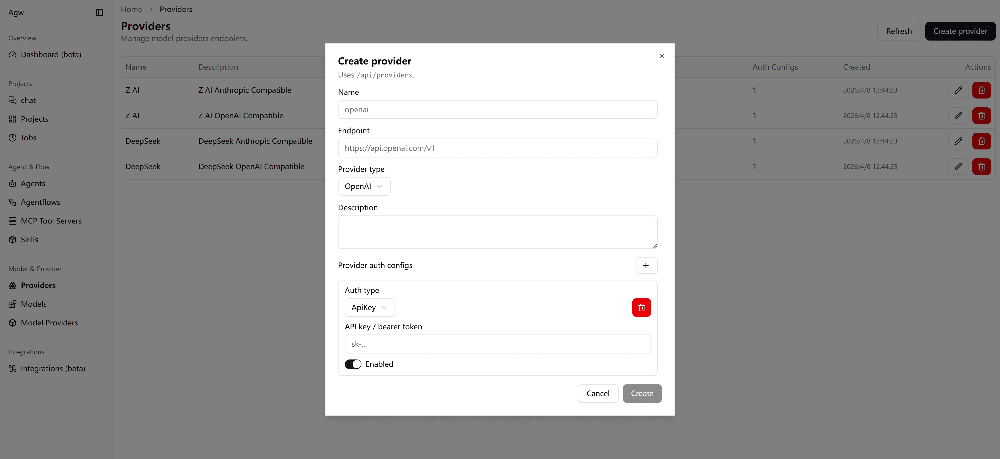

### Agents（代理）
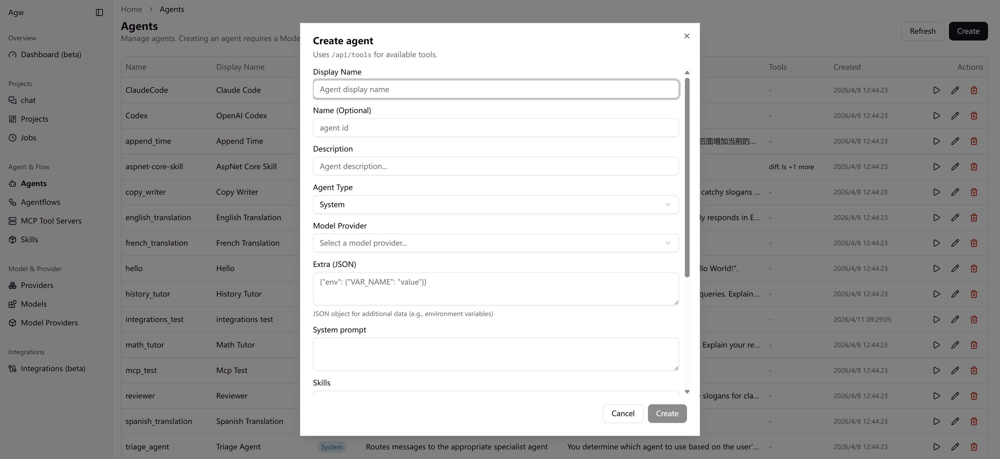

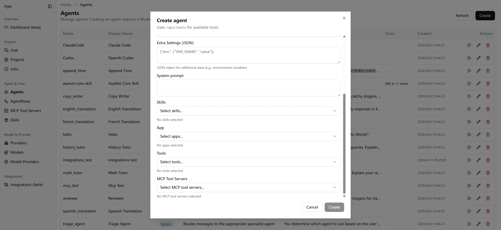

### Tools & MCP（工具与 MCP）
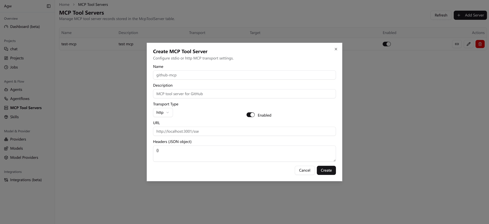

### Skills（技能）
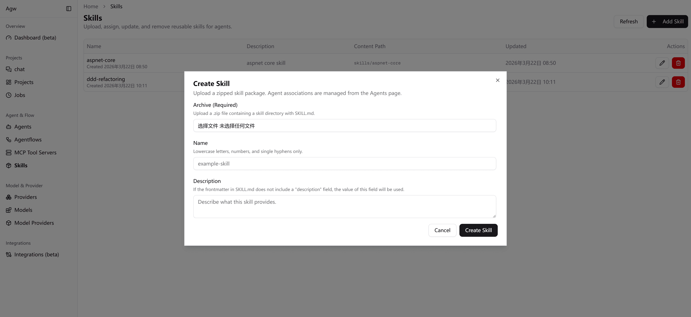

### Integrations（集成）
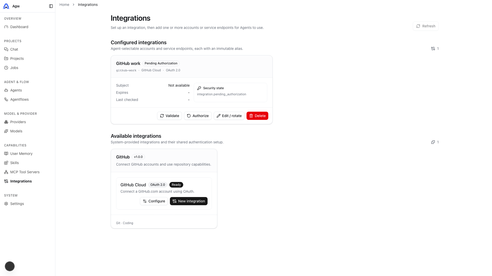

### Chat（对话）
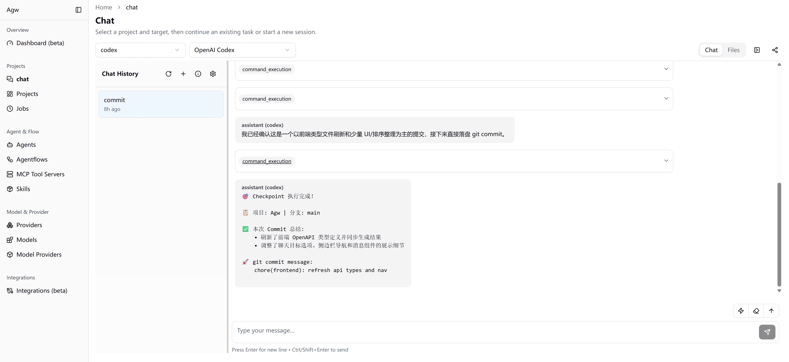

### Chat Workspace Files（对话工作区文件）
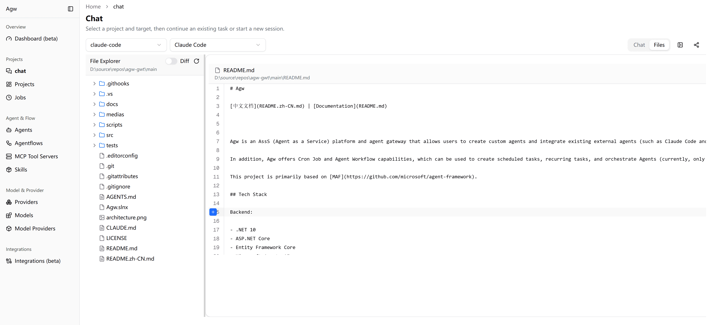

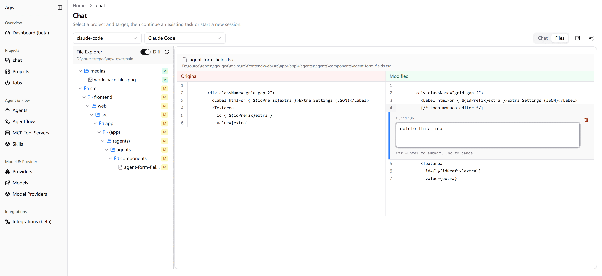

### Projects（项目）
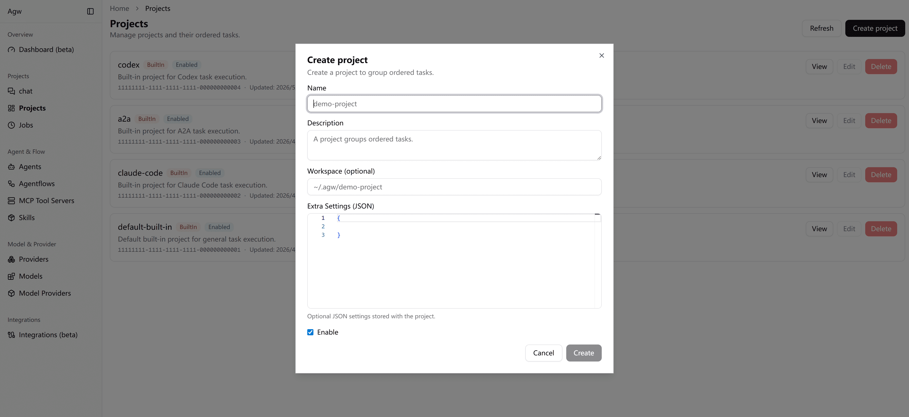

### Jobs（任务）
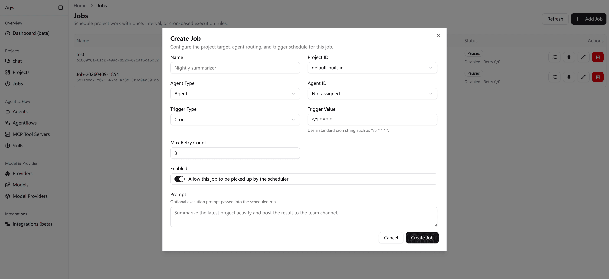

### Agentflows（代理编排）
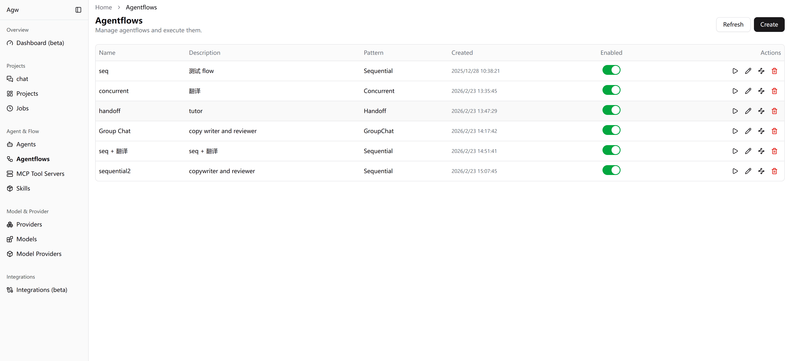

## 架构

Agw 采用基于领域的模块化单体架构。`src/backend/Agw.Host` 是 ASP.NET Core 程序入口，负责组装各个模块；Web 客户端位于 `src/clients/web`，Expo 移动客户端位于 `src/clients/mobile`。

典型的后端流程如下：

```text
Controller -> AppService / RuntimeService -> DomainService -> IRepository / IUnitOfWork -> EF Core
```

模块介绍：

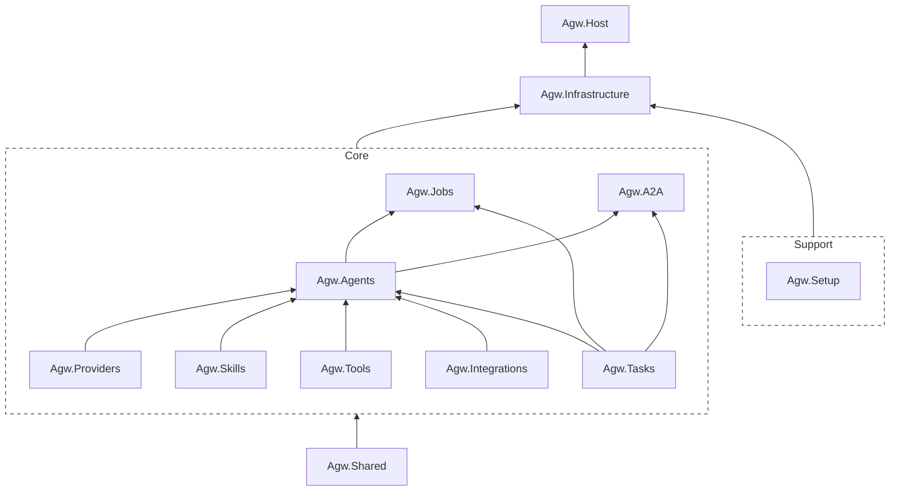

- Agw.Providers  
  用于管理模型及其供应商。

- Agw.Agents  
  集成外部 Agent（例如 Claude Code、Codex）、管理自定义 Agent。自定义 Agent 可以支持集成 Tool、MCP、Skills。

- Agw.Tools  
  内置 Tool 和 MCP Tool 管理模块。

- Agw.Skills  
  Skill 管理模块。

- Agw.Integrations  
  外部 App 集成模块。

- Agw.Tasks  
  Agent 对话历史与 Session 管理模块。在 Agw 中，一个 Session 对应一个 Task，而每个 Task 都关联一个 Project。

- Agw.Jobs  
  用于提供定时任务、周期任务和一次性任务的能力，支持使用 Cron 表达式。

- 一次性任务：创建后执行一次就会被禁用。

- 定时任务：在指定时间执行，执行一次后被禁用。

- 周期任务：以固定的周期，在指定的时间重复执行。

- Agw.A2A

对外提供 A2A 协议本系统的接口。

## 文档

- [部署指南](docs/4.Deployment.md)：单进程 Server、本地包、Docker、域名代理、数据目录与升级。

本项目的详细文档位于： [`docs/`](docs/):

- [Development Guide](docs/1.Development.md): 本地环境配置、构建/测试/代码检查/格式化命令，以及 Git 钩子配置。
- [Architecture](docs/2.Architecture.md): 系统概述、后端/前端架构以及核心领域概念。
- [Module Organization](docs/3.Module%20Organization.md): 模块内部采用的分层原则。
- [Agent 执行流程](docs/ws-flow.md)：SignalR 命令、turn 消息、runtime 生命周期与断线行为。
- [Execution 子系统](src/backend/Agw.Agents/Execution/README.md)：目录职责、数据流与 command 扩展方式。

## 配置

后端主要配置位于 [`src/backend/Agw.Host/appsettings.json`](src/backend/Agw.Host/appsettings.json):

```json
{
  "Database": {
    "Provider": "sqlite",
    "ConnectionString": "Data Source=agw.db"
  },
  "OpenTelemetry": {
    "ServiceName": "Agw",
    "ServiceVersion": "1.0.0",
    "OtlpEndpoint": "http://localhost:4317"
  }
}
```

- 数据库 Provider 支持： `sqlite`、`postgres` 和 `MySQL`.
- 请勿将机密信息写入固定配置文件；建议优先使用环境变量进行覆盖。
