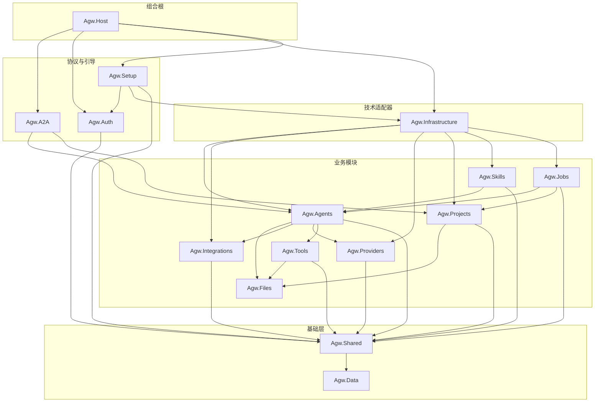

# Agw

[中文文档](README.zh-CN.md) | [Documentation](README.md)

[](https://github.com/zxyao145/agw/releases)
[](https://github.com/zxyao145/agw/pkgs/container/agw)

Agw 是一个面向个人用户和小型研发团队的、自托管的后台工程 Agent 中心，也是一个 AaaS (Agent as a Service) 平台和 Agent Gateway。用户可以在一个 UI 中，同时操作多个 Agent：
- 自定义创建 Agent
- 集成外部的 Agent（例如 Claude Code、Codex）。

除此之外，Agw 还具备 Job 和 Agent Workflow（Agentflow）能力，可以用于创建定时任务、周期任务、对 Agent 进行编排。

本项目主要基于 [MAF](https://github.com/microsoft/agent-framework) 开发。

> [!NOTE]
> Agw在 1.0 版本之前仍在积极开发中。数据库 schema、API和 interface 可能会在不同版本之间发生变化。


## 使用场景


### 多 Agent 协作流程（Agentflow）

适合相对明确、可拆分的工作，例如：

```
资料收集 Agent
        ↓
分析 Agent
        ↓
内容生成 Agent
        ↓
人工审批
        ↓
发布/归档 Agent
```

> [!NOTE]
> Agentflow 支持顺序执行、扇出/汇聚、有序条件分支、交接、人工审批和受控循环；仍不太适合高度动态、自主规划很深的 Agent 群体。

### 人-Agent 协作平台

基于 Job 能力，可以实现如下工作流：

```
人：发布任务
        ↓
Agent：领取任务
        ↓
Agent：执行任务
        ↓
人：审核任务
```

### 自动化任务平台

利用 Jobs、Integrations 和项目上下文，可以：

- 每日经营数据汇总
- GitHub Issue/PR 分类与总结
- 定期检查依赖、安全问题或文档漂移
- 客服记录整理
- 周报、日报、发布说明生成
- 定时抓取信息并写入内部系统

Job 有 Agent 推理能力、工具权限、上下文和持久化执行记录，比普通 Cron 更有价值。


### Cloud Desktop 环境

Agw 可作为 Cloud Desktop 的 Agent 控制平面，让 AI 在隔离的云端工作区中持续、安全地执行开发与自动化任务，并统一管理模型、工具、调度、审批和执行记录。

## 技术栈

Backend:

- .NET 10
- ASP.NET Core
- Entity Framework Core
- Microsoft.Agents.AI
- Serilog + OpenTelemetry

Frontend:

- Next.js 16 App Router
- React 19
- Tailwind CSS 4
- Shadcn 4 （Radix UI）

Desktop:

- Electron 43 + Electron Forge
- 提供包含当前用户级 Server daemon 的 Full 安装包，以及仅客户端的 Client 安装包
- 提供 Windows x64 安装包和便携版 Client、macOS x64/arm64 DMG，以及 Ubuntu x64 DEB

## 使用

在仓库根目录启动后端：

```bash
dotnet restore Agw.slnx
dotnet run --project src/server/Agw.Host
```

开发环境后端默认监听 `http://localhost:30816`。首次运行时，打开 `http://localhost:30816/setup`，选择部署模式、填写结构化数据库设置并创建管理员密码。无人值守部署可在不存在 `server-state.json` 时通过 `Setup` 配置节提供相同字段，密码应使用环境变量或 Secret 注入。运行数据统一保存在当前用户主目录下的 `agw`；通过域名初始化还需要 Server 启动日志中的一次性 Setup Code。

在另一个终端启动前端：

```bash
cd src/clients
pnpm install
pnpm dev:web
```

`src/clients` 是 Web、Desktop 和 `src/clients/packages/` 下共享包的 pnpm Workspace，由 Turborepo 统一编排任务；一次 `pnpm install` 即可安装整个 Workspace。Web 与 Desktop 各自拥有独立的 Next.js 应用，不会互相导入、构建或消费对方的产物，业务和基础设施模块通过根目录下的 `packages/*` 复用。Expo 移动端仍是单独的 npm Workspace。后端和 Web 都启动后，打开 `http://localhost:3001`。Web 会将 `/api/*` 和 `/openapi/*` 代理到后端，代理目标按顺序读取 `BACKEND_API_BASE_URL`、`NEXT_PUBLIC_API_BASE_URL`，默认使用 `http://localhost:30816`。

生产发布包会把静态 Web UI 嵌入 ASP.NET Core，由单一 Server 进程提供服务，详见下方部署指南。

Agw Desktop 在 `src/clients/desktop/` 下拥有独立的 Electron main/preload 实现和 React renderer。Renderer 复用与 Web 相同的业务包，Electron bridge contract 则保留在 Desktop 内部的 `src/shared/contracts/`。Desktop 会自行构建静态导出，不依赖 `web/` 的产物。运行模型、安装包类型和发布流程详见 [`src/clients/desktop/README.md`](src/clients/desktop/README.md)。

典型本地使用流程：

1. 如果后端跳转到 `/setup`，先完成首次初始化。
2. 在 `Providers`、`Models`、`Model Providers` 中配置供应商、模型和模型供应商关联，并按供应商真实规格设置每个模型的上下文窗口与最大输出 token。Definition Agent 会据此预留回复空间并自动压缩模型请求；自动发现模型使用的 `256,000 / 64,000` 只是回退默认值，并不代表供应商的真实上限。
3. 在 `Agents` 中创建 Agent，并按需关联 MCP Tool Servers、Tools、Skills 或集成应用。
4. 通过 `Chat` 或 `Projects` 运行 Agent Session，并查看持久化的 Task 历史。
5. 使用 `Agentflows` 进行多 Agent 编排，使用 `Jobs` 执行定时或周期任务。

### 项目 Workspace

每个 `Project.Workspace` 都必须是 Agw Server 进程可见的目录。文件 API、Git、Claude Code 和 Codex 使用同一棵本地工作树。需要使用网络存储时，应先通过操作系统或容器平台完成挂载，再把挂载路径配置为 Workspace；Agw 不提供应用内 SFTP 后端。已经使用过的 Workspace 发生变化后，需要重启 Server。

## 开发

请先安装 .NET 10 SDK、Node.js 24 和 pnpm 11.7.0。只有构建容器镜像时才需要安装带 Buildx 的 Docker。首次克隆仓库后，配置 Git hooks，并安装后端和客户端依赖：

```bash
git config core.hooksPath .githooks
dotnet restore Agw.slnx
dotnet tool restore

cd src/clients
pnpm install
```

在仓库根目录以热重载模式运行后端，再在另一个终端从 `src/clients` 启动 Web：

```bash
dotnet watch --project src/server/Agw.Host
```

```bash
cd src/clients
pnpm dev:web
```

如果开发 Desktop，请保持后端运行，并在 `src/clients` 下执行 `pnpm dev:desktop`。Desktop renderer 使用 `http://localhost:3000`，不需要同时启动 Web 开发服务器。

提交改动前，运行主要校验命令：

```bash
# 仓库根目录
dotnet build Agw.slnx
dotnet test Agw.slnx
dotnet format Agw.slnx --verify-no-changes

# src/clients
pnpm build
pnpm lint
pnpm test
pnpm fmt:check
```

修改后端 API contract 后，需要在 `src/clients` 下执行 `pnpm gen:api`，重新生成类型化客户端。聚焦测试命令、编码约定、EF Core migration 命令和 package 级任务详见[开发指南](docs/1.Development.md)。

## 调试

- **后端：** 在 .NET 调试器中使用 `http` 或 `https` launch profile 启动 `src/server/Agw.Host`。两个 profile 都会设置 `ASPNETCORE_ENVIRONMENT=Development`，此时可以访问仅在开发环境开放的 OpenAPI 和 Scalar 端点。Server 日志同时输出到控制台和 `$AGW_DATA_DIR/logs/application-*.log`；未设置 `AGW_DATA_DIR` 时位于 `~/agw/logs/`。
- **Web：** 执行 `pnpm dev:web`，通过浏览器开发者工具调试客户端代码和网络请求，并在 Next.js 终端查看服务端输出。需要连接其他后端时，可执行 `BACKEND_API_BASE_URL=http://host:port pnpm dev:web`。
- **Desktop：** 执行 `pnpm dev:desktop`。Electron main process 和构建输出显示在启动终端，preload 与 renderer 代码可通过 Electron DevTools 检查；开发环境 renderer 使用 `http://localhost:3000`。
- **聚焦测试：** 后端可执行 `dotnet test tests/<Project> --filter "FullyQualifiedName~MethodName"`；客户端可在 `src/clients` 下执行 `pnpm exec turbo run test --filter=@agw/web`，并按需替换 package filter。

## 发布

生成发布产物前，请先运行上述校验命令。本地 Server 和容器构建由仓库根目录下的 `publish.sh` 驱动：

```bash
# 为单个 runtime 生成 self-contained Server 压缩包
PUBLISH_MODE=portable APP_VERSION=0.1.0 RIDS=linux-x64 ./publish.sh

# 为单个平台生成可由 docker load 导入的镜像压缩包
PUBLISH_MODE=docker \
APP_VERSION=0.1.0 \
IMAGE_NAME=agw:0.1.0 \
DOCKER_PLATFORMS=linux/amd64 \
./publish.sh
```

产物写入 `artifacts/publish/`。不设置 `RIDS` 或 `DOCKER_PLATFORMS` 时会构建默认平台矩阵；使用 `PUBLISH_MODE=all` 可同时构建可移植 Server 包和 Docker 镜像。

使用 Node.js 24，在 `src/clients` 下构建 Desktop 安装包：

```bash
pnpm release:desktop -- --flavor full --arch x64 --version 0.1.0
pnpm release:desktop -- --flavor client --arch x64 --version 0.1.0
```

Desktop 产物输出到 `src/clients/desktop/release-artifacts/`。Windows 和 Linux 目前支持 x64，macOS 支持 x64 和 arm64。

`flavor` 表示安装包包含的内容：

- `full`：包含 Desktop 和自包含的 Server；Server 会安装为当前用户级 daemon。
- `client`：仅包含 Desktop，需要连接已有的 Server。在 Windows 上同时提供 Setup EXE 和 portable ZIP；ZIP 解压后直接运行 `agw-desktop.exe`，无需安装。

GitHub Release 中的 Assets 按以下格式命名：

```text
Agw-Desktop-{version}-{flavor}-{platform}-{arch}{variant}.{extension}
```

`version` 不包含开头的 `v`；`platform` 为 `windows`、`macos` 或 `linux`；`arch` 为 `x64` 或 `arm64`。Windows 安装包使用 `-Setup.exe`，便携版 Client 使用 `-Portable.zip`；DMG 和 DEB 没有 variant 后缀。例如：

```text
Agw-Desktop-0.2.0-preview.1-full-windows-x64-Setup.exe
Agw-Desktop-0.2.0-preview.1-client-windows-x64-Portable.zip
Agw-Desktop-0.2.0-preview.1-client-macos-arm64.dmg
```

同一个 Release 还会发布 `linux/amd64` 和 `linux/arm64` 的 Server 镜像，名称为 `ghcr.io/zxyao145/agw:{version}`。

正式稳定版通过 `vX.Y.Z` tag 发布，例如：

```bash
git tag v0.1.0
git push origin v0.1.0
```

[发布工作流](.github/workflows/release.yml)会将 Linux amd64/arm64 镜像发布到 GHCR，并创建包含全部 Desktop Assets 的 GitHub Release。手动发布必须提供合法的 `release_tag`。[Desktop 构建工作流](.github/workflows/build-desktop.yml)会在推送到 `main` 或手动运行时生成临时 Desktop 产物。镜像导入、Registry 发布、数据目录、反向代理和升级流程详见[部署指南](docs/4.Deployment.md)。

## 界面截图

以下是 Agw 主要界面的截图：

### Providers（供应商）


### Agents（代理）


### Tools & MCP（工具与 MCP）


### Skills（技能）


### Integrations（集成）


### Chat（对话）


### Chat Workspace Files（对话工作区文件）


### Projects（项目）


### Jobs（任务）


### Agentflows（代理编排）


## 架构

Agw 采用基于领域的模块化单体架构。`src/server/Agw.Host` 是 ASP.NET Core 程序入口，负责组装各个模块；`src/clients` pnpm Workspace 包含 Web、Electron Desktop 以及共享业务和基础设施 package，Expo 移动客户端位于 `src/clients/mobile`。

典型的后端流程如下：

```text
Controller -> AppService / RuntimeService -> DomainService -> IRepository / IUnitOfWork -> EF Core
```

模块介绍（仅展示仓库内项目的直接引用；`A --> B` 表示 A 引用 B）：



- Agw.Providers  
  用于管理模型及其供应商。

- Agw.Agents  
  集成外部 Agent（例如 Claude Code、Codex）、管理自定义 Agent。自定义 Agent 可以支持集成 Tool、MCP、Skills。

- Agw.Tools  
  内置 Tool 和 MCP Tool 管理模块。

- Agw.Skills  
  Skill 管理模块。

- Agw.Integrations  
  外部 App 集成模块。

- Agw.Projects  
  Agent 对话历史与 Session 管理模块。在 Agw 中，一个 Session 对应一个 Task，而每个 Task 都关联一个 Project。

- Agw.Files
  基于宿主机可见的本地 Workspace 提供项目级文件 API 与 Git 操作。

- Agw.Jobs  
  用于提供定时任务、周期任务和一次性任务的能力，支持使用 Cron 表达式。

- 一次性任务：创建后执行一次就会被禁用。

- 定时任务：在指定时间执行，执行一次后被禁用。

- 周期任务：以固定的周期，在指定的时间重复执行。

- Agw.A2A

对外提供 A2A 协议本系统的接口。

## 文档

- [部署指南](docs/4.Deployment.md)：单进程 Server、本地包、Docker、域名代理、数据目录与升级。

本项目的详细文档位于： [`docs/`](docs/):

- [Development Guide](docs/1.Development.md): 本地环境配置、构建/测试/代码检查/格式化命令，以及 Git 钩子配置。
- [Architecture](docs/2.Architecture.md): 系统概述、后端/前端架构以及核心领域概念。
- [Module Organization](docs/3.Module%20Organization.md): 模块内部采用的分层原则。
- [Chat Suggestions 设计](docs/5.Chat%20Suggestions.md)：Agent 感知的 slash commands、Claude init commands、文件建议与失败降级。
- [Agentflow 指南](docs/6.Agentflow.md)：图路由与循环规则、编辑器撤销和未保存状态、Chat 消息归属。
- [Agent 执行流程](docs/ws-flow.md)：SignalR 命令、turn 消息、runtime 生命周期与断线行为。
- [Execution 子系统](src/server/Agw.Agents/Execution/README.md)：目录职责、数据流、Definition Agent 自动上下文压缩与 command 扩展方式。
- [Files 模块](src/server/Agw.Files/README.zh-CN.md)：Project Workspace 解析、路径边界、Git 行为与挂载要求。

## 配置

后端主要配置位于 [`src/server/Agw.Host/appsettings.json`](src/server/Agw.Host/appsettings.json):

```json
{
  "Database": {
    "Provider": "sqlite",
    "ConnectionString": "Data Source=agw.db"
  },
  "DistributedLock": {
    "Provider": null,
    "ConnectionString": ""
  },
  "OpenTelemetry": {
    "ServiceName": "Agw",
    "ServiceVersion": "1.0.0",
    "OtlpEndpoint": "http://localhost:4317"
  }
}
```

- 数据库 Provider 支持：`sqlite` 和 `postgres`。
- 分布式执行锁 Provider 支持 `inmemory` 和 `postgres`。`DistributedLock:Provider` 为 `null` 或不存在时，SQLite 使用进程内锁，PostgreSQL 使用 advisory lock；PostgreSQL 锁连接串为空时复用 `Database:ConnectionString`。
- 请勿将机密信息写入固定配置文件；建议优先使用环境变量进行覆盖。

## 协议

在 Apache 2.0 协议之上进行添加了条款限制，个人用户和企业内部使用无任何限制，详见 [LICENSE](LICENSE)。
