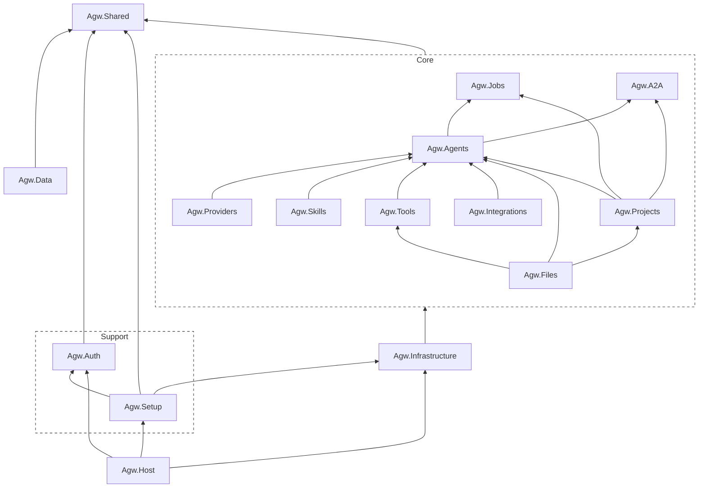

# Agw

[中文文档](README.zh-CN.md) | [Documentation](README.md)

Agw 是一个面向个人用户和小型研发团队的、自托管的后台工程 Agent 中心，也是一个 AaaS (Agent as a Service) 平台和 Agent Gateway。用户可以在一个 UI 中，同时操作多个 Agent：
- 自定义创建 Agent
- 集成外部的 Agent（例如 Claude Code、Codex）。

除此之外，Agw 还具备 Job 和 Agent Workflow（Agentflow）能力，可以用于创建定时任务、周期任务、对 Agent 进行编排。

本项目主要基于 [MAF](https://github.com/microsoft/agent-framework) 开发。


## 使用场景


### 多 Agent 协作流程（Agentflow）

适合相对明确、可拆分的知识工作，例如：

```
资料收集 Agent
        ↓
分析 Agent
        ↓
内容生成 Agent
        ↓
人工审批
        ↓
发布/归档 Agent
```

> [!NOTE]
> 当前编排能力还偏基础，比较适合顺序、并行、交接和人工审批流程；不太适合高度动态、自主规划很深的 Agent 群体。

### 人-Agent 协作平台

基于 Job 能力，可以实现如下工作流：

```
人：发布任务
        ↓
Agent：领取任务
        ↓
Agent：执行任务
        ↓
人：审核任务
```

### 自动化任务平台

利用 Jobs、Integrations 和项目上下文，可以：

- 每日经营数据汇总
- GitHub Issue/PR 分类与总结
- 定期检查依赖、安全问题或文档漂移
- 客服记录整理
- 周报、日报、发布说明生成
- 定时抓取信息并写入内部系统

Job 有 Agent 推理能力、工具权限、上下文和持久化执行记录，比普通 Cron 更有价值。


### Cloud Desktop 环境

Agw 可作为 Cloud Desktop 的 Agent 控制平面，让 AI 在隔离的云端工作区中持续、安全地执行开发与自动化任务，并统一管理模型、工具、调度、审批和执行记录。

## 技术栈

Backend:

- .NET 10
- ASP.NET Core
- Entity Framework Core
- Microsoft.Agents.AI
- Serilog + OpenTelemetry

Frontend:

- Next.js 16 App Router
- React 19
- Tailwind CSS 4
- Shadcn 4 （Radix UI）

## 使用

在仓库根目录启动后端：

```bash
dotnet restore Agw.slnx
dotnet run --project src/server/Agw.Host
```

开发环境后端默认监听 `http://localhost:30815`。首次运行时，打开 `http://localhost:30815/setup`，选择数据库 Provider、连接字符串和管理员密码。运行数据统一保存在当前用户主目录下的 `agw`；通过域名初始化还需要 Server 启动日志中的一次性 Setup Code。

在另一个终端启动前端：

```bash
cd src/clients/web
pnpm install
pnpm dev
```

两个服务都启动后，打开 `http://localhost:3000`。Next.js 开发服务器会将 `/api/*` 和 `/openapi/*` 代理到后端，代理目标按顺序读取 `BACKEND_API_BASE_URL`、`NEXT_PUBLIC_API_BASE_URL`，默认使用 `http://localhost:30815`。

生产发布包会把静态 Web UI 嵌入 ASP.NET Core，由单一 Server 进程提供服务，详见下方部署指南。

典型本地使用流程：

1. 如果后端跳转到 `/setup`，先完成首次初始化。
2. 在 `Providers`、`Models`、`Model Providers` 中配置供应商、模型和模型供应商关联。
3. 在 `Agents` 中创建 Agent，并按需关联 MCP Tool Servers、Tools、Skills 或集成应用。
4. 通过 `Chat` 或 `Projects` 运行 Agent Session，并查看持久化的 Task 历史。
5. 使用 `Agentflows` 进行多 Agent 编排，使用 `Jobs` 执行定时或周期任务。

### 项目 Workspace

每个 `Project.Workspace` 都必须是 Agw Server 进程可见的目录。文件 API、Git、Claude Code 和 Codex 使用同一棵本地工作树。需要使用网络存储时，应先通过操作系统或容器平台完成挂载，再把挂载路径配置为 Workspace；Agw 不提供应用内 SFTP 后端。已经使用过的 Workspace 发生变化后，需要重启 Server。

## 界面截图

以下是 Agw 主要界面的截图：

### Providers（供应商）


### Agents（代理）


### Tools & MCP（工具与 MCP）


### Skills（技能）


### Integrations（集成）


### Chat（对话）


### Chat Workspace Files（对话工作区文件）


### Projects（项目）


### Jobs（任务）


### Agentflows（代理编排）


## 架构

Agw 采用基于领域的模块化单体架构。`src/server/Agw.Host` 是 ASP.NET Core 程序入口，负责组装各个模块；Web 客户端位于 `src/clients/web`，Expo 移动客户端位于 `src/clients/mobile`。

典型的后端流程如下：

```text
Controller -> AppService / RuntimeService -> DomainService -> IRepository / IUnitOfWork -> EF Core
```

模块介绍：



- Agw.Providers  
  用于管理模型及其供应商。

- Agw.Agents  
  集成外部 Agent（例如 Claude Code、Codex）、管理自定义 Agent。自定义 Agent 可以支持集成 Tool、MCP、Skills。

- Agw.Tools  
  内置 Tool 和 MCP Tool 管理模块。

- Agw.Skills  
  Skill 管理模块。

- Agw.Integrations  
  外部 App 集成模块。

- Agw.Projects  
  Agent 对话历史与 Session 管理模块。在 Agw 中，一个 Session 对应一个 Task，而每个 Task 都关联一个 Project。

- Agw.Files
  基于宿主机可见的本地 Workspace 提供项目级文件 API 与 Git 操作。

- Agw.Jobs  
  用于提供定时任务、周期任务和一次性任务的能力，支持使用 Cron 表达式。

- 一次性任务：创建后执行一次就会被禁用。

- 定时任务：在指定时间执行，执行一次后被禁用。

- 周期任务：以固定的周期，在指定的时间重复执行。

- Agw.A2A

对外提供 A2A 协议本系统的接口。

## 文档

- [部署指南](docs/4.Deployment.md)：单进程 Server、本地包、Docker、域名代理、数据目录与升级。

本项目的详细文档位于： [`docs/`](docs/):

- [Development Guide](docs/1.Development.md): 本地环境配置、构建/测试/代码检查/格式化命令，以及 Git 钩子配置。
- [Architecture](docs/2.Architecture.md): 系统概述、后端/前端架构以及核心领域概念。
- [Module Organization](docs/3.Module%20Organization.md): 模块内部采用的分层原则。
- [Chat Suggestions 设计](docs/5.Chat%20Suggestions.md)：Agent 感知的 slash commands、Claude init commands、文件建议与失败降级。
- [Agent 执行流程](docs/ws-flow.md)：SignalR 命令、turn 消息、runtime 生命周期与断线行为。
- [Execution 子系统](src/server/Agw.Agents/Execution/README.md)：目录职责、数据流与 command 扩展方式。
- [Files 模块](src/server/Agw.Files/README.zh-CN.md)：Project Workspace 解析、路径边界、Git 行为与挂载要求。

## 配置

后端主要配置位于 [`src/server/Agw.Host/appsettings.json`](src/server/Agw.Host/appsettings.json):

```json
{
  "Database": {
    "Provider": "sqlite",
    "ConnectionString": "Data Source=agw.db"
  },
  "DistributedLock": {
    "Provider": null,
    "ConnectionString": ""
  },
  "OpenTelemetry": {
    "ServiceName": "Agw",
    "ServiceVersion": "1.0.0",
    "OtlpEndpoint": "http://localhost:4317"
  }
}
```

- 数据库 Provider 支持：`sqlite` 和 `postgres`。
- 分布式执行锁 Provider 支持 `inmemory` 和 `postgres`。`DistributedLock:Provider` 为 `null` 或不存在时，SQLite 使用进程内锁，PostgreSQL 使用 advisory lock；PostgreSQL 锁连接串为空时复用 `Database:ConnectionString`。
- 请勿将机密信息写入固定配置文件；建议优先使用环境变量进行覆盖。

## 协议

在 Apache 2.0 协议之上进行添加了条款限制，个人用户和企业内部使用无任何限制，详见 [LICENSE](LICENSE)。
