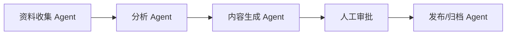
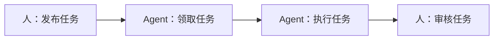
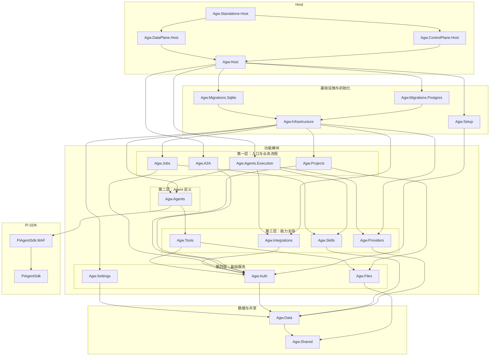

# Agw

[中文文档](README.zh-CN.md) | [Documentation](README.md)

[](https://github.com/zxyao145/agw/releases)
[](https://github.com/zxyao145/agw/pkgs/container/agw)

Agw 是一个面向个人用户和小型研发团队的、自托管的后台工程 Agent 中心，也是一个 AaaS (Agent as a Service) 平台和 Agent Gateway。用户可以在一个 UI 中同时操作多个 Agent：

- 自定义创建 Agent
- 集成外部 Agent：Claude Code、Codex 和 Pi

除此之外，Agw 还具备 Job 和 Agent Workflow（Agentflow）能力，可以用于创建定时任务、周期任务，以及对 Agent 进行编排。

本项目主要基于 [MAF](https://github.com/microsoft/agent-framework) 开发。用户文档站点：[zxyao145.github.io/agw/zh](https://zxyao145.github.io/agw/zh/)。

> [!NOTE]
> Agw 目前不具备 sandbox（沙箱）隔离能力，仅适用于可信的小团队或可信环境中的部署。

## 功能

- **自定义 Agent：** 组合模型、指令、Tools、MCP Tool Server、Skills 和集成 Connection。配置 Response Schema 后，最终回复是符合指定结构的 JSON 对象；Mode ToolBlock 提供 Plan 和 Execute 两种模式。
- **外部 Agent：** 运行 Claude Code、Codex 或 Pi，并可以选择使用 Agw 中配置的 Model Provider。
- **Chat 与 Project：** 对话归属于 Project。Chat 支持图片输入、在同一个对话中切换 Agent、按照权限模式请求工具审批，并在一轮执行（Turn）进行期间把新的输入加入队列。Files 视图可以浏览 Project Workspace、查看 Git 变更，并把行级评论发送给 Agent。
- **Agentflow：** 把 Agent、嵌套 Agentflow、Human Gate，以及并发（Concurrent）、交接（Handoff）、群聊（Group Chat）和 Magentic 模块连接成可以执行的图，并支持 Checkpoint。
- **Job：** 按照一次性、固定间隔或 Cron（按照 UTC 计算）的方式运行 Agent 或 Agentflow，支持失败重试和每次尝试的执行日志。
- **集成（Integrations）：** 基于内置集成（OAuth 2.0、API Key 或 AK/SK，其中包括 GitHub）创建每个用户自己的 Connection，并绑定到 Agent 和 Project。
- **记忆（Memory）：** User Memory 和 Project Memory 让 Agent 保存并复用个人偏好和项目知识。
- **认证：** 管理员密码、具名 API Token，以及可选的 OIDC 或 OAuth2 登录。每个第三方账号对应一个数据隔离的本地用户。
- **A2A：** 通过 A2A 协议对外提供 Agent。
- **客户端：** Web、Electron Desktop（Windows、macOS、Linux）和 Expo Mobile（iOS、Android）。
- **部署：** 单进程的 Standalone Server，或者共享 PostgreSQL 的 Control Plane 与 Data Plane 分离部署。

## 使用场景

### 多 Agent 协作流程（Agentflow）

适合相对明确、可以分解成多个步骤的工作，例如：


```mermaid
flowchart LR
    research["资料收集 Agent"] --> analysis["分析 Agent"]
    analysis --> content["内容生成 Agent"]
    content --> approval["人工审批"]
    approval --> publish["发布/归档 Agent"]
```

### 人-Agent 协作平台

基于 Job 能力，可以实现如下工作流：


```mermaid
flowchart LR
    create["人：发布任务"] --> claim["Agent：领取任务"]
    claim --> execute["Agent：执行任务"]
    execute --> review["人：审核任务"]
```

### 自动化任务平台

利用 Jobs、Integrations 和项目上下文，可以实现：

- 每日经营数据汇总
- GitHub Issue/PR 分类与总结
- 定期检查依赖、安全问题或文档漂移
- 客服记录整理
- 周报、日报、发布说明生成
- 定时抓取信息并写入内部系统

Job 具备 Agent 推理能力、工具权限、上下文和持久化执行记录，比普通 Cron 更有价值。

### Cloud Desktop 环境

Agw 可以作为 Cloud Desktop 的 Agent 控制平面，让 AI 在隔离的云端工作区中持续、安全地执行开发与自动化任务，并统一管理模型、工具、调度、审批和执行记录。

## 快速开始

### 安装方式

- **Desktop：** 从 [GitHub Releases](https://github.com/zxyao145/agw/releases) 下载安装包。`full` 安装 Desktop 和一个作为当前用户级 daemon 运行的 Server；`client` 只安装 Desktop，需要连接已有的 Server。Windows 和 Linux 支持 x64，macOS 支持 x64 和 arm64。安装包目前没有签名，也没有经过 Apple 公证（notarization）。
- **Docker：** 每个 Release 都会发布 Standalone 镜像 `ghcr.io/zxyao145/agw`，其中包含 Server 和 Web UI：

  ```bash
  docker run -d --name agw -p 127.0.0.1:30816:8080 -v agw-data:/data ghcr.io/zxyao145/agw:latest
  ```

  镜像中不包含 Claude Code、Codex 或 Pi，需要时请在容器中自行安装和配置。[`deploy/compose.yaml`](deploy/compose.yaml) 是在反向代理后面运行的 Compose 示例。
- **Portable Server：** 使用 `publish.sh` 构建（见[发布](#发布)），然后运行 `agw-server serve`（Windows 上运行 `agw-server.exe serve`）。没有设置 `ASPNETCORE_URLS` 时，默认监听 `http://127.0.0.1:30816`。
- **源码：** 见[开发](#开发)。

Control Plane 与 Data Plane 分离部署的说明见[部署指南](docs/4.Deployment.md)，示例位于 [`deploy/compose.cluster.yaml`](deploy/compose.cluster.yaml)、[`deploy/nginx.split.conf.example`](deploy/nginx.split.conf.example) 和 [`deploy/k8s/`](deploy/k8s/README.md)。

### 首次运行

1. 打开 Server 的 `/setup` 页面，例如 `http://localhost:30816/setup`。
2. 设置管理员密码（8 到 256 个字符）。通过 `localhost` 或回环地址直接访问时不需要其他信息；通过域名、反向代理、其他主机或容器映射端口访问时，还需要输入启动日志中的一次性 Setup Code（Docker 可以执行 `docker logs agw` 查看）。
3. 提交表单。Setup 会对当前配置的数据库执行迁移并写入初始数据，把管理员记录保存到数据库，完成后直接进入应用，不需要重启。

无人值守部署通过 `Setup__AdminPassword` 注入初始密码。初始化完成后，Setup 配置会被忽略。忘记密码时，先停止 Server，再执行 `agw-server auth reset-password`。

### 连接客户端

- Web 使用管理员密码登录，也可以使用已经配置的 OIDC/OAuth2 提供方登录。
- Desktop Client、Mobile 和自动化脚本使用具名 API Token，通过 `Authorization: Bearer agw_...` 请求头发送。API Token 在 Web 的 **Settings → Server access** 中创建，明文只显示一次。
- Desktop Full 在本地初始化完成后自动创建自己的 API Token，并使用操作系统凭据存储进行保护。

### 典型使用流程

1. 在 `Providers`、`Models`、`Model Providers` 中配置供应商、模型和模型供应商关联，并按照供应商的真实规格设置每个模型的上下文窗口与最大输出 token。Definition Agent 会根据这些上限预留回复空间，并自动压缩模型请求；自动发现的模型使用的 `256,000 / 64,000` 只是回退默认值，并不代表供应商的真实上限。
2. 在 `Agents` 中创建 Agent，并按需关联 Tools、MCP Tool Server、Skills 或集成 Connection。
3. 通过 `Chat` 或 `Projects` 运行 Agent 对话，并查看持久化的历史记录。
4. 使用 `Agentflows` 进行多 Agent 编排，使用 `Jobs` 执行定时或周期任务。

### 使用说明

- Web、Desktop 和 Mobile 的 Chat 都支持文字与图片混合输入；每条消息最多附带 5 张 JPEG、PNG、GIF 或 WebP 图片，单张不超过 5 MB，总计不超过 10 MB。
- 管理列表支持复制 Agent、完整的 Agentflow 图和非内建 Project。
- Claude Code、Codex 和 Pi 都可以选择 Model Provider：Claude Code 要求 Anthropic，Codex 要求 OpenAI Responses，Pi 支持 OpenAI Chat Completions、OpenAI Responses 和 Anthropic；取消选择后沿用外部工具自身的配置。
- Agent 定义的修改在下一轮执行时生效，并保留当前对话。
- Chat 只提供目标支持的权限模式。Claude Code 和自定义 Agent 支持 Always ask、Allow same arguments 和 Full access；Codex 和 Pi 只支持 Full access。权限能力查询、输入队列与重连行为见[执行协议](docs/ws-flow.md)。

### 项目 Workspace

每个 `Project.Workspace` 都必须是 Agw Server 进程可见的目录。文件 API、Git、Claude Code 和 Codex 使用同一棵本地工作树。需要使用网络存储时，应该先通过操作系统或容器平台完成挂载，再把挂载路径设置成 Workspace；Agw 不提供应用内的 SFTP 后端。已经使用过的 Workspace 发生变化后，需要重启 Server。

## 配置

后端配置遵循标准 ASP.NET Core 配置链，优先级从低到高依次是：内置默认值、[`src/server/Agw.Host/appsettings.json`](src/server/Agw.Host/appsettings.json)、环境专属 JSON、Development User Secrets、环境变量、命令行参数。主要部署配置的有效默认值如下：

```json
{
  "AgwDataDir": "~/agw",
  "AgwLogDir": "./logs",
  "Database": {
    "Provider": "sqlite",
    "ConnectionString": "Data Source=agw.db"
  },
  "Execution": {
    "Provider": "InProcess"
  },
  "DistributedLock": {
    "Provider": null,
    "ConnectionString": ""
  },
  "OpenTelemetry": {
    "OtlpEndpoint": ""
  }
}
```

- `AgwDataDir` 保存数据库、`skills/` 和 Data Protection `keys/`。默认位置是 `~/agw`（Windows 上是 `%USERPROFILE%\agw`），容器中是 `/data`。使用相对路径的 SQLite 文件位于该目录的 `database/` 子目录中。
- `AgwLogDir` 默认是进程工作目录下的 `./logs`，与 `AgwDataDir` 相互独立。
- 数据库 Provider 支持 `sqlite` 和 `postgres`。配置以单个配置键为单位进行覆盖，因此更换数据库时需要同时设置 `Database:Provider` 和 `Database:ConnectionString`。
- `Execution:Provider` 支持 `InProcess` 和 `Distributed`。分布式执行要求数据库与锁都使用 PostgreSQL；事件流默认使用 PostgreSQL，也可以通过 `Execution:Distributed:EventStream:Provider` 改用 Redis。
- 锁 Provider 支持 `inmemory` 和 `postgres`。`DistributedLock:Provider` 是 `null` 或不存在时，SQLite 使用进程内锁，PostgreSQL 使用 advisory lock；PostgreSQL 锁的连接字符串为空时，复用 `Database:ConnectionString`。
- `OpenTelemetry:OtlpEndpoint` 为空时不启用 OTLP 导出；设置成 Collector 地址后导出 traces、metrics 和日志。Development 配置使用 `http://localhost:4317`。
- Host 模板每 10 秒刷新一次对话历史；省略该间隔时使用代码中的 5 秒默认值。见[对话持久化](src/server/Agw.Agents.Execution/Persistence/README.md)。
- 不要把机密信息写入固定的配置文件，请通过环境变量、User Secrets 或密钥管理服务提供。

分离部署、反向代理、OIDC 登录、备份和升级详见[部署指南](docs/4.Deployment.md)。

## 开发

请先安装 .NET 10 SDK、Node.js 24 和 pnpm 12.5.1。只有构建容器镜像时才需要安装带 Buildx 的 Docker。首次克隆仓库后，配置 Git hooks，并安装后端和客户端依赖：

```bash
git config core.hooksPath .githooks
dotnet restore Agw.slnx
dotnet tool restore

cd src/clients
pnpm install
```

在仓库根目录以热重载模式运行后端，监听 `http://localhost:30816`：

```bash
dotnet watch --project src/server/Agw.Standalone.Host
```

在另一个终端从 `src/clients` 启动 Web，然后打开 `http://localhost:3001`：

```bash
cd src/clients
pnpm dev:web
```

Web 会把 `/api/*` 和 `/openapi/*` 代理到后端，代理目标按照顺序读取 `BACKEND_API_BASE_URL`、`NEXT_PUBLIC_API_BASE_URL`，默认使用 `http://localhost:30816`。

- **Desktop：** 保持后端运行，在 `src/clients` 下执行 `pnpm dev:desktop`。Desktop renderer 使用 `http://localhost:3000`，不需要同时启动 Web 开发服务器。
- **Mobile：** 在 `src/clients` 下执行 `pnpm dev:mobile`、`pnpm android:mobile` 或 `pnpm ios:mobile`。原生工程由 Expo CNG 生成，不需要手工维护。
- **分离的 Host：** 执行 `dotnet run --project src/server/Agw.ControlPlane.Host` 和 `dotnet run --project src/server/Agw.DataPlane.Host`（Data Plane 使用 `http://localhost:30817`），两者都需要 PostgreSQL 和 `Execution:Provider=Distributed`。

提交改动前，运行主要校验命令：

```bash
# 仓库根目录
dotnet build Agw.slnx
dotnet test Agw.slnx
dotnet csharpier check .

# src/clients
pnpm build
pnpm lint
pnpm test
pnpm fmt:check
```

修改后端 API 定义后，需要在 `src/clients` 下执行 `pnpm gen:api`，重新生成类型化客户端。修改项目引用、模块边界、持久化访问、实体或 Behavior 后，需要执行 `dotnet test tests/Agw.Architecture.Tests`。运行单个测试的命令、EF Core migration 命令、依赖 PostgreSQL 的测试和 package 级任务详见[开发指南](docs/1.Development.md)。

### 调试

- **后端：** 在 .NET 调试器中使用 launch profile 启动 `src/server/Agw.Standalone.Host`。它会设置 `ASPNETCORE_ENVIRONMENT=Development`，此时可以访问只在开发环境开放的 OpenAPI 和 Scalar 端点。Server 日志同时输出到控制台和 `AgwLogDir` 下按照 Host 角色区分的文件。
- **Web：** 执行 `pnpm dev:web`，通过浏览器开发者工具调试客户端代码和网络请求，并在 Next.js 终端查看服务端输出。需要连接其他后端时，可以执行 `BACKEND_API_BASE_URL=http://host:port pnpm dev:web`。
- **Desktop：** 执行 `pnpm dev:desktop`。Electron main process 日志和构建输出显示在启动终端，preload 与 renderer 代码可以通过 Electron DevTools 检查。
- **单个测试：** 后端可以执行 `dotnet test tests/<Project> --filter "FullyQualifiedName~MethodName"`；客户端可以在 `src/clients` 下执行 `pnpm exec turbo run test --filter=@agw/web`，并按需替换 package filter。

## 发布

生成发布产物前，请先运行上述校验命令。本地 Server 和容器构建由仓库根目录下的 `publish.sh` 驱动：

```bash
# 为单个 runtime 生成 self-contained Server 压缩包
PUBLISH_MODE=portable APP_VERSION=0.1.0 RIDS=linux-x64 ./publish.sh

# 为单个平台生成可以由 docker load 导入的镜像压缩包
PUBLISH_MODE=docker \
APP_VERSION=0.1.0 \
IMAGE_NAME=agw:0.1.0 \
DOCKER_PLATFORMS=linux/amd64 \
./publish.sh
```

产物写入 `artifacts/publish/`。不设置 `RIDS` 或 `DOCKER_PLATFORMS` 时会构建默认平台矩阵；使用 `PUBLISH_MODE=all` 可以同时构建可移植 Server 包和 Docker 镜像。Docker 构建会生成 Standalone、Control Plane 和 Data Plane 三个镜像。

使用 Node.js 24，在 `src/clients` 下构建 Desktop 安装包：

```bash
pnpm release:desktop -- --flavor full --arch x64 --version 0.1.0
pnpm release:desktop -- --flavor client --arch x64 --version 0.1.0
```

Desktop 产物输出到 `src/clients/desktop/release-artifacts/`。Windows 和 Linux 目前支持 x64，macOS 支持 x64 和 arm64。

`flavor` 表示安装包包含的内容：

- `full`：包含 Desktop 和自包含的 Server；Server 会安装成当前用户级 daemon。
- `client`：只包含 Desktop，需要连接已有的 Server。在 Windows 上同时提供 Setup EXE 和 portable ZIP；ZIP 解压后直接运行 `agw-desktop.exe`，不需要安装。

GitHub Release 中的 Assets 按照以下格式命名：

```text
Agw-Desktop-{version}-{flavor}-{platform}-{arch}{variant}.{extension}
```

`version` 不包含开头的 `v`；`platform` 是 `windows`、`macos` 或 `linux`；`arch` 是 `x64` 或 `arm64`。Windows 安装包使用 `-Setup.exe`，便携版 Client 使用 `-Portable.zip`；DMG 和 DEB 没有 variant 后缀。例如：

```text
Agw-Desktop-0.2.0-preview.1-full-windows-x64-Setup.exe
Agw-Desktop-0.2.0-preview.1-client-windows-x64-Portable.zip
Agw-Desktop-0.2.0-preview.1-client-macos-arm64.dmg
```

同一个 Release 还会发布 `linux/amd64` 和 `linux/arm64` 的 Standalone、Control Plane、Data Plane 镜像，名称分别是 `ghcr.io/zxyao145/agw:{version}`、`ghcr.io/zxyao145/agw-control-plane:{version}`、`ghcr.io/zxyao145/agw-data-plane:{version}`。稳定版还会获得 minor、major、`latest` 和 commit SHA 镜像标签；预发布版本只获得完整版本号和 commit SHA 标签。

正式稳定版通过 `vX.Y.Z` tag 发布，例如：

```bash
git tag v0.1.0
git push origin v0.1.0
```

预发布版本使用 `vX.Y.Z-preview.N`、`vX.Y.Z-alpha.N` 或 `vX.Y.Z-beta.N`。[发布工作流](.github/workflows/release.yml)会为受支持的 tag 或手动传入的 `release_tag` 发布 Linux amd64/arm64 镜像，并创建包含全部 Desktop Assets 的 GitHub Release。[Desktop 构建工作流](.github/workflows/build-desktop.yml)会在相关 Pull Request、推送到 `main` 或手动运行时生成临时 Desktop 产物。[站点工作流](.github/workflows/site.yml)负责构建 [`site/`](site/README.md) 中的文档站点，并在推送到 `main` 时部署到 GitHub Pages。

## 架构

### 技术栈

- **后端：** .NET 10、ASP.NET Core、SignalR、Entity Framework Core（SQLite 与 PostgreSQL）、Microsoft Agent Framework（`Microsoft.Agents.AI`）、MCP C# SDK、A2A .NET SDK、Serilog 和 OpenTelemetry。
- **Web 与共享 UI：** Next.js 16 App Router、React 19、Tailwind CSS 4、shadcn/ui（Radix UI）、TanStack Query 5 和 React Flow。
- **Desktop：** Electron 44 与 Electron Forge。
- **Mobile：** Expo SDK 57、Expo Router 与 React Native。
- **客户端工具链：** pnpm Workspace、Turborepo、oxlint 和 oxfmt。

### 后端

Agw 采用基于领域的模块化单体架构。`src/server/Agw.Host` 是共享 Hosting Module，负责组合所有模块的注册。可执行 Host 包括：

- `Agw.ControlPlane.Host`：Setup、认证管理、管理 API、OpenAPI、静态 Web UI 和 Job 调度。
- `Agw.DataPlane.Host`：SignalR 执行 Hub `/api/hubs/exec`、A2A 路由和持久化执行 Worker。
- `Agw.Standalone.Host`：在一个进程中同时承担两种角色（程序集名称是 `agw-server`），默认使用 SQLite 和 InProcess 执行。

每个业务模块遵循 `Api → Application → Domain ← Infrastructure`，只创建自己需要的层。Application 负责用例协调、数据读取和保存。单个 Aggregate 的业务规则由 Behavior 处理；需要其他 Aggregate 信息的规则由 DomainService 处理。普通 CRUD 直接使用持久化接口：

```text
Controller -> Application -> I<Module>DbContext / persistence adapter -> EF Core
```

跨模块调用通过 `Agw.<Module>.Contracts` 中的接口完成。实体类型集中放在 `Agw.Data`，每张表都只有一个所属模块。

后端与 Pi SDK 的简化依赖概览：省略 Contracts 项目、`Agw.Tools.Abstractions`、`Agw.Tools.Generators` 源代码生成器及其相关引用，并省略可以通过其他路径表达的重复连线；不包含测试项目和 NuGet 包。图从上往下排列，`A --> B` 表示 A 引用 B：


```mermaid
flowchart TB
    subgraph hosts["Host"]
        agwStandaloneHost["Agw.Standalone.Host"]
        agwControlPlaneHost["Agw.ControlPlane.Host"]
        agwDataPlaneHost["Agw.DataPlane.Host"]
        agwHost["Agw.Host"]
    end

    subgraph persistence["基础设施与初始化"]
        agwInfrastructure["Agw.Infrastructure"]
        agwMigrationsPostgres["Agw.Migrations.Postgres"]
        agwMigrationsSqlite["Agw.Migrations.Sqlite"]
        agwSetup["Agw.Setup"]
    end

    subgraph modules["功能模块"]
        subgraph entryLayer["第一层：入口与业务流程"]
            agwA2A["Agw.A2A"]
            agwAgentsExecution["Agw.Agents.Execution"]
            agwProjects["Agw.Projects"]
            agwJobs["Agw.Jobs"]
        end

        subgraph definitionLayer["第二层：Agent 定义"]
            agwAgents["Agw.Agents"]
        end

        subgraph capabilityLayer["第三层：能力支持"]
            agwIntegrations["Agw.Integrations"]
            agwProviders["Agw.Providers"]
            agwTools["Agw.Tools"]
            agwSkills["Agw.Skills"]
        end

        subgraph serviceLayer["第四层：基础服务"]
            agwAuth["Agw.Auth"]
            agwFiles["Agw.Files"]
            agwSettings["Agw.Settings"]
        end
    end

    subgraph foundation["数据与共享"]
        agwData["Agw.Data"]
        agwShared["Agw.Shared"]
    end

    subgraph sdk["Pi SDK"]
        piAgentSdkMAF["PiAgentSdk.MAF"]
        piAgentSdk["PiAgentSdk"]
    end

    agwStandaloneHost --> agwControlPlaneHost & agwDataPlaneHost
    agwControlPlaneHost --> agwHost
    agwDataPlaneHost --> agwHost
    agwHost --> agwMigrationsPostgres & agwMigrationsSqlite & agwSetup
    agwHost --> agwA2A & agwAgentsExecution
    agwMigrationsPostgres --> agwInfrastructure
    agwMigrationsSqlite --> agwInfrastructure
    agwInfrastructure --> agwAgents & agwProjects & agwJobs
    agwInfrastructure --> agwIntegrations & agwProviders & agwSettings
    agwSetup --> agwAuth
    agwA2A --> agwAuth
    agwAgentsExecution --> agwAgents & agwIntegrations & agwProviders & agwSkills
    agwProjects --> agwFiles & agwAuth
    agwJobs --> agwSkills & agwAuth
    agwAgents --> agwTools & piAgentSdkMAF
    agwIntegrations --> agwAuth
    agwProviders --> agwData
    agwTools --> agwFiles & agwAuth
    agwSkills --> agwData
    agwAuth --> agwData
    agwSettings --> agwData
    agwFiles --> agwShared
    agwData --> agwShared
    piAgentSdkMAF --> piAgentSdk
```

- **Agw.Agents：** 自定义 Agent 定义、外部 Agent（Claude Code、Codex 和 Pi）、Agentflow、MCP Tool Server 和 Trace。
- **Agw.Agents.Execution：** Agent 与 Agentflow 执行、外部 Agent 运行时、SignalR Hub、人工交互，以及 InProcess 或 Distributed 执行。它单向引用 `Agw.Agents`，两者在逻辑上组成同一个 Agents 模块。
- **Agw.Providers：** 模型、供应商、模型供应商关联和供应商认证配置。
- **Agw.Tools：** 统一的 Tool 与 ToolBlock 目录、运行时工具实例化和 User Memory。
- **Agw.Skills：** Skill 定义、本地与远程内容，以及执行适配器。
- **Agw.Integrations：** 内置集成目录、每个用户的安装配置与 Connection、OAuth，以及绑定到 Connection 的原生工具和 MCP 工具。
- **Agw.Projects：** Project、对话和聊天历史。每个对话都归属于一个 Project。
- **Agw.Files：** 基于宿主机可见的本地 Workspace 提供项目级文件 API 与 Git 操作。
- **Agw.Jobs：** 通过 Once、Interval 和 Cron 触发器定时运行 Agent 与 Agentflow，支持重试和执行日志。
- **Agw.A2A：** 通过 A2A 协议对外提供 Agent。
- **Agw.Auth：** 管理员与 OIDC/OAuth2 认证、本地用户、API Token、CSRF 防护和授权。
- **Agw.Setup：** 首次运行的管理员初始化，以及保存在数据库中的初始化状态。
- **Agw.Settings：** 带有审计信息的全局与用户级配置组，例如认证状态和快捷提示词（Quick Prompts）。

### 客户端

`src/clients` 下的 pnpm Workspace 包含 `@agw/web`、`@agw/desktop`、`@agw/mobile` 三个应用，以及 `src/clients/packages/` 下的共享包，由 Turborepo 统一编排任务。

- `@agw/web` 只包含路由、布局、全局 CSS 和应用外壳组合；业务界面来自 `packages/*`。
- `@agw/desktop` 拥有安全的 Electron main/preload 实现和位于 `desktop/renderer/` 的独立 React renderer，bridge 接口定义保留在 Desktop 内部。Web 与 Desktop 不会互相导入、构建或使用对方的产物。详见 [`src/clients/desktop/README.md`](src/clients/desktop/README.md)。
- `@agw/mobile` 是 Expo Router 应用，只使用兼容 React Native 的包。详见 [`src/clients/mobile/README.md`](src/clients/mobile/README.md)。
- Chat 分为 `@agw/chat-core`（消息语义）、`@agw/chat-runtime`（SignalR 执行与 Conversation 状态）、`@agw/chat`（Web 与 Desktop 渲染器）和 `@agw/chat-native`（React Native 渲染器）。`@agw/api` 提供基于 OpenAPI 生成的类型化 API 客户端。

## 界面截图

### Desktop（桌面端）


### Providers（供应商）


### Agents（代理）


### Tools & MCP（工具与 MCP）


### Skills（技能）


### Integrations（集成）


### Chat（对话）


### Chat Workspace Files（对话工作区文件）


### Projects（项目）


### Jobs（任务）


### Agentflows（代理编排）


### Mobile（移动端）

<p align="center">
  
  
  
</p>

## 文档

- [文档站点](https://zxyao145.github.io/agw/zh/)：安装、第一次对话、功能指南、运维和开发，提供中文和英文版本。
- [部署指南](docs/4.Deployment.md)：数据目录、Standalone 与分离部署、Docker、反向代理、分布式执行、OIDC 登录和升级。
- [开发指南](docs/1.Development.md)：构建、测试、代码检查和格式化命令，EF Core migration 以及错误码规则。
- [架构](docs/2.Architecture.md)：后端项目依赖图、Host 角色、实体关系和客户端包。
- [模块组织](docs/human/4.module-organization.md)：模块内部采用的分层原则。
- [领域架构](docs/human/5.domain-architecture.md)：Behavior、DomainService 与 ApplicationService 的职责划分。
- [Agent 执行协议](docs/ws-flow.md)：SignalR 命令、权限能力、Turn 消息、输入队列与断线行为。
- [Execution 子系统](src/server/Agw.Agents.Execution/README.md)：进程内与分布式执行、数据流、Definition Agent 自动上下文压缩与 Human-in-the-loop。
- [Chat Suggestions 设计](docs/approachs/1.Chat%20Suggestions.md)：Agent 感知的 slash commands、Claude init commands、文件建议与失败降级。
- [Agentflow 指南](docs/approachs/2.Agentflow.md)：图路由与循环规则、Checkpoint 分支恢复、编辑器撤销和未保存状态、Chat 消息归属。
- 模块 README：[Auth](src/server/Agw.Auth/README.md)、[Setup](src/server/Agw.Setup/README.md)、[Settings](src/server/Agw.Settings/README.md)、[Tools](src/server/Agw.Tools/README.zh-CN.md)、[Integrations](src/server/Agw.Integrations/README.zh-CN.md)、[Jobs](src/server/Agw.Jobs/README.zh-CN.md)、[Files](src/server/Agw.Files/README.zh-CN.md)。
- 客户端：[Desktop](src/clients/desktop/README.md)、[Mobile](src/clients/mobile/README.md)。

## 协议

在 Apache 2.0 协议之上添加了条款限制，个人用户和企业内部使用没有任何限制，详见 [LICENSE](LICENSE)。
