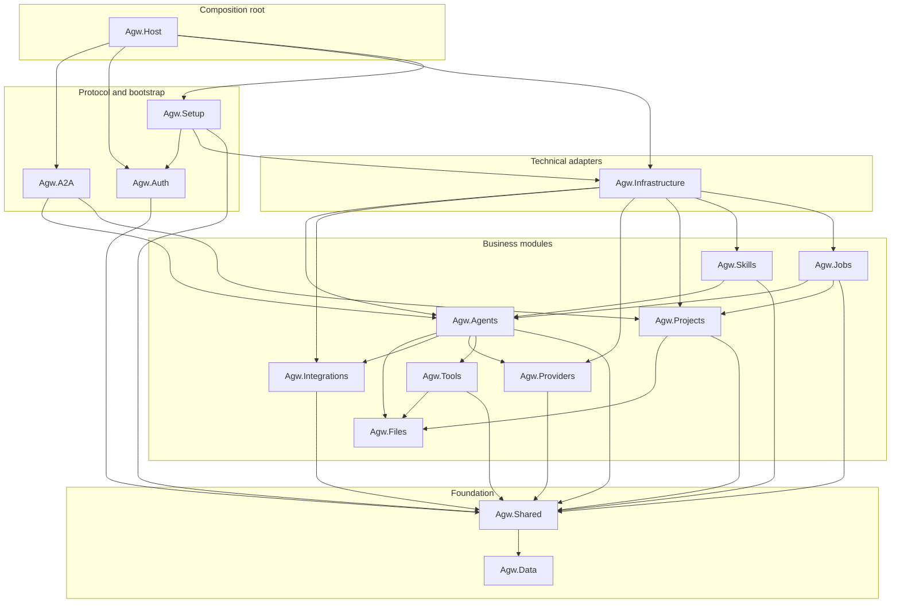

# Project Overview

Agw is an ASP.NET Core + EF Core backend with a Next.js frontend for managing LLM agents, models, providers, tools, skills, jobs, integrations, and multi-agent workflows. 

It uses a modular project structure built around Microsoft.Agents.AI, MCP tool servers, A2A endpoints, and external agents such as Claude Code SDK.

# Backend

The backend follows a modular monolith architecture; it is neither a microservices architecture nor a strict Clean Architecture.

Its core approach is to split the project by business domain, use lightweight layering within each module, and assemble the modules in the Host. The core entry point is `src/server/Agw.Host/Program.cs`.

## Tech Stack

- .NET 10, C#
- ASP.NET Core + EF Core
- Microsoft.Agents.AI

## Backend Organization (`src/server/`)

```
Agw.Host/              # ASP.NET Core entry point, DI registration, hosted services
Agw.Infrastructure/    # EF Core DbContext, repositories, and provider configuration
Agw.Migrations.Sqlite/ # SQLite migrations and model snapshot
Agw.Migrations.Postgres/ # PostgreSQL migrations and model snapshot
Agw.Data/              # Persisted entities, EF configurations, repository and unit-of-work contracts
Agw.Shared/            # Shared contracts, exceptions, results, and utilities
Agw.Agents/            # Agent definitions, agentflows, MCP tools, execution services
Agw.Providers/         # LLM models, providers, model-providers, auth configs
Agw.Projects/           # Projects, tasks, session records, chat history
Agw.Jobs/              # Background jobs, project leases
Agw.Integrations/      # Plugin catalog, installations, connections, OAuth, MCP, native tools
Agw.A2A/               # A2A protocol implementation for agent discovery/communication
Agw.Auth/              # Administrator authentication, CSRF, and authorization guards
Agw.Skills/            # Skill definitions, local/remote content, caching, and execution adapters
Agw.Tools/             # Unified Tool/ToolBlock catalog and runtime materialization
Agw.Files/             # Project-scoped file systems and file APIs
Agw.Setup/             # First-run setup, server-state persistence, and legacy Token import
```

`Agw.slnx` includes these backend projects plus the A2A, Agents, Auth, Files, Host, Integrations, Jobs, Projects, Setup, Shared, Skills, and Tools test projects.

A typical call chain is `Controller -> AppService / RuntimeService -> DomainService -> IRepository / IUnitOfWork -> EF Core`.

Scheduled project execution depends on the `IProjectExecutionLock` boundary. `ProjectExecutionLockRouter` resolves the optional `DistributedLock` configuration for each acquisition and delegates to either `InMemoryProjectExecutionLock` or the provider-neutral `DistributedProjectExecutionLock`. When the lock provider is not configured, SQLite selects the process-local implementation and PostgreSQL selects PostgreSQL advisory locks; a PostgreSQL lock can also use its own connection string.

The diagram shows direct project references between in-repository backend projects. `A --> B` means project A references project B; external SDK references are omitted.



## Agw.Host

ASP.NET Core entry point, dependency injection registration, hosted services, as well as logging, OpenTelemetry, OpenAPI, static files, database initialization, and more.

## Agw.Auth

Owns the single-administrator Cookie, named Bearer Token, and `LocalTrusted` authentication modes together with CSRF validation and the `/api` and `/a2a` authorization guard. Its persistence seam is `IAuthenticationStateStore`; `Agw.Setup.JsonInitializationStateStore` is the production Adapter so authentication and bootstrap data continue to share one atomically replaced `server-state.json` document.

## Business Module Organization

[Module Organization](3.Module%20Organization.md)

## Agent Execution

Real-time execution enters through the authenticated SignalR Hub at `/api/hubs/exec`. The `Agw.Agents/Execution` subsystem separates connection-scoped command handling from reusable Agent/Agentflow runtimes and per-turn lifecycle state. See [Agent execution flow](ws-flow.md) for the protocol and [`Execution/README.md`](../src/server/Agw.Agents/Execution/README.md) for directory responsibilities and extension guidance.

Definition Agents created through `CreateDefinitionAgentAsync` reserve each model's `MaxOutputTokens` from its `MaxContextWindowTokens`, then run MAF's `ContextWindowCompactionStrategy` before every model call inside the function-invocation loop. The effective input budget is the difference between those limits; the default strategy compacts older Tool call/result groups at 50% and truncates older messages at 80%. Compaction changes only the request view: EF Core retains the original history, while compaction state persists with the Agent session. External Agents and one-shot summary clients do not use this pipeline. See the Execution README for the full boundary and state-key contract.

Persisted Agentflows are Input-rooted directed graphs compiled into Microsoft Agent Framework workflows by `AgentflowWorkflowCompiler`. They support Direct, Fan Out, ordered Switch, Fan-in Barrier, orchestration-block, HumanGate, and controlled-cycle semantics. `AgentflowDomainService` validates graph structure, references, block membership, routing-strategy consistency, cycle exits, and cyclic barrier constraints before persistence. See [Agentflow Graphs, Editor, and Chat Attribution](6.Agentflow.md) for the complete graph contract and client behavior.

Agentflows execute through the same SignalR turn boundary as Agents. HumanGate responses arrive through `HumanResponseCommand` for the active turn; Agw does not expose a separate Agentflow run or checkpoint REST lifecycle.

## Agw.Tools

Owns the unified Tool capability model. A standalone Tool can be selected independently; a ToolBlock is an atomic group whose member Tools are selected and removed together. `ToolRegistryService` exposes both through `/api/tools`, while `ToolContribution` gives contextual Tools and ToolBlocks one materialization interface for Tools, context providers, loop evaluators, approval rules, warnings, and owned runtime resources.

Agent and Project persist one `ToolValueObject[]` in the `tools` column. The
outer value is polymorphic on `kind` (`tool` or `toolBlock`), and its nested
definition is polymorphic on `name`. Values are merged by `definition.name`,
with the Project definition replacing an Agent definition of the same name.
`AgwWorkspaceProvider` remains an implicit System Agent context provider in
`Agw.Agents`, outside the Tool catalog.

See [`Agw.Tools/README.md`](../src/server/Agw.Tools/README.md) for the runtime lifecycle and extension guide.

## Agw.Files

File API calls and in-process consumers resolve a `projectId` to `Project.Workspace` and operate only on project-relative paths. The current implementation supports host-visible local directories. Network file systems must be mounted by the operating system or container platform first so Files, Git, Claude Code, and Codex share one real working tree.

`ProjectScopedFileSystemResolver` caches `CachedEntry(FileSystem, CreatedAt)` by Project ID. There is no TTL or automatic refresh; changing an already-resolved Workspace requires a Server restart unless an explicit invalidation design is added.

## Agw.Infrastructure

Owns provider-specific persistence and other technical adapters. `AgwDbContext` derives from the shared `EFContext`, configures SQLite or PostgreSQL, applies entity configurations, encrypts protected fields during persistence, and supplies repository and unit-of-work implementations. This module also owns distributed execution-lock adapters.

## Agw.Data

Owns persisted entities, their EF Core mapping configurations, the shared `EFContext`, and repository, unit-of-work, transaction, audit, and soft-delete contracts used by backend modules.

`BaseEntity` carries create/update audit fields. The Infrastructure registration attaches creator, modifier, and soft-delete `SaveChangesInterceptor` implementations to `AgwDbContext`; they use `TimeProvider` and the current authenticated user, with the administrator identity as the background fallback. An entity that implements `ISoftDelete` is changed from a physical delete to an update and is excluded by the global soft-delete query filter. Keep these cross-cutting behaviors in the shared contracts and Infrastructure interceptors rather than duplicating them in module services.

## Agw.Shared

Owns shared contracts, exceptions, results, and utilities used across business modules. Persisted entities and repository contracts live in `Agw.Data`.

Keep shared code minimal; module-specific behavior remains in the owning module.

## Key Domain Entities

**Agent System:**

- `Agent` - AI agent with SystemPrompt, ModelProviderId, Type (System/External), MCP tool bindings
- `Agentflow` - Persisted Input-rooted multi-agent workflow graph with nodes, edges, and execution blocks
- `AgentflowNode` - Node in workflow graph (references Agent or nested Agentflow)
- `AgentflowEdge` - Connection between nodes
- `McpToolServer` - MCP server configuration (stdio/HTTP/SSE transport)

**Provider System:**

- `AgwAiModel` - LLM model definition, including context-window and maximum-output token limits used by Definition Agent compaction
- `Provider` - API provider (OpenAI, Anthropic) with endpoint and auth configs
- `ModelProvider` - Links model to provider with pricing metadata
- `ProviderAuthConfig` - Authentication (ApiKey or Environment variable)

**Task System:**

- `Project` - host-visible Workspace plus project-level agent configuration
- `ProjectConversation` - Project-scoped conversation grouping identified by ContextId
- `ProjectConversationChatHistory` - Persisted execution status and conversation history entry
- `TaskProjection` - Logical task reconstructed from records sharing a TaskId
- `TaskSessionBinding` - External provider session binding for an Agent within a project conversation
- `AgentSessionStateEntry` - Persisted SDK session state scoped by ProjectConversation, Agent, and workflow node

**Integration System:**

- `PluginDefinition` - code/content catalog entry for an integration plugin
- `PluginInstallation` - platform-wide plugin configuration and protected credentials
- `Connection` - Agent-selectable external account or endpoint with its own credentials

## Entity Relationships

```
AgwAiModel ←→ ModelProvider ←→ Provider
                               ↓
                        ProviderAuthConfig

Agent ←→ ModelProvider (optional for External agents)
   ↓
AgentMcpToolServer ←→ McpToolServer
   ↓
AgentflowNode ←→ Agentflow
   ↓
AgentflowEdge (Source/Target)

Project → ProjectConversation → ProjectConversationChatHistory
                ↓          ↘
        TaskSessionBinding  AgentSessionStateEntry ← Agent

PluginDefinition → PluginInstallation
         ↓
Connection ← AgentConnectionRelation → Agent
     ↑
ProjectConnectionRelation ← Project
```

# Web Client (`src/clients/web`)

`@agw/web`, `@agw/desktop`, and all `@agw/*` packages under `src/clients/packages/` are members of the pnpm Workspace rooted at `src/clients`, with tasks orchestrated by Turborepo. The Expo mobile client remains a separate npm workspace.

## Tech Stack

- Next.js 16 with App Router
- React 19, Tailwind CSS 4, Shadcn UI components, Radix UI components
- TanStack React Query 5 for data fetching
- openapi-fetch with auto-generated types

## Package Structure

- `@agw/web`: browser Next.js routes, layouts, global CSS, and application-shell composition only
- `@agw/desktop`: Electron main/preload plus an independent Next.js React renderer
- `@agw/http-client`, `@agw/api`: transport primitives, generated OpenAPI types, and the typed API runtime
- `@agw/components`: platform-neutral React components and design tokens
- `@agw/auth`, `@agw/agents`, `@agw/projects`, `@agw/chat`, `@agw/providers`, `@agw/integrations`, `@agw/jobs`, `@agw/skills`, `@agw/tools`, `@agw/observability`, `@agw/settings`: business domains and their reusable Web UI
- `desktop/renderer/src/runtime`: Desktop-owned Electron runtime, connection gate, settings, and shell composition
- `desktop/src/shared/contracts`: framework-free bridge protocol internal to the Desktop application

## Route Structure

```
src/app/(app)/
├── (agents)/
│   ├── agents/           # Agent CRUD
│   └── agentflows/       # Workflow editor (React Flow)
├── (interface)/
│   └── chat/             # Chat interface
├── (jobs)/
│   └── jobs/             # Scheduled jobs
├── (overview)/
│   ├── dashboard/        # Dashboard
│   └── traces/           # Trace viewer
├── (providers)/
│   ├── models/           # Model management
│   └── providers/        # Provider management
├── (tasks)/
│   └── projects/         # Project & task execution
└── (tools)/
    └── mcp-tool-servers/ # MCP server management

src/app/(app)/integrations/ # OAuth-backed integrations UI
src/app/(app)/settings/     # Server and account settings
src/app/(app)/skills/       # Skill archive management
```

## API Integration

- Run `pnpm gen:api` from `src/clients` after backend schema changes
- Use typed `apiGet()`, `apiPost()`, `apiPut()`, and `apiDelete()` from `@agw/api`
- OpenAPI types live in `src/clients/packages/api/src/openapi.d.ts`
- Use `@agw/projects` for project-scoped file and task operations
- Use `@agw/chat` for task-execution SignalR flows and reusable Chat UI

The Chat input suggestion architecture, Agent mode routing, Claude init-command lifecycle, and `@` file search behavior are documented in [Chat Suggestions Design](5.Chat%20Suggestions.md).

Web and Desktop own separate Next.js route shells. Electron-specific React composition lives in `desktop/renderer/src/runtime`, while reusable business pages and platform-neutral UI remain in root `src/clients/packages/`. Neither application imports or consumes artifacts from the other.

# Desktop Client (`src/clients/desktop`)

The Electron main process at `src/main/index.ts` and preload at `src/preload/index.ts` form the platform adapter around Desktop's own exported renderer. The main process owns the custom `agw://app` protocol, OS credential encryption, daemon registration, tray/window behavior, and installer integration. The renderer has context isolation, sandboxing, and no Node.js integration.

`@agw/desktop` keeps bridge, runtime, settings, and server-profile contracts internal under `src/shared/contracts`; no Desktop-only contracts package is exposed to Web. Desktop builds its own renderer static export, and Web has no Electron knowledge. Both applications independently consume root business packages. `@agw/chat` owns execution keys, status, aggregation, and reusable Chat UI; Electron-only I/O and React adaptation remain local to `@agw/desktop`.

Desktop connection state is keyed by Server profile. The default local Server is `127.0.0.1:30816`; when that port is occupied, the daemon writes its effective loopback endpoint to `~/agw/runtime/server.json`. Remote connections require a named Bearer token and HTTPS unless the user accepts an explicit HTTP warning.

Execution ownership remains in the renderer's session manager rather than the visible Chat component. A `server + project + conversation` key owns one SignalR client, so Project tab changes detach and reattach the UI without interrupting background turns or Human Gate state.

See [`src/clients/desktop/README.md`](../src/clients/desktop/README.md) for development and packaging commands.
