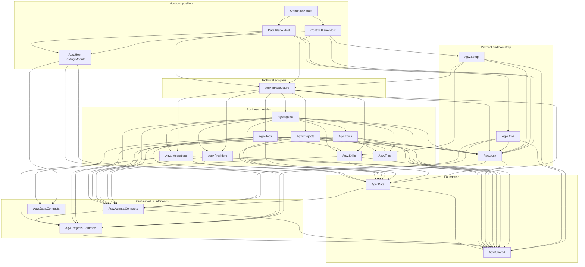

# Project Overview

Agw is an ASP.NET Core + EF Core backend with independent Next.js Web/Desktop applications and an Expo Mobile client for managing LLM agents, models, providers, tools, skills, jobs, integrations, and multi-agent workflows.

It uses a modular project structure built around Microsoft.Agents.AI, MCP tool servers, A2A endpoints, and external agents such as Claude Code SDK.

# Backend

The backend follows a modular monolith architecture; it is neither a microservices architecture nor a strict Clean Architecture.

Its core approach is to split the project by business domain, use lightweight layering within each module, and assemble the modules through the shared `Agw.Host` Hosting Module. Executable entry points live in the Control Plane, Data Plane, and Standalone Host projects.

## Normative Architecture Requirements

The following requirements are mandatory architecture invariants rather than temporary migration guidance:

1. **Modular monolith with lightweight module layering.** The backend MUST remain a modular monolith organized by business module. Each module MUST preserve the inward dependency direction `Api → Application → Domain ← Infrastructure`, while creating only the layers that its actual complexity requires. Empty layers and full Clean Architecture ceremony are not required.
2. **Logical data ownership.** Every persisted entity and table MUST have exactly one owning business module, but ownership is logical rather than physical. Entity CLR types and EF configurations MAY remain centrally hosted in `Agw.Data`; modules MAY share the single scoped `AgwDbContext`, database, and schema. Physical co-location never grants another module query or write ownership.

3. **User data isolation.** Persisted business, configuration, and execution roots are visible and mutable only to the user in immutable `CreateBy` (or the existing `UserId` owner). Child rows resolve ownership through their root. Available integration definitions, Tool/ToolBlock definitions, and registered built-in Skill definitions are global read-only catalogs; database seed rows remain administrator-owned. `PluginInstallation` is per-user setup, and default Projects `default-built-in` and `a2a` are resolved by `(CreateBy, Name)` without changing `ProjectType`.
4. **No database foreign keys from migrations.** The EF Core model MAY retain navigation and relationship metadata for change tracking and query composition, but SQLite and PostgreSQL migration generation MUST use `NoForeignKeyModelDiffer` and MUST NOT emit database foreign-key constraints or foreign-key migration operations. Hand-authored migrations MUST NOT add them. Application and Infrastructure flows own referential validation, relation cleanup, and the tests that protect those behaviors.

## Web and Desktop Renderer Tech Stack

- .NET 10, C#
- ASP.NET Core + EF Core
- Microsoft.Agents.AI

## Backend Organization (`src/server/`)

```
Agw.Host/              # Shared ASP.NET Core Hosting Module and composition runtime
Agw.ControlPlane.Host/ # Setup, Web UI, management endpoints, and Job scheduling
Agw.DataPlane.Host/    # SignalR Execution, A2A, and distributed workers
Agw.Standalone.Host/   # Combined Control/Data entry point
Agw.Infrastructure/    # EF Core DbContext, repositories, and provider configuration
Agw.Migrations.Sqlite/ # SQLite migrations and model snapshot
Agw.Migrations.Postgres/ # PostgreSQL migrations and model snapshot
Agw.Data/              # Persistence primitives and centrally hosted entity types with logical module ownership
Agw.Shared/            # Errors, results, coordination, platform utilities, and stable shared values
Agw.Agents/            # Agent definitions, agentflows, MCP tools, execution services
Agw.Agents.Contracts/  # Cross-module Agent catalog, execution, and turn contracts
Agw.Providers/         # LLM models, providers, model-providers, auth configs
Agw.Projects/           # Projects, tasks, session records, chat history
Agw.Projects.Contracts/ # Cross-module Project runtime, task/session, snapshot, and metrics contracts
Agw.Jobs/              # Background jobs, project leases
Agw.Jobs.Contracts/    # Cross-module Job metrics contracts
Agw.Integrations/      # Plugin catalog, installations, connections, OAuth, MCP, native tools
Agw.A2A/               # A2A protocol implementation for agent discovery/communication
Agw.Auth/              # Administrator authentication, CSRF, and authorization guards
Agw.Skills/            # Skill definitions, local/remote content, caching, and execution adapters
Agw.Tools/             # Unified Tool/ToolBlock catalog and runtime materialization
Agw.Files/             # Project-scoped file systems and file APIs
Agw.Setup/             # First-run setup, server-state persistence, and legacy Token import
```

`Agw.slnx` includes these backend projects plus the A2A, Agents, Auth, Files, Host, Integrations, Jobs, Projects, Setup, Shared, Skills, and Tools test projects.

A typical domain-rich write chain is `Controller -> AppService / Use Case -> new XxxBehavior(completeData) -> optional root-local preconditions -> new XxxPolicy() -> data-only XxxDecision -> Behavior applies Decision -> I<Module>DbContext / internal persistence adapter -> EF Core`. Application may reorder independent Policy and Behavior calls, but Behavior never references Policy/DomainService. Simple CRUD skips Policy and Behavior.

Scheduled project execution depends on the `IProjectExecutionLock` boundary. `ProjectExecutionLockRouter` resolves the optional `DistributedLock` configuration for each acquisition and delegates to either `InMemoryProjectExecutionLock` or the provider-neutral `DistributedProjectExecutionLock`. When the lock provider is not configured, SQLite selects the process-local implementation and PostgreSQL selects PostgreSQL advisory locks; a PostgreSQL lock can also use its own connection string.

The diagram shows runtime-facing direct references between in-repository backend projects. `A --> B` means project A references project B; provider-specific migration projects and external SDK references are omitted.



## Host Roles

`Agw.Host` is the shared Hosting Module. Three executable Hosts use its common interface:

- **Control Plane** owns Setup, authentication management, the Web UI, management endpoints, OpenAPI, and Job scheduling. In Distributed mode it submits Jobs to durable execution but never runs an execution worker.
- **Data Plane** owns `/api/hubs/exec`, A2A discovery/protocol routes, and distributed execution workers. It does not map MVC management controllers, Setup, OpenAPI, or static Web assets.
- **Standalone Host** composes both Host assemblies. It defaults to InProcess execution and retains the previous full-Server Distributed configuration as a compatibility path.

Host role is fixed by the executable and image. `DeploymentMode.Standalone/Cluster` remains the execution-topology choice stored by Setup; Control Plane and Data Plane are complementary roles within a Cluster topology.

## Agw.Auth

Owns Cookie, named Bearer Token, and `LocalTrusted` authentication modes together with CSRF validation and the `/api` and `/a2a` authorization guard. Bearer principals inherit the `ApiToken.CreateBy` user ID for execution ownership and auditing. Authenticated principals without a stable `NameIdentifier` fail closed. This phase does not add a User table or OIDC provisioning; a future numeric User key starts at `10010` and remains a decimal string in claims and owner contracts. Its persistence seam is `IAuthenticationStateStore`; `Agw.Setup.JsonInitializationStateStore` is the production Adapter so authentication and bootstrap data continue to share one atomically replaced `server-state.json` document.

## Business Module Organization

[Module Organization](3.Module%20Organization.md)

## Agent Execution

Real-time execution enters through the authenticated SignalR Hub at `/api/hubs/exec`, mapped by the Data Plane and Standalone Hosts. The `Agw.Agents/Execution` subsystem separates connection-scoped command handling from reusable Agent/Agentflow runtimes and per-turn lifecycle state. See [Agent execution flow](ws-flow.md) for the protocol and [`Execution/README.md`](../src/server/Agw.Agents/Execution/README.md) for directory responsibilities and extension guidance.

`AgwUserInput` preserves ordered text, URI, and image data content. The Server accepts JPEG, PNG, GIF, and WebP images, with at most five images, 5 MB per image, and 10 MB total per message; Web, Desktop, and Mobile mirror the same validation before dispatch.

When one project conversation switches between Agents or Agentflows, `IConversationHandoffProvider` supplies a bounded view of public text produced by other targets since the current target's durable cursor. It excludes scoped Tool protocol, control messages, private reasoning, and model-history-excluded display records. Handoff messages are request-only and are not persisted again; the current user input stores the cursor so repeated switches do not duplicate context.

`Execution:Provider` selects one process-wide runtime. `InProcess` keeps active turns and Human-in-the-loop state in the Standalone process. `Distributed` persists execution ownership, manifests, checkpoints, pending interactions, and responses in PostgreSQL, uses a PostgreSQL distributed lock for at-least-once segment execution, and replays output through PostgreSQL or Redis. SignalR, distributed Jobs, and distributed A2A share this durable execution interface; Data Plane workers claim the persisted work. Clients use a stable `executionId` and cursor to reattach after disconnects; the authenticated user ID is the ownership and authorization seam.

Definition Agents created through `CreateDefinitionAgentAsync` reserve each model's `MaxOutputTokens` from its `MaxContextWindowTokens`, then run MAF's `ContextWindowCompactionStrategy` before every model call inside the function-invocation loop. The effective input budget is the difference between those limits; the default strategy compacts older Tool call/result groups at 50% and truncates older messages at 80%. Compaction changes only the request view: EF Core retains the original history, while compaction state persists with the Agent session. External Agents and one-shot summary clients do not use this pipeline. See the Execution README for the full boundary and state-key contract.

Persisted Agentflows are Input-rooted directed graphs compiled into Microsoft Agent Framework workflows by `AgentflowWorkflowCompiler`. They support Direct, Fan Out, ordered Switch, Fan-in Barrier, orchestration-block, HumanGate, and controlled-cycle semantics. Agentflow is the current selective-DDD subdomain: `AgentflowDefinitionPolicy` evaluates proposed graph data and external facts into `AgentflowDefinitionDecision`, then `AgentflowBehavior` applies that Decision to the `Agentflow` root and owned Nodes/Edges. `AgentflowTopology` supplies reusable read-only algorithms to Policy, compiler, and runtime. CRUD, checkpoint/history, trace, and durable orchestration stay outside the Behavior. See [Agentflow Graphs, Editor, and Chat Attribution](6.Agentflow.md) for the complete graph contract and client behavior.

## Anemic Data and Behavior Pattern

Agw permanently keeps persisted entities, domain data objects, value objects, and state snapshots anemic. Behavior that a rich model would place on an entity is implemented by a concrete `Domain/Behaviors/<Entity>Behavior` class.

Application loads the root, constructs Behavior, and may run root-local preconditions before external queries. Before Behavior mutates owned children, Application loads those navigations completely. It independently evaluates Policy into a data-only Decision, asks Behavior to apply the Decision, and persists the result. Behavior may mutate only the bound root and its owned children. It is not an IoC service and cannot reference Policy/DomainService, persistence, transport, current-user, MAF/MCP, or other Infrastructure concerns. Simple CRUD does not require a Behavior.

Pure Domain Policy is manually constructed at its call site by default. A genuine DomainService whose rule spans multiple data boundaries may be managed by IoC, but it must remain stateless and may depend only on pure Domain components. A single-root `XxxDomainService` is misplaced Behavior. Policy/DomainService never calls Behavior, and Behavior never calls Policy/DomainService; Application owns their orchestration through neutral data-only Decision types.

When the root is EF-tracked, Application loads every owned navigation before Behavior mutation. Behavior reconciles children in place by stable key rather than replacing collections or delete/re-adding duplicate tracked identities.

See [ADR 0002](adr/0002-anemic-data-behavior-pattern.md) for the mandatory construction, lifetime, dependency, and migration rules.

Agentflows execute through the same SignalR turn boundary as Agents. HumanGate responses arrive through `HumanResponseCommand` for the active turn; Agw does not expose a separate Agentflow run or checkpoint REST lifecycle.

Each `CheckpointMarker` occurrence can persist a resumable workflow snapshot and a conversation boundary. Chat queries availability through the Hub and resumes an exact occurrence with `ResumeCheckpointCommand`. Resume is limited to the same user, project conversation, and Agentflow definition fingerprint; after the snapshot is validated, later conversation records and checkpoint occurrences are removed and execution continues as a new branch. In-process snapshots remain available only while their source runtime is alive, while distributed snapshots can survive reconnects and Server restarts.

## Agw.Tools

Owns the unified Tool capability model. A standalone Tool can be selected independently; a ToolBlock is an atomic group whose member Tools are selected and removed together. `ToolRegistryService` exposes both through `/api/tools`, while `ToolContribution` gives contextual Tools and ToolBlocks one materialization interface for Tools, context providers, loop evaluators, approval rules, warnings, and owned runtime resources.

Agent and Project persist one `ToolValueObject[]` in the `tools` column. The
outer value is polymorphic on `kind` (`tool` or `toolBlock`), and its nested
definition is polymorphic on `name`. Values are merged by `definition.name`,
with the Project definition replacing an Agent definition of the same name.
`AgwWorkspaceProvider` remains an implicit System Agent context provider in
`Agw.Agents`, outside the Tool catalog.

See [`Agw.Tools/README.md`](../src/server/Agw.Tools/README.md) for the runtime lifecycle and extension guide.

## Agw.Files

File API calls and in-process consumers resolve a `projectId` to `Project.Workspace` and operate only on project-relative paths. The current implementation supports host-visible local directories. Network file systems must be mounted by the operating system or container platform first so Files, Git, Claude Code, and Codex share one real working tree.

`ProjectScopedFileSystemResolver` caches `CachedEntry(FileSystem, OwnerUserId, CreatedAt)` by Project ID, rechecks the owner on cache hits, and invalidates entries when a Project is deleted. There is no TTL or automatic refresh for workspace changes.

## Agw.Infrastructure

Owns provider-specific persistence and other technical adapters. `AgwDbContext` derives from the shared `EFContext`, configures SQLite or PostgreSQL, applies entity configurations, encrypts protected fields during persistence, and supplies repository and unit-of-work implementations. This module also owns distributed execution-lock adapters.

## Agw.Data

Owns persistence primitives and centrally hosts entity CLR types and EF configurations. The ownership manifest assigns every table to one Module; ownership is logical, and the physical location in `Agw.Data` does not grant cross-module query or write access.

The `Agw.Data` assembly retains the `Agw.Shared.Data.*` CLR namespaces used by these persistence types. Namespace placement does not imply that the types live in, or create an EF Core dependency from, the `Agw.Shared` assembly.

`BaseEntity` carries create/update audit fields. The Infrastructure registration attaches creator, modifier, and soft-delete `SaveChangesInterceptor` implementations to `AgwDbContext`; `CreateBy` is immutable after creation. The named `UserScopeFilter` applies owner isolation to roots and correlates child tables through their consistency roots; it fails closed (zero rows) without a user context. Only approved token-validation, seeding, and scheduler paths may enter the restricted system scope or selectively bypass it, while retaining soft-delete filtering. An entity that implements `ISoftDelete` is changed from a physical delete to an update and is excluded by the global soft-delete query filter.

## Agw.Shared

Owns exceptions, result mapping, coordination, platform utilities, and stable shared values. It does not reference Agw.Data, EF Core, or Microsoft.Agents.

Keep shared code minimal; module-specific behavior remains in the owning module.

## Key Domain Entities

**Agent System:**

- `Agent` - AI agent with SystemPrompt, ModelProviderId, Type (System/External), MCP tool bindings
- `Agentflow` - Persisted Input-rooted multi-agent workflow graph with nodes, edges, and execution blocks
- `AgentflowNode` - Node in workflow graph (references Agent or nested Agentflow)
- `AgentflowEdge` - Connection between nodes
- `McpServer` - Independently persisted MCP server configuration (stdio/HTTP/SSE transport)

**Provider System:**

- `AgwAiModel` - LLM model definition, including context-window and maximum-output token limits used by Definition Agent compaction
- `Provider` - API provider (OpenAI, Anthropic) with endpoint and auth configs
- `ModelProviderRelation` - Links a model to a provider with pricing metadata
- `ProviderAuthConfig` - Authentication (ApiKey or Environment variable)

**Task System:**

- `Project` - host-visible Workspace plus project-level agent configuration
- `ProjectConversation` - Project-scoped conversation grouping identified by ContextId
- `ProjectConversationChatHistory` - Persisted execution status and conversation history entry
- `TaskProjection` - Logical task reconstructed from records sharing a TaskId
- `TaskSessionBinding` - External provider session binding for an Agent within a project conversation
- `AgentSessionStateEntry` - Persisted SDK session state scoped by ProjectConversation, Agent, and workflow node

**Integration System:**

- `PluginDefinition` - code/content catalog entry for an integration plugin
- `PluginInstallation` - per-user plugin setup and protected credentials
- `Connection` - Agent-selectable external account or endpoint with its own credentials

**Authentication, memory, and durable execution:**

- `ApiToken` - Hashed named Bearer token with creator audit metadata; its creator user ID becomes the authenticated ownership identity
- `UserMemory` - User-scoped memory with an encrypted Markdown body
- `ProjectMemoryEntry` - Project-scoped database memory; Project Memory may alternatively use `<Project.Workspace>/.agw/memory`
- `DurableExecutionRecord` - User-owned execution manifest, state, checkpoint, pending interactions, and responses
- `DurableExecutionEventRecord` - Append-only PostgreSQL replay entry for durable execution output
- `AgentflowCheckpointRecord` - User- and conversation-scoped resumable Agentflow checkpoint occurrence

## Entity Relationships

```
AgwAiModel ← ModelProviderRelation → Provider → ProviderAuthConfig
Agent → ModelProviderRelation (optional for External Agents)

Agent ← AgentMcpServerRelation → McpServer
Project ← ProjectMcpServerRelation → McpServer

Agentflow → AgentflowNode → Agent or nested Agentflow
Agentflow → AgentflowEdge → Source/Target AgentflowNode

Project → ProjectConversation → ProjectConversationChatHistory
                ↓          ↘
        TaskSessionBinding  AgentSessionStateEntry ← Agent

PluginDefinition → PluginInstallation
         ↓
Connection ← AgentConnectionRelation → Agent
Connection ← ProjectConnectionRelation → Project

ProjectConversation → AgentflowCheckpointRecord
DurableExecutionRecord → DurableExecutionEventRecord
```

# Client Workspace (`src/clients`)

`@agw/web`, `@agw/desktop`, `@agw/mobile`, and all `@agw/*` packages under `src/clients/packages/` are members of the pnpm Workspace rooted at `src/clients`, with tasks orchestrated by Turborepo. Chat is split into `@agw/chat-core` (message semantics and render models), `@agw/chat-runtime` (SignalR and Conversation state), `@agw/chat` (Web/Desktop renderer), and `@agw/chat-native` (React Native renderer and Chat vertical slice).

## Tech Stack

- Next.js 16 with App Router
- React 19, Tailwind CSS 4, Shadcn UI components, Radix UI components
- TanStack React Query 5 for data fetching
- openapi-fetch with auto-generated types

## Package Structure

- `@agw/web`: browser Next.js routes, layouts, global CSS, and application-shell composition only
- `@agw/desktop`: Electron main/preload plus an independent Next.js React renderer
- `@agw/mobile`: Expo Router application that consumes only React Native-safe core packages
- `@agw/http-client`, `@agw/api`: transport primitives, generated OpenAPI types, and the typed API runtime
- `@agw/components`: platform-neutral React components and design tokens
- `@agw/execution-core`: platform-neutral execution messages, protocol types, streaming merge, Tool grouping, and batching primitives; it does not establish network connections
- `@agw/projects-core`: React Native-safe Project file and conversation types plus typed client services shared with Mobile
- `@agw/auth`, `@agw/agents`, `@agw/projects`, `@agw/chat`, `@agw/providers`, `@agw/integrations`, `@agw/jobs`, `@agw/skills`, `@agw/tools`, `@agw/observability`, `@agw/settings`: business domains and their reusable Web UI
- `@agw/chat-native`: React Native Chat renderer, Composer, Context History, and Mobile Chat workspace state
- `@agw/chat-runtime`: platform-neutral execution session, activity store, and Conversation controller
- `desktop/renderer/src/runtime`: Desktop-owned Electron runtime, connection gate, settings, and shell composition
- `desktop/src/shared/contracts`: framework-free bridge protocol internal to the Desktop application

## Route Structure

```
src/app/(app)/
├── (agents)/
│   ├── agents/           # Agent CRUD
│   └── agentflows/       # Workflow editor (React Flow)
├── (interface)/
│   └── chat/             # Chat interface
├── (jobs)/
│   └── jobs/             # Scheduled jobs
├── (overview)/
│   ├── dashboard/        # Dashboard
│   └── traces/           # Trace viewer
├── (providers)/
│   ├── models/           # Model management
│   └── providers/        # Provider management
├── (tasks)/
│   └── projects/         # Project & task execution
└── (tools)/
    └── mcp-tool-servers/ # MCP server management

src/app/(app)/integrations/ # OAuth-backed integrations UI
src/app/(app)/settings/     # Server and account settings
src/app/(app)/skills/       # Skill archive management
src/app/(app)/user-memory/  # User-scoped memory management
```

## API Integration

- Run `pnpm gen:api` from `src/clients` after backend schema changes
- Use typed `apiGet()`, `apiPost()`, `apiPut()`, and `apiDelete()` from `@agw/api`
- OpenAPI types live in `src/clients/packages/api/src/openapi.d.ts`
- Use `@agw/projects` for project-scoped file and task operations
- Use `@agw/chat-runtime` for task-execution SignalR flows, `@agw/chat` for Web/Desktop Chat UI, and `@agw/chat-native` for Mobile Chat UI

The Chat input suggestion architecture, Agent mode routing, Claude init-command lifecycle, and `@` file search behavior are documented in [Chat Suggestions Design](5.Chat%20Suggestions.md).

Web and Desktop own separate Next.js route shells. Electron-specific React composition lives in `desktop/renderer/src/runtime`, while reusable business pages and platform-neutral UI remain in root `src/clients/packages/`. Neither application imports or consumes artifacts from the other.

# Desktop Client (`src/clients/desktop`)

The Electron main process at `src/main/index.ts` and preload at `src/preload/index.ts` form the platform adapter around Desktop's own exported renderer. The main process owns the custom `agw://app` protocol, OS credential encryption, daemon registration, tray/window behavior, and installer integration. The renderer has context isolation, sandboxing, and no Node.js integration.

`@agw/desktop` keeps bridge, runtime, settings, and server-profile contracts internal under `src/shared/contracts`; no Desktop-only contracts package is exposed to Web. Desktop builds its own renderer static export, and Web has no Electron knowledge. Both applications independently consume root business packages. `@agw/chat-runtime` owns execution keys, status, aggregation, and Conversation state; `@agw/chat` owns the shared DOM renderer. Electron-only I/O and React adaptation remain local to `@agw/desktop`.

Desktop connection state is keyed by Server profile. The default local Server is `127.0.0.1:30816`; when that port is occupied, the daemon writes its effective loopback endpoint to `~/agw/runtime/server.json`. Remote connections require a named Bearer token and HTTPS unless the user accepts an explicit HTTP warning.

Each Server profile owns an isolated React Query cache. Changing a profile's base URL or token retires that cache, and profile switches abort older connection probes and queries so a slower response from the previous Server cannot overwrite the active profile.

Execution ownership remains in the renderer's session manager rather than the visible Chat component. A `server + project + conversation` key owns one SignalR client, so Project tab changes detach and reattach the UI without interrupting background turns or Human Gate state.

See [`src/clients/desktop/README.md`](../src/clients/desktop/README.md) for development and packaging commands.
