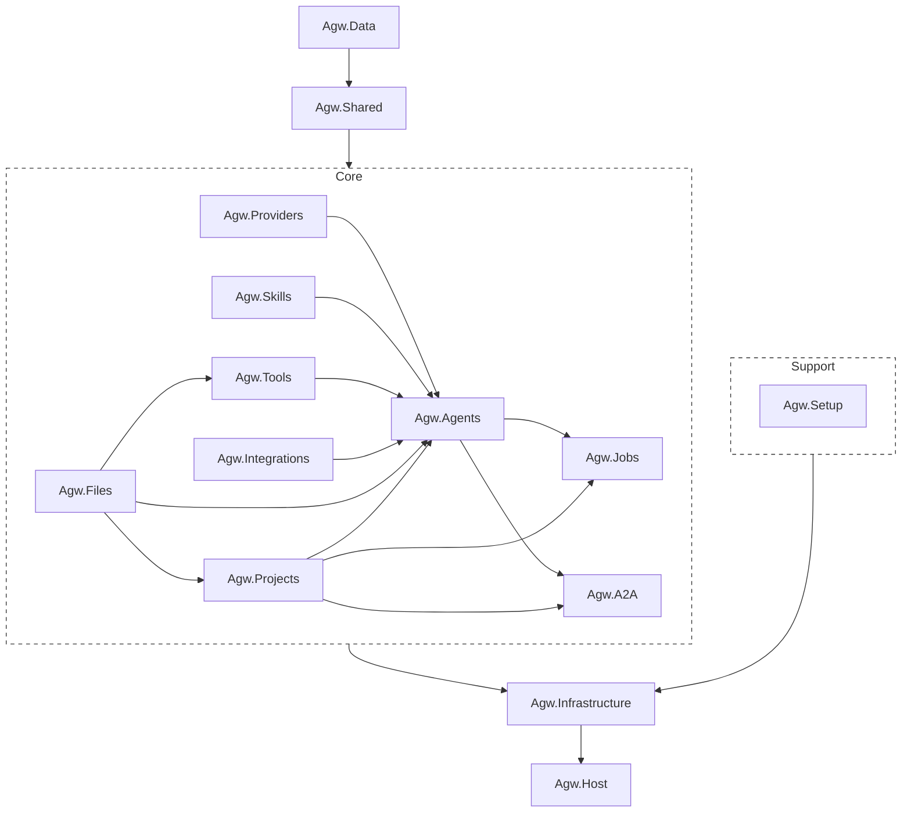

# Project Overview

Agw is an ASP.NET Core + EF Core backend with a Next.js frontend for managing LLM agents, models, providers, tools, skills, jobs, integrations, and multi-agent workflows. 

It uses a modular project structure built around Microsoft.Agents.AI, MCP tool servers, A2A endpoints, and external agents such as Claude Code SDK.

# Backend

The backend currently follows a typical “modular monolith” architecture; it is neither a microservices architecture nor a strict Clean Architecture.

Its core approach is to "split the project by business domain and implement lightweight layering within each project", which is then uniformly assembled by the host. The core entry point is located at `src\server\Agw.Host\Program.cs`.

## Tech Stack

- .NET 10, C#
- ASP.NET Core + EF Core
- Microsoft.Agents.AI

## Backend Organization (`src/server/`)

```
Agw.Host/              # ASP.NET Core entry point, DI registration, hosted services
Agw.Infrastructure/    # EF Core DbContext, repositories, migrations
Agw.Data/              # Persisted entities, EF configurations, repository and unit-of-work contracts
Agw.Shared/            # Shared contracts, exceptions, results, and utilities
Agw.Agents/            # Agent definitions, agentflows, MCP tools, execution services
Agw.Providers/         # LLM models, providers, model-providers, auth configs
Agw.Projects/           # Projects, tasks, session records, chat history
Agw.Jobs/              # Background jobs, project leases
Agw.Integrations/      # Plugin catalog, installations, connections, OAuth, MCP, native tools
Agw.A2A/               # A2A protocol implementation for agent discovery/communication
Agw.Skills/            # Skill archive management (ZIP uploads, SKILL.md format)
Agw.Tools/             # Tool discovery and registration system
Agw.Files/             # Project-scoped file systems and file APIs
Agw.Setup/             # First-run setup, authentication, and initialization state
```

`Agw.slnx` includes these backend projects plus the A2A, Agents, Files, Host, Integrations, Jobs, Projects, Setup, Shared, Skills, and Tools test projects.

A typical call chain is `Controller -> AppService / RuntimeService -> DomainService -> IRepository / IUnitOfWork -> EF Core`.

Scheduled project execution depends on the `IProjectExecutionLock` boundary. `ProjectExecutionLockRouter` resolves the optional `DistributedLock` configuration for each acquisition and delegates to either `InMemoryProjectExecutionLock` or the provider-neutral `DistributedProjectExecutionLock`. When the lock provider is not configured, SQLite selects the process-local implementation and PostgreSQL selects PostgreSQL advisory locks; a PostgreSQL lock can also use its own connection string.



## Agw.Host

ASP.NET Core entry point, dependency injection registration, hosted services, as well as logging, OpenTelemetry, OpenAPI, static files, database initialization, and more.

## Business Module Organization

[Module Organization](3.Module%20Organization.md)

## Agent Execution

Real-time execution enters through the authenticated SignalR Hub at `/api/hubs/exec`. The `Agw.Agents/Execution` subsystem separates connection-scoped command handling from reusable Agent/Agentflow runtimes and per-turn lifecycle state. See [Agent execution flow](ws-flow.md) for the protocol and [`Execution/README.md`](../src/server/Agw.Agents/Execution/README.md) for directory responsibilities and extension guidance.

## Agw.Files

File API calls and in-process consumers resolve a `projectId` to `Project.Workspace` and operate only on project-relative paths. The current implementation supports host-visible local directories. Network file systems must be mounted by the operating system or container platform first so Files, Git, Claude Code, and Codex share one real working tree.

`ProjectScopedFileSystemResolver` caches `CachedEntry(FileSystem, CreatedAt)` by Project ID. There is no TTL or automatic refresh; changing an already-resolved Workspace requires a Server restart unless an explicit invalidation design is added.

## Agw.Infrastructure

**Purpose:**

Implements **technical details** required by Application & Domain.

This is where **real-world stuff** lives.

### What belongs here

- Database
- ORM
- Repositories (implementation)
- Email services
- Message queues
- External APIs
- Logging
- Frameworks

## Agw.Data

Owns persisted entities, their EF Core mapping configurations, and the repository/unit-of-work contracts shared by backend modules.

## Agw.Shared

Owns shared contracts, exceptions, results, and utilities used across business modules. Persisted entities and repository contracts live in `Agw.Data`.

Keep shared code minimal; module-specific behavior remains in the owning module.

## Key Domain Entities

**Agent System:**

- `Agent` - AI agent with SystemPrompt, ModelProviderId, Type (System/External), MCP tool bindings
- `Agentflow` - Persisted multi-agent DAG with nodes, edges, and execution blocks
- `AgentflowNode` - Node in workflow graph (references Agent or nested Agentflow)
- `AgentflowEdge` - Connection between nodes
- `McpToolServer` - MCP server configuration (stdio/HTTP/SSE transport)

**Provider System:**

- `LlmModel` - LLM model definition
- `Provider` - API provider (OpenAI, Anthropic) with endpoint and auth configs
- `ModelProvider` - Links model to provider with pricing metadata
- `ProviderAuthConfig` - Authentication (ApiKey or Environment variable)

**Task System:**

- `Project` - host-visible Workspace plus project-level agent configuration
- `ProjectContext` - Project-scoped conversation grouping identified by ContextId
- `TaskRecord` - Persisted execution status and conversation record
- `TaskProjection` - Logical task reconstructed from records sharing a TaskId
- `TaskSessionBinding` - External provider session binding for an Agent within a project context

**Integration System:**

- `PluginDefinition` - code/content catalog entry for an integration plugin
- `PluginInstallation` - platform-wide plugin configuration and protected credentials
- `Connection` - Agent-selectable external account or endpoint with its own credentials

## Entity Relationships

```
LlmModel ←→ ModelProvider ←→ Provider
                               ↓
                        ProviderAuthConfig

Agent ←→ ModelProvider (optional for External agents)
   ↓
AgentMcpToolServer ←→ McpToolServer
   ↓
AgentflowNode ←→ Agentflow
   ↓
AgentflowEdge (Source/Target)

Project → ProjectContext → TaskRecord
             ↓
     TaskSessionBinding

PluginDefinition → PluginInstallation
         ↓
Connection ← AgentConnectionRelation → Agent
     ↑
ProjectConnectionRelation ← Project
```

# Web Client (`src/clients/web`)

`@agw/web`, `@agw/desktop`, and all `@agw/*` packages under `src/clients/packages/` are members of the pnpm Workspace rooted at `src/clients`, with tasks orchestrated by Turborepo. The Expo mobile client remains a separate npm workspace.

## Tech Stack

- Next.js 16 with App Router
- React 19, Tailwind CSS 4, Shadcn UI components, Radix UI components
- TanStack React Query 5 for data fetching
- openapi-fetch with auto-generated types

## Package Structure

- `@agw/web`: browser Next.js routes, layouts, global CSS, and application-shell composition only
- `@agw/desktop`: Electron main/preload plus an independent Next.js React renderer
- `@agw/http-client`, `@agw/api`: transport primitives, generated OpenAPI types, and the typed API runtime
- `@agw/components`: platform-neutral React components and design tokens
- `@agw/auth`, `@agw/agents`, `@agw/projects`, `@agw/chat`, `@agw/providers`, `@agw/integrations`, `@agw/jobs`, `@agw/skills`, `@agw/observability`, `@agw/settings`: business domains and their reusable Web UI
- `desktop/renderer/src/runtime`: Desktop-owned Electron runtime, connection gate, settings, and shell composition
- `desktop/src/shared/contracts`: framework-free bridge protocol internal to the Desktop application

## Route Structure

```
src/app/(app)/
├── (agents)/
│   ├── agents/           # Agent CRUD
│   └── agentflows/       # Workflow editor (React Flow)
├── (interface)/
│   └── chat/             # Chat interface
├── (jobs)/
│   └── jobs/             # Scheduled jobs
├── (overview)/
│   ├── dashboard/        # Dashboard
│   └── traces/           # Trace viewer
├── (providers)/
│   ├── models/           # Model management
│   └── providers/        # Provider management
├── (tasks)/
│   └── projects/         # Project & task execution
└── (tools)/
    └── mcp-tool-servers/ # MCP server management

src/app/(app)/integrations/ # OAuth-backed integrations UI
src/app/(app)/settings/     # Server and account settings
src/app/(app)/skills/       # Skill archive management
```

## API Integration

- Run `pnpm gen:api` from `src/clients` after backend schema changes
- Use typed `apiGet()`, `apiPost()`, `apiPut()`, and `apiDelete()` from `@agw/api`
- OpenAPI types live in `src/clients/packages/api/src/openapi.d.ts`
- Use `@agw/projects` for project-scoped file and task operations
- Use `@agw/chat` for task-execution SignalR flows and reusable Chat UI

The Chat input suggestion architecture, Agent mode routing, Claude init-command lifecycle, and `@` file search behavior are documented in [Chat Suggestions Design](5.Chat%20Suggestions.md).

Web and Desktop own separate Next.js route shells. Electron-specific React composition lives in `desktop/renderer/src/runtime`, while reusable business pages and platform-neutral UI remain in root `src/clients/packages/`. Neither application imports or consumes artifacts from the other.

# Desktop Client (`src/clients/desktop`)

The Electron main process at `src/main/index.ts` and preload at `src/preload/index.ts` form the platform adapter around Desktop's own exported renderer. The main process owns the custom `agw://app` protocol, OS credential encryption, daemon registration, tray/window behavior, and installer integration. The renderer has context isolation, sandboxing, and no Node.js integration.

`@agw/desktop` keeps bridge, runtime, settings, and server-profile contracts internal under `src/shared/contracts`; no Desktop-only contracts package is exposed to Web. Desktop builds its own renderer static export, and Web has no Electron knowledge. Both applications independently consume root business packages. `@agw/chat` owns execution keys, status, aggregation, and reusable Chat UI; Electron-only I/O and React adaptation remain local to `@agw/desktop`.

Desktop connection state is keyed by Server profile. The default local Server is `127.0.0.1:30815`; when that port is occupied, the daemon writes its effective loopback endpoint to `~/agw/runtime/server.json`. Remote connections require a named Bearer token and HTTPS unless the user accepts an explicit HTTP warning.

Execution ownership remains in the renderer's session manager rather than the visible Chat component. A `server + project + conversation` key owns one SignalR client, so Project tab changes detach and reattach the UI without interrupting background turns or Human Gate state.

See [`src/clients/desktop/README.md`](../src/clients/desktop/README.md) for development and packaging commands.
