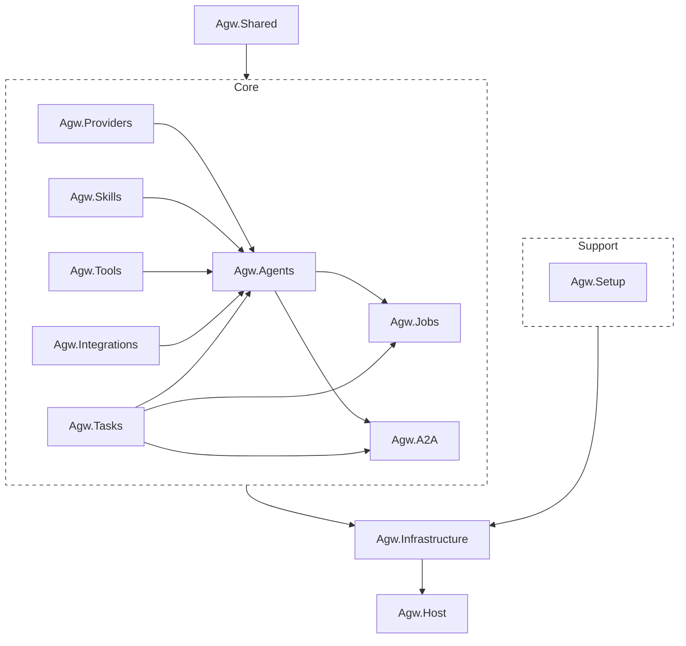

# Project Overview

Agw is an ASP.NET Core + EF Core backend with a Next.js frontend for managing LLM agents, models, providers, tools, skills, jobs, integrations, and multi-agent workflows. 

It uses a modular project structure built around Microsoft.Agents.AI, MCP tool servers, A2A endpoints, and external agents such as Claude Code SDK.

# Backend

The backend currently follows a typical “modular monolith” architecture; it is neither a microservices architecture nor a strict Clean Architecture.

Its core approach is to "split the project by business domain and implement lightweight layering within each project", which is then uniformly assembled by the host. The core entry point is located at `src\server\Agw.Host\Program.cs`.

## Tech Stack

- .NET 10, C#
- ASP.NET Core + EF Core
- Microsoft.Agents.AI

## Backend Organization (`src/server/`)

```
Agw.Host/              # ASP.NET Core entry point, DI registration, hosted services
Agw.Infrastructure/    # EF Core DbContext, repositories, migrations
Agw.Shared/            # Base entities, enums, shared models, repository interfaces, contracts
Agw.Agents/            # Agent definitions, agentflows, MCP tools, execution services
Agw.Providers/         # LLM models, providers, model-providers, auth configs
Agw.Tasks/             # Projects, tasks, session records, chat history
Agw.Jobs/              # Background jobs, project leases
Agw.Integrations/      # OAuth integrations, app definitions/instances, integration tools
Agw.A2A/               # A2A protocol implementation for agent discovery/communication
Agw.Skills/            # Skill archive management (ZIP uploads, SKILL.md format)
Agw.Tools/             # Tool discovery and registration system
Agw.Files/             # Project-scoped file systems and file APIs
Agw.Setup/             # First-run setup, authentication, and initialization state
```

`Agw.slnx` includes these backend projects plus the A2A, Agents, Files, Host, Jobs, Setup, Shared, Skills, Tasks, and Tools test projects.

A typical call chain is `Controller -> AppService / RuntimeService -> DomainService -> IRepository / IUnitOfWork -> EF Core`.

Scheduled project execution depends on the `IProjectExecutionLock` boundary. `ProjectExecutionLockRouter` resolves the optional `DistributedLock` configuration for each acquisition and delegates to either `InMemoryProjectExecutionLock` or the provider-neutral `DistributedProjectExecutionLock`. When the lock provider is not configured, SQLite selects the process-local implementation and PostgreSQL selects PostgreSQL advisory locks; a PostgreSQL lock can also use its own connection string.



## Agw.Host

ASP.NET Core entry point, dependency injection registration, hosted services, as well as logging, OpenTelemetry, OpenAPI, static files, database initialization, and more.

## Business Module Organization

[Module Organization](3.Module%20Organization.md)

## Agent Execution

Real-time execution enters through the authenticated SignalR Hub at `/api/hubs/exec`. The `Agw.Agents/Execution` subsystem separates connection-scoped command handling from reusable Agent/Agentflow runtimes and per-turn lifecycle state. See [Agent execution flow](ws-flow.md) for the protocol and [`Execution/README.md`](../src/server/Agw.Agents/Execution/README.md) for directory responsibilities and extension guidance.

## Agw.Infrastructure

**Purpose:**

Implements **technical details** required by Application & Domain.

This is where **real-world stuff** lives.

### What belongs here

- Database
- ORM
- Repositories (implementation)
- Email services
- Message queues
- File storage
- External APIs
- Logging
- Frameworks

## Agw.Shared

Code reused across various "Business Modules". Such as entities, enums, shared models / DTOs, repository interfaces, contracts.

Agw.Shared is more like a shared kernel than just an interface layer. It contains not only basic abstractions and repository interfaces, but also some shared entities, contracts, and utility classes.

> If an entity, enumeration, DTO, or constant is used across multiple business modules, it should be extracted from those modules and placed in a Shared.

## Key Domain Entities

**Agent System:**

- `Agent` - AI agent with SystemPrompt, ModelProviderId, Type (System/External), MCP tool bindings
- `Agentflow` - Multi-agent workflow with nodes, edges, orchestration pattern
- `AgentflowNode` - Node in workflow graph (references Agent or nested Agentflow)
- `AgentflowEdge` - Connection between nodes
- `McpToolServer` - MCP server configuration (stdio/HTTP/SSE transport)

**Provider System:**

- `LlmModel` - LLM model definition
- `Provider` - API provider (OpenAI, Anthropic) with endpoint and auth configs
- `ModelProvider` - Links model to provider with pricing metadata
- `ProviderAuthConfig` - Authentication (ApiKey or Environment variable)

**Task System:**

- `Project` - Workspace with ExtraSetting for agent configuration
- `ProjectContext` - Project-scoped conversation grouping identified by ContextId
- `TaskRecord` - Persisted execution status and conversation record
- `TaskProjection` - Logical task reconstructed from records sharing a TaskId
- `TaskSessionBinding` - External provider session binding for an Agent within a project context

**Integration System:**

- `AppDefinition` - Registered integration app metadata and capability descriptor
- `AppInstance` - User/workspace-scoped authorized integration connection
- `OAuthAuthorizationToken` - OAuth state/token persistence for authorization flow

## Entity Relationships

```
LlmModel ←→ ModelProvider ←→ Provider
                               ↓
                        ProviderAuthConfig

Agent ←→ ModelProvider (optional for External agents)
   ↓
AgentMcpToolServer ←→ McpToolServer
   ↓
AgentflowNode ←→ Agentflow
   ↓
AgentflowEdge (Source/Target)

Project → ProjectContext → TaskRecord
             ↓
     TaskSessionBinding

AppDefinition → AppInstance
                 ↓
     OAuthAuthorizationToken
```

# Web Client (`src/clients/web`)

## Tech Stack

- Next.js 16 with App Router
- React 19, Tailwind CSS 4, Shadcn UI components, Radix UI components
- TanStack React Query 5 for data fetching
- openapi-fetch with auto-generated types

## Route Structure

```
src/app/(app)/
├── (agents)/
│   ├── agents/           # Agent CRUD
│   └── agentflows/       # Workflow editor (React Flow)
├── (interface)/
│   └── chat/             # Chat interface
├── (jobs)/
│   └── jobs/             # Scheduled jobs
├── (overview)/
│   ├── dashboard/        # Dashboard
│   └── traces/           # Trace viewer
├── (providers)/
│   ├── models/           # Model management
│   ├── providers/        # Provider management
│   └── model-providers/  # Model-Provider associations
├── (tasks)/
│   └── projects/         # Project & task execution
└── (tools)/
    └── mcp-tool-servers/ # MCP server management

src/app/(app)/integrations/ # OAuth-backed integrations UI
src/app/(app)/settings/     # Server and account settings
src/app/(app)/skills/       # Skill archive management
```

## API Integration

- Run `pnpm gen:openapi` after backend schema changes
- Use typed `apiGet()`, `apiPost()`, `apiPut()`, `apiDelete()` from `api/client.ts`
- OpenAPI types in `api/openapi.d.ts`
- Use `api/files.ts` for file operations in the Claude Code UI
- Use `api/execution-hub.ts` for task execution SignalR flows
