# Project Overview

Agw is an ASP.NET Core + EF Core backend with independent Next.js Web/Desktop applications and an Expo Mobile client for managing LLM agents, models, providers, tools, skills, jobs, integrations, and multi-agent workflows.

It uses a modular project structure built around Microsoft.Agents.AI, MCP tool servers, A2A endpoints, and external agents such as Claude Code SDK.

## Backend

The backend follows a modular monolith architecture; it is neither a microservices architecture nor a strict Clean Architecture.

Its core approach is to split the project by business domain, use lightweight layering within each module, and assemble the modules through the shared `Agw.Host` Hosting Module. Executable entry points live in the Control Plane, Data Plane, and Standalone Host projects.

### Normative Architecture Requirements

The following requirements are mandatory architecture invariants rather than temporary migration guidance:

1. **Modular monolith with lightweight module layering.** The backend MUST remain a modular monolith organized by business module. Each module MUST preserve the inward dependency direction `Api → Application → Domain ← Infrastructure`, while creating only the layers that its actual complexity requires. Empty layers and full Clean Architecture ceremony are not required.
2. **Logical data ownership.** Every persisted entity and table MUST have exactly one owning business module, but ownership is logical rather than physical. Entity CLR types and EF configurations MAY remain centrally hosted in `Agw.Data`; modules MAY share the single scoped `AgwDbContext`, database, and schema. Physical co-location never grants another module query or write ownership.

3. **User data isolation.** Persisted business, configuration, and execution roots are visible and mutable only to the user in immutable `CreateBy` (or the existing `UserId` owner). Child rows resolve ownership through their root. Available integration definitions, Tool/ToolBlock definitions, and registered built-in Skill definitions are global read-only catalogs; database seed rows remain administrator-owned. `PluginInstallation` is per-user setup, and default Projects `default-built-in` and `a2a` are resolved by `(CreateBy, Name)` without changing `ProjectType`.
4. **No database foreign keys from migrations.** The EF Core model MAY retain navigation and relationship metadata for change tracking and query composition, but SQLite and PostgreSQL migration generation MUST use `NoForeignKeyModelDiffer` and MUST NOT emit database foreign-key constraints or foreign-key migration operations. Hand-authored migrations MUST NOT add them. Application and Infrastructure flows own referential validation, relation cleanup, and the tests that protect those behaviors.

### Backend Tech Stack

- .NET 10, C#
- ASP.NET Core + EF Core
- Microsoft.Agents.AI

### Backend Organization (`src/server/`)

```
Agw.Host/              # Shared ASP.NET Core Hosting Module and composition runtime
Agw.ControlPlane.Host/ # Setup, Web UI, management endpoints, and Job scheduling
Agw.DataPlane.Host/    # SignalR Execution, A2A, and distributed workers
Agw.Standalone.Host/   # Combined Control/Data entry point
Agw.Infrastructure/    # EF Core DbContext, repositories, and provider configuration
Agw.Migrations.Sqlite/ # SQLite migrations and model snapshot
Agw.Migrations.Postgres/ # PostgreSQL migrations and model snapshot
Agw.Data/              # Persistence primitives and centrally hosted entity types with logical module ownership
Agw.Shared/            # Errors, results, coordination, platform utilities, and stable shared values
Agw.Agents/            # Agent definitions, agentflows, MCP tools, and persistence seams
Agw.Agents.Execution/  # Agent/Agentflow execution, external-agent adapters, SignalR, and workers
Agw.Agents.Contracts/  # Cross-module Agent catalog, execution, and turn contracts
Agw.Providers/         # LLM models, providers, model-providers, auth configs
Agw.Projects/           # Projects, tasks, session records, chat history
Agw.Projects.Contracts/ # Cross-module Project runtime, task/session, snapshot, and metrics contracts
Agw.Jobs/              # Background jobs, project leases
Agw.Jobs.Contracts/    # Cross-module Job metrics contracts
Agw.Integrations/      # Plugin catalog, installations, connections, OAuth, MCP, native tools
Agw.A2A/               # A2A protocol implementation for agent discovery/communication
Agw.Auth/              # Administrator/OIDC authentication, local users, CSRF, and authorization guards
Agw.Skills/            # Skill definitions, local/remote content, caching, and execution adapters
Agw.Tools/             # Unified Tool/ToolBlock catalog and runtime materialization
Agw.Files/             # Project-scoped file systems and file APIs
Agw.Setup/             # First-run setup and database-backed initialization state
Agw.Settings/          # Audited global/current-user JSON configuration groups
```

`Agw.slnx` includes these backend projects plus the A2A, Agents, Auth, Files, Host, Integrations, Jobs, Projects, Settings, Setup, Shared, Skills, and Tools test projects.

The diagram shows runtime-facing direct references between in-repository backend projects. `A --> B` means project A references project B; provider-specific migration projects and external SDK references are omitted.

```mermaid
flowchart TB
    subgraph Composition["Host composition"]
        direction LR
        CONTROL["Control Plane Host"]
        DATAPLANE["Data Plane Host"]
        STANDALONE["Standalone Host"]
        HOST["Agw.Host<br/>Hosting Module"]
    end

    subgraph Boundaries["Protocol and bootstrap"]
        direction LR
        A2A["Agw.A2A"]
        AUTH["Agw.Auth"]
        SETUP["Agw.Setup"]
    end

    subgraph Adapters["Technical adapters"]
        INFRA["Agw.Infrastructure"]
    end

    subgraph Core["Business modules"]
        direction LR
        AGENTS["Agw.Agents"]
        EXECUTION["Agw.Agents.Execution<br/>same Agents module"]
        JOBS["Agw.Jobs"]
        PROJECTS["Agw.Projects"]
        PROVIDERS["Agw.Providers"]
        INTEGRATIONS["Agw.Integrations"]
        SKILLS["Agw.Skills"]
        TOOLS["Agw.Tools"]
        FILES["Agw.Files"]
    end

    subgraph Interfaces["Cross-module interfaces"]
        direction LR
        AGENT_CONTRACTS["Agw.Agents.Contracts"]
        PROJECT_CONTRACTS["Agw.Projects.Contracts"]
        JOB_CONTRACTS["Agw.Jobs.Contracts"]
        INTEGRATION_CONTRACTS["Agw.Integrations.Contracts"]
        PROVIDER_CONTRACTS["Agw.Providers.Contracts"]
        SKILL_CONTRACTS["Agw.Skills.Contracts"]
    end

    subgraph Foundation["Foundation"]
        direction LR
        SHARED["Agw.Shared"]
        DATA["Agw.Data"]
    end

    CONTROL --> HOST
    DATAPLANE --> HOST
    STANDALONE --> CONTROL
    STANDALONE --> DATAPLANE
    HOST --> AGENTS
    HOST --> EXECUTION
    HOST --> AGENT_CONTRACTS
    HOST --> PROJECT_CONTRACTS
    HOST --> JOB_CONTRACTS
    HOST --> AUTH
    HOST --> INFRA
    HOST --> SETUP
    HOST --> A2A

    SETUP --> AUTH
    SETUP --> SHARED

    A2A --> AGENT_CONTRACTS
    A2A --> PROJECT_CONTRACTS
    A2A --> AUTH
    A2A --> SHARED

    INFRA --> AGENTS
    INFRA --> AUTH
    INFRA --> INTEGRATIONS
    INFRA --> PROVIDERS
    INFRA --> PROJECTS
    INFRA --> SKILLS
    INFRA --> JOBS
    INFRA --> DATA
    INFRA --> TOOLS

    SKILLS --> AGENT_CONTRACTS
    SKILLS --> SKILL_CONTRACTS
    SKILLS --> SHARED
    SKILLS --> DATA
    JOBS --> AGENT_CONTRACTS
    JOBS --> PROJECT_CONTRACTS
    JOBS --> JOB_CONTRACTS
    JOBS --> AUTH
    JOBS --> SHARED
    JOBS --> SKILLS
    JOBS --> DATA

    EXECUTION --> AGENTS
    EXECUTION --> AGENT_CONTRACTS
    EXECUTION --> AUTH
    EXECUTION --> DATA
    EXECUTION --> FILES
    EXECUTION --> INTEGRATIONS
    EXECUTION --> PROVIDERS
    EXECUTION --> PROJECT_CONTRACTS
    EXECUTION --> SHARED
    EXECUTION --> SKILLS
    EXECUTION --> TOOLS

    AGENTS --> AUTH
    AGENTS --> AGENT_CONTRACTS
    AGENTS --> INTEGRATION_CONTRACTS
    AGENTS --> PROVIDER_CONTRACTS
    AGENTS --> SKILL_CONTRACTS
    AGENTS --> TOOLS
    AGENTS --> SHARED
    AGENTS --> PROJECT_CONTRACTS
    AGENTS --> DATA

    PROJECTS --> AGENT_CONTRACTS
    PROJECTS --> PROJECT_CONTRACTS
    PROJECTS --> FILES
    PROJECTS --> INTEGRATION_CONTRACTS
    PROJECTS --> SKILL_CONTRACTS
    PROJECTS --> AUTH
    PROJECTS --> SHARED
    PROJECTS --> DATA
    TOOLS --> AUTH
    TOOLS --> FILES

    AUTH --> SHARED
    AUTH --> DATA
    INTEGRATIONS --> INTEGRATION_CONTRACTS
    INTEGRATIONS --> PROJECT_CONTRACTS
    INTEGRATIONS --> AUTH
    INTEGRATIONS --> SHARED
    INTEGRATIONS --> DATA
    PROVIDERS --> AGENT_CONTRACTS
    PROVIDERS --> PROVIDER_CONTRACTS
    PROVIDERS --> SHARED
    PROVIDERS --> DATA

    AGENT_CONTRACTS --> PROJECT_CONTRACTS
    AGENT_CONTRACTS --> SHARED
    PROJECT_CONTRACTS --> SHARED

    %% Layout only: keep the foundation below the business modules.
    FILES ~~~ SHARED
    DATA --> AGENT_CONTRACTS
    DATA --> PROVIDER_CONTRACTS
    DATA --> SKILL_CONTRACTS
    DATA --> SHARED
```



### Host Roles

`Agw.Host` is the shared Hosting Module. Three executable Hosts use its common interface:

- **Control Plane** owns Setup, authentication management, the Web UI, management endpoints, OpenAPI, and Job scheduling. In Distributed mode it submits Jobs to durable execution but never runs an execution worker.
- **Data Plane** owns `/api/hubs/exec`, A2A discovery/protocol routes, and distributed execution workers. It does not map MVC management controllers, Setup, OpenAPI, or static Web assets.
- **Standalone Host** composes both Host assemblies. It defaults to InProcess execution and retains the previous full-Server Distributed configuration as a compatibility path.

Host role is fixed by the executable and image. Execution topology is selected by standard `Execution:Provider` configuration (InProcess or Distributed), with Database and DistributedLock configured through the same chain. Control Plane and Data Plane are complementary roles requiring PostgreSQL and Distributed execution. Setup only initializes the configured database and administrator; new state files contain authentication/initialization state, while legacy deployment values remain a low-priority startup fallback.

### Agw.Auth

Owns Cookie, named Bearer Token, and `LocalTrusted` authentication modes together with CSRF validation and the `/api` and `/a2a` authorization guard. Bearer principals inherit the `ApiToken.CreateBy` user ID for execution ownership and auditing. Authenticated principals without a stable `NameIdentifier` fail closed. OIDC users have numeric local keys starting at `10000`, represented as decimal strings in claims and owner contracts; administrator `1001` remains unchanged. Auth owns `auth_user`, `auth_external_identity`, `auth_user_id_sequence`, and `auth_desktop_login_grant`. External accounts are identified by verified `(issuer, sub)` without email linking. Control Plane and Standalone register remote OIDC handlers; Data Plane validates local Cookie/Bearer identities only. Infrastructure coordinates transactional provisioning through the Projects initialization contract. Browser sessions use the local user's session version; the administrator retains the existing global session state. `IServerAuthStatePersistence` is implemented by `Agw.Infrastructure.Auth.SettingsServerAuthStatePersistence` through `ISettingsStore` over the global `auth` group in the Settings-owned `setting` table. `Agw.Setup.DatabaseInitializationStateStore` supplies initialization and authentication snapshots to all Hosts; password hashes and session versions never enter IConfiguration.

### Business Module Organization

[Module Organization](human/4.module-organization.md)

### Business Module Details

Check the `README.md` documentation under each module.

### Entity Relationships

```
AgwAiModel ← ModelProviderRelation → Provider → ProviderAuthConfig
Agent → ModelProviderRelation (optional for External Agents)
Agent.ExternalAgentKind → Claude Code, Codex, or Pi runtime (External Agents only)

Agent ← AgentMcpServerRelation → McpServer
Project ← ProjectMcpServerRelation → McpServer

Agentflow → AgentflowNode → Agent or nested Agentflow
Agentflow → AgentflowEdge → Source/Target AgentflowNode

Project → ProjectConversation → ProjectConversationChatHistory
                ↓          ↘
        ProjectConversationBinding  AgentSessionStateEntry ← Agent

PluginDefinition → PluginInstallation
         ↓
Connection ← AgentConnectionRelation → Agent
Connection ← ProjectConnectionRelation → Project

ProjectConversation → AgentflowCheckpointRecord
DurableExecutionRecord → DurableExecutionEventRecord
```

## Client Workspace (`src/clients`)

`@agw/web`, `@agw/desktop`, `@agw/mobile`, and all `@agw/*` packages under `src/clients/packages/` are members of the pnpm Workspace rooted at `src/clients`, with tasks orchestrated by Turborepo. Chat is split into `@agw/chat-core` (message semantics and render models), `@agw/chat-runtime` (SignalR and Conversation state), `@agw/chat` (Web/Desktop renderer), and `@agw/chat-native` (React Native renderer and Chat vertical slice).

### Tech Stack

- Next.js 16 with App Router
- React 19, Tailwind CSS 4, Shadcn UI components, Radix UI components
- TanStack React Query 5 for data fetching
- openapi-fetch with auto-generated types

### Package Structure

- `@agw/web`: browser Next.js routes, layouts, global CSS, and application-shell composition only
- `@agw/desktop`: Electron main/preload plus an independent Next.js React renderer
- `@agw/mobile`: Expo Router application that consumes only React Native-safe core packages
- `@agw/http-client`, `@agw/api`: transport primitives, generated OpenAPI types, and the typed API runtime
- `@agw/components`: platform-neutral React components and design tokens
- `@agw/execution-core`: platform-neutral execution messages, protocol types, streaming merge, Tool grouping, and batching primitives; it does not establish network connections
- `@agw/projects-core`: React Native-safe Project file and conversation types plus typed client services shared with Mobile
- `@agw/auth`, `@agw/agents`, `@agw/projects`, `@agw/chat`, `@agw/providers`, `@agw/integrations`, `@agw/jobs`, `@agw/skills`, `@agw/tools`, `@agw/observability`, `@agw/settings`: business domains and their reusable Web UI
- `@agw/chat-native`: React Native Chat renderer, Composer, Context History, and Mobile Chat workspace state
- `@agw/chat-runtime`: platform-neutral execution session, activity store, and Conversation controller
- `desktop/renderer/src/runtime`: Desktop-owned Electron runtime, connection gate, settings, and shell composition
- `desktop/src/shared/contracts`: framework-free bridge protocol internal to the Desktop application

### Route Structure

```
src/app/(app)/
├── (agents)/
│   ├── agents/           # Agent CRUD
│   └── agentflows/       # Workflow editor (React Flow)
├── (interface)/
│   └── chat/             # Chat interface
├── (jobs)/
│   └── jobs/             # Scheduled jobs
├── (overview)/
│   ├── dashboard/        # Dashboard
│   └── traces/           # Trace viewer
├── (providers)/
│   ├── models/           # Model management
│   └── providers/        # Provider management
├── (tasks)/
│   └── projects/         # Project & task execution
└── (tools)/
    └── mcp-tool-servers/ # MCP server management

src/app/(app)/integrations/ # OAuth-backed integrations UI
src/app/(app)/settings/     # Server and account settings
src/app/(app)/skills/       # Skill archive management
src/app/(app)/user-memory/  # User-scoped memory management
```

### API Integration

- Run `pnpm gen:api` from `src/clients` after backend schema changes
- Use typed `apiGet()`, `apiPost()`, `apiPut()`, and `apiDelete()` from `@agw/api`
- OpenAPI types live in `src/clients/packages/api/src/openapi.d.ts`
- Use `@agw/projects` for project-scoped file and task operations
- Use `@agw/chat-runtime` for task-execution SignalR flows, `@agw/chat` for Web/Desktop Chat UI, and `@agw/chat-native` for Mobile Chat UI

The Chat input suggestion architecture, Agent mode routing, Claude init-command lifecycle, and `@` file search behavior are documented in [Chat Suggestions Design](5.Chat%20Suggestions.md).

Web and Desktop own separate Next.js route shells. Electron-specific React composition lives in `desktop/renderer/src/runtime`, while reusable business pages and platform-neutral UI remain in root `src/clients/packages/`. Neither application imports or consumes artifacts from the other.

# Desktop Client (`src/clients/desktop`)

The Electron main process at `src/clients/desktop/src/main/index.ts` and preload at `src/clients/desktop/src/preload/index.ts` form the platform adapter around Desktop's own exported renderer. The main process owns the custom `agw://app` protocol, OS credential encryption, daemon registration, tray/window behavior, and installer integration. The renderer has context isolation, sandboxing, and no Node.js integration.

`@agw/desktop` keeps bridge, runtime, settings, and server-profile contracts internal under `src/shared/contracts`; no Desktop-only contracts package is exposed to Web. Desktop builds its own renderer static export, and Web has no Electron knowledge. Both applications independently consume root business packages. `@agw/chat-runtime` owns execution keys, status, aggregation, and Conversation state; `@agw/chat` owns the shared DOM renderer. Electron-only I/O and React adaptation remain local to `@agw/desktop`.

Desktop connection state is keyed by Server profile. The default local Server is `127.0.0.1:30816`; when that port is occupied, the daemon writes its effective loopback endpoint to `~/agw/runtime/server.json`. Remote connections require a named Bearer token and HTTPS unless the user accepts an explicit HTTP warning.

Each Server profile owns an isolated React Query cache. Changing a profile's base URL or token retires that cache, and profile switches abort older connection probes and queries so a slower response from the previous Server cannot overwrite the active profile.

Execution ownership remains in the renderer's session manager rather than the visible Chat component. A `server + project + conversation` key owns one SignalR client, so Project tab changes detach and reattach the UI without interrupting background turns or Human Gate state.

See [`src/clients/desktop/README.md`](../src/clients/desktop/README.md) for development and packaging commands.
