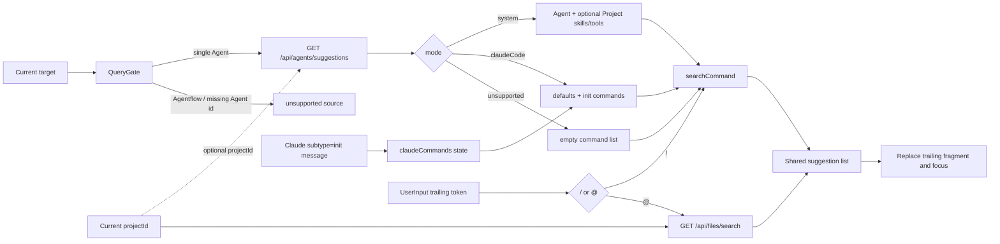

# Chat Suggestions 设计

本文定义 Web `/chat` 页的输入建议机制。设计同时覆盖两类触发器：`/` 用于 Agent 命令建议，`@` 用于 Project 工作区文件建议。两类建议共用输入组件和展示层，但数据来源、生命周期和失败策略彼此独立。

文档中的“规范”表示对外契约与预期行为；“实现状态”记录 2026-07-14 工作区代码与规范的对齐情况。若两者冲突，应先修正实现或测试，不应把临时偏差反向写成正式契约。

## 1. 背景

早期 `/chat` 只维护了一套 Claude Code 风格的 slash command 列表。这套列表无法表达不同 Agent 的能力差异：System Agent 的命令应来自 Agent 配置，并在存在当前 Project 时合并 Project 配置；Claude Code 还需要会话初始化阶段返回的动态命令，而 Codex、未知 External Agent 与 Agentflow 暂时没有可靠的命令来源。

`@` 文件建议没有这个问题。它只依赖当前 Project ID，与执行目标无关。因此 `/` 与 `@` 虽然使用同一个输入框，不能共用一套可用性判断。

本设计将“命令来源”建模为显式模式，并把稳定配置与会话动态状态分开：

- 后端负责根据 Agent 和可选的 Project 计算稳定的 System 能力候选项，并决定 External Agent 的处理模式。
- 前端负责 Claude Code 默认命令、init commands、输入触发、模糊搜索和选择后的文本替换。
- 文件服务负责根据 `projectId` 解析 Workspace，并把文件树打平成规范相对路径，供 `@` 建议搜索。

## 2. 目标与非目标

### 2.1 目标

1. `/` 建议必须与当前单 Agent 目标一致，切换 Project、Agent 或会话后不能复用旧状态。
2. System Agent 显示 Agent 直接配置的 skills/tools；存在当前 Project 时再合并 Project 直接配置的能力。
3. Claude Code 保留默认命令，并合并当前会话 init 消息中的动态命令。
4. Codex、未知 External Agent 和 Agentflow 对 `/` 明确返回空列表。
5. `@` 文件建议对所有目标保持可用，并支持按完整相对路径和目录分隔符搜索。
6. API 或异步搜索失败时，建议功能静默降级，不影响输入和消息发送。
7. 同名 Skill 与 Tool 必须作为两个候选项保留，UI 可通过 `kind` 区分。

### 2.2 非目标

- `/name` 不是浏览器本地命令。选择建议后，它仍作为普通输入文本发送给 Agent。
- 本期不为 Codex、其他 External Agent 或 Agentflow 推导 slash commands。
- System 候选项不包含 AppInstance、MCP server 或运行时派生 tools。
- 不根据 Agent 执行历史、模型能力或 prompt 内容猜测命令。
- 不在本期实现键盘上下选择、命令参数补全、命令本地执行或多级菜单。

## 3. 总体结构



设计中有三个关键边界：

1. `AgentSuggestionsResponse.mode` 决定 `/` 的处理策略，而不是让前端再次根据 Agent 名称猜测。
2. Claude init commands 属于会话状态，不进入稳定的后端 suggestions API。
3. `@` 文件搜索不读取 command mode，因此 Agentflow 或 Codex 仍可使用文件建议。

## 4. 术语与数据模型

### 4.1 SuggestionItem

输入组件只依赖最小展示结构：

```ts
interface SuggestionItem {
  text: string;
  description?: string;
  kind?: string;
}
```

`text` 是选择后写入输入框的完整文本。命令使用 `/name`，文件使用 `@relative/path`。`description` 用于补充说明，`kind` 主要用于 Skill/Tool 徽标。

### 4.2 CommandSource

`searchCommand` 不接收若干可空数组，而是接收判别联合：

```ts
type CommandSource =
  | { mode: "system"; suggestions: AgentCommandSuggestion[] }
  | { mode: "claudeCode"; slashCommands: string[] }
  | { mode: "unsupported" };
```

这个结构保证每种模式只能携带自己的数据。System 不会意外混入 Claude 默认命令，unsupported 也不会因为残留数组而显示建议。

## 5. Agent 模式矩阵

| 当前目标 | `/` 数据来源 | 是否请求 suggestions API | `@` 文件建议 |
|---|---|---:|---:|
| System Agent，有 Project | Project + Agent 直接 skills/tools | 是 | 可用 |
| System Agent，无 Project | Agent 直接 skills/tools | 是 | 无 Project 时不可用 |
| Claude Code | 默认命令 + 当前会话 init commands | 是，用于取得 `claudeCode` mode | 可用 |
| Codex | 无 | 是，返回 `unsupported` | 可用 |
| 其他 External Agent | 无 | 是，返回 `unsupported` | 可用 |
| Agentflow | 无 | 否 | 可用 |
| 缺少 Agent ID | 无 | 否 | 有 Project 时可用 |

External Agent 的分流使用持久化 Agent 的 `Type` 与 `Name`。`Type == External` 且名称忽略大小写等于 `ClaudeCode` 时返回 `claudeCode`；其他 External Agent 一律返回 `unsupported`。这包括 Codex 和未来尚未显式接入的 External Agent。

## 6. 后端 suggestions API

### 6.1 路由

```http
GET /api/agents/suggestions?agentId={guid}&projectId={guid}
```

`agentId` 是必需的业务参数，`projectId` 可选。省略 `projectId` 时，System Agent 只返回 Agent 直属能力；传入 `projectId` 时再合并对应 Project 的直属能力。

路由不使用 path parameters。控制器通过 `AgwApiResult.Ok(...)` 返回 Bens.Results envelope，Web 的 `apiGet()` 在页面拿到数据前统一解包。下面的示例是解包后的 `data`：

```json
{
  "mode": "system",
  "suggestions": [
    {
      "text": "/deploy",
      "description": "Skill · Deploy the application",
      "kind": "skill"
    },
    {
      "text": "/deploy",
      "description": "Tool · Operations · Runs deployment",
      "kind": "tool"
    }
  ]
}
```

公开枚举值固定为：

- `mode`: `system | claudeCode | unsupported`
- `kind`: `skill | tool`

OpenAPI 快照和生成的 TypeScript 类型是该字符串契约的一部分。C# 枚举成员名称不应泄漏到 JSON。

### 6.2 查找顺序与错误

`AgentSuggestionAppService` 先加载 Agent 及 `AgentSkillRelations`。只有请求提供 `projectId` 时，才加载 Project 及 `ProjectSkillRelations`。因此 Agent 与显式指定的 Project 同时不存在时，优先返回 Agent 错误。

| 条件 | 行为 |
|---|---|
| Agent 不存在 | 抛出 `AgwException(ErrorCodes.AgentNotFound)` |
| 未提供 `projectId` | 跳过 Project 查询，只使用 Agent 直属能力 |
| 已提供的 Project 不存在 | 抛出 `ResourceNotFound`，消息包含 `projectId` |
| External Agent | 若提供了 Project 则先验证其存在，随后按名称返回 mode |
| tools JSON 错误 | 忽略该 JSON 来源，继续处理其他来源 |
| tool 未注册 | 忽略，不向客户端暴露无效候选项 |

异常由统一 API 中间件转换为 Bens.Results 错误响应。前端 suggestions 查询关闭 retry，错误不会阻塞 Chat 输入。

### 6.3 System Agent 的 Skill 聚合

Skill 来源最多有两处：

- `Agent.AgentSkillRelations`
- 请求提供 `projectId` 时的 `Project.ProjectSkillRelations`

聚合流程如下：

1. 以 Agent 的 Skill ID 为基础；存在 Project 时连接 Project 的 Skill ID。
2. 丢弃 `Guid.Empty`。
3. 按 ID 去重。
4. 从 Skill repository 批量加载实体。
5. 丢弃空白名称。
6. 将名称规范为 `/name`：去掉首尾空白和已有的前导 `/`，再补一个 `/`。

Skill 不从 App、MCP、运行时 tool graph 或其他间接关系派生。直接关系是 suggestions 与配置界面的共同边界，避免“运行时可能可用”与“用户明确配置”混为一谈。

### 6.4 System Agent 的 Tool 聚合

Tool 名称来自 `Agent.Tools`，并在请求提供 `projectId` 时合并 `Project.Tools`。两个字段都是 JSON 字符串数组，例如：

```json
["Deploy", "search"]
```

每个 JSON 来源独立解析；其中一个损坏不会丢弃另一个来源。解析后的名称按忽略大小写的方式去重，再逐项调用 `ToolRegistryService.GetTool(name)`。只有 registry 中真实存在的 tool 才能进入响应。

该边界有两个含义：

- 配置里残留的旧 tool 名不会产生不可执行建议。
- MCP 和 App 派生 tools 即使在某个 runtime 中可用，也不会因为 registry 或运行时装配过程被隐式加入。

### 6.5 去重、同名与排序

不同类别使用不同的去重键：

- Skills 按 `Skill.Id` 去重。
- Tools 按名称忽略大小写去重。
- Skill 与 Tool 不跨类别去重。

因此 `/deploy` 可以同时存在 Skill 和 Tool 两项。最终结果先按 `text` 忽略大小写排序，再按 `kind` 排序；同命令下 Skill 位于 Tool 之前。这保证候选顺序不依赖关系加载或 HashSet 枚举顺序。

### 6.6 描述文本规范

API 的 `description` 是自描述文本，即使调用方不渲染 `kind` 也能识别来源：

| 类型 | 规则 | 示例 |
|---|---|---|
| Skill，有描述 | `Skill · {description}` | `Skill · Deploy the application` |
| Skill，无描述 | `Skill` | `Skill` |
| Tool | 将 `Tool`、category、description 的非空项用 ` · ` 连接 | `Tool · Operations · Runs deployment` |

`kind` 仍然保留，因为 UI 需要稳定的机器可读判别值来显示徽标，同名项也需要可靠区分。描述中的类型前缀属于 API 可读性契约，不替代 `kind`。

## 7. 前端查询与模式转换

### 7.1 查询启用条件

页面通过 `getAgentSuggestionQueryParams(projectId, target)` 计算参数。满足以下条件即返回非空参数：

- target 存在；
- `target.type === "agent"`。

`projectId` 存在时参数为 `{ projectId, agentId }`，不存在时为 `{ agentId }`。因此没有当前 Project 的单 Agent 目标仍会请求 API，Agentflow 仍不请求。

React Query 使用以下 key：

```ts
["agentSuggestions", projectId, agentId]
```

Agentflow 不发起请求。切换 Project 或 Agent 会产生新 key，旧目标的数据不会成为新目标的 command source。查询设置 `retry: false`，避免一个非关键交互功能反复请求。

### 7.2 API 响应到 CommandSource

`toCommandSource()` 是 API DTO 与搜索逻辑之间的唯一转换点：

| API 状态 | CommandSource |
|---|---|
| 无响应、加载失败 | `{ mode: "unsupported" }` |
| `unsupported` | `{ mode: "unsupported" }` |
| `claudeCode` | `{ mode: "claudeCode", slashCommands: claudeCommands }` |
| `system` | `{ mode: "system", suggestions: response.suggestions }` |

API 失败时 `/` 返回空列表，但 `@` 仍走独立的文件搜索。消息发送也不依赖 suggestions query 的成功状态。

## 8. `/` 命令搜索

### 8.1 System 模式

System 模式只搜索 API 返回项，不加入 Claude 默认命令。即使 `/compact`、`/clear` 或 `/status` 对 Claude 有意义，也不会自动出现在 System Agent 中；只有当它们作为 Skill 或 Tool 被直接配置时才出现。

同名 Skill/Tool 不合并。搜索结果继续携带各自的 `kind` 与 `description`，供列表渲染区分。

### 8.2 Claude Code 模式

Claude Code 的候选项由两层组成：

1. 固定默认命令：`/compact`、`/clear`、`/status`。
2. 当前会话 init 消息返回的 `slash_commands`。

动态命令规范化规则：

- 去掉首尾空白；
- 空字符串忽略；
- 没有 `/` 前缀时自动补齐；
- 按命令文本忽略大小写去重；
- 与默认命令重复时保留默认项；
- 命中 `IGNORED_COMMANDS` 时过滤。

`IGNORED_COMMANDS` 的代码定义是过滤列表的单一事实来源，位于 `chat/lib/search_command.ts`。列表包含需要专门 UI、会改变本地配置、退出登录、恢复会话或当前 Chat 不应直接暴露的 Claude 命令，例如 `/help`、`/init`、`/mcp`、`/model`、`/resume`、`/login` 和 `/logout`。

### 8.3 Unsupported 模式

Unsupported 模式始终返回空数组。它不是“先显示通用命令、执行时再报错”，而是明确表示当前目标没有可靠的 `/` 候选来源。

### 8.4 模糊搜索与数量限制

命令搜索使用 Fuse.js：

- `text` 权重 `0.7`；
- `description` 权重 `0.3`；
- `threshold = 0.3`；
- `minMatchCharLength = 1`；
- `ignoreLocation = true`；
- `shouldSort = true`。

输入为空时按源顺序取前 5 项；输入非空时由 Fuse 返回最多 5 项。数量限制只适用于 `/` command suggestions。`@` 文件建议由文件 API 的 limit 控制，当前默认最多 10 项。

## 9. Claude init commands 生命周期

### 9.1 消息识别与解析

只要 `message.additionalProperties.subtype === "init"`，消息就按 Claude init 元数据处理。解析不依赖 author 或 role，以适应历史记录和 SDK 包装差异。

解析只读取第一个 content 的 `content`：

- 字符串：先执行 `JSON.parse`；
- 对象：直接读取；
- 其他类型、非法 JSON、数组或缺少 `slash_commands`：视为无效 init；
- `slash_commands` 中只保留字符串，其他元素忽略。

示例：

```json
{
  "slash_commands": ["compact", "/review"]
}
```

### 9.2 流式消息

流式执行收到 init 消息时，只更新 `claudeCommands`，不会把 init 消息追加到 Conversation。无效 init 会把当前动态命令回退为空；Claude 默认命令由 `searchCommand` 独立提供，因此仍然可用。

### 9.3 历史恢复

加载历史时，`prepareClaudeHistory()` 扫描全部消息：

- 所有 init 消息从可见 Conversation 中移除；
- 每个有效 init 覆盖前一个有效值；
- 无效 init 不覆盖已经找到的有效值；
- 没有有效 init 时返回空命令数组。

这使历史恢复得到“最后一个有效 init commands”，同时避免损坏的尾部元数据抹掉此前有效状态。

### 9.4 清理时机

以下操作必须清空旧 `claudeCommands`：

- 清空当前会话；
- 新建会话；
- 切换 Project；
- 切换 target；
- active context 被重新解析；
- 进入没有有效 init 的历史。

Claude commands 不写入 local storage。它们只能来自当前执行流或当前历史记录，不能跨 Project、Agent 或 context 继承。

## 10. 输入触发与选择

### 10.1 触发语法

输入框只识别末尾 token，匹配规则等价于：

```regex
(^|\s)([/@])([^\s]*)$
```

这意味着：

- `/dep` 和 `Please run /dep` 触发命令建议；
- `@src/app` 和 `Open @src/app` 触发文件建议；
- `/deploy later` 不触发，因为触发片段不在末尾；
- `user@example.com` 不触发，因为 `@` 前不是输入开头或空白。

触发器返回三项信息：类型、去掉 `/` 或 `@` 后的 query，以及触发片段在原输入中的起始位置。

### 10.2 选择后的替换

选择建议时只替换末尾触发片段：

```text
Please run /dep  ->  Please run /deploy␠
Open @src/a      ->  Open @src/app.ts␠
```

前文保持不变，末尾自动追加一个空格。更新完成后 textarea 重新获得焦点，光标移动到文本末尾。

### 10.3 异步竞态

文件搜索是异步操作。`UserInput` 为每次输入变化分配递增 request id；Promise 返回时只有最新 request id 能更新 suggestions。选择建议、外部设置输入、发送消息都会使旧请求失效。

因此较慢的旧 `@` 请求不会覆盖较新的输入结果。Promise reject 时列表回退为空，不向输入组件抛出异常。

## 11. `@` 文件建议

### 11.1 与 Agent 模式解耦

`InputArea` 先解析尾部触发器：

- `/` 调用 `searchCommand(query, commandSource)`；
- `@` 调用 `searchFile(projectId, query)`。

文件分支不读取 command source。Agentflow、Codex 或 suggestions API 失败都不会关闭 `@`。

`projectId` 为空时 `searchFile()` 直接返回空数组。请求失败时记录错误并返回空数组，不阻塞发送消息。

### 11.2 文件 API

前端固定以递归模式调用：

```http
GET /api/files/search?projectId={projectId}&path=&keyword={query}&recursive=true
```

客户端不传宿主机 Workspace 路径。后端根据 `projectId` 解析 `Project.Workspace`，`path` 始终是相对于项目根目录的路径；Chat 从项目根搜索时传空字符串。

后端把允许访问的文件树打平成相对路径，并统一使用 `/`：

- 目录：`demo/abc/`
- 文件：`demo/abc/d.txt`

匹配发生在完整相对路径上，使用忽略大小写的 substring 比较。因此：

- 查询 `a` 可以命中 `demo/abc/`、`demo/abc/d.txt`、`demo/abc/e.log`；
- 查询 `abc/` 可以命中目录本身及其后代；
- 文件名本身不包含关键词，只要祖先路径包含关键词也能命中。

隐藏目录和 `node_modules` 不进入递归搜索。结果先显示目录，再按相对路径排序。API 默认 limit 为 10；遍历达到 limit 后停止，再对已收集结果排序，因此它不是对整棵树完成全量排序后的全局 Top 10。

前端将结果映射为：

```ts
{
  text: `@${result.relativePath}`,
  description: result.fullPath,
}
```

`fullPath` 同样是 Project 根目录内的规范相对路径，不暴露宿主机绝对路径。

目录保留尾部 `/`，用于区分目录，并让 `abc/` 这类查询同时命中目录本身及其后代。选择后仍遵循统一替换规则，在末尾追加空格。

## 12. 展示规则

建议列表位于输入框上方。每个候选项至少显示 `text`；存在 `description` 时显示辅助行。命令项的 `kind` 可渲染为 Skill/Tool 徽标，用于区分相同的命令文本。

列表 key 使用 `text + index`，因为同名 Skill 与 Tool 是合法输入，不能只用 `text` 作为唯一键。徽标使用内容高度，不拉伸到描述行的完整高度。

当前交互通过点击选择。键盘高亮、方向键导航和 Enter 确认不在本期范围内。

## 13. 失败与降级策略

| 故障 | `/` 行为 | `@` 行为 | 消息发送 |
|---|---|---|---|
| suggestions API 失败 | 空列表 | 不受影响 | 不受影响 |
| suggestions API 尚未返回 | 临时按 unsupported 处理 | 不受影响 | 不受影响 |
| Claude init JSON 非法 | 只保留默认 Claude 命令 | 不受影响 | 不受影响 |
| 文件 API 失败 | 不受影响 | 空列表 | 不受影响 |
| Project 为空 | 不受影响 | 空列表 | 不受影响 |
| 旧的 Promise 型建议请求后返回 | 不适用 | 忽略旧结果 | 不受影响 |

Suggestions 是辅助交互，不应成为 Chat 执行链路的前置条件。错误不弹出阻断式对话框，也不修改用户已经输入的内容。

## 14. 缓存、性能与一致性

System suggestions 每个 React Query key 对应一个可选 Project 与 Agent 的组合。后端单次请求执行：

1. Agent 及直接 Skill 关系查询；
2. 提供 `projectId` 时，查询 Project 及直接 Skill 关系；
3. 合并后 Skill 实体查询；
4. 对配置的 Tool 名逐项读取内存 ToolRegistry。

服务不读取运行时 Agent 实例，也不连接 MCP server，因此请求不会触发外部网络或 tool 初始化。ToolRegistry 自身是内存 registry；skills/tools 的持久化变更通过 React Query 生命周期反映，当前没有额外的服务端 suggestions cache。

文件搜索按目录递归并受 limit 约束。它适合输入建议，不是通用文件索引或全文搜索；大型 workspace 若需要更稳定的全局排序，应另行设计索引服务。

## 15. 安全与边界

- suggestions API 使用当前已认证的 API 边界，不接受任意类型的运行时对象。
- Agent 始终由服务端 repository 验证存在性；请求提供 Project 时再验证 Project。
- 文件搜索先根据 `projectId` 解析项目文件系统；`path` 只接受项目相对路径，本地实现会拒绝绝对路径和词法越界。
- API 只返回 ToolRegistry metadata，不执行 tool。
- 选择 `/name` 或 `@path` 只修改输入文本，不在浏览器执行命令或读取文件内容。

## 16. 测试策略

### 16.1 后端

`AgentSuggestionAppServiceTests` 应覆盖：

- System Agent 合并 Project/Agent 的直接 skills/tools；
- 未提供 `projectId` 时只返回 Agent 直属 skills/tools；
- Skill ID 和 Tool 名称去重；
- 同名 Skill/Tool 同时保留；
- 错误 tools JSON 与未注册 tool 被过滤；
- Claude Code、Codex、未知 External Agent 的 mode；
- Agent/Project 不存在的错误码与上下文；
- Bens.Results 返回类型；
- `mode`、`kind` 的字符串序列化；
- 描述文本与稳定排序。

`FilesControllerSearchTests` 应覆盖完整相对路径匹配、带 `/` 的查询、目录尾部 `/` 与 non-recursive 边界。

### 16.2 前端

前端单元测试应覆盖：

- 有无 Project 时，单 Agent 都启用 suggestions query；Agentflow 不启用；
- API mode 到 CommandSource 的转换；
- System 不混入 Claude 默认命令；
- Claude 默认命令、init commands、ignored commands 与去重；
- unsupported 返回空；
- `/` 最多返回 5 项；
- init 流式提取、历史恢复与无效数据回退；
- 尾部 `/`、`@` 触发与前文保留；
- Skill/Tool 同名项和 kind 徽标布局；
- 异步失败与旧请求不覆盖新输入。

### 16.3 手工验证矩阵

| 场景 | 操作 | 预期 |
|---|---|---|
| System Agent | 输入 `/` 或 `/dep` | 只显示 Project/Agent 直接配置项 |
| 无 Project 的 System Agent | 输入 `/` 或 `/dep` | 只显示 Agent 直接配置项 |
| 同名能力 | 配置同名 Skill 与 Tool | 显示两项，kind 可区分 |
| Claude Code | 启动会话后输入 `/` | 默认命令与 init commands 合并 |
| Claude 历史 | 重新打开包含 init 的 context | init 不显示，动态命令恢复 |
| Codex | 输入 `/` | 无命令建议 |
| Agentflow | 输入 `/` | 无请求、无命令建议 |
| 任意目标 | 输入 `@abc/` | 匹配完整相对路径中的目录和后代 |
| 前文保留 | 输入 `Please run /dep` 后选择 | 变为 `Please run /deploy ` |
| API 故障 | 使 suggestions API 返回错误 | 仍可发送消息和使用 `@` |

## 17. 代码位置

| 职责 | 文件 |
|---|---|
| 后端聚合服务 | `src/server/Agw.Agents/Definitions/Agents/AgentSuggestionAppService.cs` |
| API DTO / enum | `src/server/Agw.Agents/Definitions/Contracts/AgentSuggestionContracts.cs` |
| API controller | `src/server/Agw.Agents/Definitions/Controllers/AgentsController.cs` |
| 服务注册 | `src/server/Agw.Agents/DependencyInjection.cs` |
| API query gate / mode 转换 | `src/clients/web/src/app/(app)/(interface)/chat/lib/agent-suggestions.ts` |
| 命令搜索 | `src/clients/web/src/app/(app)/(interface)/chat/lib/search_command.ts` |
| Claude init 处理 | `src/clients/web/src/app/(app)/(interface)/chat/lib/ai-message-handlers.ts` |
| 页面状态与 React Query | `src/clients/web/src/app/(app)/(interface)/chat/page.tsx` |
| 触发器解析 / 文本替换 | `src/clients/web/src/components/message/suggestion-trigger.ts` |
| 通用输入与建议列表 | `src/clients/web/src/components/message/user-input.tsx` |
| 文件建议适配 | `src/clients/web/src/app/(app)/(interface)/chat/lib/search_file.ts` |
| 文件搜索 API | `src/server/Agw.Files/Api/FilesController.cs` |

## 18. 扩展规则

### 18.1 支持新的 External Agent

新增 External Agent 的 `/` 支持时，应新增明确 mode 或将其映射到已有且语义完全一致的 mode。不要把未知 External Agent 默认映射到 Claude Code；默认仍为 unsupported。

若命令来自运行时握手，应像 Claude init commands 一样维护会话状态。若命令来自稳定配置，应由后端 API 返回。两种来源不能混在同一个持久化字段里。

### 18.2 扩展 System 能力来源

要加入 MCP、AppInstance 或派生 tools，必须先定义：

- 候选项是否真的可执行；
- 去重键和同名规则；
- metadata 获取是否会产生网络或初始化开销；
- Project 与 Agent 的覆盖/合并顺序；
- 错误和权限边界。

在这些问题明确前，继续保持“直接 skills/tools only”。

### 18.3 增加新的触发器

新触发器应先扩展 `SuggestionTrigger.type`，再由 `InputArea` 路由到独立 source。不要在 `UserInput` 内加入 Agent 或 Project 业务判断；通用组件只负责异步请求管理、展示与文本替换。

## 19. 实现对齐状态（2026-07-14）

前端相关测试当前 15/15 通过，覆盖 query gate、mode 转换、命令搜索、Claude init、尾部触发与徽标高度。文件搜索的定向测试 3/3 通过。

后端 `AgentSuggestionAppServiceTests` 当前 9/9 通过。实现已按本文第 6.1、6.6 节为 description 添加 `Skill` / `Tool` 自描述前缀，并将 `AgentSuggestionKind` 稳定序列化为 `skill` / `tool`。
