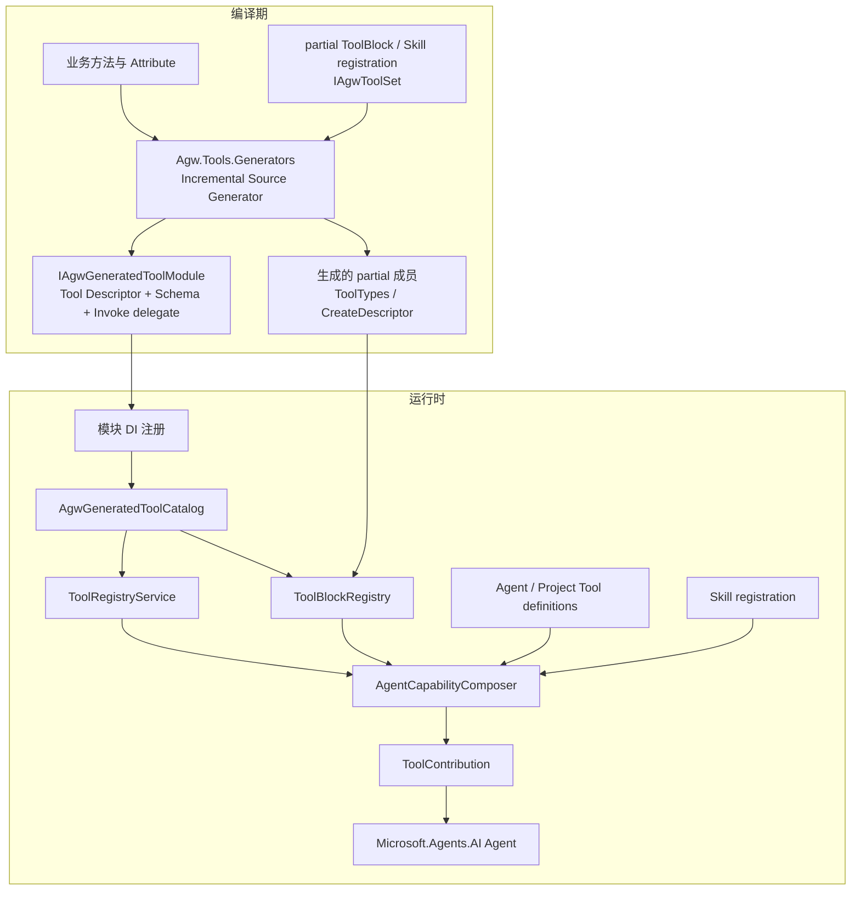
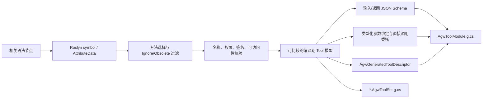
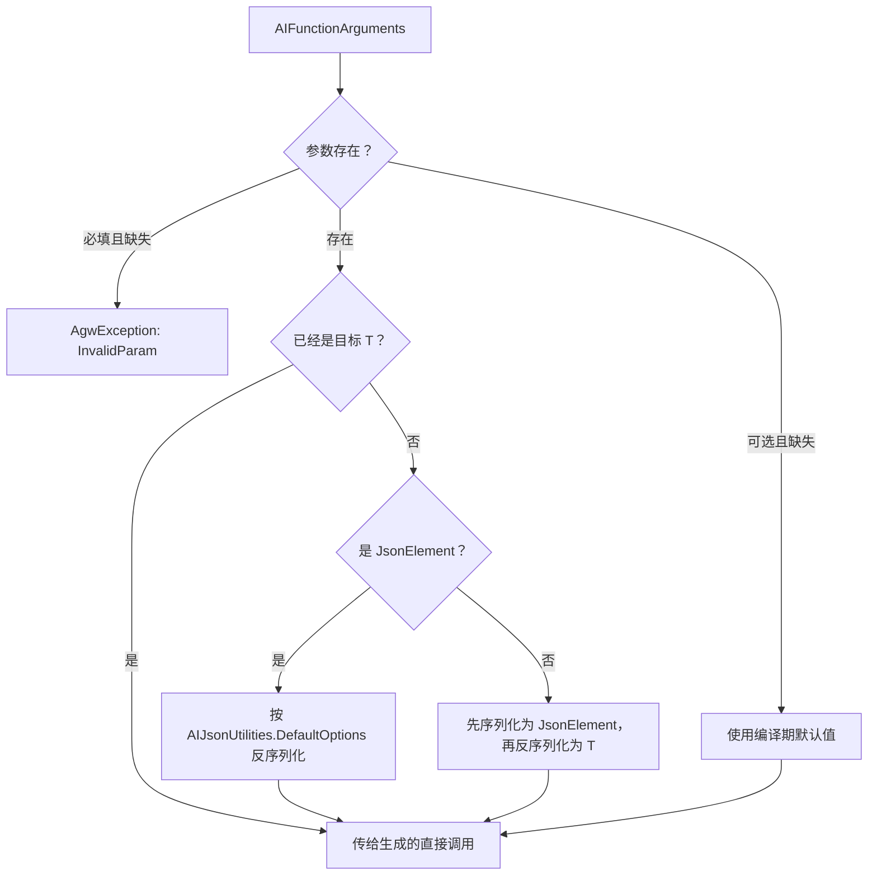
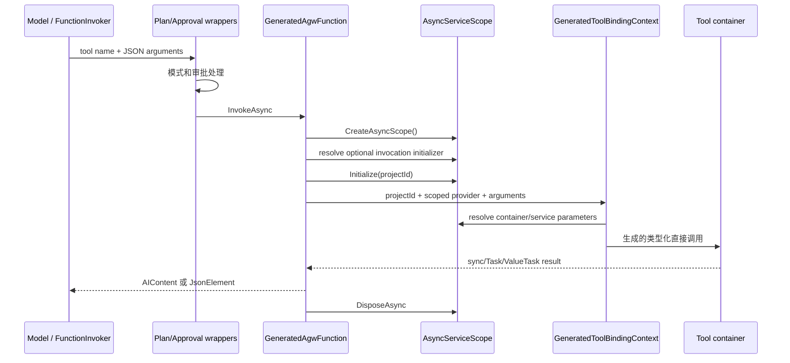
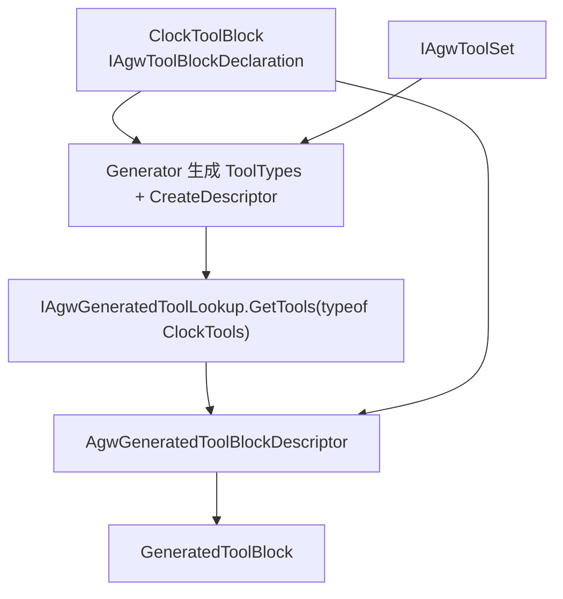
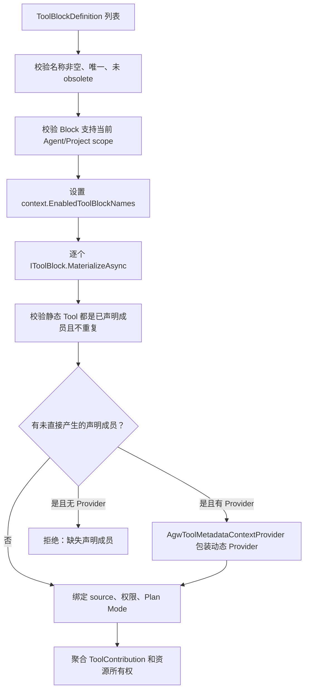
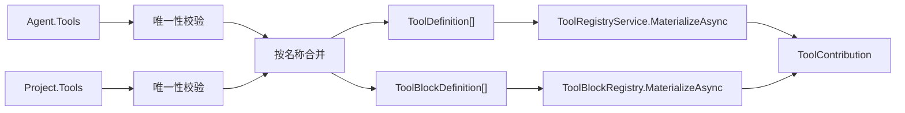
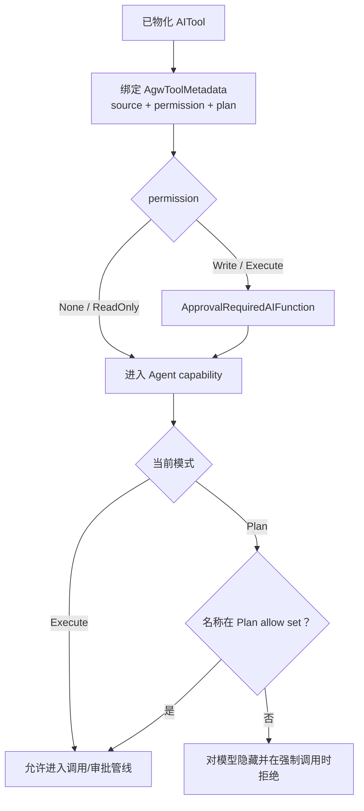

# Tool 设计

本文描述 Agw 当前的 Tool 声明、编译期生成、目录注册、能力组合和调用机制。本文面向需要新增 Tool、ToolBlock 或 Skill Tool 的开发者，也用于解释这些能力在运行时如何协作。

## 以代码实现作为事实源

当前设计的主要事实源如下：

| 关注点 | 代码位置 |
| --- | --- |
| 轻量接口、Attribute、生成桥接契约 | `src/server/Agw.Tools.Abstractions/` |
| 编译期发现、Schema 和调用代码生成 | `src/server/Agw.Tools.Generators/AgwToolGenerator.cs` |
| 生成 Tool 目录与调用适配器 | `src/server/Agw.Tools/Generated/` |
| 全局目录、选择和物化 | `src/server/Agw.Tools/ToolRegistryService.cs` |
| ToolBlock 注册与原子物化 | `src/server/Agw.Tools/ToolBlocks/` |
| Agent、Project、Connection 和 Skill 的能力组合 | `src/server/Agw.Agents.Execution/Agents/Composition/` |
| Plan Mode 与审批执行 | `src/server/Agw.Agents.Execution/Agents/` |
| HTTP 目录接口 | `src/server/Agw.Tools/Api/ToolsController.cs` |

阅读顺序应从调用入口向下追踪实现。例如，要判断 `AllowInPlanMode` 是否只影响展示，需继续阅读 `PlanModeToolGuardProvider`；要判断 `TimeoutMs` 是否真正中断调用，需搜索它在运行时的所有读取位置。

## 名词解释

| 名词 | 含义 |
| --- | --- |
| Tool | 提供给模型的一个具名能力。运行时通常表现为 `Microsoft.Extensions.AI.AITool`，可调用函数表现为 `AIFunction`。 |
| 独立 Tool | 可以通过自己的名称单独选择、物化和调用的 Tool。 |
| Attribute Tool | 由 `[AgwTool]` 或 `[AgwToolContainer]` 声明，并由 `Agw.Tools.Generators` 在编译期生成描述符、Schema 和调用委托的 Tool。 |
| 手写 Tool | 直接实现 `IAgwTool` 或 `IProjectScopedAgwTool`，自行构造 `AITool` 的 Tool。 |
| Contextual Tool | 实现 `IContextualTool`，在给定 Agent、Project、Workspace 等上下文后产生一组运行时能力。 |
| Tool 容器 | 承载 Attribute Tool 方法的类。容器本身不是 Tool，也不等同于 ToolBlock。 |
| ToolBlock | 一组必须作为整体选择的 Tool。成员不能脱离所属 Block 独立配置。 |
| 固定 ToolBlock | 由 `partial class`、`IAgwToolBlockDeclaration` 和一个或多个 `IAgwToolSet<T>` 声明；成员类型在源码中固定，Descriptor 由 Generator 补齐。 |
| 动态 ToolBlock | 手写 `IToolBlock`；可在物化时创建 Provider、动态 Tool、会话状态和资源。 |
| ToolSet | `IAgwToolSet<TToolContainer>`。泛型参数直接表达“当前声明使用这个 Tool 容器”，Generator 由此生成 `ToolTypes`，无需字符串匹配。 |
| Descriptor | Tool 或 ToolBlock 的结构化声明。它描述名称、权限、Schema、成员等，不持有 scoped 实例。 |
| Generated Module | 一个工具程序集生成的 `IAgwGeneratedToolModule` 单例，包含该程序集的 Tool 描述符、ToolBlock registration 和 obsolete 名称。 |
| Catalog | `AgwGeneratedToolCatalog` 对所有已注册 Generated Module 的索引，可按名称或声明类型查找生成 Tool。 |
| Registry | `ToolRegistryService` 提供统一目录，将生成 Tool、手写 Tool、Contextual Tool 和 ToolBlock 汇总，并负责选择与物化。 |
| Definition | Agent 或 Project 持久化配置中的 Tool/ToolBlock 选择及选项。Definition 使用 JSON 多态类型表达。 |
| Materialization | 根据 Definition 和可信运行时上下文创建真正交给 Agent 的 Tool、Provider、规则和资源。 |
| ToolContribution | 一次物化产生的能力集合，包含 Tool、Context Provider、Loop Evaluator、自动审批规则、Plan Mode 白名单、警告和需要释放的资源。 |
| Skill | 可加载说明和资源的能力包。Skill 可以在绑定时附带手写 Tool 或生成 Tool；Skill 本身不由 Tool Generator 解释。 |
| Project scoped | Tool 创建或调用时绑定可信 `projectId`，模型不能用普通参数替换该值。 |
| Plan Mode | Agent 的受限模式。只有被加入 `PlanModeAllowedToolNames` 的 Tool 才允许在此模式中调用。 |
| Permission | Tool 声明的静态权限：`None`、`ReadOnly`、`Write`、`Execute`。当前 `Write` 和 `Execute` 会包装为需要审批的函数。 |
| 列表隐藏 | `ExcludeToolFromList` 或 ToolBlock 的 `ExcludeFromList` 只影响两个列表接口，不移除能力，也不改变按名称查询。 |

## 整体架构与职责边界

Tool 系统把“如何声明能力”“如何选择能力”和“如何安全调用能力”分成三层。业务模块只需依赖轻量契约和 Analyzer；`Agw.Tools` 负责运行时目录与 DI；`Agw.Agents.Execution` 负责把能力接入 Agent 的模式和审批管线。



项目职责如下：

| 项目 | 当前职责 |
| --- | --- |
| `Agw.Tools.Abstractions` | 权限、手写 Tool 接口、声明 Attribute、生成描述符和调用桥接接口。只依赖 `Microsoft.Extensions.AI.Abstractions`。 |
| `Agw.Tools.Generators` | 编译期发现 Attribute Tool 和 `IAgwToolSet<T>`，生成 Schema、直接调用代码、模块清单和 partial 成员。目标框架为 `netstandard2.0`，作为 Analyzer 引用。 |
| `Agw.Tools` | 汇总生成清单，保留手写路径，创建调用 scope，绑定参数和服务，构造 ToolBlock，投影目录。 |
| 业务模块 | 声明 Tool 方法，注册生成模块、实例容器和依赖，按需声明 Skill 或 ToolBlock。 |
| `Agw.Agents.Execution` | 合并 Agent、Project、Connection 和 Skill 能力，执行 Plan Mode 限制、审批、调用和资源释放。 |

设计边界有三点：

1. Descriptor 是静态声明，不持有 scoped 服务或业务实例。
2. Tool 是否存在于生成模块，与它是否进入全局 Registry 或某个 Agent 的最终能力集合是不同阶段。
3. 权限、Plan Mode、审批和可信 Project 上下文由服务端执行，不能由模型输入决定。

## 声明单个方法或整个 Tool 容器

所有 Tool Attribute 位于 `Agw.Tools.Abstractions.Attributes`。

| Attribute | 作用位置 | 当前行为 |
| --- | --- | --- |
| `AgwTool` | 方法 | 显式暴露方法，或覆盖容器默认元数据。 |
| `AgwToolContainer` | 类型 | 批量选择该类型直接声明的 public 普通方法，并提供默认权限、分类和 Plan Mode 配置。 |
| `AgwToolIgnore` | 方法 | 完全跳过生成；优先级高于容器发现和方法 `[AgwTool]`。 |
| `AgwToolService` | 参数 | 从本次调用的 DI scope 解析参数，不进入输入 Schema。 |
| `ExcludeToolFromList` | 类型、方法 | 生成并保留能力，只从列表投影隐藏。 |
| `AgwToolParameterSchema` | 参数 | 为输入 Schema 增加格式、范围、长度等约束。 |
| `AgwToolRequiresWorkspace` | 类型 | 把 `RequiresWorkspace=true` 写入 Tool 描述符。 |

`AgwTool` 支持无参数、只传权限、以及同时传名称和权限三种构造方式：

```csharp
[AgwTool]
[AgwTool(AgwToolPermission.ReadOnly)]
[AgwTool("save_item", AgwToolPermission.Write)]
```

其可配置项如下：

| 配置项 | 默认值 | 实际用途 |
| --- | --- | --- |
| `Name` | 方法默认名称 | 覆盖 Tool 的稳定调用名称。 |
| `Category` | `General` | 覆盖目录分类；容器默认值参与继承。 |
| `RequiredPermission` | `None` 的 CLR 默认值 | 只有通过方法构造参数或容器构造参数明确提供后才视为有效声明。 |
| `AllowInPlanMode` | `false` | 控制是否进入 Plan Mode 允许名称集合。 |
| `TimeoutMs` | `5000` | 当前写入 Descriptor 和内部目录元数据，通用生成调用器尚不强制该超时。 |
| `ReturnExceptionsAsResults` | `true` | 兼容属性；Generator 和运行时没有根据该值分支，Agent Tool 调用错误边界统一处理异常。 |

`AgwToolContainer` 的构造参数 `RequiredPermission` 是容器内方法的默认权限；`DefaultCategory` 默认为 `General`，`AllowInPlanMode` 默认为 `false`。方法上的显式配置优先。

未标记容器的类型，只生成显式带 `[AgwTool]` 的方法：

```csharp
using System.ComponentModel;
using Agw.Tools.Abstractions;
using Agw.Tools.Abstractions.Attributes;

internal static class IdTools
{
    [AgwTool(AgwToolPermission.ReadOnly)]
    [Description("生成一个新的 GUID。")]
    public static Guid GenerateGuid()
    {
        return Guid.CreateVersion7();
    }
}
```

批量容器适合一组具有共同默认值的方法：

```csharp
using System.ComponentModel;
using Agw.Tools.Abstractions;
using Agw.Tools.Abstractions.Attributes;

[AgwToolContainer(
    AgwToolPermission.ReadOnly,
    DefaultCategory = "Time",
    AllowInPlanMode = true)]
internal sealed class ClockTools
{
    private readonly TimeProvider _timeProvider;

    public ClockTools(TimeProvider timeProvider)
    {
        _timeProvider = timeProvider;
    }

    /// <summary>获取当前 UTC 时间。</summary>
    public DateTimeOffset GetUtcNow()
    {
        return _timeProvider.GetUtcNow();
    }

    [AgwTool("unix_time_seconds", AgwToolPermission.ReadOnly)]
    [Description("获取当前 Unix 时间戳，单位为秒。")]
    public long GetUnixTimeSeconds()
    {
        return _timeProvider.GetUtcNow().ToUnixTimeSeconds();
    }

    [AgwToolIgnore]
    public string FormatForDisplay(DateTimeOffset value)
    {
        return value.ToString("O");
    }
}
```

这个容器生成 `GetUtcNow` 和 `unix_time_seconds`；`FormatForDisplay` 仍可被普通 C# 代码调用，但不生成 Descriptor、Schema、调用委托或 ToolBlock 成员。

方法发现遵循以下规则：

- 容器只批量选择该类型直接声明的 public 普通方法，不包含继承成员、构造函数、属性和事件访问器。
- 静态类生成静态调用；实例类的方法按方法本身的静态性生成静态或实例调用。
- 容器发现和方法 `[AgwTool]` 同时命中时只生成一次。
- `[AgwToolIgnore]` 先于签名和 Schema 分析。
- 带 `[Obsolete]` 的方法或类型不生成可调用 Tool，其名称进入模块的 `ObsoleteToolNames`。

## 生成 Tool 名称、描述和运行元数据

最终元数据来自方法声明和容器默认值。Generator 使用 Roslyn 的 `AttributeData` 区分“没有配置”和“显式配置”，所以 `false`、`None` 和 `0` 都是有效覆盖值。

| 字段 | 解析规则 |
| --- | --- |
| `Name` | 方法显式名称；否则使用方法名并移除末尾一个精确匹配的 `Async`。大小写保持不变。 |
| `DisplayName` | 方法 `DisplayNameAttribute`；否则等于最终名称。 |
| `Description` | 方法 `DescriptionAttribute`；否则方法 XMLDoc `<summary>`；否则空字符串。 |
| `Category` | 方法显式 `Category`；容器 `DefaultCategory`；最后为 `General`。 |
| `RequiredPermission` | 方法构造参数；容器构造参数。两者都没有时产生编译错误。 |
| `AllowInPlanMode` | 方法显式值；容器值；最后为 `false`。 |
| `TimeoutMs` | 方法显式值；否则为 `5000`。 |
| `ExcludeFromList` | 方法或类型带 `ExcludeToolFromList`。 |
| `RequiresWorkspace` | 所属类型带 `AgwToolRequiresWorkspace`。 |

默认命名示例：

```text
GetJobAsync       -> GetJob
getJobAsync       -> getJob
GetJob            -> GetJob
显式 "get_async"  -> get_async
```

名称冲突使用不区分大小写的比较。空名称和重复名称会产生编译或目录构建错误，因此名称也必须在最终组合边界保持唯一。

参数描述先读取参数上的 `DescriptionAttribute`，再读取方法 XMLDoc 对应的 `<param>`。XMLDoc 在编译期读入生成代码，运行时不读取 XML 文件。

`TimeoutMs` 当前写入 `AgwGeneratedToolDescriptor` 和内部 `ToolInfo`，但通用 `GeneratedAgwFunction` 没有基于它创建超时取消令牌。需要硬超时的方法必须在业务实现或专用执行器中明确实现，不能只设置 Attribute。`AgwToolRequiresWorkspace` 当前也属于目录元数据：生成 ToolBlock 会在任一成员需要 Workspace 时把 Block 标为需要 Workspace，但通用生成调用器本身不执行 Workspace 存在性检查。

## 在编译期生成 Descriptor、Schema 和直接调用代码

`AgwToolGenerator` 实现 `IIncrementalGenerator`。它用 `ForAttributeWithMetadataName` 定位 Tool 容器和 Tool 方法，并分析带 base list 的类型以识别 `IAgwToolSet<T>`。



每个消费程序集生成一个模块单例，命名形式是：

```text
Agw.Generated.<按 namespace segment 规范化的程序集名称>.AgwToolModule.Instance
```

程序集名中的 `.` 保留为 namespace 层级。每个 segment 内无法作为 C# 标识符的字符转换为 `_`；数字开头或 C# 关键字增加 `_` 前缀。例如 `Agw.Jobs` 生成 `Agw.Generated.Agw.Jobs.AgwToolModule`。

`IAgwGeneratedToolModule` 当前包含三组数据：

```csharp
public interface IAgwGeneratedToolModule
{
    IReadOnlyList<AgwGeneratedToolDescriptor> Tools { get; }

    IReadOnlyList<IAgwGeneratedToolBlockRegistration> ToolBlockRegistrations { get; }

    IReadOnlyList<string> ObsoleteToolNames { get; }
}
```

单个 `AgwGeneratedToolDescriptor` 保存声明类型、名称、显示名称、描述、分类、权限、Plan Mode、列表隐藏、Workspace、超时、是否异步、输入和返回 Schema、参数描述以及 `InvokeAsync` 委托。它不保存容器实例或 DI scope。

实例调用的生成代码在语义上类似：

```csharp
var target = context.GetRequiredService<ClockTools>();
var value = context.GetRequiredArgument<Guid>("id");
return await target.GetAsync(value, cancellationToken);
```

因此 Attribute 路径在运行时不会调用 `MethodInfo.Invoke`，也不会用 `AIFunctionFactory.Create` 再次分析签名。Tool 容器无需为生成器声明 `partial`；只有要让 Generator 补齐成员的 ToolSet owner 需要 `partial`。

生成器采用严格模式：不支持的签名产生编译错误，不回退到运行时反射。诊断编号如下：

| 编号 | 含义 | 常见原因 |
| --- | --- | --- |
| `AGWTOOL001` | 不支持的方法签名或类型 | 泛型、`ref/out/in`、`async void`、动态或无法静态描述的 JSON 类型。 |
| `AGWTOOL002` | Tool 或 ToolSet 声明无效 | 权限缺失、名称冲突、owner 未声明 `partial`、同一服务参数重复标记等。 |

调试时可以把生成文件临时输出到 `obj`：

```bash
dotnet build src/server/My.Module/My.Module.csproj \
  -p:EmitCompilerGeneratedFiles=true \
  -p:CompilerGeneratedFilesOutputPath=obj/Generated
```

生成的 `.g.cs` 由编译器管理，不提交到仓库。

## 生成 JSON Schema 并绑定模型参数

输入 Schema 与调用参数绑定使用同一份编译期模型。当前支持：

- `string`、`char`、`bool`、常规整数和浮点类型；
- `Guid`，对应 `string/uuid`；
- `DateTimeOffset`，对应 `string/date-time`；
- 普通枚举，按成员名称生成字符串枚举；
- 可空值类型和带可空标注的引用类型；
- 数组、`IEnumerable<T>`、`IReadOnlyList<T>`、`IList<T>`、`List<T>`；
- 字符串键的 `IDictionary<TKey,TValue>`、`IReadOnlyDictionary<TKey,TValue>`、`Dictionary<TKey,TValue>`；
- 由 public 可读实例属性构成的普通 class、struct、DTO 和 record；
- 属性上的 `JsonPropertyNameAttribute`、`JsonIgnoreAttribute` 和 `DescriptionAttribute`。

“参数是否必填”和“值是否可为 null”分别计算。没有显式默认值的业务参数进入输入 Schema 的 `required`；有默认值的参数使用 `GetOptionalArgument<T>`，默认值也写入 Schema；可空类型决定类型 Schema 是否允许 `null`。

可以用 `AgwToolParameterSchema` 增加静态约束：

```csharp
[AgwTool(AgwToolPermission.Write)]
public Task<UserResponse> CreateUserAsync(
    [Description("用户显示名称")]
    [AgwToolParameterSchema(MinLength = 1, MaxLength = 80)]
    string name,
    [AgwToolParameterSchema(
        Type = "string",
        Format = "email",
        Pattern = "^[^@]+@[^@]+$")]
    string email,
    [AgwToolParameterSchema(Minimum = 0, Maximum = 10)]
    int retryCount = 3,
    CancellationToken cancellationToken = default)
{
    throw new NotImplementedException();
}
```

可配置项为 `Type`、`Format`、逗号分隔的 `EnumValues`、`Minimum`、`Maximum`、`MinLength`、`MaxLength` 和 `Pattern`。只有显式指定的项写入 Schema，所以 `Minimum = 0` 不会被误判为未配置。

运行时参数转换流程如下：



服务参数和 `CancellationToken` 不进入输入 Schema。调用结果若为 `null`、`AIContent` 或 `IEnumerable<AIContent>` 会直接返回；其他结果按运行时实际类型和 `AIJsonUtilities.DefaultOptions` 转为 `JsonElement`。

生成器拒绝无法静态安全描述的泛型 Tool、by-ref 参数或返回、`async void`、指针、`dynamic`、裸 `object`、自定义 `JsonConverterAttribute`、JSON 多态、Extension Data、循环 DTO 图和非字符串键字典。此类能力应使用受支持 DTO 或手写 Tool 路径。

## 使用依赖注入和可信 Project 上下文

实例 Tool 容器使用构造函数注入；静态方法或方法级依赖使用 `[AgwToolService]`。Generator 也兼容按完整元数据名识别 `Microsoft.AspNetCore.Mvc.FromServicesAttribute`，自身不因此依赖 ASP.NET Core。

```csharp
[AgwToolContainer(AgwToolPermission.ReadOnly)]
internal sealed class ProjectTools
{
    private readonly ProjectAppService _service;

    public ProjectTools(ProjectAppService service)
    {
        _service = service;
    }

    public Task<ProjectResponse> GetCurrentAsync(
        [AgwToolService] IAgwToolInvocationContext invocationContext,
        CancellationToken cancellationToken)
    {
        return _service.GetAsync(invocationContext.ProjectId, cancellationToken);
    }
}
```

静态方法示例：

```csharp
[AgwTool(AgwToolPermission.ReadOnly)]
public static DateTimeOffset GetUtcNow(
    [Microsoft.AspNetCore.Mvc.FromServices] TimeProvider timeProvider)
{
    return timeProvider.GetUtcNow();
}
```

`[AgwToolService]` 和 `[FromServices]` 的生成结果相同：生成委托调用 `IAgwToolBindingContext.GetRequiredService<T>()`。同一参数同时使用两者会产生 `AGWTOOL002`。服务身份必须显式声明，Generator 不会根据容器中是否注册某个类型来猜测。

每次生成 Tool 调用都会创建独立 `AsyncServiceScope`：



`IAgwToolInvocationContext.ProjectId` 由运行时在 scope 内初始化，业务方法可把它作为服务参数读取。它不是模型输入。`CancellationToken` 直接使用当前函数调用的取消令牌。并发调用分别持有 scope，成功、异常和取消都会离开 `await using` 并释放 scoped 依赖。

实例容器和其构造函数依赖必须注册：

```csharp
services.AddScoped<ClockTools>();
services.AddSingleton<TimeProvider>(TimeProvider.System);
```

服务缺失由 `GetRequiredService<T>()` 报错；业务异常继续进入 Agent 的 Tool 调用错误边界。

## 定义固定 ToolBlock 并建立类型安全成员关系

固定 ToolBlock 由开发者定义语义，Generator 只补齐机械代码。Block 不使用 Attribute 自动创建，也不在 Tool 方法上重复写 Block 名称。

```csharp
using Agw.Tools.Abstractions.Generated;

internal sealed partial class ClockToolBlock
    : IAgwToolBlockDeclaration,
        IAgwToolSet<ClockTools>
{
    public string Name => "clock";

    public string DisplayName => "Clock";

    public string Description => "提供当前时间及时间戳。";
}
```

`IAgwToolSet<ClockTools>` 在类型系统中直接表达成员关系。Generator 为这个 partial class 生成：

- `ToolTypes`，包含 `typeof(ClockTools)`；
- `IAgwGeneratedToolBlockRegistration` 实现；
- `CreateDescriptor(IAgwGeneratedToolLookup)`，按 `ToolTypes` 查找成员 Descriptor；
- Generated Module 中的 ToolBlock registration 实例。

它不会执行 `Name` 来推断成员，也不要求 `ToolBlock = "clock"` 之类的重复字符串。一个 Block 可以实现多个 `IAgwToolSet<T>` 以组合多个容器：

```csharp
internal sealed partial class ProjectToolBlock
    : IAgwToolBlockDeclaration,
        IAgwToolSet<ProjectQueryTools>,
        IAgwToolSet<ProjectCommandTools>
{
    public string Name => "project";

    public string DisplayName => "Project";
}
```

`IAgwToolBlockDeclaration` 的默认值为：

| 属性 | 默认值 |
| --- | --- |
| `DisplayName` | `Name` |
| `Description` | 空字符串 |
| `Scopes` | `Agent | Project` |
| `ExcludeFromList` | `false` |

声明类型必须是顶层、具体、非泛型、非静态的 public 或 internal `partial class`，并有 Generator 可访问的无参数构造函数。`ToolTypes` 和 `CreateDescriptor` 是生成器保留成员名。



固定 Block 的成员在源码中确定。需要根据会话动态产生成员、维护 Context Provider 状态或拥有动态资源时，实现手写 `IToolBlock`。

## 保证 ToolBlock 的原子选择和运行时完整性

`ToolBlockRegistry` 为所有固定和动态 Block 建立不区分大小写的名称索引与成员 owner 索引。构建目录时会拒绝：

- Block 名称重复；
- 同一个 Tool 同时属于多个 Block；
- Block 名称与另一个 Block 的成员 Tool 名称冲突；
- 空 Block 名称或无效成员权限声明。

被 Block 拥有的生成 Tool 不再作为独立 Tool 放入 Registry。若持久化配置仍试图按独立 Tool 选择成员，物化会明确报错；若把 Block 名称写成 `kind: tool`，也会报错。

Block 物化流程如下：



`ToolContribution` 聚合的内容包括：

- 直接暴露给模型的 `Tools`；
- 允许在 Plan Mode 使用的名称；
- 动态 `AIContextProvider` 和动态 Tool 元数据；
- `LoopEvaluator`；
- 自动审批规则；
- 物化警告和按 Tool 调用显示的警告；
- 需要在 Agent 释放时异步释放的资源。

子 Contribution 被父 Contribution 持有，资源按后进先出释放；某个资源释放失败时仍继续尝试释放其他资源，最后重新抛出首个异常。

## 注册 Generated Module、容器和全局目录选择

业务项目必须把 Generator 作为 Analyzer 引用：

```xml
<ItemGroup>
  <ProjectReference Include="..\Agw.Tools.Abstractions\Agw.Tools.Abstractions.csproj" />
  <ProjectReference
    Include="..\Agw.Tools.Generators\Agw.Tools.Generators.csproj"
    OutputItemType="Analyzer"
    ReferenceOutputAssembly="false" />
</ItemGroup>
```

模块 DI 入口注册生成模块和实例容器：

```csharp
services.AddSingleton<IAgwGeneratedToolModule>(
    Agw.Generated.My.Module.AgwToolModule.Instance);
services.AddScoped<ClockTools>();
```

注册 Generated Module 只让 `AgwGeneratedToolCatalog` 能按名称和类型找到 Descriptor。它不会自动把该模块的所有 Tool 加到全局 Registry。确实需要全局可选时，Host 或模块组合代码显式选择容器类型：

```csharp
services.AddToolCatalogTypes(typeof(ClockTools));
```

`AddTools` 当前还会：

- 注册 scoped `AgwToolInvocationContext`，同时暴露读取接口和初始化接口；
- 注册 `Agw.Tools` 自己生成的 Module；
- 注册 singleton `AgwGeneratedToolCatalog`；
- 构建 singleton `ToolRegistryService` 并执行 Definition 覆盖校验；
- 暴露统一 `ToolBlockRegistry`。

`ToolRegistryService` 仍会反射发现保留的手写 `IAgwTool`、`IProjectScopedAgwTool`、`IContextualTool` 和动态 `IToolBlock`。Attribute Tool 的方法发现、Attribute 读取、Schema 推断和调用不走这条反射路径。

## 将 Agent 与 Project 的持久化选择组合成能力

Agent 和 Project 使用 `ToolValueObject` 保存选择。外层 `kind` 区分独立 Tool 与 ToolBlock，内层 Definition 的 `name` 是稳定的多态判别值：

```json
[
  {
    "kind": "tool",
    "definition": {
      "name": "web_search",
      "options": {}
    }
  },
  {
    "kind": "toolBlock",
    "definition": {
      "name": "project-memory",
      "options": {
        "storage": "database"
      }
    }
  }
]
```

当前可持久化的 Definition 必须在 `Agw.Shared.Tooling.ToolValueObject` 的 `JsonDerivedType` 登记中存在。把一个 Tool 或 ToolBlock 放入运行时 Registry，并不会自动创建它的持久化 JSON 类型。

`ToolValueResolution.Resolve` 先分别校验 Agent 和 Project 列表内名称唯一，再按 Definition 名称合并。Project 中同名项替换 Agent 项并保留原位置，新名称追加到末尾。`background-agents` Block 只允许出现在 Agent Definition。



物化时会拒绝空名称、重复名称、obsolete 名称、未知名称、把 Block 当作 Tool，以及单独选择 Block 成员。Contextual Tool 可以根据 `ToolMaterializationContext` 产生多项能力。这个上下文当前包含 Agent、Project、Conversation、Workspace、默认模式、已启用 Block 名称、环境变量、后台 Agent 工厂和托管 Web Search 能力标志。

## 通过 Skill 按需贡献 Tool

`IAgentSkillRegistration` 是 Skills 模块的运行时登记契约，负责 Skill 身份、说明对象和可选 Tool 声明：

```csharp
public interface IAgentSkillRegistration
{
    Guid Id { get; }
    string Name { get; }
    string Description { get; }
    AgentSkill Create(Guid projectId);
    IReadOnlyList<IProjectScopedAgwTool> Tools => [];
    IReadOnlyList<Type> ToolTypes => [];
}
```

Tool Generator 不识别也不依赖 `IAgentSkillRegistration`。Skill 通过通用 `IAgwToolSet<T>` marker 获得生成的 `ToolTypes`：

```csharp
public sealed partial class ClockSkillRegistration
    : IAgentSkillRegistration,
        IAgwToolSet<ClockTools>
{
    public Guid Id => Guid.Parse("11111111-1111-1111-8888-000000000099");

    public string Name => "clock";

    public string Description => "读取当前时间。";

    public AgentSkill Create(Guid projectId)
    {
        return new ClockSkill();
    }
}
```

运行时加载 Agent 和 Project 绑定的 Skill ID，将内置 registration 按 `Id` 去重，然后调用 `Create(projectId)` 提供 Skill 说明。`AddSkillTools` 分别处理：

- `Tools` 中的手写 `IProjectScopedAgwTool`；
- `ToolTypes` 中的生成容器类型。

生成 Tool 按 Type 从 `AgwGeneratedToolCatalog` 读取，使用当前 `projectId` 创建，并以 `skill:<skill name>` 作为元数据来源。Skill Tool 名称与现有静态、动态 Tool 或保留的 Skill 工具名冲突时，整个组合失败。

Skill 专属 Tool 不要求成为全局持久化 Definition，也不会因为注册 Generated Module 就自动出现在所有 Agent 中。它只在相应 Skill 被绑定时进入最终能力集合。

## 执行权限、审批和 Plan Mode 限制

每个独立 Tool 和每个 ToolBlock 成员都必须声明 `AgwToolPermission`。

| 权限 | 当前统一审批包装 |
| --- | --- |
| `None` | 不因 Agw 权限声明增加审批包装。 |
| `ReadOnly` | 不因 Agw 权限声明增加审批包装。 |
| `Write` | 包装为 `ApprovalRequiredAIFunction`。 |
| `Execute` | 包装为 `ApprovalRequiredAIFunction`。 |

`AgwToolMetadataBinding` 把来源、权限和 `AllowInPlanMode` 绑定到 `AITool`。对 `AIFunction`，元数据通过委托包装器暴露；`Write` 和 `Execute` 再增加 SDK 的审批包装。非 `AIFunction` 不能声明需要审批的权限。



`AllowInPlanMode` 控制可用性，不等同于免审批。物化过程把允许的名称加入 `PlanModeAllowedToolNames`；`PlanModeToolGuardProvider` 在 Provider 产生动态 Tool 之后运行。在 Plan Mode 中，不允许的函数对模型隐藏，若仍被强制调用则返回 `PlanModeToolNotAllowed`。在 Execute Mode 中，存在名称冲突或未进入允许集合的函数仍会被运行时包装检查。

审批由 Agent 执行管线处理。它会绑定审批响应与原始 Tool 调用，识别必须等待用户回答的人机交互 Tool，并尝试使用当前 session 已保存的授权或 `ToolContribution.AutoApprovalRules` 自动批准。没有被自动批准的审批请求交给上层 Agent Runtime 与客户端交互。权限状态可在执行前刷新；权限模式变化会使不再适用的 session grant 失效。

权限与 Plan Mode 检查的外层包装发生在 `GeneratedAgwFunction` 创建调用 scope 之前，因此尚未获准的调用不会解析 Attribute Tool 的实例容器和方法服务。

## 控制目录 API 的展示与隐藏

统一目录包含独立 Tool、Contextual Tool 和 ToolBlock。HTTP 接口投影为 `ToolLiteInfo`：

| 接口 | 数据来源与隐藏行为 |
| --- | --- |
| `GET /api/tools` | 使用 `GetListedTools()`，过滤 `ExcludeFromList=true`。 |
| `GET /api/tools/by-category` | 对过滤后的条目按 Category 分组，因此不会保留空分类。 |
| `GET /api/tools/{name}` | 使用完整 Registry 按名称查询，隐藏条目仍可返回。 |

列表 DTO 当前包含 `Kind`、`Name`、`DisplayName`、`Description`、`Category`、`MemberToolNames`、`Scopes`、`RequiresWorkspace`、`RequiredPermission` 和 `RequiresConfirmation`。

`AgwToolIgnore` 与列表隐藏的语义必须分开：

| 行为 | `AgwToolIgnore` | `ExcludeToolFromList` |
| --- | --- | --- |
| 生成 Tool、Schema 和调用委托 | 否 | 是 |
| 可进入固定 ToolBlock | 否 | 是 |
| 可以正常绑定与调用 | 否 | 是 |
| 列表接口 | 因不存在而没有条目 | 过滤隐藏 |
| 按名称详情接口 | 不存在 | 保留 Registry 查询行为 |

容器或方法的 `ExcludeToolFromList` 控制独立 Tool 条目。ToolBlock 是否隐藏由 `IAgwToolBlockDeclaration.ExcludeFromList` 或手写 Descriptor 独立决定；成员隐藏不会删减 Block 的原子成员集合。

## 选择 Attribute、手写 Tool、Contextual Tool 或动态 ToolBlock

| 接入方式 | 适用场景 | 注册与物化特点 |
| --- | --- | --- |
| Attribute Tool | 方法签名可静态描述，输入输出使用受支持 JSON 类型，成员固定。 | Generator 生成 Schema 和直接调用；实例在每次调用的 DI scope 中解析。 |
| `IAgwTool` | 独立能力，不需要创建时绑定 Project，或需要完全手工构造 `AITool`。 | Registry 反射发现或显式注册实现类型。 |
| `IProjectScopedAgwTool` | 手写 Tool 在创建时需要可信 Project ID。 | Registry 或 Skill 调用 `ToAITool(projectId)`。 |
| `IContextualTool` | 能力依赖 Agent、Project、Workspace 或运行时环境，并可能贡献多项能力。 | `MaterializeAsync` 返回 `ToolContribution`。 |
| 固定生成 ToolBlock | 一组静态 Attribute Tool 必须整体选择。 | partial declaration + `IAgwToolSet<T>`；Generator 创建 Descriptor 工厂。 |
| 手写 `IToolBlock` | 动态成员、会话 Provider、状态、运行规则或资源生命周期。 | Block 自行物化并返回 `ToolContribution`，Registry 校验声明与产物。 |

Attribute Tool 不适合动态 Schema、多态输入、任意 `object` 图或必须在运行时决定成员的能力。此时手写路径能更直接表达真实边界。

## 以 Job Management 为完整示例

Jobs 模块展示了同一 Attribute Tool 容器同时服务固定 ToolBlock 和 Skill 的方式。

容器声明五个 Tool：

| Tool | 权限 | Plan Mode | 来源 |
| --- | --- | --- | --- |
| `agw_job_list` | `ReadOnly` | 允许 | 继承容器默认值。 |
| `agw_job_get` | `ReadOnly` | 允许 | 继承容器默认值。 |
| `agw_job_create` | `Write` | 禁止 | 方法显式覆盖。 |
| `agw_job_update` | `Write` | 禁止 | 方法显式覆盖。 |
| `agw_job_delete` | `Write` | 禁止 | 方法显式覆盖。 |

简化后的声明形态：

```csharp
[AgwToolContainer(
    AgwToolPermission.ReadOnly,
    DefaultCategory = "Jobs",
    AllowInPlanMode = true)]
[ExcludeToolFromList]
public sealed class JobManagementToolExecutor
{
    private readonly JobAppService _service;

    public JobManagementToolExecutor(JobAppService service, ICurrentAgentTurn turn)
    {
        _service = service;
    }

    [AgwTool(Name = "agw_job_list")]
    public Task<IReadOnlyList<JobToolResponse>> ListJobsAsync(
        [AgwToolService] IAgwToolInvocationContext invocationContext,
        CancellationToken cancellationToken)
    {
        throw new NotImplementedException();
    }

    [AgwTool("agw_job_create", AgwToolPermission.Write, AllowInPlanMode = false)]
    public Task<JobToolResponse> CreateJobAsync(
        string prompt,
        [AgwToolService] IAgwToolInvocationContext invocationContext,
        CancellationToken cancellationToken)
    {
        throw new NotImplementedException();
    }
}
```

固定 Block 和 Skill registration 分别声明同一个 ToolSet：

```csharp
internal sealed partial class JobManagementToolBlock
    : IAgwToolBlockDeclaration,
        IAgwToolSet<JobManagementToolExecutor>
{
    public string Name => "agw-job";
    public string DisplayName => "Job management";
    public string Description => "Manage scheduled jobs in the current project.";
    public bool ExcludeFromList => true;
}

public sealed partial class JobManagementSkillRegistration
    : IAgentSkillRegistration,
        IAgwToolSet<JobManagementToolExecutor>
{
    // Id、Name、Description、Create(projectId)
}
```

二者共享类型关系，但用途不同：ToolBlock 让五个成员成为原子目录项；Skill registration 让绑定 `agw-job` Skill 的 Agent 获得这些 Tool。Generator 只理解 `IAgwToolSet<T>` 并为两种 owner 生成 `ToolTypes`；只有同时实现 `IAgwToolBlockDeclaration` 的 owner 才生成 Block Descriptor 工厂。

Jobs 的 DI 入口注册：

```csharp
services.AddSingleton<IAgentSkillRegistration, JobManagementSkillRegistration>();
services.AddSingleton<IAgwGeneratedToolModule>(
    Agw.Generated.Agw.Jobs.AgwToolModule.Instance);
services.AddScoped<JobManagementToolExecutor>();
services.AddScoped<JobAppService>();
```

读取和修改方法通过 `IAgwToolInvocationContext` 获得可信 Project ID。写操作还会核对当前交互 turn 的稳定用户身份；删除要求确认字符串精确匹配 Job ID。这些属于 Jobs 的业务授权和校验，不能由静态 `AgwToolPermission` 替代。

## 新增能力的操作步骤与验收

新增 Attribute Tool 时按以下顺序完成：

1. 引用 `Agw.Tools.Abstractions`，并以 Analyzer 方式引用 `Agw.Tools.Generators`。
2. 为单个方法使用 `[AgwTool]`，或为批量 public 方法使用 `[AgwToolContainer]`。
3. 在方法或容器上明确权限，核对名称、分类、Plan Mode 和描述来源。
4. 使用受支持的业务参数和 DTO；服务参数显式标记 `[AgwToolService]` 或 `[FromServices]`。
5. 注册 `IAgwGeneratedToolModule`、实例容器及其构造函数依赖。
6. 选择暴露方式：`AddToolCatalogTypes`、`IAgwToolSet<T>` Skill 或固定 ToolBlock。
7. 若需要持久化选择，增加相应 `ToolDefinition`/`ToolBlockDefinition` 及 JSON 多态登记。
8. 构建消费项目并修复全部 `AGWTOOL001`、`AGWTOOL002`。
9. 检查最终目录是否存在名称冲突，Block 成员是否不能单独选择，隐藏投影是否符合要求。
10. 运行 Tools、Skills、Agents 和所属业务模块的相关测试；跨边界修改再运行 Architecture 测试和解决方案构建。

至少覆盖以下验收面：

| 验收面 | 应验证的行为 |
| --- | --- |
| 发现 | 方法级、容器级、Ignore 和 Obsolete 的选择符合规则。 |
| 命名 | 保留大小写，只移除末尾一个 `Async`，显式名称原样保留，冲突失败。 |
| Schema | 可空、默认值、DTO、集合、枚举和补充约束与参数绑定一致。 |
| DI | 每次调用独立 scope；实例、方法服务、取消和异常释放正确。 |
| ToolBlock | 类型关联正确，成员唯一，原子选择，scope 限制生效。 |
| Skill | 绑定后才贡献 Tool，重复 Skill ID 去重，最终 Tool 名称冲突失败。 |
| 权限 | `Write`/`Execute` 进入审批，Plan Mode 白名单与审批互不替代。 |
| API | 两个列表接口过滤隐藏条目，按名称接口保留查询。 |
| 兼容路径 | 现有手写 Tool、Contextual Tool 和动态 ToolBlock 仍能组合。 |

涉及 Generator 的改动还应检查增量输出：无关源码修改不应改变生成结果；修改方法签名、XMLDoc 或 Attribute 后，相应 `.g.cs` 应更新。性能验证应分别测量目录初始化、首次能力组合和分配量，且只报告实际数据。
