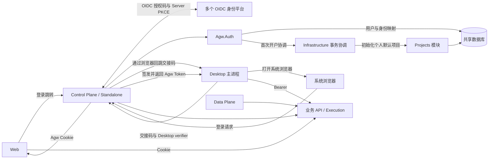
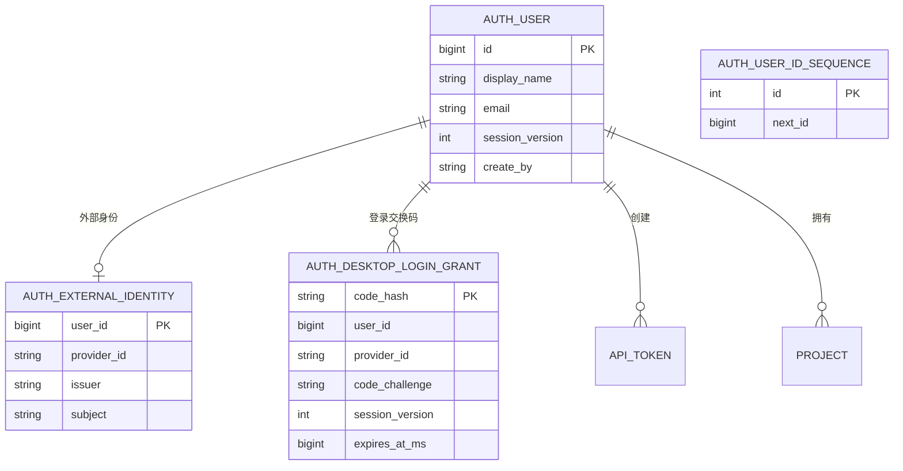
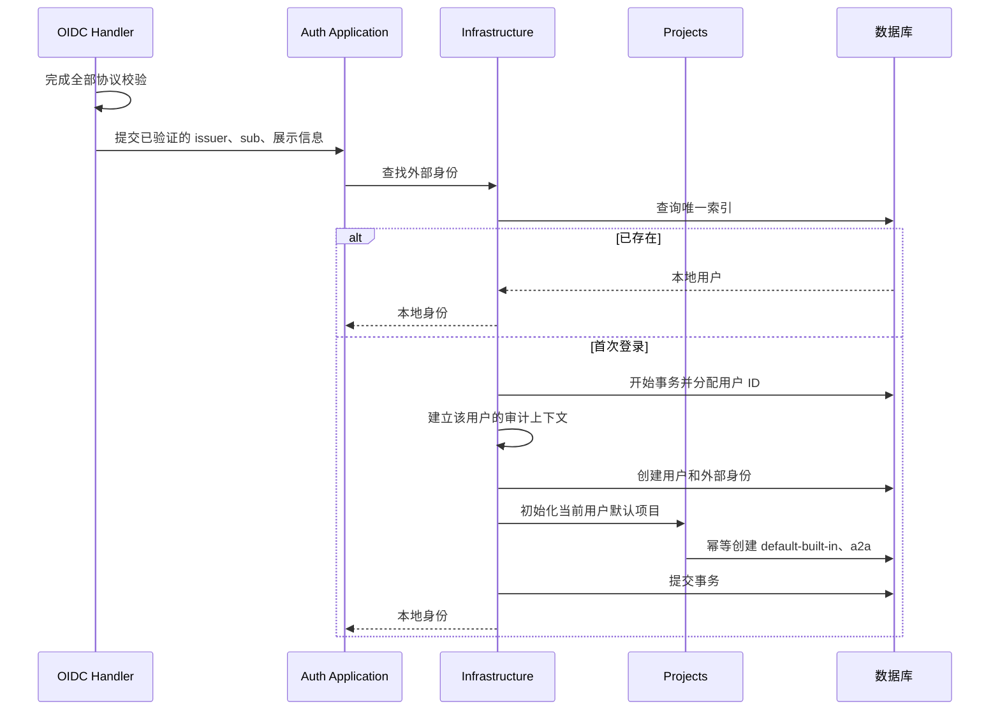
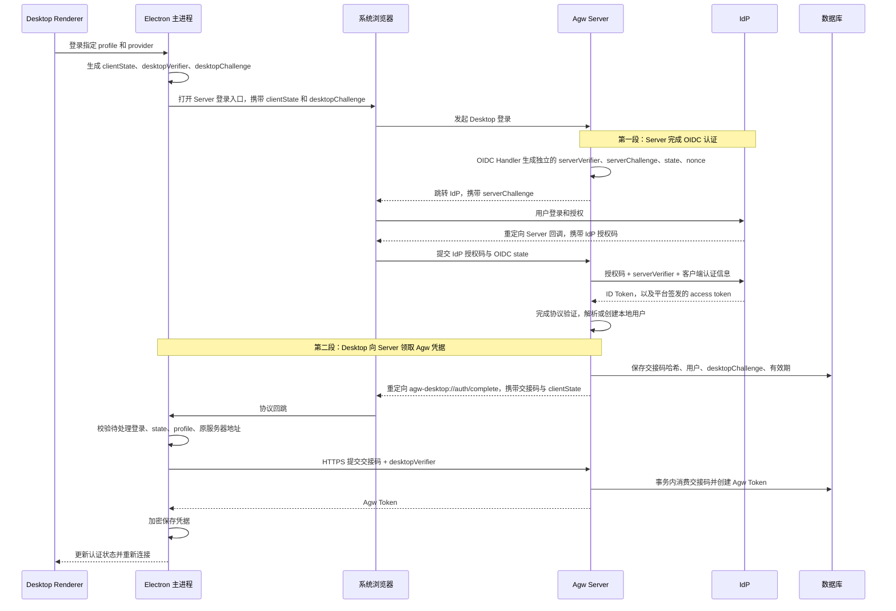

# Agw 多平台 OIDC 登录能力建设

状态：已按本方案完成 Server、Web、Desktop 实现（2026-09-17）。本文保留设计依据，实际配置与部署步骤见 [Deployment](../4.Deployment.md) 和 [Auth README](../../src/server/Agw.Auth/README.md)。真实身份平台的生产联调需使用部署方提供的 Client ID、Secret 和回调域名。

## 名词解释

| 名词 | 说明 |
| --- | --- |
| OIDC | OpenID Connect，用于通过外部身份平台认证用户 |
| IdP | Identity Provider，身份提供方，例如 Google、Microsoft Entra ID、Keycloak、Authentik |
| Provider | Agw 中配置的一项 OIDC 登录平台，使用稳定的 `providerId` 标识 |
| 外部身份 | IdP 签发并验证通过的 `issuer + sub` 组合 |
| 本地用户 | Agw 内部用户，拥有稳定数值 ID，业务数据按照该 ID 隔离 |
| OIDC 授权码 | IdP 经浏览器回调交给 Agw Server 的短期凭据，由 Server 向 IdP 兑换 Token |
| ID Token | IdP 签发的身份凭据，由 Server 验证，不作为 Agw API 的访问凭据 |
| Agw Token | Agw 自己签发的 `agw_...` 命名 API Token，Desktop 使用它访问本系统 |
| PKCE | 将授权码兑换与发起登录的客户端绑定，防止授权码被截获后兑换 |
| Desktop 交换码 | Agw 签发的一次性短期交接凭据，Desktop 使用它向 Server 领取 Agw Token |

## 背景

当前 Server 支持管理员密码登录、命名 API Token 和本机可信访问，但没有完整的本地用户及外部身份映射。

业务模块已经通过稳定用户 ID 隔离数据，具备接入多用户认证的基础。为了让用户使用其他平台账号登录，需要补齐外部身份认证、本地用户开户，以及 Web、Desktop 的登录流程。

现有实现还包含两处需要随本需求调整的假设：

- Cookie 登录被直接视为管理员登录，无法区分普通用户与管理员。
- Cookie 会话版本来自全局管理员认证状态，不适合独立用户会话。

本方案采用以下已确认范围：

- 支持通用 OIDC，通过部署配置管理多个平台，修改后重启生效。
- 平台认证成功即可创建独立普通用户。
- 接通 Server、Web、Desktop。
- 首版不包含 Mobile、跨平台账号绑定、注册审批、用户管理后台和非 OIDC 社交登录。
- 新增本地用户 ID 从 **10000** 开始递增；保留管理员 `1001`、现有密码登录、API Token 和历史数据。
- 生成 SQLite、PostgreSQL 两套迁移，并在临时数据库验证；不更新当前运行数据库。

## 设计目标

### 功能目标

| 编号 | 功能 | 验收结果 |
| --- | --- | --- |
| F1 | 多平台 OIDC 配置 | 同时启用多个平台，客户端自动展示可用入口 |
| F2 | 外部身份与本地用户映射 | 首次登录自动开户，重复登录复用用户，不按邮箱合并 |
| F3 | Web 登录与注销 | 平台登录后建立 Agw Cookie，会话正常访问现有业务功能 |
| F4 | Desktop 登录与注销 | 系统浏览器完成认证，Desktop 自动取得并加密保存 Agw Token |
| F5 | 用户权限与数据隔离 | 普通用户只能访问自己的资源，不能执行管理员操作 |
| F6 | 兼容升级与部署 | 新旧认证方式并存，支持 Standalone 和分离部署 |

### 技术目标

| 维度 | 目标 |
| --- | --- |
| 安全 | 完整校验 OIDC 协议；上游凭据不进入 Desktop、数据库或日志 |
| 身份稳定性 | 本地用户 ID 为数值，新增用户从 `10000` 开始；接口和 claims 使用十进制字符串 |
| 幂等 | 同一外部身份并发首次登录只产生一个用户及一组默认项目 |
| 一次性兑换 | 一个 Desktop 交换码最多成功兑换一次，跨 Server 副本同样成立 |
| 高可用 | 登录状态使用共享数据库和 Data Protection 密钥，不依赖请求落到同一副本 |
| 故障隔离 | IdP 不可用影响新登录，不要求已有本地会话持续访问 IdP |
| 性能 | 正常业务请求不调用 IdP；用户状态采用索引查询，不增加全表扫描 |
| 可观测性 | 记录登录结果、阶段耗时、兑换失败及清理异常，不使用用户信息作为指标标签 |
| 资源控制 | 登录及交换失败使用独立限流桶；过期交换记录按批清理 |
| 验证 | 使用受控 OIDC 服务测试完整流程，默认测试不依赖真实平台账号或 Agent CLI |

当前没有该功能的压测基线，不承诺未经测量的绝对 P99 或 SLA。验收时记录登录回调和 Desktop 兑换的服务端耗时，排除用户操作及 IdP 页面停留时间。

## 总体设计

### 架构图



### 两段兑换的职责

**OIDC 的 Token 始终由 Server 向 IdP 兑换。Desktop 只向 Agw Server 领取本系统的登录凭据。**

| 阶段 | 请求方 | 处理方 | 提交的凭据 | 结果 |
| --- | --- | --- | --- | --- |
| 第一段：OIDC 认证 | Agw Server | IdP | IdP 授权码、Server 的 PKCE verifier、客户端认证信息 | Server 获得并验证 ID Token，确定本地用户 |
| 第二段：Desktop 领取凭据 | Desktop 主进程 | Agw Server | Agw 一次性交换码、Desktop 的 PKCE verifier | Server 签发并返回 Agw Token |

第一段完成后，Server 已经认证用户。第二段解决的是如何把登录结果安全地交给发起登录的 Desktop。Agw Token 在第二段验证成功后由 Server 创建，不是 Desktop 自行生成，也不是 Desktop 向 IdP 兑换。

系统浏览器的 Cookie 不会自动成为 Desktop 的登录凭据。本方案通过协议回跳完成交接，只在回跳中携带短期交换码；长期 Agw Token 通过 Desktop 与 Server 之间的 HTTPS 响应返回。

两套 PKCE 独立生成、独立使用：

| 项目 | Server ↔ IdP | Desktop ↔ Agw Server |
| --- | --- | --- |
| verifier 生成和管理方 | Server 的 OIDC Handler | Electron 主进程 |
| challenge 接收方 | IdP | Agw Server，经受保护登录状态绑定到交换记录 |
| verifier 验证方 | IdP | Agw Server |
| 保护的凭据 | IdP 授权码 | Agw 一次性交换码 |
| 保护目标 | 授权码只能由发起 OIDC 请求的 Server 兑换 | 交接码只能由发起登录的 Desktop 领取 |

Desktop 不持有平台 ClientSecret、Server 的 PKCE verifier 或上游 Token。Server 的 OIDC 状态与 Desktop 的 `clientState` 也分别管理，不混用。

### 模块职责

| 模块 | 职责 |
| --- | --- |
| `Agw.Auth` | 平台配置、OIDC 流程、本地身份映射、会话、Desktop 交换及权限判断 |
| `Agw.Data` | 用户、外部身份、交换记录的贫血实体及 EF 配置 |
| `Agw.Infrastructure` | Auth 持久化、用户 ID 分配、跨模块事务协调 |
| `Agw.Projects` | 幂等创建当前用户的默认项目 |
| `Agw.Host` | 配置、Data Protection、认证管道和 Host 角色组合 |
| `@agw/auth` | 平台列表、Web 登录、会话展示及共享认证服务 |
| Desktop | 系统浏览器、协议回跳、主进程登录状态、加密凭据存储 |

Auth 使用 `Agw.Projects.Contracts` 中的初始化契约，不依赖 Projects 实现程序集；跨模块事务放在 Infrastructure。

### 方案对比与技术选型

| 方案 | 说明 | 结论 |
| --- | --- | --- |
| Server 完成 OIDC，签发本地会话 | 沿用现有 Cookie、Token、用户隔离与执行链路 | 采用 |
| 各客户端直接持有 IdP Token | 需要调整 API Token 验证、不同平台 claims 和客户端会话体系 | 本期不采用 |
| 引入独立身份中台 | 增加部署组件及运维成本 | 本期不采用 |

服务端使用 `Microsoft.AspNetCore.Authentication.OpenIdConnect`，为每个平台注册独立 Scheme，采用授权码流程和 PKCE。[官方参考](https://learn.microsoft.com/en-us/aspnet/core/security/authentication/configure-oidc-web-authentication?view=aspnetcore-10.0)

## 数据库设计

### ER 图



图中关系是逻辑关系，不生成数据库外键。

### 通用约定

- 新增表归 Auth 所有，通过 `IAuthDbContext` 和专用 Infrastructure 适配访问。
- 用户、外部身份和交换记录继承 `BaseEntity`，使用现有审计拦截器。
- `create_by`、`update_by` 使用本地用户 ID 的字符串形式。
- 时间在代码中使用 `DateTimeOffset`，由 `TimeProvider` 提供。
- 用户及身份表的普通读取按本地用户限制；认证前按外部身份查找、交换码验证通过专用认证入口完成。
- 不向其他模块开放跨用户身份查询，也不放宽现有业务表的用户过滤规则。

### 表结构：auth_user

| 字段 | 类型 | 可空 | 说明 |
| --- | --- | --- | --- |
| `id` | bigint | 否 | 本地用户 ID |
| `display_name` | varchar(256) | 否 | 展示名称，缺失时使用 `User <id>` |
| `email` | varchar(320) | 是 | 展示信息，不参与身份识别或授权 |
| `session_version` | int | 否 | 初始为 1，用于校验 OIDC Cookie 和未完成交换 |
| 审计字段 | BaseEntity | — | 创建人、创建时间、修改人、修改时间 |

保留管理员行 `id=1001`。管理员密码和原会话版本仍位于现有全局 `auth` 设置中，不迁移到用户表。

### 表结构：auth_external_identity

| 字段 | 类型 | 可空 | 说明 |
| --- | --- | --- | --- |
| `user_id` | bigint | 否 | 主键；首版每个用户最多一个外部身份 |
| `provider_id` | varchar(64) | 否 | 登录平台配置标识 |
| `issuer` | varchar(512) | 否 | 验证通过的发行者 |
| `subject` | varchar(255) | 否 | 验证通过的 `sub` |
| 审计字段 | BaseEntity | — | 由本地用户身份写入 |

索引：

- 主键：`user_id`。
- 唯一索引：`(issuer, subject)`，区分大小写，使用确定性比较。

平台 ID 不参与外部身份唯一性判断。身份以经过验证的 `issuer + sub` 为准，不对其做邮箱式归一化。[OIDC 身份稳定性定义](https://openid.net/specs/openid-connect-core-1_0.html#ClaimStability)

### 表结构：auth_desktop_login_grant

| 字段 | 类型 | 可空 | 说明 |
| --- | --- | --- | --- |
| `code_hash` | char(64) | 否 | 随机交换码的 SHA-256 十六进制哈希，主键 |
| `user_id` | bigint | 否 | 已认证的本地用户 |
| `provider_id` | varchar(64) | 否 | 此次登录的平台 |
| `code_challenge` | varchar(43) | 否 | Desktop PKCE S256 challenge |
| `session_version` | int | 否 | 签发时用户会话版本 |
| `expires_at_ms` | bigint | 否 | UTC Unix 毫秒，有效期 2 分钟 |
| 审计字段 | BaseEntity | — | 创建人是已认证用户 |

索引：

- 主键：`code_hash`。
- 普通索引：`expires_at_ms`，用于过期清理。

不保存交换码明文、PKCE verifier 或上游 Token。兑换成功后删除记录，不保留额外的“已消费”状态。

`ExpiresAt` 在代码中仍为 `DateTimeOffset`，通过转换器保存为 Unix 毫秒，使两个数据库都能执行过期比较和索引查询，避免 SQLite 对 `DateTimeOffset` 比较的限制。[EF Core SQLite 限制](https://learn.microsoft.com/en-us/ef/core/providers/sqlite/limitations)

#### 为什么需要这张表

这不是 OIDC 协议要求的表。它保存的是“Server 已完成认证，等待 Desktop 领取本地凭据”的临时交接状态，不参与 Server 向 IdP 兑换授权码。

| 要求 | 这张表解决的问题 |
| --- | --- |
| 只能兑换一次 | 通过数据库原子消费记录，阻止重放和并发重复签发 |
| 跨副本交接 | 回调落到副本 A、兑换落到副本 B 时，仍可查询同一记录 |
| 事务一致性 | 消费交换码与创建 Agw Token 在同一事务内成功或回滚 |
| 有效期管理 | 统一验证两分钟有效期，并清理过期记录 |

PKCE 证明兑换方持有发起登录时的 verifier，本身不负责记录“交换码是否已经使用”。只给交换码签名或加密，也不能替代一次性消费状态。

存储方案对比：

| 存储方式 | 适用性 | 本期选择 |
| --- | --- | --- |
| 内存 | 单进程可用；重启后状态丢失，多副本无法自然共享 | 不采用 |
| Redis | 能共享短期记录，但增加依赖；与 SQL 中 Token 创建不在同一数据库事务 | 不采用 |
| 现有数据库 | SQLite、PostgreSQL 均可实现；无需新增基础设施，可与 Token 创建共用事务 | 采用 |

### 表结构：auth_user_id_sequence

| 字段 | 类型 | 说明 |
| --- | --- | --- |
| `id` | int | 固定为 1 |
| `next_id` | bigint | 初始为 10000 |

该表是技术性 ID 分配器，不是用户业务实体。

使用数据库原子更新取得 ID，避免 `MAX(id)+1` 的并发问题。先取得 ID，再建立本地身份上下文，可以继续由现有拦截器写入正确的审计信息。

### Migration SQL

下面是新增结构的 PostgreSQL 等价 SQL。实际交付以两套 EF Migration、快照及生成脚本为准。

```sql
CREATE TABLE auth_user_id_sequence (
    id integer PRIMARY KEY CHECK (id = 1),
    next_id bigint NOT NULL CHECK (next_id >= 10000)
);

INSERT INTO auth_user_id_sequence (id, next_id)
VALUES (1, 10000);

CREATE TABLE auth_user (
    id bigint PRIMARY KEY,
    display_name varchar(256) NOT NULL,
    email varchar(320),
    session_version integer NOT NULL DEFAULT 1,
    create_by varchar(128) NOT NULL,
    create_time timestamptz NOT NULL,
    update_by varchar(128),
    update_time timestamptz
);

CREATE TABLE auth_external_identity (
    user_id bigint PRIMARY KEY,
    provider_id varchar(64) NOT NULL,
    issuer varchar(512) COLLATE "C" NOT NULL,
    subject varchar(255) COLLATE "C" NOT NULL,
    create_by varchar(128) NOT NULL,
    create_time timestamptz NOT NULL,
    update_by varchar(128),
    update_time timestamptz
);

CREATE UNIQUE INDEX ux_auth_external_identity_issuer_subject
ON auth_external_identity (issuer, subject);

CREATE TABLE auth_desktop_login_grant (
    code_hash char(64) PRIMARY KEY,
    user_id bigint NOT NULL,
    provider_id varchar(64) NOT NULL,
    code_challenge varchar(43) NOT NULL,
    session_version integer NOT NULL,
    expires_at_ms bigint NOT NULL,
    create_by varchar(128) NOT NULL,
    create_time timestamptz NOT NULL,
    update_by varchar(128),
    update_time timestamptz
);

CREATE INDEX ix_auth_desktop_login_grant_expires_at_ms
ON auth_desktop_login_grant (expires_at_ms);

INSERT INTO auth_user (
    id, display_name, session_version, create_by, create_time
)
VALUES (
    1001, 'admin', 1, '1001', CURRENT_TIMESTAMP
);
```

SQLite 使用相同的表、字段和索引，类型映射如下：

| PostgreSQL | SQLite |
| --- | --- |
| `bigint`、`integer` | `INTEGER` |
| `varchar(n)`、`char(n)` | `TEXT`，长度由应用验证 |
| `timestamptz` | `TEXT`，沿用现有审计时间映射 |
| `COLLATE "C"` | `COLLATE BINARY` |

SQLite 管理员初始化时间使用 UTC 格式，例如：

```sql
strftime('%Y-%m-%dT%H:%M:%fZ', 'now')
```

两个数据库的 ID 分配使用同一逻辑，并加入开户事务：

```sql
UPDATE auth_user_id_sequence
SET next_id = next_id + 1
WHERE id = 1
RETURNING next_id - 1;
```

迁移不修改现有业务记录的 `CreateBy`，不修改现有 Token，不添加外键。

## 详细设计

### F1：多平台 OIDC 配置

#### 配置项

以下 Provider 配置的完整前缀为 `Auth:Oidc:Providers:<id>`。

| Key | 默认值 | 说明 |
| --- | --- | --- |
| `Auth:Oidc:PublicBaseUrl` | 未设置 | 浏览器访问 Agw 的公开根地址；启用平台时必填 |
| `Auth:Oidc:Providers` | 空集合 | 按稳定平台 ID 索引的配置字典 |
| `Providers:<id>:Enabled` | `false` | 是否允许通过该平台发起新登录 |
| `Providers:<id>:DisplayName` | 平台 ID | 客户端显示名称 |
| `Providers:<id>:Authority` | 未设置 | IdP 的 Authority |
| `Providers:<id>:ClientId` | 未设置 | 在 IdP 注册的客户端 ID |
| `Providers:<id>:ClientSecret` | 未设置 | 通过环境变量或 Secrets 注入 |

示例：

```json
{
  "Auth": {
    "Oidc": {
      "PublicBaseUrl": "https://agw.example.com",
      "Providers": {
        "google": {
          "Enabled": true,
          "DisplayName": "Google",
          "Authority": "https://accounts.google.com",
          "ClientId": "<client-id>"
        },
        "company": {
          "Enabled": true,
          "DisplayName": "公司账号",
          "Authority": "https://sso.example.com/realms/company",
          "ClientId": "agw"
        }
      }
    }
  }
}
```

Secret 示例变量名：

```text
Auth__Oidc__Providers__google__ClientSecret
Auth__Oidc__Providers__company__ClientSecret
```

#### 固定协议行为

- 使用授权码模式、PKCE S256。
- 请求 `openid profile email`。
- 使用 ID Token 中的展示信息，缺少邮箱或名称不阻止登录。
- 不请求 `offline_access`，不保存上游 Token。
- Scheme 名为 `oidc:<providerId>`。
- 回调固定为 `/api/auth/oidc/callback/<providerId>`。
- 使用 `response_mode=query`，通过 GET 接收授权码。
- 使用官方 metadata/JWKS 缓存与密钥刷新机制；应用管理的回源 HTTP 通过 `IHttpClientFactory`。
- 登录事务最长 10 分钟，单次回源超时 15 秒。
- 不自动重试授权码兑换。

平台 ID 采用小写 kebab-case，最长 64 字符。启动时验证配置完整性、URL、平台 ID 和回调唯一性。

生产环境要求公开地址和 Authority 使用 HTTPS。Development 仅允许 loopback 地址使用 HTTP，不提供全局关闭生产校验的开关。

配置修改后重启生效。停用平台阻止新登录和未完成的 Desktop 兑换；已建立的本地 Cookie、Token 按本地生命周期处理。

### F2：外部身份映射与首次开户



开户放在 `OnTicketReceived` 阶段，在全部协议检查通过后执行。`OnTokenValidated` 之后仍可能存在 nonce 等检查，因此不在该事件中创建用户或签发交换码。[事件说明](https://learn.microsoft.com/en-us/dotnet/api/microsoft.aspnetcore.authentication.openidconnect.openidconnectevents?view=aspnetcore-10.0)

处理规则：

1. 从验证结果取得 `issuer`、`sub`，不使用请求参数声明身份。
2. 按唯一索引查找已有映射。
3. 已存在时复用用户，可更新展示名称和邮箱。
4. 不存在时在一个事务中完成 ID 分配、用户创建、身份映射及默认项目初始化。
5. 并发唯一冲突时回滚本次事务，重新读取已成功创建的用户。
6. 事务中不进行 IdP、文件系统或其他网络调用。
7. 临时身份上下文在结束时恢复，不能泄漏到后续请求。

新用户的默认项目使用新的项目 ID，工作目录沿用按项目 ID 分配的默认目录。管理员的凭据、集成和业务数据不复制给新用户。

### F3：Web 登录、会话与注销

#### 登录流程

1. 登录页读取启用的平台列表。
2. 用户选择平台，浏览器导航到登录入口。
3. Server 将经过验证的本站 `returnUrl` 放入受保护的 OIDC state。
4. IdP 经浏览器回调交给 Server 授权码。
5. Server 使用自己的 PKCE verifier 和客户端认证信息向 IdP 兑换 Token，完成全部验证与用户映射。
6. Server 创建本地 principal，签发 `agw.session` Cookie。
7. 浏览器返回原页面，缺省进入 `/dashboard/`。

Web 流程直接签发 Cookie，不需要 Desktop 交换码或 Desktop PKCE。

本地 principal 只包含应用需要的字段：

- 本地用户 ID。
- 展示名称。
- 本地登录来源。
- 此次登录的平台 ID。
- 本地会话版本。

不把 IdP 的角色声明直接映射为 Agw 管理员权限。

#### 会话与安全

- Cookie 保持 HttpOnly，生产使用 Secure。
- `SameSite` 调整为 `Lax`，适配跨站登录后的顶层导航。
- 保留现有 12 小时滑动会话期限。
- 写操作继续验证 `X-CSRF-TOKEN`。
- OIDC Cookie 校验本地用户存在性和该用户的会话版本。
- 管理员 Cookie 继续使用原全局管理员会话版本，兼容已有 Cookie。
- 查询本地状态失败时不接受该认证结果。
- 普通 API 未登录返回 401，不自动跳转到 IdP。

`returnUrl` 仅允许本站绝对路径，拒绝外部 URL、协议相对 URL、反斜杠等绕过形式。

#### 注销与界面

- `POST /api/auth/logout` 清除本系统 Cookie，不执行 IdP 单点注销。
- 登录、注销或用户变化后，清理 CSRF 缓存、业务缓存并重建执行连接。
- 取消登录、登录超时和认证失败使用固定错误标识展示，不显示上游原始错误。
- state 无法验证时，返回本站固定错误页，不使用其中的回跳信息。
- 密码管理入口仅向管理员展示，服务端仍独立校验权限。

### F4：Desktop 登录、交换与注销

Desktop 使用系统浏览器，避免在 Electron 内嵌页面输入外部平台凭据；采用外部浏览器及 PKCE 的设计遵循原生应用认证建议。[RFC 8252](https://www.rfc-editor.org/rfc/rfc8252.html)

下面的时序明确区分两套验证码和两次处理：



Server 向 IdP 的兑换由 OIDC Handler 执行。Desktop 不向 IdP 的 Token Endpoint 发请求；它调用的 `/api/auth/desktop/exchange` 是 Agw 自己的凭据领取接口。

#### 主进程状态

主进程保管：

- `profileId` 和发起时的服务器地址。
- 随机 `clientState`。
- 随机 Desktop PKCE verifier。
- 截止时间和取消状态。

上述登录临时状态不放进 renderer，不写日志。每个 profile 同时只保留一次待完成登录，新登录取消旧登录。

新增 bridge 能力：

```typescript
loginWithOidc(profileId: string, providerId: string): Promise<void>;
cancelOidcLogin(profileId: string): Promise<void>;
logoutOidc(profileId: string): Promise<void>;
```

#### 回跳规则

固定回跳地址：

```text
agw-desktop://auth/complete
```

成功参数：

```text
?code=<opaque-code>&state=<client-state>
```

失败参数：

```text
?error=authorization-denied&state=<client-state>
```

这里的 `code` 是 Agw 生成的短期交接码，不是 IdP 授权码；这里的 `state` 对应 Desktop 的 `clientState`，不是 OIDC Handler 使用的协议 state。

回跳中不允许携带服务器地址、长期 Token 或任意导航目标。

主进程必须确认：

- state 与待处理登录匹配。
- profile 仍存在。
- profile 地址与发起时一致。
- 登录未超时、未取消。
- 回跳协议、host、path 和参数符合固定格式。

无匹配状态的回跳直接拒绝。Desktop 进程退出后不恢复未完成登录，重新发起即可。

现有 `agw-desktop://oauth/complete` 继续用于 Integrations，不改变其行为。

#### 交换算法

1. 对交换码计算 SHA-256，查询对应记录。
2. 验证有效期、用户会话版本和平台是否仍启用。
3. 计算 `BASE64URL(SHA256(desktopVerifier))`，与保存的 Desktop challenge 比较。
4. 在事务中条件删除仍有效的记录，受影响行数必须为 1。
5. 在同一事务、同一用户上下文中创建命名 Agw Token。
6. 提交成功后才返回 Token 明文。

第二次兑换、过期、错误 verifier 等情况返回统一失败，不透露记录是否存在。

Token 创建失败时事务回滚，不留下“交换码已消费但 Token 未创建”的中间状态。若事务已提交但响应丢失，客户端重新登录，不重复兑换。

生成的 Token 名称为 `Desktop <随机标识>`，沿用现有哈希存储、权限和撤销能力。

#### 凭据与注销

- 成功兑换后，通过现有系统加密能力保存 Token，并记录该 profile 的凭据来源。
- 保存成功前不替换原凭据。
- 成功后重建对应 profile 的查询缓存和执行连接。
- 切换 profile 不执行注销。
- 注销时使用当前 Bearer Token 请求撤销自身，再清理本地凭据。
- 网络失败时仍清除本地凭据，并明确提示远端撤销未确认，可在 Web Token 管理页撤销。
- 本地退出 OIDC 会话不能隐式切换为管理员身份；本地管理员连接保留为现有显式连接流程。

### F5：权限与数据隔离

| 能力 | 管理员 | 普通 OIDC 用户 |
| --- | --- | --- |
| 使用自己的业务资源 | 允许 | 允许 |
| 访问其他用户资源 | 继续按现有所有权规则限制 | 禁止 |
| 管理自己的 API Token | 交互会话允许 | Web 交互会话允许 |
| 修改管理员密码 | 允许，保留原验证要求 | 禁止 |
| 通过 IdP 角色获得管理员权限 | 不使用该机制 | 禁止 |
| Desktop 撤销当前 Token | 有效 Bearer 可撤销自身 | 有效 Bearer 可撤销自身 |

管理员判断使用本地 ID `1001`，不再仅凭 Cookie 类型判断。

`ApiTokenIdentity` 内部契约补充已验证的 Token ID，供“撤销当前 Token”使用。该 ID 来自验证结果，不接受客户端通过请求体指定其他 Token。

OIDC 登录转换为本地身份后，API 继续使用原有 Agw Cookie/Bearer 体系；不把外部 ID Token 当作本系统 API Token。

### F6：兼容、部署与可观测性

#### 部署兼容

- Control Plane、Standalone 提供登录、回调、平台列表和 Desktop 交换接口。
- Data Plane 只参与本地认证及执行，不注册 OIDC 远程回调处理器。
- 所有副本共享数据库、Data Protection 密钥和应用名称。
- OIDC 路由由入口代理发送到 Control Plane。
- Web 继续通过同源 API 入口访问；`PublicBaseUrl` 配置为浏览器可见的入口地址。
- 未配置 OIDC 时保持原有登录行为。
- Mobile 继续使用现有 API Token。

#### 缓存与清理

- 平台配置在进程启动时加载。
- metadata/JWKS 使用官方缓存，不自行维护另一份密钥缓存。
- 首版不缓存用户会话状态，避免跨副本失效延迟。
- Desktop 交换码存数据库。
- 每分钟清理一批过期交换记录，每批最多 1000 条；多个副本重复执行也保持幂等。

#### 日志与指标

新增以下指标：

| 指标 | 标签 | 用途 |
| --- | --- | --- |
| `agw.auth.oidc.login` | provider、client、result | 登录开始、成功、取消和失败次数 |
| `agw.auth.oidc.failure` | provider、client、stage、category | 区分协议、IdP 通信和本地开户/凭据创建失败 |
| `agw.auth.oidc.callback.duration` | provider、result | 回调服务端处理耗时 |
| `agw.auth.desktop.exchange` | result | 交换成功、失败、过期和重放 |
| `agw.auth.desktop.exchange.duration` | result | 兑换耗时 |
| `agw.auth.desktop.cleanup.failure` | 无 | 清理任务异常 |

日志保留 trace ID、阶段、平台 ID、客户端类型、结果及成功后的本地用户 ID；失败记录受控类别与异常类型，不输出异常消息或对象。

禁止记录：

- ClientSecret、ID Token、access/refresh token。
- Cookie、Agw Token。
- 授权码、Desktop 交换码、任意一套 PKCE verifier、完整 state。
- 完整认证响应、认证回调查询字符串。

沿用现有 OpenTelemetry 导出链路。本期提供指标定义与排障说明，不新建外部监控平台或自动告警集成。

## 接口文档

### 基础信息

| 项目 | 约定 |
| --- | --- |
| 示例域名 | `https://agw.example.com` |
| 部署入口 | Control Plane 或 Standalone |
| 数据格式 | JSON 使用 Bens.Results |
| 用户 ID | 十进制字符串 |
| 时间 | RFC 3339，包含 `Z` 或偏移 |
| Web 认证 | HttpOnly Cookie |
| Desktop 认证 | `Authorization: Bearer agw_...` |
| Web 写操作 | `X-CSRF-TOKEN` |
| 敏感响应 | `Cache-Control: no-store` |
| 回调响应 | 允许使用协议要求的 302 跳转 |

成功响应示例：

```json
{
  "code": 0,
  "title": "ok",
  "statusCode": 200,
  "data": {}
}
```

客户端通过 `@agw/api` 解包，不自行复制响应封装逻辑。

### 接口列表

| 类型 | Method | Path | 认证 |
| --- | --- | --- | --- |
| 新增 | GET | `/api/auth/oidc/providers` | 匿名，Server 已初始化 |
| 新增 | GET | `/api/auth/oidc/login` | 匿名，Server 已初始化 |
| 新增 | GET | `/api/auth/oidc/callback/{providerId}` | OIDC 协议校验 |
| 新增 | POST | `/api/auth/desktop/exchange` | 一次性交换码与 Desktop PKCE |
| 新增 | POST | `/api/auth/desktop/logout` | 当前有效 Bearer |
| 修改 | GET | `/api/auth/session` | 匿名或已登录 |
| 保留 | POST | `/api/auth/login` | 原管理员密码与 CSRF |
| 保留 | POST | `/api/auth/logout` | 原 Cookie 注销与 CSRF |

登录和交换接口必须独立检查初始化状态。授权中间件按具体接口开放匿名访问，不对整个认证路径无差别放行。

#### 1. 获取可用平台

```http
GET /api/auth/oidc/providers
```

响应：

```json
{
  "code": 0,
  "title": "ok",
  "statusCode": 200,
  "data": [
    {
      "id": "google",
      "displayName": "Google"
    },
    {
      "id": "company",
      "displayName": "公司账号"
    }
  ]
}
```

仅返回启用平台，按平台 ID 稳定排序。无平台时返回空数组，不返回 Authority、ClientId 或 Secret。

#### 2. 发起登录

Web：

```http
GET /api/auth/oidc/login?providerId=google&client=web&returnUrl=%2Fdashboard%2F
```

Desktop：

```http
GET /api/auth/oidc/login?providerId=company&client=desktop&clientState=<random-state>&codeChallenge=<desktop-s256-challenge>&codeChallengeMethod=S256
```

参数：

| 参数 | 必填 | 说明 |
| --- | --- | --- |
| `providerId` | 是 | 已启用的平台 |
| `client` | 否 | `web` 或 `desktop`，默认 `web` |
| `returnUrl` | Web 可选 | 本站路径，默认 `/dashboard/` |
| `clientState` | Desktop 必填 | 主进程生成的随机状态 |
| `codeChallenge` | Desktop 必填 | Desktop 的 S256 challenge |
| `codeChallengeMethod` | Desktop 必填 | 只接受 `S256` |

成功返回：

```http
HTTP/1.1 302 Found
Location: <IdP authorization URL>
Cache-Control: no-store
```

传入此接口的 `codeChallenge` 用于第二段 Desktop 交接；Server 的 OIDC Handler 会独立生成第一段向 IdP 提交的 challenge，不能直接复用 Desktop 的 challenge。

Desktop 模式不接受任意 `returnUrl` 或回调 URI。参数错误或平台不可用返回 Bens.Results 错误。

客户端必须使用浏览器导航，不能通过普通 AJAX 请求跟随整个认证流程。

#### 3. OIDC 回调

```http
GET /api/auth/oidc/callback/google?code=<idp-authorization-code>&state=<protected-oidc-state>
```

由官方 OIDC Handler 处理，业务客户端不直接调用。Server 收到此处的授权码后，向 IdP 兑换并验证 Token。

Web 成功：

```http
HTTP/1.1 302 Found
Set-Cookie: agw.session=<protected-cookie>; HttpOnly; Secure; SameSite=Lax
Location: /dashboard/
Cache-Control: no-store
```

Desktop 成功：

```http
HTTP/1.1 302 Found
Location: agw-desktop://auth/complete?code=<agw-exchange-code>&state=<client-state>
Cache-Control: no-store
Referrer-Policy: no-referrer
```

Desktop 流程不覆盖系统浏览器已有的 Agw Web 会话。

失败使用固定标识，例如 `authorization-denied`、`invalid-state`、`invalid-nonce`、`invalid-token`、`provider-unavailable`、`provisioning-failed`、`grant-creation-failed`。只有 OIDC state 已验证时，才允许使用其中绑定的 Desktop 回跳信息。

#### 4. Desktop 领取 Agw Token

```http
POST /api/auth/desktop/exchange
Content-Type: application/json
```

请求：

```json
{
  "code": "<agw-exchange-code>",
  "codeVerifier": "<desktop-verifier>"
}
```

此请求中不包含 IdP 授权码、平台 ClientSecret 或 Server 的 PKCE verifier。

响应：

```json
{
  "code": 0,
  "title": "ok",
  "statusCode": 200,
  "data": {
    "token": "agw_<secret>",
    "tokenId": "01900000-0000-7000-8000-000000000001",
    "userId": "10000",
    "displayName": "Ben",
    "loginProvider": "company"
  }
}
```

接口不依赖 Cookie，也不使用 Cookie 身份决定 Token 所有人。对该具体 POST 接口豁免 Cookie CSRF 校验，由交换码与 Desktop PKCE 完成请求证明。

无效、过期、已消费或 verifier 错误统一返回：

```json
{
  "code": 4010005,
  "title": "Desktop login request is invalid or expired.",
  "statusCode": 401
}
```

新增稳定错误码 `401_0005`。请求体结构错误仍使用现有参数错误码。

#### 5. Desktop 注销

```http
POST /api/auth/desktop/logout
Authorization: Bearer agw_<current-token>
```

无请求体，成功响应：

```json
{
  "code": 0,
  "title": "ok",
  "statusCode": 200
}
```

必须验证请求中实际提供的 Bearer Token，只撤销该 Token。Cookie 或本机可信身份不能替代此处的 Bearer 验证。

#### 6. 查询当前会话

```http
GET /api/auth/session
```

响应：

```json
{
  "code": 0,
  "title": "ok",
  "statusCode": 200,
  "data": {
    "authenticated": true,
    "accessMode": "cookie",
    "apiMajorVersion": 1,
    "userId": "10000",
    "displayName": "Ben",
    "loginProvider": "company",
    "isAdmin": false
  }
}
```

兼容规则：

- 保留已有字段及 `accessMode` 枚举，API 主版本保持 1。
- 新增 `displayName`、`loginProvider`、`isAdmin`。
- 匿名时用户字段为 `null`，`isAdmin=false`。
- 本地密码或可信管理员会话的 `loginProvider=null`。
- OIDC 用户的 Bearer 会话可返回其外部身份对应的平台。
- 新客户端连接旧 Server 时，对缺失字段使用兼容默认值；未实现的平台列表接口视为不支持 OIDC。

## 实施与验收

### 实施顺序

1. 完成 Auth 数据模型、ID 分配、用户及外部身份存储、双数据库迁移。
2. 完成首次开户事务和 Projects 默认项目初始化。
3. 完成多平台 OIDC、会话身份转换及管理员权限修正。
4. 完成 Desktop 交换、撤销当前 Token 和过期记录清理。
5. 接通 Web 与 Desktop UI、bridge、凭据及缓存处理。
6. 更新 OpenAPI、部署示例、架构文档和仓库规则。
7. 执行测试、构建和迁移验证，交付可审查的变更。

### 验收场景

| 分类 | 必测场景 |
| --- | --- |
| 多平台 | 两个平台独立登录；未启用、缺少配置、不可达平台 |
| 身份映射 | 重复登录、并发首次登录、同邮箱不同身份、不同 issuer 相同 sub |
| 开户 | 首个新 ID 为 10000，之后递增；用户、映射、默认项目整体成功或回滚 |
| 权限 | 普通用户不能修改管理员密码、读取其他用户资源或管理其他人的 Token |
| 协议 | 错误签名、发行者、受众、nonce、state、过期授权和开放重定向 |
| 两段兑换 | IdP 授权码只由 Server 兑换；两套 PKCE 独立；上游 Token 不进入 Desktop |
| Web | 原页面恢复、取消、失败、注销、CSRF、身份变化后的缓存清理 |
| Desktop | verifier 错误、重复兑换、跨副本兑换、超时、取消、profile 删除或地址变更 |
| 事务 | Token 创建失败回滚；同一码并发兑换仅一项成功 |
| 兼容 | 管理员历史 Cookie、密码、现有 Token、本地连接、旧 Server、Integrations 回跳 |
| 数据库 | SQLite/PostgreSQL 全新迁移、升级、索引、时间比较及无外键检查 |
| 故障 | IdP 不可用、数据库失败、响应丢失、远端注销失败、交换记录清理失败 |

执行后端构建及 Auth、Setup、Projects、Host 相关测试；运行客户端相关测试、类型检查、lint、构建和 `pnpm test:boundaries`，重新生成 OpenAPI 类型。

默认测试使用受控 OIDC 服务，不依赖真实平台账号、平台 Secret 或 Agent CLI。迁移在临时 SQLite、PostgreSQL 数据库执行验证。

### 文档与上线

实施功能时更新文档中的旧阶段限制和用户 ID 起始规则，保持 `AGENTS.md` 与 `CLAUDE.md` 一致。提供 Google、租户级 Microsoft Entra ID、Keycloak、Authentik 的配置示例、回调注册及代理说明。

上线按以下顺序进行：

1. 验证两套迁移，准备目标环境的数据库变更。
2. 协调部署所有 Host，保持数据库和 Data Protection 配置一致。
3. 配置 IdP 回调地址、公开访问地址和 Secrets。
4. 启用平台并执行 Web、Desktop 登录冒烟测试。

本次功能实施范围包括迁移文件和临时测试库验证，不操作当前运行数据库，也不自动提交 Git 或发布。


## 实施与验证记录（2026-09-17）

- Server：接入 ASP.NET Core OIDC Authorization Code + PKCE；按已验证的 issuer/sub 开户，保留管理员 1001，新用户从 10000 分配。用户、外部身份、Desktop 一次性凭据和计数器已落库，SQLite/PostgreSQL 迁移均不创建外键。
- Web：第三方平台列表、Cookie 登录、普通用户权限及会话校验、账号切换后的缓存清理；保留管理员密码入口。
- Desktop：系统浏览器登录、独立 PKCE 和 state、按 Server profile 存储加密 Token、取消/超时/地址变更防护及退出撤销。OIDC 退出或凭据失效后不会自动切换成本机管理员；用户可显式选择本机管理员。
- 已更新 OpenAPI 和生成的客户端类型、部署/开发文档、模块说明及仓库规则。未修改 Mobile，未向当前运行数据库应用迁移。

验证结果：

| 检查 | 结果 |
| --- | --- |
| .NET 全量构建 | 通过，0 warnings / 0 errors |
| Auth 测试 | SQLite 79/79，隔离 PostgreSQL 79/79 |
| 协议集成 | 受控 IdP 验证 Server 换码、两套 PKCE、Cookie/Token、错误签名/issuer/audience/nonce/state、过期与重放 |
| 数据库 | 双 Provider 新建/升级、并发开户、一次性消费、失败回滚及过期清理通过 |
| Projects / 架构 / Shared / Setup / Host | 306 / 49 / 56 / 48 / 79 项通过 |
| Desktop / API | 113 / 25 项通过，客户端边界检查通过 |
| Web / Desktop 构建 | 生产构建通过 |
| 前端 lint | 本次涉及包无错误；Desktop 原有 app-shell 两个未使用 import 警告保留 |
| 浏览器 | 验证多个登录平台按钮、管理员入口、关闭 OIDC 后兼容显示，无横向溢出 |

全量测试仍有两项与本次变更无关的失败，已用 HEAD 基线复现：Files 的 Git Unstage 测试，以及在相同工作区换行格式下的 Workspace instructions 文本比较测试。未将这些修复混入认证变更。

尚未使用真实 Google/Entra/Keycloak/Authentik 账号联调，也未执行 Electron 打包后的 OS 深链安装验证；前者需要部署方配置，后者需要安装对应平台构建产物。Desktop 主进程的深链解析、状态绑定、兑换及安全存储已由测试覆盖。


### Review 后续处理

- 会话校验保持单次 LEFT JOIN 查询，不增加本地 TTL 缓存，避免跨副本会话版本失效延迟。
- 增加受控失败诊断与指标：阶段、类别、异常类型和 TraceId。开户、Desktop grant、会话创建失败与 IdP 通信/协议校验失败分开记录，原始异常和协议载荷不进入日志。
- 补充 Resolve 默认项目保存后失败的事务回滚测试，验证 user/identity/projects/计数器全部回滚，重试正常开户；注明 Auth/Projects seam 必须共享同一 scoped AgwDbContext。
- SameSite=Strict → Lax 影响管理员及普通用户的会话 Cookie；它与 correlation/nonce Cookie 分开考虑，unsafe HTTP 方法保留 CSRF 校验。
- 升级定制部署需检查 api_token.create_by 中的既有数字用户 ID，不假设 >=10000 的存量身份不存在。缺失本地用户的 Token 继续 fail closed。详见 Deployment 的安全与升级说明。
- name/email 继续以 IdP 为资料来源；将来加入本地编辑时再区分同步资料与本地覆盖。错误码仅调整声明顺序，值保持不变。
