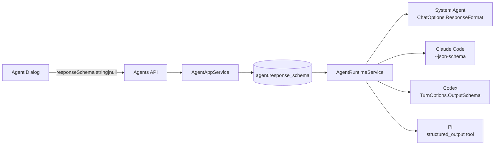
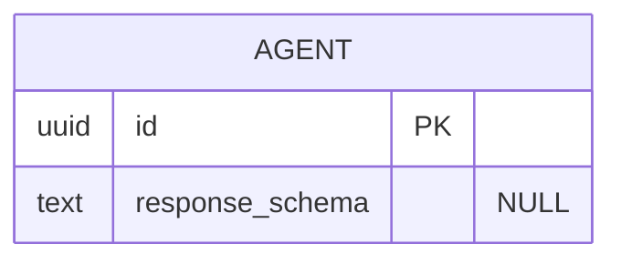

# Agent JSON Schema 响应配置与运行时支持

## 名词解释

- JSON Schema：描述 Agent 最终响应结构的 JSON 文档。
- Response Schema：UI、API 和数据库中的字段名称 `responseSchema`。
- System Agent：由 MAF 和 `IChatClient` 直接运行的 Agent。
- External Agent：Claude Code、Codex、Pi Agent。
- 严格支持：配置 Schema 后必须使用结构化输出，不允许降级为普通文本。

## 背景

当前 Agent 没有统一的响应结构配置。用户需要在 Agent 创建/编辑 Dialog 中粘贴 JSON Schema，并让 System Agent 与 External Agent 按 Schema 返回结果。

现有 Agent 查询接口用途不同：

- `/api/agents/paged` 用于 Agent 管理页，编辑和复制操作直接使用列表项数据；
- `/api/agents` 主要用于 Chat、Job、Project、Agentflow 的 Agent 选择器；
- `/api/agents/{id}` 用于完整 Agent 详情。

因此本方案只要求管理列表和详情接口返回 `responseSchema`，普通 Agent 选择接口不新增该字段。

附件和引用对话仅作为背景资料，不纳入 OIDC 需求。

## 设计目标

### 功能目标

- 创建/编辑 Dialog 增加 `Response Schema` Tab。
- System Agent 和 External Agent 均支持配置。
- 支持创建、编辑、查询、复制和清空 Schema。
- 空白值表示关闭结构化响应。
- 保存时要求：
  - 是合法 JSON；
  - JSON 根节点必须是 object。
- 运行时支持 System、Claude Code、Codex、Pi Agent。
- 未配置 Schema 的 Agent 保持现有行为。
- `/api/agents/paged` 和 `/api/agents/{id}` 返回 `responseSchema`。
- `/api/agents` 保持原有响应字段，但不新增 `responseSchema`。

### 技术目标

- Schema 只作为数据解析和传输，不执行其中内容。
- 沿用现有 Agent 所有权、认证和授权校验。
- Provider 或 CLI 不支持 Schema 时直接失败，不静默降级。
- 不记录完整 Schema、完整命令行参数或 Schema 响应内容。
- Agent runtime 创建时解析一次 Schema，不在每轮重复解析。
- 不新增部署配置、缓存、限流或独立 SLA。

## 总体设计

### 方案对比

| 方案 | 结论 |
|---|---|
| 只通过 Prompt 要求返回 JSON | 不采用，无法严格保证格式 |
| 所有 Agent 统一使用 MAF `AgentRunOptions.ResponseFormat` | 不采用，当前 External Agent 适配层不会完整转发 |
| System 使用 MAF ResponseFormat，External 使用各自原生结构化输出 | 采用 |

### 架构图



接口范围：

| 接口 | 是否返回 `responseSchema` | 原因 |
|---|---:|---|
| `GET /api/agents/paged` | 是 | 管理页编辑和复制直接使用列表数据 |
| `GET /api/agents/{id}` | 是 | 完整 Agent 详情 |
| `GET /api/agents` | 否 | 仅用于选择器和 Agentflow 选项 |
| `POST /api/agents` | 是 | 创建结果需要返回完整 Agent |
| `PUT /api/agents/{id}` | 是 | 更新结果需要返回完整 Agent |

## 数据库设计

### ER 图



### 表结构

| 表 | 字段 | 类型 | 可空 | 说明 |
|---|---|---|---|---|
| `agent` | `response_schema` | `TEXT` | 是 | 用户配置的 JSON Schema 原文 |

### 索引

不新增索引。该字段不参与查询、排序和唯一性判断。

### 字段说明

- 保存 trimmed 后的 JSON 字符串。
- `NULL` 表示未启用。
- 不添加外键。
- 不自动补充 `type: "object"`。
- 不执行远程 `$ref` 解析。

### Migration SQL

实际使用 EF Core 生成 SQLite 和 PostgreSQL 两套 migration：

```sql
-- SQLite
ALTER TABLE "agent"
ADD COLUMN "response_schema" TEXT NULL;
```

```sql
-- PostgreSQL
ALTER TABLE "agent"
ADD COLUMN "response_schema" TEXT NULL;
```

只生成 migration，不自动执行数据库升级。

## 详细设计

### Response Schema 配置

#### UI

在创建和编辑 Dialog 中新增：

```text
Instructions
Response Schema
Tools
Skills
MCP Tool Server
Integrations
Environment Variables
Extra Settings
```

Tab 对 System Agent 和 External Agent 都可用，包含：

- 等宽字体文本框；
- JSON Schema 示例；
- 空值说明；
- 行内校验错误。

前端校验规则：

```text
空白输入 -> null
合法 JSON object -> trimmed string
非法 JSON / array / scalar -> 校验错误
```

保存按钮在 Schema 非法时禁用。

编辑时回填 `responseSchema`；复制 Agent 时保留 Schema；切换 External Agent 类型时不清除 Schema。

#### API 和领域模型

新增字段：

```text
Agent.ResponseSchema : string?
AgentCreateRequest.ResponseSchema : string?
AgentUpdateRequest.ResponseSchema : string?
AgentResponse.ResponseSchema : string?
```

更新语义：

- 字段缺失：保持原值；
- 字段为 `null`：清空；
- 字段为非空字符串：替换。

Schema 校验放在 Application 层，不放入 Entity 或 Behavior。

### Agent 查询 DTO

新增完整响应 DTO 的 `responseSchema` 字段，用于：

- `GET /api/agents/paged`；
- `GET /api/agents/{id}`；
- `POST /api/agents`；
- `PUT /api/agents/{id}`。

`GET /api/agents` 改用单独的列表响应 DTO：

- 保留当前接口已有字段，避免删除既有响应字段造成兼容性问题；
- 不新增 `responseSchema`；
- 继续满足 Chat、Job、Project、Agentflow 对 `id`、`name`、`displayName`、`description`、`enable` 等字段的需求。

前端 `AgentDto.responseSchema` 定义为可选 nullable 字段，以同时兼容管理接口和选项接口。

### System Agent 运行时

创建 System Agent 时：

1. 读取 `Agent.ResponseSchema`；
2. 解析 JSON 并 clone `JsonElement`；
3. 创建 `ChatResponseFormat.ForJsonSchema(...)`；
4. 写入 `ChatOptions.ResponseFormat`；
5. 继续使用现有 Agent Pipeline。

覆盖：

- 普通运行；
- 流式运行；
- 工具调用后的继续执行；
- Agentflow 节点；
- 后台 Agent。

没有 Schema 时保持现有 ChatOptions。

### External Agent 运行时

#### Claude Code

通过 Claude CLI 的 `--json-schema` 参数传递 Schema。

要求：

- Response Schema 优先于 Extra Settings 中同名配置；
- 安全编码 JSON 命令行参数；
- 不记录完整命令和 Schema；
- 结构化结果映射为 MAF 标准响应；
- 未返回结构化结果时执行失败。

#### Codex

Codex SDK 支持 `TurnOptions.OutputSchema`，并将 Schema 传给 CLI。[Codex SDK structured output](https://github.com/zxyao145/codex-sdk-csharp)

需要修改现有 MAF bridge：

- buffered 和 streaming 路径都生成 `TurnOptions`；
- 将 Schema 映射到 `OutputSchema`；
- 保留现有会话恢复、工作目录、权限和工具逻辑；
- CLI 拒绝 Schema 时直接失败。

如果当前 NuGet 包无法扩展，则使用与当前版本匹配的本地 SDK project reference，只修改 MAF bridge，不重新实现整个 Codex Agent。

#### Pi

Pi 使用专用 structured-output extension：

- 注册 `structured_output` 工具；
- 工具参数使用用户配置的 JSON Schema；
- 模型通过该工具提交最终结果；
- 使用 `terminate: true` 结束 turn；
- 将工具参数转换为 MAF 最终响应；
- 普通文本最终响应视为失败。

该机制参考 Pi 官方 structured-output extension 模式。[Pi structured-output example](https://github.com/earendil-works/pi/blob/main/packages/coding-agent/examples/extensions/structured-output.ts)

### 算法

不涉及复杂算法。

核心流程为：

1. Trim；
2. `JsonDocument.Parse`；
3. 检查根节点是否为 object；
4. 保存或传递给 Runtime Adapter。

时间复杂度为 O(n)，n 为 Schema 文本长度。

### 配置项

不涉及。

不新增 `appsettings`、环境变量或用户级配置项。

### 安全设计

- 沿用现有 Agent 用户范围和所有权校验。
- Schema 不作为代码执行。
- 不自动请求 `$ref` 指向的远程资源。
- 日志只记录 Agent ID、Agent 类型、Provider 类型、启用状态和执行结果。
- 不记录 Schema 原文。
- Codex 临时 Schema 文件由 SDK 清理。
- Claude、Pi 的 Schema 传递过程不进入普通日志。

### 缓存

不涉及。

Schema 随 Agent Runtime 生命周期加载，配置变化后沿用现有 runtime 重建规则生效。

### 可观测性

新增或复用以下指标：

```text
agw_agent_response_schema_execution_total
agw_agent_response_schema_execution_failed
```

建议标签：

```text
agent_type
external_agent_kind
provider_type
result
```

不将完整 Schema 放入日志、Metric 标签或 Trace 属性。

### 兼容设计

- 已有 Agent 的 `responseSchema` 为 `null`，行为不变。
- 老客户端不发送该字段时，创建和更新继续兼容。
- `GET /api/agents` 保留原有响应字段，不新增 `responseSchema`。
- `GET /api/agents/paged` 新增 nullable `responseSchema`。
- 不修改现有 OIDC 未提交变更。
- 不自动执行 migration。

## 接口文档

### 基础信息

- 域名：沿用现有 Host。
- 认证：沿用现有 Agent API 认证。
- 授权：继续限制为当前用户拥有的 Agent。
- 请求头：

```http
Content-Type: application/json
Authorization: Bearer <token>
```

- 响应：沿用 Bens.Results envelope。
- `responseSchema` 的 wire 类型为 `string | null`。

### 接口列表

#### 创建 Agent

```http
POST /api/agents
```

请求新增字段：

```json
{
  "responseSchema": "{\"type\":\"object\",\"properties\":{\"answer\":{\"type\":\"string\"}},\"required\":[\"answer\"]}"
}
```

该字段可省略或为 `null`。

#### 更新 Agent

```http
PUT /api/agents/{id}
```

设置 Schema：

```json
{
  "responseSchema": "{\"type\":\"object\",\"properties\":{\"answer\":{\"type\":\"string\"}},\"required\":[\"answer\"]}"
}
```

清空 Schema：

```json
{
  "responseSchema": null
}
```

字段缺失表示不修改。

#### 查询 Agent 详情

```http
GET /api/agents/{id}
```

响应新增：

```json
{
  "responseSchema": "{\"type\":\"object\",\"properties\":{\"answer\":{\"type\":\"string\"}},\"required\":[\"answer\"]}"
}
```

#### 分页查询 Agent

```http
GET /api/agents/paged?pageIndex=1&pageSize=20
```

`data.items[]` 中新增 `responseSchema`。

该字段用于管理页编辑和复制 Agent。

#### Agent 选项查询

```http
GET /api/agents
```

保持原有响应字段，不新增 `responseSchema`。

该接口继续用于 Chat、Job、Project 和 Agentflow 的 Agent 选择器。

## 测试计划

### 配置测试

不涉及。

### 单元测试

#### 后端

- 空白 Schema 归一化为 `null`。
- 合法 JSON object 保存成功。
- 非法 JSON、数组和标量被拒绝。
- 创建请求正确映射 `responseSchema`。
- 更新请求的 `null` 能清空字段。
- System Agent 和 External Agent 均能保存和更新。
- `AgentResponse` 正确返回 Schema。
- `AgentListResponse` 不返回 Schema。
- 复制 Agent 保留 Schema。

#### 前端

- Response Schema 校验器拒绝非法 JSON。
- Response Schema 校验器拒绝数组和标量。
- 空白输入被归一化为 `null`。
- 创建和编辑 Dialog 都显示 Response Schema Tab。
- 非法 Schema 禁用保存。
- 编辑时正确回填。
- 创建成功后正确重置。
- 复制请求保留 Schema。
- `/api/agents` 缺少 Schema 时仍能被选择器正常使用。

#### Runtime

- System Agent 设置 `ChatResponseFormat`。
- 未配置 Schema 时保持现有行为。
- Claude 添加 `--json-schema`。
- Codex buffered/streaming 均设置 `OutputSchema`。
- Pi 正确加载 structured-output extension。
- External Agent 未产生结构化最终结果时失败。
- 恢复会话和后台 Agent 继续使用 Schema。

### 集成测试

- SQLite 创建、查询、更新和清空 Schema。
- SQLite migration 可生成并构建。
- PostgreSQL migration 与 model snapshot 一致。
- `POST /api/agents` 和 `PUT /api/agents/{id}` 的 API 集成测试。
- `GET /api/agents/paged` 返回 Schema。
- `GET /api/agents/{id}` 返回 Schema。
- `GET /api/agents` 不返回新增 Schema 字段。
- 默认测试不依赖真实 Claude、Codex 或 Pi CLI。

### 回归测试

- `dotnet build Agw.slnx`
- `dotnet test Agw.slnx`
- 前端 Agent package 测试
- `pnpm test:boundaries`
- `pnpm gen:api`
- 前端类型检查和构建
- SQLite/PostgreSQL 两套 migration 生成检查
- 确认现有 OIDC 未提交修改未被覆盖
