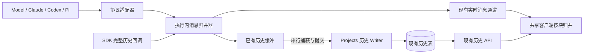
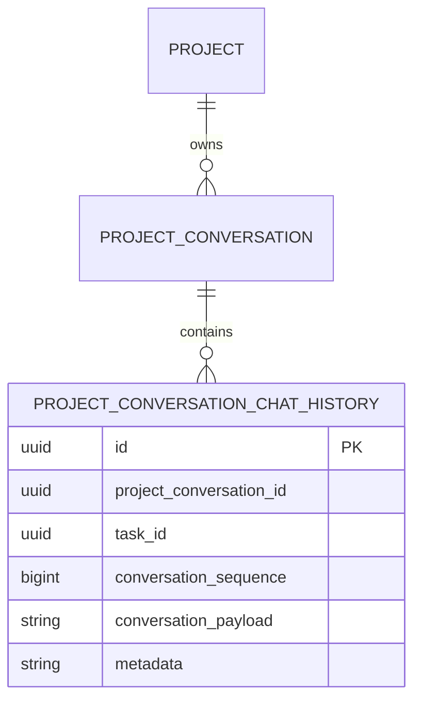
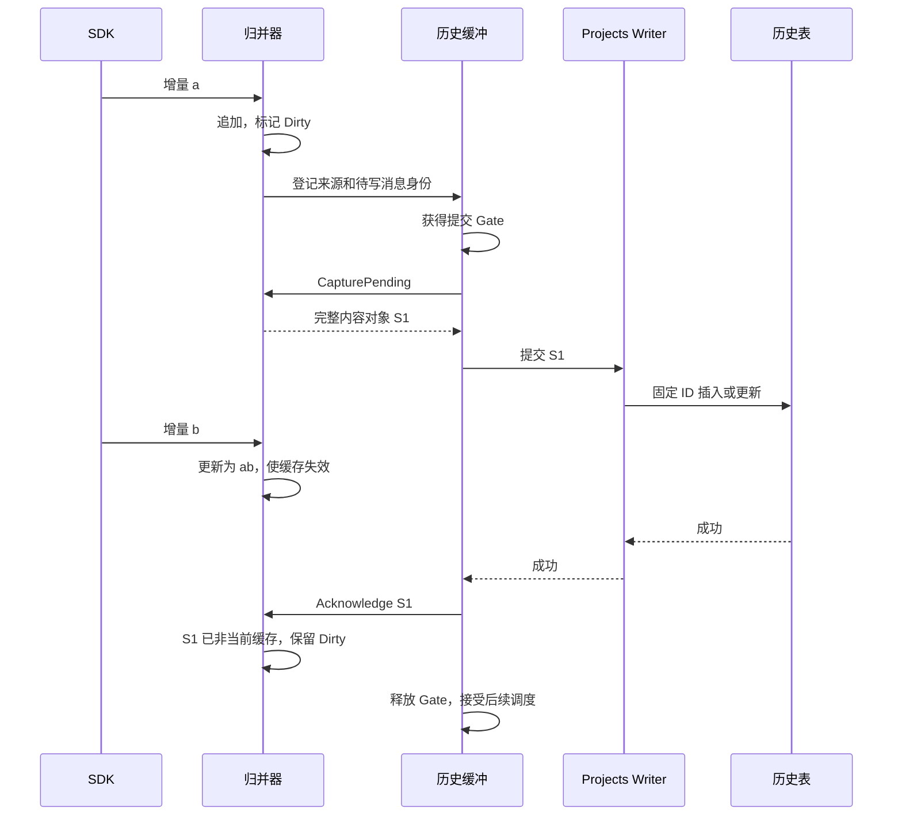
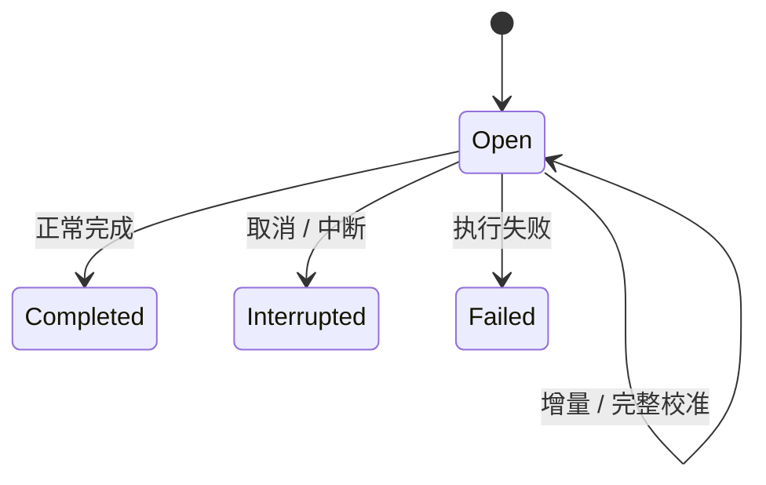

# Agent 统一消息归并与历史持久化方案

状态：代码已实现并通过回归，尚未部署。方案按增量归并和串行提交收敛，不新增数据库字段或迁移。运行时接入说明见 [History README](../../src/server/Agw.Agents.Execution/Agents/History/README.md)。性能目标是验收预算，尚未完成压测。

## 名词解释

| 名词 | 含义 |
|---|---|
| 增量 | 本次新产生的文本或 thinking 内容，不包含此前输出 |
| 逻辑消息 | 有稳定消息身份的一组内容块，是历史存储单位 |
| 内容块 | 消息内的 text、thinking、工具调用或工具结果，具有独立身份和顺序 |
| producer | 一次 Agent 调用的来源范围，用于隔离不同轮次和并行节点复用的源 ID |
| 归并器 | 执行内对象，按消息及块身份追加增量，并接收完整回调校准 |
| 提交快照 | flush 时从归并器捕获的完整内容；不意味着 Agent 流式输出本身是累计快照 |
| 脏标记 | 消息自上次成功提交后是否发生变化，仅保存在内存 |
| generation | 已有会话代际，清空或重置会话后阻止旧执行继续写入 |

## 背景

### 用户反馈与根因

会话 `01a0bfb8-6f0b-744e-acb6-a844d7cf0b13` 最初只读取样中，同一 Claude 消息被存成 87 个 assistant 片段，包含共 389 字符的 thinking 和工具调用。系统进度通知穿插在文本片段之间，既有聚合按相邻记录判断，通知被过滤时原消息已经分裂。

根因是流式消息在持久化前没有按逻辑消息充分归并。历史加载后的逐词卡片和重复模型标题，是碎片化存储的表现。客户端兼容只能帮助读取旧数据，新数据必须在写入端满足完整性要求。

### 技术债与扩展成本

- 不同 Agent 各自决定历史如何聚合，新增 Agent 容易重复同类错误。
- flush 是 I/O 调度边界，不应成为逻辑消息边界。
- SDK 实时增量与最终完整回调可能重叠，需要共享身份并避免重复拼接。
- 不能根据 `AgentResponseUpdate` 类型或 item 事件名推断正文是累计文本。
- 普通模型、Claude、Pi 和 Codex 的文本/thinking 统一按增量归并；独立 item 保留消息边界。工具或计划状态根据明确的事件语义更新。

### 设计收敛

本方案不使用 `message_revision`。同一消息由一个执行内归并器负责，捕获与提交串行化即可确定先后关系；数据库只保存当前完整内容。客户端连接恢复复用已有执行恢复和历史加载，不为此新增缺版本检测、版本协商或单消息恢复接口。

## 设计目标

### 功能目标

| 编号 | 功能 |
|---|---|
| F1 | 所有 Agent 进入统一的持久化前归并链路 |
| F2 | 文本、thinking、空白、工具块及内容顺序保真 |
| F3 | 跨 flush 更新同一消息行，保留首次排序和时间 |
| F4 | SDK 完整回调校准，取消和失败保存已生成内容 |
| F5 | 实时显示、历史加载和 Agentflow 下游保持一致 |
| F6 | 通过薄适配器扩展 Agent，不重复实现缓冲和数据库逻辑 |
| F7 | 兼容旧历史并保持用户、会话和执行隔离 |

### 技术目标

- 行数随逻辑消息数量增长，不随 token 分片数量增长。
- 文本追加采用 StringBuilder；完整内容只在读取和提交边界物化，避免每个 token 都序列化完整正文。
- 提交继续使用 Immediate、Interval、TurnEnd 和已有缓冲大小限制。
- 同一 source 的捕获、写入和确认串行执行；会话写入继续使用应用锁及事务。
- 提交失败保留待写内容，重复提交同一行同一载荷不产生重复记录。
- 未完成消息可以展示，但不进入后续模型历史和 handoff。
- 不改变认证、授权或 generation 校验，不输出消息正文到日志。
- 性能验收预算：本地单次常规增量归并 P99 小于 5 ms；数据库 flush 单独统计，不计入模型首 token 延迟。需用真实长会话测量后确认。
- 当前不提供已中断原生模型流的续传；保留已有 durable 执行事件重放及所有权控制。

## 总体设计



### 方案对比与技术选型

| 方案 | 收益 | 代价 | 选择 |
|---|---|---|---|
| 只在 UI 合并 | 改动小 | 数据仍碎片化，分页和其他客户端继续受影响 | 仅用于旧数据兼容 |
| 每个 Agent 独立实现 | 可快速修复单一来源 | 存储、并发和失败规则重复 | 不采用 |
| 统一归并、串行提交 | 数据完整，SDK 只负责协议差异，复用现有锁和缓冲 | 需要统一消息身份与块边界 | 采用 |
| 消息修订号、版本协商及快照恢复 | 可处理独立的多版本交付问题 | 新列、迁移、恢复 API 和客户端状态机 | 当前需求不引入 |

## 数据库设计

### ER 图

下图表达逻辑关系，数据库不新增外键。



### 表结构、字段和索引

复用 `project_conversation_chat_history`，不增加表、列或索引。

| 字段 | 本方案用途 |
|---|---|
| id | 归并器首次建立逻辑消息时分配，后续 flush 继续使用 |
| project_conversation_id | 归属经过当前用户授权的会话 |
| task_id | 保留现有批次关联；同一消息的后续写入不得换 producer |
| conversation_sequence | 首次插入时分配，更新时不变 |
| conversation_payload | 合并后的完整 ChatMessage JSON |
| metadata | 复用现有来源、用途、turn、scope 等元数据 |
| create_time / update_time | 首次落库时间与后续更新时间 |

消息完成状态存于 `conversation_payload.additionalProperties.messageState`；不增加独立状态列。旧行缺少这些元数据时沿用现有读取路径。

### Migration SQL

无。不新增、生成或应用数据库迁移。此前未发布的消息快照迁移已从实现中撤除，不对现有数据库执行 DDL，也不批量重写旧记录。

## 详细设计

### F1：统一归并入口

每次调用创建独立适配器和 `AgentMessageProjection`。归并身份包含 producer、源消息 ID、role、author 和用途；来源 ID 可以在不同调用中复用。

适配器只输出以下内容语义，不负责数据库和刷新周期：

| 操作 | 使用场景 |
|---|---|
| AppendText | 新增文本或 thinking，逐字追加，包括重复文本和纯空白 |
| PutBlock | 完整工具调用、工具结果、受保护内容等块更新 |
| PutMessage | 明确的完整历史回调或状态替换，不根据事件名猜测 |
| SealMessage | 完成、失败或中断，保留已有正文 |

纯进度通知及 usage 不制造逻辑消息边界。Result 与正文保持独立用途，通过关联 ID 指向正文。

### F2：内容与边界保真

用字典按消息及块 ID 定位，用 StringBuilder 追加文本，保留内容块首次出现的顺序。相邻同类型片段并不总属于同一块，因此优先使用协议中的稳定块身份。

- 空格、换行、代码围栏和重复词均作为内容处理，不按字符串去重。
- 工具 callId/resultId 保留关联；不同 role 不合成同一逻辑消息。
- 完整回调按完整内容替换，避免再次追加已经实时显示的文本。
- 未知的协议语义必须先核实，不能构造 `a → ab → abc` 的测试来证明来源使用累计快照。

常规消息/块定位平均 O(1)，追加成本为本次增量长度。捕获快照的时间与内存成本为当前完整消息长度；不保留所有历史 token 对象。

### F3：跨 flush 单行提交



关键规则：

1. buffer 登记消息首次可见顺序。并行 producer 在同一会话中按登记顺序首次插入。
2. 持有 buffer Gate 后捕获当前内容并写入。无 buffer 时，用 source 对应的执行内 Gate 串行化捕获到确认的全过程。
3. Writer 使用既有项目生命周期锁、会话写入锁及事务；验证 owner、generation 和 producer。
4. 已有行更新正文和元数据，保留 id、task_id、conversation_sequence、create_time。
5. 提交成功后只确认原捕获对象。若期间有修改，缓存已失效，旧确认不能清除新变化。
6. 失败不确认、不删除待提交内容；下次捕获最新内容重试。

这些规则依赖单一归并器和串行提交。调用方不得绕过 Schedule 并行提交同一消息的旧快照。

### F4：完成、失败和取消



SDK 完整回调先校准内容，再结束捕获。已经完成的消息不会因同一次执行后续失败被改为未完成。完成后的重复完整回调按幂等处理；封存之后同一身份再出现新的内容时，保留已封存消息的正文，并为新内容开启下一条逻辑消息。同一次回调里重复出现的消息 ID 或工具 callId 因此各自成为独立消息，历史写入不中断执行。

Interrupted、Failed 和仍 Open 的消息保存最后可见内容，并设置 modelHistoryExcluded；不完整工具结果不进入下一次模型调用。

### F5：实时、历史与 Agentflow 一致

实时文本传输增量，客户端按消息 ID 和块 ID 追加。完整 SDK 回调或工具状态有明确操作元数据时按相应语义应用。HTTP 历史始终返回完整消息，重开会话无需重放 token。

沿用现有 `ReceiveMessage`，不新增版本协商或单消息恢复通道。重复交付控制继续使用既有 durable 事件位置机制，不以文本相等或消息修订号判断 token 是否重复。

Agentflow 的实时观察链路保留增量；在交给默认按文本拼接的 MAF 下游前，由公共归并器生成一条完整消息，防止完整校准内容被重复拼接。

### F6：Agent 接入

| Agent | 来源差异 | 处理方式 |
|---|---|---|
| 普通模型 | MAF 增量、最终响应 | 共用消息身份，增量追加，完成回调校准 |
| Claude | partial、进度通知、完整 AssistantMessage | 通知过滤，原生 StreamEvent 块索引，完整回调校准 |
| Codex | 新 item 内容、生命周期、工具/计划状态 | 文本/thinking 共用追加；不同 item 保留消息边界；状态按其原生语义更新 |
| Pi | Delta、ContentIndex、完整 turn_end | 共享实时/历史 ID 和块 ID，完成回调关联；当前适配使用显式完整结束内容 |
| 新 Agent | 需核实协议 | 映射上述语义，复用缓冲、Writer、客户端归并和测试 |

适配器通过现有 runtime factory 构造，不引入跨执行可变 singleton。普通 CRUD 或新数据库层不属于接入要求。

### F7：安全、兼容与发布

- HTTP/SignalR 沿用现有认证，写入必须存在稳定用户 ID，并验证会话所属项目。
- generation 保留，用于阻止会话重置前的执行继续写入；这与已删除的消息修订号不同。
- 进程级缓存仅持有执行内内容；释放执行后不保留公共消息快照注册表。
- 旧碎片历史由已有 `prepareConversationHistory` 兼容读取，不自动回写，不跨用户或消息边界合并。
- 服务端和共享客户端需配套发布；旧客户端不保证理解新的操作元数据。无需数据库升级。
- 不承诺恢复已中断的模型网络连接；新调用使用新的 producer，保留既有执行恢复行为。

### 配置项

不新增配置，沿用 `ConversationHistory`。

| key | value / 默认值 | 使用说明 |
|---|---|---|
| ConversationHistory:Mode | Immediate / Interval / TurnEnd；默认 Interval | 只控制提交时间 |
| ConversationHistory:FlushIntervalSeconds | Host 模板 10；代码缺省 5 | Interval 模式刷新间隔 |
| ConversationHistory:MaxBufferedBytes | 16 MiB | 达到阈值提前提交，不划分消息边界 |

### 可观测性

| 指标 | 用途 |
|---|---|
| agw.history.normalize.duration | 归并耗时 |
| agw.history.operations | 已接受、重复或冲突的操作 |
| agw.history.flush.duration | 数据库提交耗时 |
| agw.history.write.failures | 提交失败 |
| agw.history.pending.bytes | 待提交内容估算大小 |
| agw.history.pending.oldest_age | 最早待提交内容等待时间 |

日志沿用执行上下文和错误信息，不打印正文或秘密。监控关注持续写入失败和超过多个刷新周期的等待时间；告警阈值需部署压测后确定。本次未新增外部看板或告警规则。

## 接口文档

### 基础信息

沿用部署现有域名、环境、认证和请求头。HTTP 历史接口及 Bens.Results 外层结构不变。SignalR 沿用既有连接、身份、命令和 `ReceiveMessage`。

### 消息元数据

文本增量示例：

```json
{
  "messageId": "canonical-message-id",
  "role": "assistant",
  "author": "agent",
  "contents": [
    {
      "type": "TextContent",
      "content": "hello",
      "additionalProperties": { "blockId": "block:0" }
    }
  ],
  "additionalProperties": {
    "messageOperation": "AppendText",
    "messageState": "open",
    "sourceMessageId": "source-message-id",
    "producerScopeId": "producer-id",
    "conversationGeneration": 0
  }
}
```

完整历史载荷使用 `PutMessage` 和合并后的内容。消息 ID 在实时和落库间稳定；客户端不能把完整校准当作文本增量拼接，也不能根据内容重复判断重放。

### 内部持久化接口

- `ScheduleAsync(scope, source, changedBytes, token)`：登记脏来源，由现有缓冲决定提交时间。
- `CapturePending()`：返回当前脏消息的完整捕获对象。
- `Acknowledge(captured)`：成功提交后仅确认这些原对象。
- `UpsertAsync(scope, snapshots, token)`：持久化固定消息 ID，调用方必须处于串行提交链路。

没有新增 HTTP path、消息恢复方法或协议协商方法。

## 测试计划

### 配置测试

分别运行 Immediate、Interval、TurnEnd，验证配置只影响提交时间；跨提交仍为同一消息行。验证缓冲阈值触发提交后不丢消息身份。

### 单元测试

| 用例 | 前置与步骤 | 预期 |
|---|---|---|
| 增量保真 | 同一消息按 a、a、空格、b 输入 | aa b，不去重、不覆盖前文 |
| 通知穿插 | 同一 thinking 分片之间插入 progress | 通知不划分消息 |
| 内容块隔离 | 两个同类型块交错更新 | 各块独立且顺序稳定 |
| 完整回调 | 增量完成后再次给出完整正文 | 正文只出现一次 |
| 消息边界 | 不同 item ID 输出相同正文 | 两条独立消息 |
| 提交确认 | 捕获 S1 后追加，再确认 S1 | 新内容保持 Dirty |
| 状态封存 | 完成后重复回调或追加 | 完整相同回调幂等，后续内容进入下一条消息 |
| 生命周期 | 分别取消、失败和正常结束 | 状态与模型历史排除规则正确 |

### 集成测试

| 用例 | 操作 | 预期 |
|---|---|---|
| 三种模式 | 增量、flush、增量、完成、重读 | 一条完整消息，ID/顺序/首次时间不变 |
| 并发调度 | 阻塞首个提交，同时请求后续提交 | 后续在首个写入后捕获最新内容 |
| 确认丢失 | 数据库提交成功后抛异常，再重试 | 原行幂等，无重复 |
| 权限与代际 | 外用户、旧 generation、其他 producer 写同 ID | 拒绝且原内容不变 |
| SQLite/PostgreSQL | 在隔离测试库运行真实 upsert | 固定 ID 更新，旧历史不受影响 |
| SDK 生命周期 | 通过实际 wrapper 执行假 Agent，包含完整回调 | 不双写、错误和取消正常传播 |
| Agentflow | 观察实时更新并读取下游响应 | 下游只收到完整归并结果 |

### 回归测试

- 原逐词 thinking 历史加载兼容、工具关联、usage、Result 和耗时分组。
- Web/Desktop/Mobile 共享的 execution-core/chat-core 消息语义。
- 原 SignalR 通道在没有消息版本字段、协商和恢复请求时正常交付增量。
- 原 durable 事件恢复及会话 generation fencing。
- 双数据库模型无待生成迁移；没有新增消息版本或状态列。
- 完成构建、相关后端测试、客户端类型检查、lint 和包边界检查后发布。
