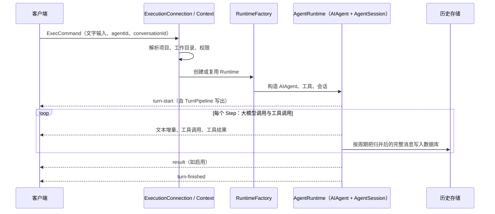
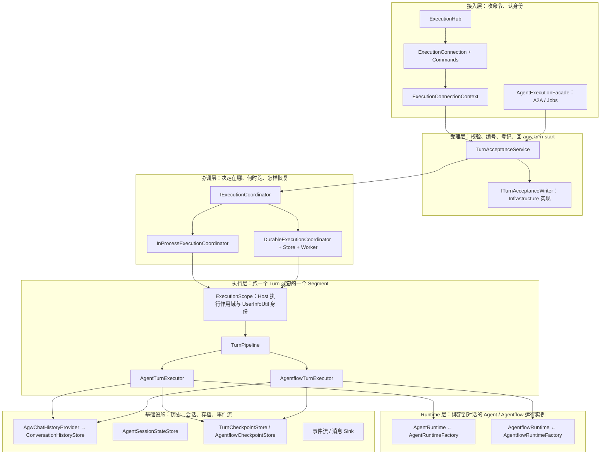
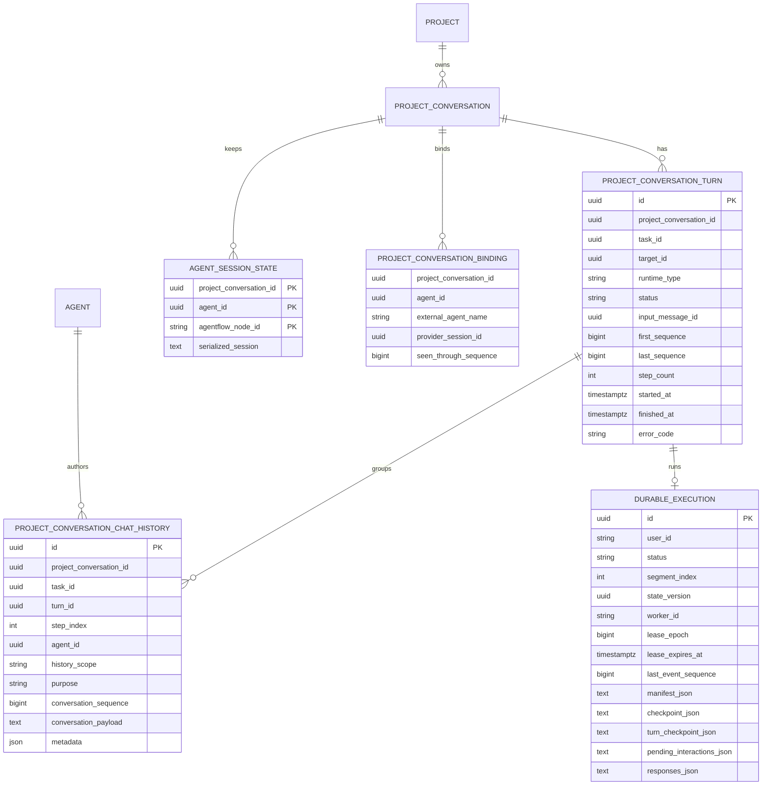
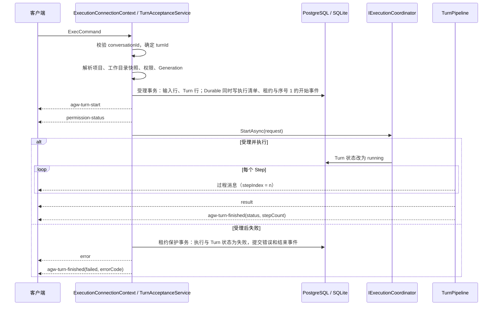
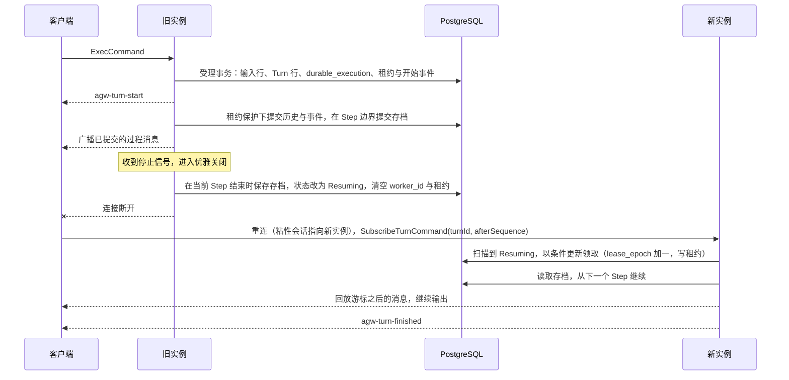
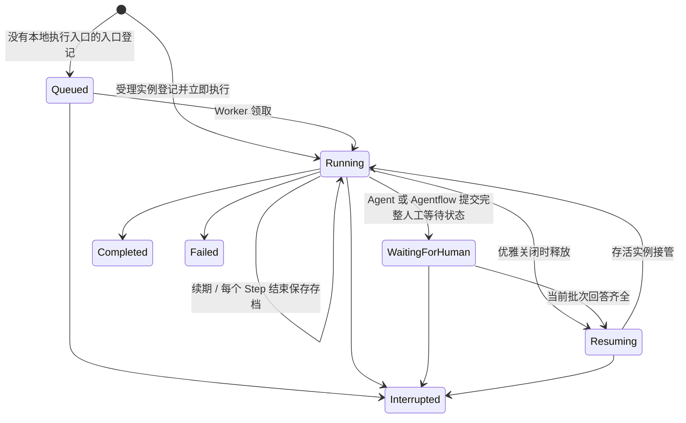
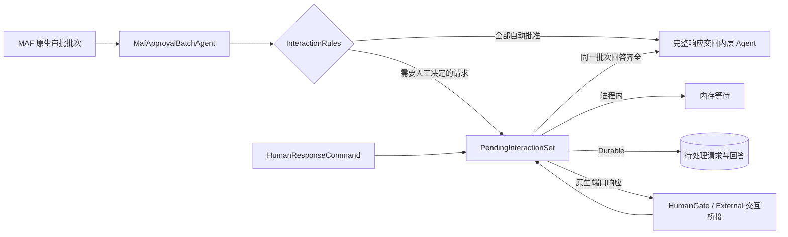
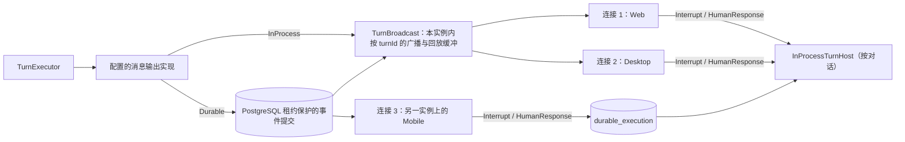

# Agent 与 Agentflow 执行重构方案

状态：设计稿，尚未实现。依据 Microsoft Agent Framework（MAF）1.21.0 的 C# 文档与源码、Codex 协议文档（`codex-rs/docs/protocol_v1.md`）与当前 `src/server/Agw.Agents.Execution` 源码编写。现状描述给出文件与行号，行号对应本文撰写时的工作区状态。

## 怎样阅读本文

本文面向没有 AI 框架背景的程序员。第一部分用通俗的语言解释涉及的概念，第二部分说明系统现在怎样运行、哪里有问题，第三部分说明改成什么样以及为什么。每个改动都写清"现在是怎样、改成怎样、为什么"。

## 先解释几个词

### 执行相关

| 词 | 意思 |
| --- | --- |
| Engine | 装在机器上、安装一次的执行程序：Claude Code、Codex、Pi 等。System Agent 的 Engine 由 MAF 框架提供（`ChatClientAgent` 加模型提供方接口）。代码中的 `ExternalAgentKind` 改名 `EngineKind` |
| Agent Definition | 选定一个 Engine 并给它配置（模型、权限、工作目录、Extra）。与 Engine 同属"静态、安装后就存在"的层次。对应 `Agent` 实体 |
| Agent | Agent Definition 与 Engine 的泛称。Agw 里有两种：System Agent 由 Agw 通过 MAF 直接调用大模型；External Agent 由外部命令行程序代劳，Agw 只负责和这个程序通信 |
| Runtime | 按一个 Agent Definition 启动出来、绑定到某个对话的运行实例。External 时是一个外部进程加它的会话，System 时是 AIAgent 加 AgentSession。同一个 Agent Definition 可以同时有多个 Runtime。对应 `AgentRuntime` |
| Agentflow | 把多个 Agent 和一些控制节点（分支、汇合、人工审核等）连成一张图，按图执行。MAF 里叫 Workflow |
| Conversation | 一个对话。对应数据库表 `project_conversation`，属于某个项目。它没有"属于哪个 Agent"这一列，同一个对话可以先让 A 回答，再让 B 回答 |

### Turn、Step 与 Task

| 词 | 意思 |
| --- | --- |
| Turn | 一次用户输入触发的全部工作，从服务端受理到处理结束。一个 Conversation 同时最多运行一个 Turn。Turn 结束于：某个 Step 不再产生需要继续的输出（正常完成）；用户中断；致命错误。等待用户回答（工具审批、`ask_user_question`、HumanGate）期间 Turn 仍然存在，回答到达后继续。这是对外协议里的概念，对应消息 `agw-turn-start` / `agw-turn-finished` |
| turnId | Turn 的编号。现有代码叫 `ExecutionId`：客户端发 `ExecCommand` 时可以自己带一个，没带时服务端生成（`Inbound/Connections/ExecutionConnectionContext.cs:204`）；Durable 模式下它是 `durable_execution` 表的主键，客户端断线后按它重新订阅；从 checkpoint 分支恢复会得到新的编号。本方案把 `ExecCommand.ExecutionId`、`SubscribeExecutionCommand.ExecutionId`、消息字段 `executionId` 统一改名为 `turnId` |
| Step | Turn 内的一次循环，对应 Codex 协议文档里的 "Turn"：向大模型发一次请求（第一个 Step 的输入是用户输入，之后的输入是上一个 Step 的输出，例如工具结果）→ 收完流式响应 → 执行工具、必要时暂停等待审批 → 得到本次输出。Agent Turn 中，一个不含工具调用的 Step 结束整个 Turn；Agentflow 节点内的 Step 见 F3。System Agent 按 Step 存档，Agentflow 按 Superstep 存档。External Agent 的展示分组按 SDK 事件映射（Codex 的 `item.completed`、Claude Code 的每条 assistant 消息、Pi 的 `turn_end`），恢复边界见 6.5 |
| stepIndex | Turn 内 Step 的序号，从 1 开始；用户输入为 0。每条消息都带它 |
| Task | 内部术语，不进入对外协议。指现有 Projects 模块的 `TaskProjection`：由连接第一次解析对话时或 Job 触发时创建，带 `JobId` 与标题，跨该连接上的多个 Turn 复用（`ExecutionConnectionContext.cs:577-590`），历史行的 `task_id` 列引用它。本方案保留它作为"把多个 Turn 归为一组"的扩展点，不改变其含义与存储 |
| Segment | Durable 模式下，一个实例一次连续运行的若干个完整 Step。一个 Turn 可能因为等待用户回答或实例更换被分成多个 Segment |

### 消息与状态

| 词 | 意思 |
| --- | --- |
| 逻辑消息 | 客户端界面上的"一条消息"。流式输出时它会被分成很多小块陆续发送，但数据库里只存一行 |
| Result 消息 | Turn 快结束时表示"这一轮的结论"的那条消息，客户端用它做结果展示。`type = result` |
| Checkpoint | 存档点。把执行到某一步的全部状态保存下来，之后可以从这一步继续执行 |
| Superstep | MAF Workflow 的一步。MAF 在每一步结束时创建 Checkpoint |
| AgentSession | MAF 用来保存"这个 Agent 在这个对话里的私有状态"的对象，例如上下文压缩状态、用户给过哪些工具授权 |
| ChatHistoryProvider | MAF 的一个扩展点：Agent 每次调用大模型之前从这里读历史消息，调用之后把新消息交给它保存。Agw 用它把历史存进数据库 |
| HITL | Human-in-the-loop，执行过程中需要用户参与的地方。分两类：用户输入类（Agent 提问 `ask_user_question`、确认切换模式 `mode_set`、Agentflow 的人工审核节点 HumanGate），任何权限模式下都必须等用户；工具审批类（某个工具能不能执行），由权限模式决定是否自动批准 |
| 权限模式 | `AgwPermissionMode`：`FullAccess`（工具审批自动批准）、`AlwaysAsk`（每次都问）、`AllowSameArguments`（同样参数问过一次就不再问）。它只作用于工具审批类；修改后作用于下一个 Turn，当前 Turn 保持开始时的快照 |
| 进程内 / Durable | 两种运行方式。进程内：Turn 在收到命令的那个服务进程里直接跑，进程重启就没了。Durable：Turn 仍在收到命令的实例上跑（负载均衡使用粘性会话，同一用户的请求到同一实例），但状态与存档写在 PostgreSQL 里；实例滚动更新后，用户重连到新实例，新实例从存档继续这个 Turn |
| Worker | `DistributedExecutionWorker`，Data Plane 与 Standalone 进程里的后台服务。方案中它只负责两件事：接管别的实例留下的 Turn，以及执行没有本地执行入口的排队 Turn |
| AsyncLocal | .NET 里"跟随一次异步调用链自动传递的变量"。用它可以在深层代码里读到"当前是谁在执行"，不需要把参数一层层传下去 |

## 系统现在是怎样运行的

一次普通的进程内 Turn：



Durable 模式多一层：连接把 Turn 登记到 `durable_execution` 表，Worker 轮询领取（可能是本实例，也可能是别的实例），执行结果和消息写回数据库与事件流，连接从事件流回放给客户端（`Runtimes/README.md` 第 6 节）。部署上负载均衡使用粘性会话，同一用户的连接总是到同一实例，因此 Durable 要解决的核心问题是：实例滚动更新时，正在进行的 Turn 能在新实例上正确恢复。

### MAF 提供了什么、Agw 用了什么

| MAF 概念 | Agw 当前对应 | 备注 |
| --- | --- | --- |
| `AIAgent.RunStreamingAsync` | `AgentRuntime.ExecuteStreamingCoreAsync`（`Agents/Runtime/AgentRuntime.cs:340-420`） | Turn 的主循环写在这里，循环的每一圈就是一个 Step |
| `AgentSession` 序列化 | `AgentSessionStateStore` 写入 `agent_session_state` | 只对 System Agent 保存 |
| `ChatHistoryProvider` + `PerServiceCallChatHistoryPersistingChatClient` | `EfCoreChatHistoryProvider`（Agw.Projects）加多层包装；`UsePerServiceCallChatHistoryPersistence`（`Agents/Tools/AgwAgentExtensions.Tools.cs:207`） | 历史按每次大模型调用保存；保存发生在模型响应返回后、工具执行之前（MAF `PerServiceCallChatHistoryPersistingChatClient.cs:112-119`） |
| `AIAgentHostExecutor` | `AgentflowWorkflowCompiler` 用 `BindAsExecutor` 把节点 Agent 装进 Workflow | 它持有自己的 `_session`，只创建一次，Checkpoint 序列化的是这个对象（MAF `AIAgentHostExecutor.cs:31`、`:137-138`、`:144-146`） |
| `RequestPort` | HumanGate 已由 `RequestPort.Create<List<ChatMessage>, List<ChatMessage>>` 创建（`AgentflowWorkflowCompiler.cs:380-382`） | Runner 处理 `RequestInfoEvent`，通过 `SendResponseAsync` 交回答复 |
| `ApprovalRequiredAIFunction` | `DeferredHumanInteractionProvider` 为用户输入工具添加审批包装；`MafApprovalAdapter` 转换请求与响应 | 包装器来自 `Microsoft.Extensions.AI`，`FunctionInvokingChatClient` 执行审批流程 |
| `CheckpointManager.CreateJson(ICheckpointStore<JsonElement>)` | `DurableAgentflowSegmentRunner.cs:94-95` 已调用；传入的 `DurableAgentflowCheckpointStore` 使用内存列表 | 最新 Checkpoint 在 Segment 结束时随结果写入 PostgreSQL |
| `AIAgent.CurrentRunContext`、`AgentRunOptions.AdditionalProperties` | `AdditionalProperties` 传递 `HumanInteractionToolMetadata.SourceKey`（写入 `Agentflows/Context/AgentflowNodeScopedAgent.cs:481-485`，读取 `Agents/Tools/AgwAgentExtensions.Tools.cs:314-316`）；`CurrentRunContext` 用于读取会话（`StreamingChatHistoryClient.cs:84` 等） | MAF 向工具与函数调用中间件传运行期数据的通道；`ChatClientAgent` 把 `AdditionalProperties` 合并进 `ChatOptions` |
| Durable Extension（Durable Task） | 未使用 | 需要 Durable Task Scheduler，Agw 用 PostgreSQL 自己管理 |

## 现状与问题

按用户提出的期望逐项说明。

### 1. 流式输出给客户端，数据库里存归并后的完整消息

现在：客户端收到的是一块一块的增量，服务端 `AgentMessageProjection` 把增量按消息和内容块归并，数据库一条逻辑消息一行，按 `ConversationHistory:Mode` 的周期更新这一行的完整正文。这一点已经做到。

问题：

- `stream = false` 的进程内路径没有历史缓冲。`RuntimeFactory.ExecuteAgentAsync`（`Runtimes/InProcess/RuntimeFactory.cs:350-353`）在非流式时走 `AgentTurnExecutor.ExecuteAsync`，该方法没有建立持久化作用域（`Agents/Runtime/AgentTurnExecutor.cs:169-201`），历史写入变成每条立即写，`ConversationHistory:Mode` 对它无效。
- 非流式追加写入每次生成新的行 ID：`EfCoreChatHistoryProvider.CreateRecords`（`Agw.Projects/Infrastructure/EfCoreChatHistoryProvider.cs:325-333`）用 `Guid.CreateVersion7()` 当行 ID，载荷里的 `MessageId` 与行 ID 不同；流式快照路径则要求两者相等（`EfCoreChatHistoryProvider.Snapshots.cs:110`）。Result 消息与工具块消息走追加路径，同一条消息提交两次会出现两行。
- 判定一条消息是否为 Result 的代码有六份，规则不同：`AgentMessageProjection.GetPurpose` 看顶层 `type`、`messagePurpose` 或任一内容块的 `type`；`ResultOnlyMessageSink.IsResult` 与 `ResponseSchemaResultMetadata.Apply`（`Agents/ResponseSchemaResultMetadata.cs:21-23`）看顶层或内容块；`ClaudeCodeChatHistoryProvider.HasResultContent`（`Agents/ExternalAgents/ClaudeCode/ClaudeCodeChatHistoryProvider.cs:96-99`）只看内容块；`EfCoreChatHistoryProvider.IsResult`（`:488-490`）与 `ConversationHandoffProvider.HasMessageType`（`:286-290`）只看顶层。三种 External Agent 的 SDK 都在消息顶层写 `type = result`，当前各处都能识别；只在内容块上标记的消息会在这六处得到不同判定。
- `EfCoreChatHistoryProvider.HistoryStream`（`EfCoreChatHistoryProvider.Streaming.cs:35-156`）是另一套"先存原始增量、写库时再合并"的旧路径，在 `NormalizedChatHistoryProvider.BeginAsync` 返回 `null` 时使用。两套归并逻辑并存。
- 用户输入没有单独标记，Turn 没有自己的表；按 Turn 分页加载历史需要扫描全部行。

### 2. 同一个对话可以换 Agent，历史共用

现在：连接只把 Conversation 固定住（`ExecutionConnectionContext.cs:197-203`），换 Agent 只是释放旧 Runtime（`:213-217`）。System Agent 读同一个对话下 `historyScope` 为空的全部历史，换 Agent 后自然能看到之前的内容。每个 Agent 的 `AgentSession` 按 `(Conversation, AgentId)` 分开保存。这一点基本做到。

每条用户输入消息的第一个内容块上记录了本轮的目标：`targetType` 是 `AgentRuntimeType`（`agent` / `agentflow`），`targetId` 是 Agent 或 Agentflow 的 ID（`Messaging/AgwMessageUtil.cs:84-100`）。`ConversationHandoffProvider` 读这两个字段判定哪些消息是某个目标没见过的（`Agw.Projects/Infrastructure/ConversationHandoffProvider.cs:133-163`）。

问题：

- 归属信息只存在用户输入消息的 JSON 元数据里，assistant 消息行只有显示用的 `AgentName`（`Agw.Data/Entities/Projects/ProjectConversationChatHistory.cs:25`）。按 Agent 查询或统计要解析 JSON。
- External Agent 的上下文在外部程序的会话里，按 `(Conversation, AgentId, ExternalAgentName)` 绑定（`ProjectConversationBinding`）。换成另一个 External Agent 时外部会话从零开始，之前的对话要靠各自的 `ChatHistoryProvider` 包装塞进去；Codex 传入 `ChatHistoryProvider = null`（`Agents/Runtime/AgentRuntimeService.CreateExternalAgents.cs:486`、`:616-619`），只靠 `ThreadId` 恢复自己的线程，所以从别的 Agent 切到 Codex 时它看不到之前的对话。
- "共享历史读取"与 "`ConversationHandoffProvider` 注入未见消息"两条路都在给新 Agent 补上下文，靠 `IsAlreadyVisibleToTarget`（`targetType == agent && historyScope == null && type != result`，`ConversationHandoffProvider.cs:184-193`）避免重复。

### 3. Agentflow 里各节点上下文隔离，只共享 Workflow 的上下文

现在：每个节点单独构造 `AIAgent`，历史作用域 `agentflow:{flowId:N}:node:{nodeId}`（`Agentflows/Workflows/AgentflowWorkflowCompiler.cs:61-77`），会话键 `{flowId:N}:{nodeId}`（`:131-138`）。两个节点即使用同一个 Agent Definition 也互不可见。

问题：

- 同一个节点被执行多次（循环）时共用会话与历史：`AgentflowNodeScopedAgent.PrepareSessionAsync`（`Agentflows/Context/AgentflowNodeScopedAgent.cs:611-628`）每次都按节点键把上次的会话读回来，并且忽略 MAF `AIAgentHostExecutor` 传入的会话对象，Checkpoint 序列化的会话与实际使用的会话是两个不同的对象。用户要求同一个 Agent 多次执行也互相隔离。
- 节点的工具块消息按对话作用域写入：`PersistToolBlockMessagesAsync`（`AgentflowWorkflowCompiler.cs:124-129`）调用不带 `historyScope` 的 `AppendAsync`，这些消息会进入外层对话给大模型的历史，而节点的 assistant 输出不会。
- 会话键与历史作用域是两种字符串格式，表示同一件事。
- 嵌套 `WorkflowAsAgent` 节点没有传 `agentId`（`AgentflowWorkflowCompiler.cs:360-370`），会话不保存，与 Agent 节点行为不同。
- 节点会话既保存到 `agent_session_state`，又被 MAF Checkpoint 序列化一次，同一份状态存两处。

### 4. 收到用户输入后立即返回 `turn-start`

现在：`turn-start` 由 `TurnPipeline.RunAsync` 的第一行写出（`Turns/TurnPipeline.cs:14`），而 `TurnPipeline` 在后台任务里运行。它之前要先完成任务解析、工作目录快照、权限校验、创建或复用 Runtime（External Agent 时包括启动外部进程）。客户端在 `ExecCommand` 后立即收到的只有 `permission-status`。

问题：

- `turn-start` 何时出现取决于 Runtime 构造耗时，客户端拿不到"服务端已经收到并接受本轮"的信号。
- 进程内的 `turn-start` / `turn-finished` 不带 `executionId`（`TurnPipeline.cs:14`、`:77`），Durable 带（`Runtimes/Durable/DurableExecutionSession.cs:294-304`）。客户端按 `streamingScopeId` 归并消息时（`src/clients/packages/chat-runtime/src/execution-session.ts:1023-1030`）两种模式表现不同。
- A2A / Jobs 走的 Facade 流式路径（`Inbound/Facades/InProcessAgentExecutionRunner.cs:69-83`）不经过 `TurnPipeline`，`AgentTurnExecutor.cs:96` 产生的 `turn-finished` 没有配对的 `turn-start`。
- 启动失败（任务解析异常、Runtime 创建失败）时没有 `turn-start`：`AgwException` 经 `ExecutionHub` 转为 `HubException`，作为 SignalR 调用错误返回（`Inbound/SignalR/ExecutionHub.cs:81-85`），消息流里没有对应消息，客户端无法把错误关联到某一轮。
- 大模型调用的循环（Step）在代码里没有名字，也没有序号。

### 5. Result 消息在 `turn-finished` 之前

现在：System Agent 开启 `EnableSummary` 或配置了 `ResponseSchema` 时由 `AgentRuntime.CreateResultAsync` 生成 Result（`AgentRuntime.cs:408-417`、`:503-558`）；External Agent 的 Result 来自外部程序的原生事件。两者都在 `TurnPipeline` 的 `finally` 写出 `turn-finished` 之前。顺序已经正确。

问题：Result 的标记与判定分散在第 1 项说的六处代码里，规则各不相同；External Agent 的 Result 没有 `resultFormat`。

### 6. 进程内与 Durable 两种运行方式

现在：`Execution:Provider = InProcess | Distributed`。Durable 以 `durable_execution` 单行状态机、PostgreSQL advisory lock、`StateVersion` 版本号实现 Segment 的领取与防止旧实例覆盖结果（`Runtimes/Durable/DistributedExecutionWorker.cs:157-185`、`Persistence/Durable/DurableExecutionStore.cs:454-469`）。Worker 只在 Data Plane 与 Standalone 注册（`Agw.Host/Program.cs:258-266`）。

问题：

- External Agent 在 Durable 下被拒绝（`Agents/Runners/Durable/DurableAgentSegmentRunner.cs:65-73`）。
- Agent 的 Turn 在 Segment 内部没有存档点。Segment 期间持久化的只有启动清单、Segment 结束时保存的 `AgentSession`、按大模型调用写入的历史。实例在 Turn 中途终止后，恢复方式是从启动清单的输入重新执行整个 Segment。
- Agentflow 每步的 Checkpoint 只放在内存 store（`Agentflows/Checkpoints/Durable/DurableAgentflowCheckpointStore.cs:14-32`），只有进入人工等待时才写入 `CheckpointJson`（`DurableAgentflowSegmentRunner.cs:337-352`）。实例中途终止同样从 Segment 起点重跑。
- 登记后要等 Worker 轮询才开始执行，即使执行的就是登记的那个实例；恢复最快也要等 `RecoveryProbeSeconds`（默认 30 秒）：`Running` 记录的 `StateChangedAt` 超过阈值才被当作候选（`DurableExecutionStore.cs:363`），而这个时间在 Segment 运行期间不刷新。长任务跑过 30 秒后，每个 Worker 在每次轮询（默认 250 毫秒，另加最长 500 毫秒的取锁等待）都会去争一次锁。
- 优雅关闭时 Worker 只是保留 `Running` 行并释放锁（`DistributedExecutionWorker.cs:261-265`），没有在关闭前保存存档，新实例只能从 Segment 起点重跑。
- `RequestedMode`（计划 / 执行模式）在 Durable 启动映射里丢了（`Runtimes/ExecutionStartCommandMapper.cs:8-17`）；`SetModeAsync` 在 Durable 下因 `Runtime == null` 直接返回（`ExecutionConnectionContext.cs:264-276`）。
- Durable 拒绝 `stream = false`（`DurableExecutionCoordinator.cs:77-80`）；Facade 的 `DurableAgentExecutionRunner` 非流式返回空列表（`Inbound/Facades/AgentExecutionMapping.cs:19-20`）。
- 同一件事在两种模式下有两套实现：Agent 有 `AgentTurnExecutor` + `DurableAgentSegmentRunner`，Agentflow 有 `InProcessAgentflowRunner` + `DurableAgentflowSegmentRunner`，Facade 有 `InProcessAgentExecutionRunner` + `DurableAgentExecutionRunner`，人机交互有 `InProcessInteractionSession` + `DurableInteractionHandler`。每次改行为都要改两处，且两处已经出现差异（下文第 8 项）。

### 7. 可信的执行上下文

现在：执行相关的数据分散在 6 个类的 11 个 `AsyncLocal` 字段和多处参数里：

| 数据 | 存放位置 |
| --- | --- |
| 用户 ID | `UserInfoUtil`（Auth，三个 `AsyncLocal`：principal、上下文标志、系统范围深度）、`RuntimeTurnContext.UserId`、`ExecutionConnectionContext._userId`、Durable 清单 `UserId` |
| Agent ID、Agent / Agentflow 类型 | `ExecutionTarget` |
| System / External 类型 | 只在 `Agent` 实体与 `AgentRuntime.AgentType` |
| 项目、对话、Generation | `AgentExecutionTask`、`ConversationSessionContext` |
| 工作目录快照 | `ProjectWorkspaceContext`（Agw.Shared） |
| 权限模式 | `ExecutionSettings.PermissionMode`、`InteractionPermissionState`（internal） |
| 人机交互通道 | `HumanInteractionContextAccessor`（四个 `AsyncLocal`） |
| 历史缓冲 | `ConversationHistoryPersistenceContext`（`Agw.Agents.Contracts/Execution/IConversationHistoryPersistence.cs:28`） |
| Turn 上下文 | `RuntimeTurnContextAccessor` |

身份检查有三个入口都读 `UserInfoUtil`：`RequiredUserId` 先检查 `IsAuthenticated`（`Agw.Auth/Contracts/UserInfoUtil.cs:46-53`），`AgwDbContext.CurrentUserId` 与 `UserScopeIsActive` 读 `IsContextActive`（`Agw.Infrastructure/Data/AgwDbContext.cs:155-157`），业务代码读 `UserId`。Execution 在每个入口用合成的 `ClaimsPrincipal` 调用 `UserInfoUtil.Push`（`ExecutionConnectionContext.cs:778-779`，Durable 见 `DurableExecutionSegmentExecutor.cs:86-104`）。

问题：

- `RuntimeTurnContext.UserId` 默认值是管理员 ID（`Turns/RuntimeTurnContext.cs:43`）；`AgentRuntimeService.ResolveExecutionUserId`（`Agents/Runtime/AgentRuntimeService.CreateRuntime.cs:168-177`）两处都取不到时回退为管理员 ID，并把它写成 External 会话绑定的所有者。仓库规则要求缺失用户 ID 时失败。
- 跨模块只暴露 `AgentTurnSnapshot(ProjectId, UserId)`（`Agw.Agents.Contracts/Execution/AgentTurnContracts.cs:3-8`），工具读不到 Agent ID、Agent 类型、对话 ID、权限模式。
- `RuntimeTurnContext` 只在进程内的 `RuntimeBase` 路径建立（`Runtimes/RuntimeBase.cs:196-212`），Facade 与 Durable Segment 都没有，`JobManagementToolExecutor` 在那两条路上抛出 `InteractiveAdminRequired`（`Agw.Jobs/Application/Tools/JobManagementToolExecutor.cs:181-200`）。
- `ToolMaterializationContext`（`Agw.Tools/Runtime/ToolMaterializationContext.cs:8-43`）在构造 Agent 时把项目、Agent、对话固定下来，没有用户与权限；Runtime 跨 Turn 复用时工具拿到的是构造时的值。

### 8. HITL

现在：`FullAccess` 不会跳过 `ask_user_question` 与 `mode_set`。`InteractionRules.AutomaticallyApprove` 只对工具审批类请求生效（`HumanInteraction/Application/InteractionRules.cs:8-16`）；`TryAutoApproveAsync` 对用户输入类调用先返回 false（`Agents/Tools/AgwAgentExtensions.Tools.cs:317-321`）；Claude Code 桥接把 `AskUserQuestion` 与工具审批分开处理（`Agents/ExternalAgents/ClaudeCode/ClaudeCodeAskUserQuestionBridge.cs:212-214`、`:311-314`）；HumanGate 用 `WorkflowGateInteraction` 表示，不受 `FullAccess` 影响（`Agentflows/Messaging/AgentflowMessageMapper.cs:82-107`）。进程内等待用户回答时断线会中断等待（`ExecutionConnectionContext.PrepareForDetach`，`:536-541`），Durable 下等待保留在数据库。权限模式修改只更新连接设置与 Durable 清单的 `NextPermissionMode`（`ExecutionConnectionContext.SetPermissionModeAsync`，`:292-304`），当前 Turn 保持快照。这些都符合期望。

问题：

- Durable 的 Agent Segment 在第一个待处理请求处就结束（`AgentRuntime.cs:388-389`）；进程内可以同时挂起多个请求。
- External Agent 桥接构造的 `InteractionSource` 没有 `NodeId`（`ClaudeCodeAskUserQuestionBridge.cs:241`、`Agents/ExternalAgents/Pi/PiExtensionUiBridge.cs:176`），`ResolvedHumanInteractionChannel` 拒绝这种请求（`:32-36`）。
- Durable 的 Agentflow Runner 不记录 HumanGate 节点遥测（只有 `InProcessAgentflowRunner.cs:330-338` 调用 `StartHumanGate`）。
- `MaxToolApprovalRounds = 32`（`AgentRuntime.cs:19`）按 Segment 计数，Durable 下跨 Segment 没有上限。
- `InProcessInteractionSession.SetPermissionMode`（`:127-141`）会自动放行排队中的审批。它由 `RuntimeFactory` 交给 `ActiveTurn` 的回调调用（`Runtimes/InProcess/RuntimeFactory.cs:232`、`:281`），但这条调用链的起点 `RuntimeBase.TrySetActivePermissionModeAsync`（`RuntimeBase.cs:122-128`）没有调用方，属于没有入口的代码。

### 9. 多个客户端同时观看

现在：进程内模式下，Turn 的输出只写到发起它的那条 SignalR 连接（`RuntimeTurnContext.MessageSink` 就是该连接的 sink），`ActiveTurn` 也归该连接持有；另一个客户端打开同一对话只能在 Turn 结束后刷新历史。Durable 模式下其他连接可以按编号与游标订阅事件流（`SubscribeExecutionCommand`），但发起连接自己走的是另一条路径。中断与 HITL 回答在进程内只能由发起连接发出（`ExecutionConnectionContext.InterruptTurnAsync`、`SubmitHumanDecisionAsync` 直接操作本连接的 `Runtime`）。

## 设计目标

| 编号 | 目标 | 验收结果 |
| --- | --- | --- |
| F1 | 流式输出、归并存储 | 所有 Turn 入口共用一条写入路径；数据库行数等于逻辑消息数；`ConversationHistory:Mode` 对所有路径生效；用户输入可索引，历史可按 Turn 分页加载 |
| F2 | 同一对话换 Agent 仍共享上下文 | System 与 External Agent 切换后都能看到此前全部对话；历史行带 `agent_id` 与 `turn_id` |
| F3 | Agentflow 节点隔离 | 节点每次执行都从空上下文开始，只拿到 Workflow 上下文传给它的输入；同一节点多次执行互不可见；节点的全部消息（含工具块）带节点作用域；Checkpoint 保存的会话就是实际使用的会话，节点的模型历史随 Checkpoint 保存 |
| F4 | Turn 协议 | Durable 登记完成、进程内 Turn 行写入之后立即返回 `agw-turn-start`；任何结束路径恰好一个 `agw-turn-finished`；每条消息带 `turnId`、`stepIndex`、`turnSequence`；两种模式字段相同 |
| F5 | Result 消息 | 形态统一，只有一处判定代码；System Agent 由 `EnableSummary` / `ResponseSchema` 生成，External Agent 由适配器归一 |
| F6 | 进程内与 Durable | Agent 与 Agentflow、System 与 External 都支持两种方式；两种方式共用执行代码，只有协调层不同；Durable 下 Turn 在受理实例立即开始；实例滚动更新后从已提交的 Step / Superstep 存档或 Engine continuation 恢复，外部交互能力按 6.5 校验 |
| F7 | 执行上下文 | 每次 Agent 调用使用一份可信、不可变的执行数据；MAF 调用链通过 `CurrentRunContext` 与 `AgentRunOptions` 读取，Host 执行作用域覆盖其他阶段；身份沿用 `UserInfoUtil`，跨模块通过统一接口读取，缺失时报错 |
| F8 | HITL | 用户输入类与工具审批类共用请求身份、待处理集合与回答通道；HumanGate 使用 MAF `RequestPort`，MAF 工具调用使用原生审批消息；权限模式只作用于工具审批类且只影响下一个 Turn |
| F9 | 多客户端同时观看 | 同一用户在同一 Conversation 上的多个客户端可以同时实时看到同一个 Turn 的输出，中途加入的客户端能补齐已产生的消息并发现之后开始的新 Turn，并且都能中断或回答 HITL |

技术上的约束：

- 遵守仓库分层：`Agw.Agents.Contracts` 只放数据与接口，Execution 放实现，Projects 拥有历史表。
- 不引入 Durable Task Scheduler、Redis 强依赖或新的消息中间件；Durable 继续以 PostgreSQL 为状态权威。
- 消息协议只增加字段与常量，客户端同步更新常量。
- 身份缺失一律抛出 `AgwException`，不回退到管理员 ID。
- 工具的幂等由被调用方保证：同一调用重复执行不产生额外副作用。恢复逻辑依赖这一约定，不在执行层记录调用台账。
- 每一步实现都有对应的单元或集成测试，测试使用真实实现。

## 总体设计

### MAF 扩展点与 Agw 职责

以仓库使用的 MAF 1.21.0 与 `Microsoft.Extensions.AI` 10.10.0 为依据，执行流程复用框架的公开扩展点：

| 功能 | MAF 负责 | Agw 负责 |
| --- | --- | --- |
| HumanGate | `RequestPort` 发出 `RequestInfoEvent`，匹配响应并继续 Workflow，Checkpoint 保存待处理请求 | 审核配置、用户身份、结构化决定、回答存储、客户端展示与后续业务处理 |
| 工具审批与用户输入工具 | `ApprovalRequiredAIFunction` 声明审批要求，`FunctionInvokingChatClient` 产生和处理原生审批消息；`AIAgentHostExecutor` 接入 Workflow 请求机制 | 在 Agent 管线内自动批准；保存完整批次、暂存部分回答，回答齐全后继续内层 Agent；绑定结构化回答与取消结果 |
| Agentflow Checkpoint | `CheckpointManager.CreateJson` 收集和序列化 Superstep 状态，`ResumeStreamingAsync` 恢复队列、会话与待处理请求 | 实现 `ICheckpointStore<JsonElement>`，提交 PostgreSQL，校验用户与租约，协调历史、事件和 Turn 状态 |
| 运行上下文 | `AIAgent.CurrentRunContext` 提供当前 Agent、Session 和 RunOptions；`AdditionalProperties` 传递本次调用的数据 | 从可信入口创建 `AgentExecutionContext`，建立 Host 执行作用域，派生节点上下文，恢复身份与权限快照 |

MAF 工具审批适用于 `FunctionInvokingChatClient` 管理的调用。External Engine 内部的工具、UI 回调与会话文件由各 Engine 适配器处理，见 6.5。独立 Agent 的 Step 存档由 6.3 定义，Workflow 存档使用 6.4 的 Superstep 边界。

框架依据：[RequestPort 与 HITL](https://learn.microsoft.com/en-us/agent-framework/workflows/human-in-the-loop)、[ApprovalRequiredAIFunction](https://github.com/dotnet/extensions/blob/v10.10.0/src/Libraries/Microsoft.Extensions.AI.Abstractions/Functions/ApprovalRequiredAIFunction.cs)、[CheckpointManager](https://github.com/microsoft/agent-framework/blob/dotnet-1.21.0/dotnet/src/Microsoft.Agents.AI.Workflows/CheckpointManager.cs)、[AgentRunContext](https://github.com/microsoft/agent-framework/blob/dotnet-1.21.0/dotnet/src/Microsoft.Agents.AI.Abstractions/AgentRunContext.cs)。

### 分层与统一命名

现在的代码里 "Runtime"、"RuntimeService"、"Runner"、"Executor"、"Session"、"Starter" 混用，同一件事在进程内与 Durable 各有一个类。目标是六层，每层只做一件事，两种运行方式只在"协调层"有区别：



命名规则：

| 后缀 | 含义 | 举例 |
| --- | --- | --- |
| `Runtime` | 按一个 Agent Definition（或 Agentflow 定义）启动出来、绑定到某个对话的运行实例（AIAgent + AgentSession + 工具，External 时含外部进程；或编译好的 Workflow + 租约） | `AgentRuntime`、`AgentflowRuntime` |
| `RuntimeFactory` | 从 Agent Definition 与其 Engine 构造 `Runtime` | `AgentRuntimeFactory`、`AgentflowRuntimeFactory` |
| `Engine` / `EngineKind` | 安装一次的执行程序及其种类 | `EngineKind`（原 `ExternalAgentKind`，加上 System Agent 使用的 MAF） |
| `TurnExecutor` | 用一个 `Runtime` 跑一个 Turn（或恢复它的一个 Segment），逐个 Step 推进，产生消息流，最后给出结果 | `AgentTurnExecutor`、`AgentflowTurnExecutor` |
| `Coordinator` | 决定这个 Turn 在哪个进程、什么时候跑，以及跑到一半怎么恢复。`Scheduler` 一词保留给 Jobs 模块的定时任务 | `InProcessExecutionCoordinator`、`DurableExecutionCoordinator` |
| `Store` | 持久化 | `DurableExecutionStore`、`ConversationHistoryStore`、`TurnCheckpointStore` |
| `Set` | 待处理集合 | `PendingInteractionSet` |
| `Attachment` | 一条客户端连接对某个 Durable Turn 的订阅关系 | `DurableExecutionAttachment` |
| `Session` | 只用于 MAF 的 `AgentSession` | |

"Runner"、"RuntimeService"、"Starter" 不再作为类型名；"Step" 表示一次大模型请求的循环；"Task" 只出现在 Projects 的现有内部类型与 `task_id` 列。现有类型与目标类型的对应：

| 现有类型 | 目标类型 | 说明 |
| --- | --- | --- |
| `IExecutionStarter`、`InProcessExecutionStarter`、`DurableExecutionStarter` | `IExecutionCoordinator`、`InProcessExecutionCoordinator`、`DurableExecutionCoordinator` | 名称说明它们决定"在哪跑" |
| `RuntimeFactory`（IRuntimeFactory） | 并入 `InProcessExecutionCoordinator` | 它现在做的是进程内的复用判定与 ActiveTurn 注册，属于协调 |
| `RuntimeBase`、`ActiveTurn` | `InProcessTurnHost`、`ActiveTurn` | 进程内"一个 Runtime 同时只跑一个 Turn"的生命周期，归协调层 |
| `AgentRuntime.ExecuteStreamingCoreAsync`、`AgentTurnExecutor`、`DurableAgentSegmentRunner`、`AgentRuntimeService.Execution` | `AgentTurnExecutor` | Agent 的 Turn 主循环只有一份，循环的每一圈是一个 Step |
| `InProcessAgentflowRunner`、`DurableAgentflowSegmentRunner`、`AgentflowRuntimeService`（执行部分） | `AgentflowTurnExecutor` | Agentflow 的 Turn 主循环只有一份 |
| `TurnMessageProtocol` | `AgwMessageTypes` | 集中全部消息类型常量 |
| `AgentRuntimeService.*`（10 个 partial） | `AgentRuntimeFactory`（按 `EngineKind` 构造、Skills、Mode、Permission） | 只负责"从 Agent Definition 构造 Runtime" |
| `ExternalAgentKind` | `EngineKind` | 表示 Engine 种类 |
| `AgentflowWorkflowFactory`、`AgentflowWorkflowCompiler`、`AgentflowExecutionContextFactory`、`AgentflowRuntimeService`（构造部分） | `AgentflowRuntimeFactory` 与其内部的 Compiler | |
| `InProcessAgentExecutionRunner`、`DurableAgentExecutionRunner`、`AgentExecutionMapping` | 删除；`AgentExecutionFacade` 经 `TurnAcceptanceService` 受理后调用 `IExecutionCoordinator`，并从消息流取结果 | Facade 与 SignalR 走同一条路 |
| `DurableExecutionSession` | `DurableExecutionAttachment` | 它是连接对 Turn 的订阅，与 MAF Session 无关 |
| `DurableExecutionCoordinator`、`DurableExecutionClient` | `DurableExecutionCoordinator`（名称保留，实现 `IExecutionCoordinator`；`DurableExecutionClient` 并入） | |
| `DurableExecutionSegmentExecutor` | 并入 `DurableExecutionCoordinator`（本地执行）与 `DistributedExecutionWorker`（接管与排队） | 两处都是建立 `ExecutionScope` 后调用 `TurnExecutor` |
| `InProcessInteractionSession`、`DurableInteractionHandler`、`InteractionRequestRegistry` | `PendingInteractionSet`（`InMemoryPendingInteractionSet`、`DurablePendingInteractionSet`） | 请求登记、决定与回答存储，见 F8 |
| `ResolvedHumanInteractionChannel` | 保留为输入工具的回答读取适配器，数据来自 `PendingInteractionSet` | 按原请求身份读取结构化回答，供 `IHumanInteractionProtocol.BindResponse` 使用 |
| `MafApprovalAdapter`、`DeferredHumanInteractionProvider` | 保留各自的 MAF 适配职责，两种执行模式共用 | 前者转换原生审批消息；后者为动态和静态输入工具添加审批包装 |
| `UseToolApproval` 与 `AutoApprovalRules` 的组合 | `MafApprovalBatchAgent` | 在 Agent 管线内部调用 `InteractionRules`，对外呈现完整人工审批批次；批次状态保存在实际 Session 的 `StateBag`，原生函数执行仍由 FICC 完成 |
| `MafApprovalGrantAgent` | 保留授权同步与记录职责 | 使用当前 Turn 的权限快照；只记录已验证的工具审批授权，供 `InteractionRules` 使用 |
| `RuntimeTurnContext(+Accessor)`、`ConversationSessionContext`、`ProjectWorkspaceContext`、`ConversationHistoryPersistenceContext` | `ExecutionScope` 与 `AgentExecutionContext` | 见"一个执行上下文" |
| `HumanInteractionContextAccessor` | 保留为工具交互接口适配器，从 `ExecutionScope` 读取数据与服务 | 实现现有 `IHumanInteractionContextAccessor`，自身不再保存 `AsyncLocal` |
| `AgentflowAgentSessionScope` | `AgentflowNodeContextFactory` | 为节点每次执行派生子上下文 |
| 历史相关的九个包装类 | `AgwChatHistoryProvider` + `HistoryRecordingAgent` + 四个 `IAgentMessageAdapter` | 见"一个 ChatHistoryProvider" |
| `ExecutionStreamMessageSink` | `EventStreamMessageSink` | |
| `AgentExecutionTask`、`TaskProjection`、`ProjectTaskProjectionMapper` | 保留 | Task 是内部术语与扩展点，本方案不改动 |

两种运行方式的差别被限制在协调层与三个可替换实现里：

| 关注点 | 进程内实现 | Durable 实现 |
| --- | --- | --- |
| Turn 在哪跑 | 连接所在进程的后台任务 | 受理实例立即开始并持有租约；实例丢失后由存活实例接管 |
| 存档点 | `InMemoryTurnCheckpointStore`（只用于统一计数与恢复规则） | `PostgresTurnCheckpointStore` |
| 人工等待 | `InMemoryPendingInteractionSet`，等待在内存 | `DurablePendingInteractionSet`，等待在数据库 |
| 消息输出 | `TurnBroadcast` → `SignalRMessageSink` | `EventStreamMessageSink` 在租约保护下提交事件，再由 `TurnBroadcast` 向连接广播；跨实例读取已提交事件 |

`AgentTurnExecutor` 与 `AgentflowTurnExecutor` 通过 `ExecutionScope` 拿到上述实现，代码里没有 `if (durable)`。

### 一个执行上下文

同一次 Agent 调用共享一份可信执行数据。MAF 调用链使用框架上下文，Host 在受理、恢复、Workflow 非 Agent 节点和连接控制等阶段建立自己的执行作用域，身份沿用 `UserInfoUtil`：

- `Agw.Shared/Runtime/ExecutionContextSlot`：Agw 自己定义的执行数据 `AsyncLocal` 统一到这个槽。槽中的对象实现 `IExecutionIdentity`，只向 Shared 暴露 `UserId`、`ProjectId`、`ProjectConversationId`、`ContextId`、`Generation`、`WorkspaceSnapshot`。MAF 自己管理 `AIAgent.CurrentRunContext` 的 `AsyncLocal` 和生命周期。
- `Agw.Agents.Contracts/Execution/AgentExecutionContext`：实现 `IExecutionIdentity` 的不可变数据记录，增加 `TurnId`、Turn 目标（`TurnTargetId`、`RuntimeType`：Agent 或 Agentflow）、当前执行者（`AgentId`、`EngineKind`）、`PermissionMode`、`PermissionVersion`、`Provider`（InProcess / Distributed）、`Node`（节点执行信息，顶层 Agent 为空）。顶层 Agent 的 Turn 目标与当前执行者相同；Agentflow 节点的 Turn 目标是 Agentflow，当前执行者是节点引用的 Agent。
- `ExecutionScope`（Execution 内部）：槽中的实际对象，通过 `Context` 提供 `IExecutionIdentity` 的字段，并持有 `PendingInteractionSet`、当前回答通道、`TurnBroadcast`、历史缓冲和 `ITurnCheckpointStore`。只有 Execution 能创建它。每个 Agent 或节点的 `StepIndex` 由自己的作用域管理，随 Step 推进，用于消息和存档；身份与权限数据在本次调用期间保持不变。
- `IAgentExecutionContextAccessor`（Contracts）：提供 `Current` 与 `Required`。实现在 Execution：MAF 调用链内读取 `AIAgent.CurrentRunContext.RunOptions.AdditionalProperties["agw.execution"]`；Host 的其他执行阶段读取 `ExecutionScope.Context`。当前调用的两条路径引用同一个对象；父级 Turn 与各个节点分别拥有自己的上下文对象。MAF 调用存在但未注入执行数据时，`Required` 抛出 `ExecutionContextMissing`；未建立 Host 执行作用域时也执行相同检查。Shared 和 Auth 保持现有依赖方向。

身份：

- `UserInfoUtil` 继续是用户身份的唯一来源。它的三个 `AsyncLocal`（principal、上下文标志、系统范围深度）归 Auth 所有；`UserInfoUtil`、`AgwDbContext.CurrentUserId` / `UserScopeIsActive` / `UserScopeBypass` 与 `UserScopeFilter` 不改。系统范围（`PushSystemScope`）与各个 `IgnoreUserScope` 旁路保持现状。
- `ExecutionScope.Push` 在内部调用 `UserInfoUtil.Push`，传入由 `Context.UserId` 构造的 principal，释放时一起恢复。进入前如果 `UserInfoUtil.Current` 已有用户且用户 ID 与 `Context.UserId` 不同，抛出 `ExecutionOwnerMismatch`。
- 不在执行作用域内、但需要用户上下文的代码保留现有的 `UserInfoUtil.Push`：`ExecutionConnectionContext` 的连接控制命令（设置、权限、中断、回答、订阅）、`DistributedExecutionWorker` 保存 Segment 结果、`DurableExecutionStore.SaveStateAsync`、F9 的对话观察轮询、`JobAgentExecutor`。

其他读取方：

- `EfCoreChatHistoryProvider` 读取的 Generation、`Agw.Files` 读取的工作目录快照都来自 `IExecutionIdentity`；`ConversationSessionContext`、`ProjectWorkspaceContext`、`ConversationHistoryPersistenceContext` 删除。
- 工具运行时通过统一接口读取用户、Agent、权限；`ToolMaterializationContext` 只保留工具物化所需的配置。Agent 调用前把当前 `ExecutionScope.Context` 写入 `AgentRunOptions.AdditionalProperties["agw.execution"]`。框架回调已经提供 `RunOptions`、`Session` 时直接读取这些参数；深层工具和中间件通过 `AIAgent.CurrentRunContext` 读取。`StreamingChatHistoryClient` 继续从框架上下文获取实际会话。
- `agw.execution` 取代 `HumanInteractionToolMetadata.SourceKey`。`InteractionSource` 的节点信息从该上下文生成，当前工具的 `CallId`、`ToolName` 取自 `FunctionInvokingChatClient.CurrentContext.CallContent`；`ProviderScopeId` 与节点绑定的 MAF 请求端口一致。
- 工具层继续依赖 `Agw.Tools.Abstractions` 的交互接口。Execution 中的 `HumanInteractionContextAccessor` 将同一执行上下文投影为工具需要的 `InteractionSource`，并提供当前回答通道与请求登记服务；工具抽象保持现有的模块依赖范围。
- MAF `AIAgentHostExecutor` 调用节点 Agent 时不传 `AgentRunOptions`（`AIAgentHostExecutor.cs:226-229`）。`AgentflowNodeScopedAgent` 直接从父 `ExecutionScope` 派生当前执行者的数据，创建节点子作用域并调用 `ExecutionScope.Push`，再复制 options 并注入同一个 `childScope.Context`。子作用域覆盖 `HistoryRecordingAgent`、内层 Agent 调用及完整的流式枚举，完成或异常退出后恢复父作用域。每个节点 activation 的 Step 进度、历史缓冲与回答视图独立；`TurnBroadcast`、租约与存档服务沿用所属 Turn 的实例，待处理集合按节点和 activation 区分请求。延续及恢复时从实际 Session 的 `StateBag` 重建节点进度。每个并行节点使用独立的 options 与不可变数据，MAF 请求端口信息随节点上下文建立。
- 执行数据由服务端在权限校验后创建，Durable 恢复时从持久化清单重建。客户端参数、模型参数与外部 Engine 事件不能改写用户、Agent 归属和权限快照。`ExecutionScope` 的服务对象仅在进程内使用，持久化保存数据记录和框架支持的会话状态。

`ExecutionScope.Push` 覆盖 Turn 受理与执行、Durable Segment 接管、Facade、Workflow 非 Agent 节点和 Agentflow 节点调用。需要执行数据的连接控制与后台回调在已验证的 Turn 范围内建立作用域；仅需要用户身份的路径继续按上面的身份规则处理。进入 Agent 调用后由 MAF 建立 `CurrentRunContext`；退出调用时由 MAF 恢复其上下文，Agw 作用域独立完成自己的释放。

### 一个 ChatHistoryProvider

现在历史读写的包装类有九个，按 Agent 种类组合使用：

| 类 | 用在 | 做什么 |
| --- | --- | --- |
| `EfCoreChatHistoryProvider`（Projects） | 全部 | 读数据库、写数据库、锁、序号、Generation 校验，同时是 MAF `ChatHistoryProvider` |
| `NormalizedChatHistoryProvider` | 全部 | 持有 `AgentMessageProjection`，把增量交给缓冲 |
| `StreamingChatHistoryClient` | System Agent | 在 IChatClient 层观察每次大模型调用的增量 |
| `NormalizedHistoryAgent` | Claude、Codex、Pi | 在 AIAgent 层观察增量并归并：Claude 与 Codex 用各自的 `IAgentMessageAdapter`，Pi 用通用的 `ModelMessageAdapter` |
| `ExternalAgentChatHistoryAgent` | 没有归并器时的 Codex | 按 20 条或 1 秒批量复制响应到历史 |
| `ClaudeCodeChatHistoryProvider` | Claude | 过滤传输事件、合并片段后再交给内层保存 |
| `PiChatHistoryProvider` | Pi | 标记 System / User / Tool 为只展示 |
| `ResponseSchemaChatHistoryProvider` | 配置了 `ResponseSchema` 的 Agent | 给响应打上 Result 格式元数据 |
| `AgentRequestContextAgent` | 全部 | 暂存原始输入、注入记忆 |

改为两个类加四个适配器，对所有 Agent 相同：

- `AgwChatHistoryProvider`（Execution，唯一的 MAF `ChatHistoryProvider` 实现）。每个 Step 开始、调用大模型前（`InvokingAsync`）：请求消息里若含有上一 Step 的工具结果（批准后执行、被拒绝、执行失败三种路径生成的结果都在这里出现），先把这些结果持久化并保存 `StepCompleted` 存档（见 6.3），缺少 `MessageId` 的工具结果消息使用由 `turnId` 与 `callId` 生成的确定 ID，恢复后重跑只会更新同一行；然后读模型历史：顶层 Agent 读对话共享历史，加上"这个 Agent 还没见过的对话内容"（见 F2）；节点读会话 `StateBag` 中随 Checkpoint 保存的节点历史（见 F3）。模型响应返回后（`InvokedAsync`，此时工具尚未执行）：只持久化响应消息，请求消息里的工具结果已在 `InvokingAsync` 持久化，这里跳过；用 SDK 给的完整消息校准归并器里的内容（`PutMessage`），给 Result 打上格式元数据。Turn 的结局由 `AgentTurnExecutor` 判定（见 6.3）。
- 这一调用时机依赖 Agw 已启用的 per-service-call 模式（`RequirePerServiceCallChatHistoryPersistence` 与 `UsePerServiceCallChatHistoryPersistence`，`Agents/Tools/AgwAgentExtensions.Tools.cs:113-115`、`:207`）：MAF 在每次模型调用前调用 `InvokingAsync`（`PerServiceCallChatHistoryPersistingChatClient.cs:105-107`、`:167-169`），第 2 个 Step 起请求消息只含上一 Step 的工具结果。
- `HistoryRecordingAgent`（Execution，`DelegatingAIAgent`，包在每个 AIAgent 外面）。暂存本 Turn 的原始输入；每个 Turn 在调用内层 Agent 前注入一次记忆上下文（临时前缀，不持久化，取代 `AgentRequestContextAgent` 的这部分职责）；观察流式增量，交给该 Engine 的 `IAgentMessageAdapter` 归并到 `AgentMessageProjection`，再交给历史缓冲；把归一后的 Result 写出；给每条消息盖上 `stepIndex`。
- `IAgentMessageAdapter` 四个实现：`ModelMessageAdapter`（System）、`ClaudeMessageAdapter`、`CodexMessageAdapter`、`PiMessageAdapter`。各 Engine 的差异只在这里：Claude 的传输事件过滤与片段合并、Pi 的角色只展示规则、Codex 按 item 划分消息边界，以及各自的 Step 边界事件映射。
- Projects 侧保留 `ConversationHistoryStore`：读、`UpsertAsync`、序号、锁、Generation 校验。它不再继承 MAF 的 `ChatHistoryProvider`。

各 Engine 的 SDK 输入侧必须使用 `InvokingAsync` 返回的历史：Pi SDK（`src/sdks/pi-agent-sdk-csharp`）现在丢弃返回值、用原始请求消息构造 prompt（`PiAgentAIAgent.cs:258-262`），随本方案修改为把返回的历史作为前置消息进入 prompt。Codex SDK 接收了返回值（`CodexAIAgent.cs:282`），但构造输入时使用原始 `inputMessages`（`:79`、`:174`），返回的历史只交给 `SaveNewMessagesAsync`，同样修改为进入 prompt。Claude Code SDK 在实施第 6 步核对，不使用返回值时同样补上。

### 方案对比

| 问题 | 备选 | 选择与理由 |
| --- | --- | --- |
| 大模型调用循环的名字 | 沿用 Codex 的 "Turn"；另取 "Step" | Step。对外协议中 Turn 已表示一次用户输入的全部工作（需求 4 与既有客户端），Codex 意义上的 Turn 只在内部需要一个名字 |
| Segment 内存档点 | MAF Durable Extension；自管理 PostgreSQL 存档 | 自管理。Durable Extension 要求 Durable Task Scheduler 与 `DurableAIAgent` 编程模型，不能承载 External Agent 与现有 SignalR 协议；Agw 已有 PostgreSQL 状态机与 `ICheckpointStore<JsonElement>` 实现 |
| Agent Turn 的存档时机 | 每个 token；每个 Step 结束；只在人工等待 | 每个 Step 结束。历史已经按大模型调用写入，会话与循环进度在同一边界保存，恢复时从下一个 Step 继续 |
| 工具副作用重复 | 执行层记录每次调用的开始与结果；由被调用方保证幂等 | 被调用方幂等。恢复时从上一个 Step 的存档重新请求模型，重复出现的调用由工具自身吸收 |
| 节点隔离的单位 | 按节点；按节点的每次执行 | 按每次执行。用户明确要求同一 Agent 多次执行互相隔离；节点之间的数据只经 Workflow 上下文传递 |
| 节点会话保存位置 | `agent_session_state` 表；MAF Checkpoint | MAF Checkpoint。`AIAgentHostExecutor` 已把会话放进 Checkpoint，另存一份没有价值 |
| 执行上下文传递 | 参数逐层传；使用运行上下文 | 同一份可信数据通过 `AgentRunOptions.AdditionalProperties` 进入 MAF，在调用链中使用 `CurrentRunContext`；Host 作用域覆盖受理、恢复和纯 Workflow 执行。Agw 的执行数据槽统一为一个，身份与系统范围沿用 Auth 的 `UserInfoUtil` |
| External Agent 的 Durable HITL | Engine 原生 continuation；扩展提供可重放交互协议 | Claude Code 使用 `PreToolUse` 的 `defer` 与 `--resume`；Codex 没有用户输入类接口；Pi 的 Durable 输入工具必须登记可重放调用与稳定交互身份，按 6.5 保存请求和回答并重放原调用，普通扩展回调按能力校验规则处理 |
| Durable 下谁来执行 | 登记后等任意 Worker 轮询领取；受理实例本地立即执行，Worker 只接管失联与排队 | 本地立即执行。粘性会话下请求本来就在同一实例，等待轮询只增加延迟；接管只在滚动更新或实例失联时发生 |
| 实例存活判定与持有者 | `StateChangedAt` 阈值加 advisory lock；租约（`lease_expires_at` + `lease_epoch`）续期 | 租约。持有者由 `worker_id + lease_epoch` 定义，每次领取 `lease_epoch` 加一；全部执行写入在事务内校验有效租约，序号分配与事件追加共同提交。Segment 执行期间不占用数据库连接持有 advisory lock |

## 数据库设计

### ER 图

逻辑关系如下，数据库不生成外键。



### 表结构变更

新增表 `project_conversation_turn`（Projects 拥有），一行对应一个 Turn：

| 列 | 类型 | 用途 |
| --- | --- | --- |
| `id` | uuid，主键 | turnId |
| `project_conversation_id` | uuid | 所属对话 |
| `task_id` | uuid，可空 | 所属的现有 Task（内部分组，含 Job 关联） |
| `target_id` | uuid | 本轮的目标 Agent 或 Agentflow |
| `runtime_type` | text | `agent` / `agentflow` |
| `status` | text | `accepted` / `running` / `completed` / `failed` / `interrupted` |
| `input_message_id` | uuid | 用户输入消息的行 ID |
| `first_sequence` / `last_sequence` | bigint | 本轮消息在对话中的序号范围；`last_sequence` 在结束时写入 |
| `step_count` | int | Agent Turn 为已完成的 Step 数，每个 Step 结束时加一；Agentflow Turn 为已完成的 Superstep 数 |
| `started_at` / `finished_at` | timestamptz | 开始与结束时间 |
| `error_code` | text，可空 | 失败或中断原因 |

索引 `(project_conversation_id, first_sequence)`、`(project_conversation_id, status)`、`(task_id)`。写入时机见 F4。Durable 模式下 `durable_execution.id` 与本表 `id` 相同。

`project_conversation_chat_history` 新增列：

| 列 | 类型 | 用途 |
| --- | --- | --- |
| `turn_id` | uuid，可空 | 所属 Turn |
| `step_index` | int，可空 | 消息产生于 Turn 内第几个 Step；用户输入为 0，系统控制消息为空 |
| `agent_id` | uuid，可空 | 产生该消息的 Agent Definition ID。用户输入与系统控制消息为空。现有的 `targetType` / `targetId` 元数据继续写在用户输入消息上，这一列把 assistant 行的归属变成可查询的列 |
| `history_scope` | text，可空 | 从 `metadata` JSON 提升为列。对话作用域为空；节点执行作用域见 F3 |
| `purpose` | text，非空，默认 `message` | `input`（用户输入）、`message`（过程消息）或 `result`。用户输入单独标记后可以直接按它建索引与查询 |

`task_id` 列含义不变。索引新增 `(project_conversation_id, history_scope, conversation_sequence)`、`(turn_id, conversation_sequence)` 与 `(project_conversation_id, purpose, conversation_sequence)`。

`project_conversation_binding` 新增列：

| 列 | 类型 | 用途 |
| --- | --- | --- |
| `seen_through_sequence` | bigint，可空 | 这个外部会话已经看到的对话历史序号，用来给 External Agent 补它没见过的对话 |

`durable_execution` 新增列：

| 列 | 类型 | 用途 |
| --- | --- | --- |
| `worker_id` | text，可空 | 当前持有 Segment 的实例标识 |
| `lease_epoch` | bigint，非空，默认 0 | 领取编号，每次领取加一；全部执行写入以 `worker_id + lease_epoch` 与有效租约为条件，见 6.2 |
| `lease_expires_at` | timestamptz，可空 | 租约到期时间；实例按 `LeaseRenewSeconds` 续期 |
| `last_event_sequence` | bigint，非空，默认 0 | 本 Turn 已提交的最大事件序号；与对应事件在同一事务中递增和提交，接管后继续使用 |
| `turn_checkpoint_json` | text，可空，`[Encrypted]` | Agent Turn 在 Step 边界的存档 |

`DurableExecutionEventRecord` 的存储使用 bigint `turn_sequence` 与 `lease_epoch`，唯一键为 `(turn_id, turn_sequence)`；`segment_index` 保留为执行诊断信息。PostgreSQL 事件记录同时承担可靠发布来源，Redis 保存其投影。迁移为已有事件按原 segment 与 sequence 顺序回填 Turn 内序号，并初始化 `last_event_sequence`。

`agent_session_state` 结构不变，`agentflow_node_id` 只保留空字符串（顶层 Agent）。节点会话改由 MAF Checkpoint 承载，已有节点行随对话删除或清空一起清理。顶层 Agent 的会话在 Turn 进行期间只写入 `turn_checkpoint_json`，Turn 结束时写入本表（见 6.3）。

### Migration

模型变更需要 SQLite 与 PostgreSQL 两套迁移，按 [Development](../1.Development.md) 的 provider 专用命令生成，不自动生成或应用。迁移一次性回填旧数据：用户输入的锚点条件为 `role = user`、`metadata` 中没有 `historyScope`、没有 `agentflowInput` 标记、没有 handoff 标记（Agentflow 把上游输出转换成的 User 消息带 `agentflowInput` 与节点作用域，`AgentflowMessageTransforms.cs:70-75`、`:187`，不算用户输入）；从一个锚点到下一个锚点之前的行归入同一个 Turn，生成对应的 `project_conversation_turn` 行并写 `turn_id`；`history_scope`、`purpose` 从 `metadata` JSON 回填；`step_index`、`agent_id` 旧行保持空。

## 详细设计

### F7：执行上下文

现在：见"现状与问题"第 7 项。

改成：见"一个执行上下文"。补充规则：

- `RuntimeTurnContext.UserId` 的管理员默认值、`ResolveExecutionUserId` 的管理员回退删除。
- `ExecutionScope.Push` 同时建立执行数据与 `UserInfoUtil` 身份；已有用户与执行上下文的用户不同时抛出 `ExecutionOwnerMismatch`。
- `InteractionPermissionState` 读取上下文里的权限模式与版本。`SetPermissionModeCommand` 更新连接设置后，下一个 Turn 的上下文携带新值，当前 Turn 保持快照。
- Agentflow 节点执行时派生子上下文：继承用户、Turn、项目、对话、Generation、工作目录快照、权限快照与 Turn 目标；`AgentId`、`EngineKind` 改为节点引用的 Agent；`Node` 包含 `AgentflowId`、`NodeId`、`NodeName`、`ActivationIndex`（本节点第几次执行）和 `ProviderScopeId`。`AgentflowNodeScopedAgent` 建立对应的节点 `ExecutionScope`，把该作用域的 `Context` 注入 options 后调用内层 Agent。历史记录、工具身份、Step 进度与回答读取均处于这个子作用域，流式枚举结束后恢复父作用域。

为什么：执行数据只有一个读取入口，身份只有 `UserInfoUtil` 一个来源；入口缺失时报错；Facade 与 Durable 路径和进程内路径拿到的是同一种对象；`AgwDbContext` 的所属过滤在 Durable 接管的实例上同样成立。

### F4：Turn 协议

现在：见第 4 项。

改成：

- 消息类型改名为 `agw-turn-start` 与 `agw-turn-finished`，两种模式字段一致：

```json
{
  "role": "system",
  "author": "$agw-server",
  "contents": [{ "type": "TextContent", "content": "" }],
  "additionalProperties": {
    "type": "agw-turn-start",
    "turnId": "…",
    "conversationId": "…",
    "agentId": "…",
    "agentType": "agent",
    "turnSequence": 1,
    "streamingScopeId": "…"
  }
}
```

`agw-turn-finished` 额外携带 `status`（`completed | failed | interrupted`）、`stepCount`（含义同 `project_conversation_turn.step_count`）与可选 `errorCode`。

- 每条 Turn 内的消息都带 `turnId`、`stepIndex`（用户输入为 0，之后从 1 递增）、`turnSequence`（Turn 内从 1 递增，见 F9）。Step 边界不单独发消息，客户端按 `stepIndex` 分组即可。

受理顺序，先持久化再确认：



规则：

- `agw-turn-start` 在 `StartTurnAsync` 校验 `conversationId`、确定 `turnId`、解析恢复所需数据、完成上述事务之后立即写出，在 Runtime 创建（含外部进程启动）之前。恢复所需数据指用户身份、项目与工作目录快照、权限快照、Generation，它们进入 Durable 清单。现有清单校验要求用户、项目、对话、工作目录快照、任务、输入与设置齐全（`Agw.Agents/Application/Persistence/DurableExecutionManifestScopeReader.cs:15-27`），本方案把 Generation 与权限快照（`Settings.PermissionMode`）加入校验，缺少任何一项的记录不能被接管。事务失败则不发开始消息，异常沿 `HubException` 边界返回。
- 受理由 `TurnAcceptanceService` 完成，`ExecutionConnectionContext` 与 Facade 共用。三张表分属 Projects（用户输入行、`project_conversation_turn`）与 Agents（`durable_execution`），事务由 `ITurnAcceptanceWriter` 写入：接口定义在 Agw.Agents 的 Application 层，实现在 Agw.Infrastructure，使用同一个 `AgwDbContext` 事务，符合跨模块事务放在 Infrastructure 的规则。
- Durable 受理事务还写入 `turnSequence = 1` 的开始事件，并设置 `last_event_sequence = 1`；`Queued` 与本地立即执行采用相同的开始事件规则。开始事件在事务提交后广播。后续事件按照 6.2 的租约保护流程分配序号并提交。
- 入口在本实例有执行能力时，Durable 行写为 `Running` 并带租约；没有本地执行入口时（例如 Control Plane 上 Jobs 创建的 Turn）写为 `Queued`，不带租约，由 Worker 领取。
- 事务以 `turnId` 幂等：只有用户与对话都相同时，重发同一 `turnId` 才视为同一次受理，直接返回当前状态，不重复插入；`turnId` 已被其他用户或其他对话使用时，返回与"对话不存在"相同的错误，不透露记录存在。客户端重连后按 `turnId` 查询 `project_conversation_turn`，查不到即视为未受理并重发。
- `TurnPipeline.RunAsync(TurnEnvelope envelope, …)` 不再写出开始消息；`TurnEnvelope` 携带 `turnId` 等字段用于结束消息。
- 从写出开始消息到 Coordinator 受理之间的任何异常（包括 Runtime 创建失败），Durable 通过 6.2 的提交入口，在同一个租约保护事务中把 `durable_execution` 与 Turn 行写为失败，并写入 `error` 和 `agw-turn-finished(failed)` 事件；提交成功后广播。检查失败时由当前持有者决定结局。进程内直接更新 Turn 行并发送消息。
- 一个 Conversation 同时最多一个运行中的 Turn。新的 `ExecCommand` 到达而上一个 Turn 仍在运行时返回 busy 错误（现有行为）。
- Durable：Turn 行与 `durable_execution` 行在同一事务写入，受理实例随即在本地执行；`DurableExecutionAttachment` 只在重新订阅（`SubscribeTurnCommand`）时按持久状态补发一次开始或结束消息。
- Facade（A2A、Jobs）流式与非流式都经过 `TurnAcceptanceService` 与 `TurnPipeline`，同样先写 Turn 行；Jobs 触发的 Turn 通过 `task_id` 关联到 Job 的 Task。
- `AgwMessageTypes` 静态类集中定义全部 `type` 常量（包括 6.3 的 `agw-step-discarded`），`AgwMessageClassifier` 提供 `IsControl`、`IsResult`、`IsTurnFinished`。`TurnPipeline`、`ResultOnlyMessageSink`、`EventStreamMessageSink`、`ConversationHandoffProvider`、`ConversationHistoryStore` 全部改用它。客户端 `@agw/chat-core` 与 `@agw/chat-runtime` 同步改用新常量。

为什么：客户端收到开始消息时，数据库里已经有可供任何实例接管的记录，不存在"客户端认为已受理、服务端却没有记录"的空隙；之后所有消息（包括启动失败的错误）都能挂到这个 Turn 上；Step 有了名字和序号，存档、审批轮次、进度展示都有了统一的粒度。

### F1：流式输出与归并存储

现在：见第 1 项。

改成：

- `IConversationHistoryWriter.AppendAsync` 内部把消息交给当前 `ExecutionScope` 的 `AgentMessageProjection`（`PutMessage`），再走 `UpsertAsync`。行 `Id` 恒等于消息 `MessageId`，同一逻辑消息重复提交更新同一行。
- 所有 Turn 入口都在 `ExecutionScope` 内持有历史缓冲，`AgentTurnExecutor` 的流式与非流式分支共用它；Facade 与 Durable Segment 同样。
- 删除 `HistoryStream` 旧路径。
- 写入时填充新列：`agent_id` 来自上下文 `AgentId`（节点消息为节点引用的 Agent ID），`turn_id` 来自 `TurnId`，`step_index` 来自 `StepIndex`，`history_scope` 来自上下文作用域，`purpose` 来自分类器；`task_id` 沿用现有写法。
- 发给大模型的历史按 `purpose = result`、`history_scope`、`modelHistoryExcluded` 与工具消息规则过滤。

按 Turn 加载历史：

- 用户输入行 `purpose = input`，与 `project_conversation_turn` 一起构成可索引的 Turn 列表。
- 历史接口新增两个查询：`conversation-turns`（参数 `conversationId`、`beforeSequence`、`limit`，按 `first_sequence` 倒序返回 Turn 列表，每项含状态、Agent、时间、Step 数、用户输入摘要）与 `conversation-turn-messages`（参数 `conversationId`、`turnId`，返回该 Turn 全部消息，只按 `conversation_sequence` 排序；`step_index` 随行返回，供客户端在同一节点内分组，Agentflow 各节点分别计数，不能用作跨节点排序键）。客户端打开对话时先取最近若干 Turn，向上滚动时继续取更早的 Turn，再按需取每个 Turn 的消息；现有整段加载接口保留。

为什么：写入路径只剩一条，行与消息一一对应，缓冲策略对所有入口一致；用户输入与 Turn 有独立索引，长对话可以按轮分页加载。

### F5：Result 消息

现在：见第 5 项。

改成：统一形态为顶层 `type = result`、`resultFormat`（`markdown | json`）、`resultSourceMessageId`（指向正文消息）、`purpose = result`。

- System Agent：`EnableSummary` 为真时由 `AgentTurnSummaryService.CreateResultAsync` 生成摘要；`ResponseSchema` 非空时生成 `json` Result。两者在 `AgentTurnExecutor` 的最后一个 Step 结束、工具状态快照之后写出，经归并器持久化。
- External Agent：`ClaudeMessageAdapter`、`CodexMessageAdapter`、`PiMessageAdapter` 把 SDK 原生 Result 归一为上述形态，保留 SDK author，`resultFormat` 取 `markdown`。

为什么：六处规则不同的判定合并为一个判定函数，下游对同一条消息只会得到一种结论。

### F2：同一对话换 Agent

现在：见第 2 项。

改成：对话的共享上下文定义为 `history_scope` 为空的全部历史行，按 `conversation_sequence` 排序。

- System Agent：`AgwChatHistoryProvider` 读共享历史。其他 Agent 的 assistant 消息进入大模型请求时保留 `AuthorName`，角色保持 assistant。`AgentSession` 仍按 `(Conversation, AgentId)` 保存该 Agent 的私有状态。
- External Agent：每个 `ProjectConversationBinding` 记录 `seen_through_sequence`。每个 Turn 开始时把序号大于该值的共享历史（排除 Result 与工具消息）作为"之前的对话"放在本轮输入前面交给外部程序。输入成功交给外部程序后，把序号推进到本轮用户输入行的序号；Turn 以任何状态结束时，再推进到本轮的 `last_sequence`。Turn 中途产生的内容由外部会话自己保存，不需要重复补充。Claude Code、Codex、Pi 共用这一规则（`AgwChatHistoryProvider` 的读取阶段），Codex 不再依赖 `ThreadId` 恢复来获得对话内容。前提是各 SDK 的输入侧真正使用 `InvokingAsync` 的返回值，见"一个 ChatHistoryProvider"末尾。
- `ConversationHandoffProvider` 保留给 Agentflow 入口，用同样的游标规则给 Agentflow 补它没见过的共享历史。`IsAlreadyVisibleToTarget` 删除，可见性只由 `history_scope` 与游标决定。
- `AgentName` 列保留用于展示；归属查询使用 `agent_id`。

为什么：System 与 External 用同一条"读历史"的路径，换 Agent 后两类 Agent 都能看到之前的内容。

### F3：Agentflow 节点隔离与 Workflow 上下文

现在：见第 3 项。

改成：隔离单位是"节点的一次执行"（activation）。

- 历史作用域：`agentflow:{agentflowId:N}:turn:{turnId:N}:node:{nodeId}:activation:{index}`，由 `AgentflowNodeActivationKey` 生成，写入节点消息行的 `history_scope`，只用于展示、分组与把节点行排除出对话共享历史，不参与节点模型历史的读取。
- 节点的模型历史：System Agent 由 `AgwChatHistoryProvider` 写入会话 `StateBag` 中 Agw 的节点历史键；External Agent 由 6.4 的 `ExternalSessionCheckpoint` 指向已提交的不可变会话快照及精确历史位置。两者随 `AIAgentHostExecutor` 的 Checkpoint 保存。从 Checkpoint 恢复（包括 Superstep 恢复与 `CheckpointMarker` 分支，分支会得到新的 `turnId`）时，节点看到的历史与存档时刻一致；External Agent 在新的可写会话目录中恢复，分支与原执行分别写入各自的会话。
- 会话对象：`AgentflowNodeScopedAgent` 不再替换 MAF `AIAgentHostExecutor` 传入的会话对象，也不再从 `agent_session_state` 读写。新的 activation 开始时，包装层在同一个会话对象上执行按 Engine 定义的重置；同一次 activation 内的延续与故障恢复复用同一对象，不重置。这样 `AIAgentHostExecutor.OnCheckpointingAsync` 序列化的 `_session` 就是实际使用的会话。
- 按 Engine 的重置内容：System Agent 清空 `StateBag` 里的节点历史、审批批次与 Agw 的其他私有键；Pi 把 `PiAgentSession.SessionId` 置空并解除 `BoundSession`（这两个字段在 `StateBag` 之外，`PiAgentSession.cs:23-30`），让下一次调用开启新的外部会话；Claude Code 与 Codex 同样把会话对象上的外部会话 ID 置空。新产生的外部会话 ID 与 `ExternalSessionCheckpoint` 写回实际会话，恢复时由快照创建本次执行的可写副本并更新绑定。每种 Engine 的重置由其 `IAgentMessageAdapter` 同级的 `IActivationSessionReset` 实现提供。
- 判定"新 activation"与"延续"的依据：会话 `StateBag` 中保存当前 activation 序号与待处理请求 ID（审批请求 ID、外部函数调用 ID）。`AIAgentHostExecutor` 恢复节点时会把 `ToolApprovalResponseContent` 或 `FunctionResultContent` 与已缓冲的普通消息合并后一起传入（`AIAgentHostExecutor.cs:82-135`），因此判定只看传入消息中是否存在与待处理 ID 匹配的响应内容：存在即为延续，否则为新 activation。
- 执行计数：从 Workflow 共享 state（scope `agw.workflow`，键 `activations:{nodeId}`）读取并递增，随 Checkpoint 持久化。
- 工具块消息使用当前 activation 的历史作用域。
- 嵌套 `WorkflowAsAgent` 与 Concurrent、GroupChat、Handoff、Magentic 的参与者用同一个键规则：`{blockNodeId}.{participantNodeId}` 加 activation 序号。
- 节点内部的大模型调用循环同样是 Step；节点消息的 `stepIndex` 是该节点本次 activation 内的 Step 序号，与顶层 Turn 的 `stepIndex` 分别计数，元数据里带 `nodeId` 与 `activationIndex` 加以区分。Agentflow Turn 的 `stepCount` 是已完成的 Superstep 数量。

Workflow 上下文里有什么、放在哪：

| 内容 | 位置 | 读写方 |
| --- | --- | --- |
| 入口消息 | 第一个 Superstep 的消息批 | `AgentflowRuntimeFactory` 写入，起点节点读取 |
| 尚有消费者的节点输出 | 共享 state `agw.workflow`，键 `outputs:{nodeId}:{activationIndex}`，附待消费边与循环输入引用 | 节点结束时写入；边的转换与循环输入构造读取；最后一个消费者取得消息后清除 |
| 执行计数 | 共享 state `agw.workflow`，键 `activations:{nodeId}` | 节点读写 |
| 权限状态 | `MafPermissionState`，注册到每个节点会话 | Turn 开始时设置，所有节点读取 |
| HumanGate 结果 | `RequestPort` 的 `HumanGateResponse`，包含 `WorkflowGateDecision` 与服务端保存的原始输入 | 后续 Executor 按审核配置生成下游消息与分支结果，见 F8 |

循环输入：`AgentflowMessageTransforms.CreateFeedbackLoopAgentInput` 从 `outputs:{nodeId}:{index-1}` 读取本节点上一次的输出，与上游反馈一起构造本次输入。节点会话里不再留有上一次的内容。

输出保留范围由消费者决定。边把输出复制到 MAF 待发送消息、汇合节点自己的输入状态或下一次 activation 的输入后，解除对应引用；循环继续时保留下一轮需要的输出，循环退出时解除该引用。并行分支和挂起节点尚未取得的输出继续保留。引用全部解除后，在生成当前 Superstep 的 Checkpoint 前删除该输出键；引用变化、接收方状态与清理结果随同一 Checkpoint 保存。顺序循环只保留仍需读取的相邻轮次。历史展示读取消息表，已保存的 CheckpointMarker 持有自己的完整快照。

节点消息在外层对话里的展示不变：所有节点行仍属于同一 `ConversationId` 与同一 `turn_id`，带 `nodeName`、`activationIndex` 元数据；节点发给大模型的历史来自各自的会话。

为什么：每次执行的上下文只由 Workflow 传给它的输入决定，行为可预期；会话与节点历史只有一份，都在 Checkpoint 里，从任何存档恢复都与实际执行一致。

### F6：进程内与 Durable

#### 6.1 两种方式共用执行代码

`ITurnExecutor.RunAsync(ExecutionScope scope, TurnInput input, TurnCheckpoint? resumeFrom, CancellationToken ct)` 返回消息流，并在结束时通过 `scope` 报告 `TurnOutcome`（`Completed | WaitingForHuman | Failed`）。它逐个 Step 推进：每个 Step 结束时保存存档（见 6.3）并把 `StepIndex` 加一。进程内协调器直接调用它；Durable 协调器在受理实例上也直接调用它，接管时 `resumeFrom` 来自 `turn_checkpoint_json` 或 `checkpoint_json`。执行器内部没有运行方式分支。

#### 6.2 Durable 的协调：本地立即执行，失联后接管

部署上负载均衡使用粘性会话，一个客户端对同一用户、同一 Conversation 的请求保持实例亲和；不同客户端可以位于不同实例。Durable 协调器的规则是：

- 受理事务（F4）写入 `durable_execution` 行时已带 `worker_id`、`lease_epoch = 1` 与 `lease_expires_at = now + LeaseSeconds`，受理实例随即在本地执行，与进程内一样没有排队等待。执行期间每 `LeaseRenewSeconds` 以 `worker_id + lease_epoch` 与仍有效的租约为条件续期一次，时间取 PostgreSQL 当前时间。
- 持有者由 `worker_id + lease_epoch` 定义。续期、历史新增与更新、恢复时的历史清理、历史序号分配、事件追加、Turn 事件序号分配、待处理请求登记、会话与绑定更新、Step / Superstep 存档及终态提交，均使用下述事务检查。检查失败触发 `ownershipLost` 取消令牌，终止本地执行并停止提交和广播。`StateVersion` 用于用户回答与控制命令的乐观并发；这些命令验证所属用户和 Turn，不要求客户端持有执行租约。Segment 执行期间不持有 advisory lock。
- Worker 扫描三类行：`Queued`（没有本地执行入口的入口创建的，例如 Control Plane 上 Jobs 创建的 Turn）、`Resuming`（前一个实例优雅关闭时留下的）、`Running` 且 `lease_expires_at < now`（前一个实例失联）。领取是一条条件更新：写入本实例的 `worker_id`、`lease_epoch + 1` 与新的 `lease_expires_at`，更新成功者获得所有权。删除 `RecoveryProbeSeconds` 与 `LockAcquireTimeoutMilliseconds`。
- 每次执行写入由 Agw.Infrastructure 的提交入口开启短事务，锁定所属 `durable_execution` 行，校验当前 `worker_id`、`lease_epoch`、租约有效期及可写状态，再通过各模块的持久化接口执行写入，持有行锁直到事务提交。领取与释放租约也更新同一行，因此写入检查与实际提交之间无法被另一实例接管。跨模块的历史与执行记录使用同一个 `AgwDbContext` 事务；所有写入路径，包括历史定时刷新和事件批量刷新，都经过这个入口。
- 事件事务在持有该行锁时递增 `last_event_sequence`，为本批事件分配连续序号，并把计数器与事件一起提交。事件 ID 在提交前生成，重试同一批时保持不变；已存在的 ID 返回原序号，载荷不一致时报错。历史的 `conversation_sequence` 继续由 Projects 分配，分配操作处于同一次租约保护事务内。接管实例沿用数据库计数器；`turnSequence` 在 Segment 切换时持续递增。
- `EventStreamMessageSink` 接收当前执行的租约身份，通过上述入口提交 PostgreSQL 事件；提交成功后 `TurnBroadcast` 才广播相同的已编号消息。进程在提交后、广播前终止时，连接从已提交事件回放。Redis 作为这些事件的可选投影，由发布器读取 PostgreSQL 已提交记录后写入，按事件 ID 和序号去重；写入保护和序号分配始终由 PostgreSQL 完成。
- Step / Superstep 提交屏障等待历史刷新结束，并在租约保护事务中保存历史边界、会话或 Checkpoint 身份及相关状态。终态事件与终态记录共同提交；恢复时的历史清理与 `agw-step-discarded` 事件共同提交。旧实例提交失败后清除本地未提交缓冲，已提交事件仍可由任意订阅连接读取。

滚动更新时的完整过程：



优雅关闭的规则：

- 实例收到停止信号后不再受理新的 Turn（连接收到的新 `ExecCommand` 返回 `ServerDraining` 错误，客户端重连后重发）。
- 对进行中的 Segment 调用执行器的 `DrainAsync`：System Agent 在当前 Step 结束时保存存档并把状态写为 `Resuming`；Agentflow 在当前 Superstep 结束时同样处理；然后清空 `worker_id` 与租约。`WorkerDrainTimeoutSeconds` 内没有到达边界时，同样写 `Resuming`，接管方从最近存档按 6.3 的规则重跑未完成的 Step。
- External Agent 按 6.5 的能力表处理：Claude Code 的 deferred 调用与 Pi 的可重放输入调用在等待前保存会话快照；Agentflow 节点同时返回原生交互请求，让 MAF 完成包含等待状态的 Superstep 存档。普通运行等待本次调用完成；超过 `WorkerDrainTimeoutSeconds` 时释放租约并写 `Resuming`，接管方使用最近已提交的会话快照及其 continuation。快照缺少待处理交互的恢复能力时明确报告恢复失败。
- 非优雅失联（实例被直接终止）：租约到期后由存活实例接管，System Agent 与 Agentflow 从最近存档继续，External Agent 按 6.5 的规则处理。



#### 6.3 Agent Turn 的存档与 Step 边界

Step 结束的定义是"本次模型响应里的全部工具调用都已有结果"。结果的产生有三条路径：批准后执行、被用户拒绝（`FunctionInvokingChatClient` 直接生成拒绝结果，`FunctionInvokingChatClient.cs:1383`）、执行失败。三条路径的结果都会出现在下一次模型请求的消息里，因此 Step 结束的判定点只有一处：

- `AgwChatHistoryProvider.InvokingAsync` 收到含上一 Step 工具结果的请求消息时：持久化这些结果，保存 `StepCompleted` 存档，然后才发出模型请求。`DrainAsync` 在这一点响应。

Turn 的结局由 `AgentTurnExecutor` 在 `RunStreamingAsync` 返回后判定：`PendingInteractionSet` 中有本 Step 的待处理请求时保存 `AwaitingInput`；没有待处理请求时保存 `TurnCompleted`。等待审批时 MAF 会提前退出，此时 `InvokedAsync` 收到的响应为空（`PerServiceCallChatHistoryPersistingChatClient.cs:241-250`），所以 `InvokedAsync` 只负责持久化，不参与结局判定。

写入 `turn_checkpoint_json` 的数据：

```csharp
internal sealed record DurableAgentTurnCheckpoint(
    Guid TurnId,
    int StepIndex,
    TurnCheckpointKind Kind,
    int ApprovalRound,
    string SerializedSession,
    long HistoryThroughSequence,
    IReadOnlyList<InteractionIdentity> PendingInteractions
);

internal enum TurnCheckpointKind { StepCompleted, AwaitingInput, TurnCompleted }
```

- `StepCompleted`：在上述第一处保存，`StepIndex` 是刚结束的 Step。恢复：新实例反序列化会话，删除 `turn_id` 等于本 Turn 且序号大于 `HistoryThroughSequence` 的历史行（未完成 Step 的部分输出），并发出控制消息 `agw-step-discarded(turnId, stepIndex)`；客户端收到后移除这个 Step 的消息，从事件流回放时遇到它也做同样处理。然后从 `StepIndex + 1` 开始，以存档中最后一个 Step 的工具结果作为输入重新请求模型。未完成 Step 里已执行过的工具可能被模型再次调用，由工具自身的幂等保证不产生额外副作用。
- `AwaitingInput`：`AgentTurnExecutor` 在运行返回且存在待处理请求时保存，`StepIndex` 是当前未完成的 Step，`PendingInteractions` 是请求身份。完整原始请求保存在实际 Session 的 `StateBag["agw.approvalBatch"]` 中，并随 `SerializedSession` 写入本存档，数据结构见 8.1；包括原始 `ToolApprovalRequestContent`、工具名称与参数、全部请求 ID、已收集的决定、输入描述与已接收的结构化回答。恢复时校验身份列表与批次内容一致，再从原始内容创建 `ToolApprovalResponseContent`，保留 `RequestId` 与 `ToolCall.CallId`。工具审批使用批准或拒绝的决定；用户输入先把结构化 `UserInputResponse` 绑定到回答读取通道，再放行输入工具，由 `IHumanInteractionProtocol` 处理参数与取消。数据库已提交且晚于存档的回答按原身份合并，回答未到齐则继续等待，到齐后继续同一个 Step，`StepIndex` 保持不变。
- `TurnCompleted`：`AgentTurnExecutor` 在运行返回且没有待处理请求时、生成 Result 与提交终态之前保存。恢复：不再请求模型，直接生成 Result（如启用）并提交 `Completed`。没有这种存档时，实例在 Result 生成或终态提交前终止会导致最终响应被删除并重新生成。
- 存档与历史提交共用 6.2 的租约保护和提交屏障，`HistoryThroughSequence` 是此刻本 Turn 已提交的最大 `conversation_sequence`。历史清理与 `agw-step-discarded` 的事件编号也经过同一个提交入口。Segment 结束前保存的存档取当时的种类。
- `ApprovalRound` 按首次登记的人工审批批次跨 Segment 累计，`MaxToolApprovalRounds = 32` 对整个 Turn 生效；自动批准、部分回答、重复请求重发与恢复同一批次均不增加计数。
- 会话保存位置：Turn 进行期间，顶层 Agent 的会话只写在 `turn_checkpoint_json`；Turn 以 `Completed`、`Failed` 或 `Interrupted` 结束时写入 `agent_session_state`，同时清空 `turn_checkpoint_json`。恢复时有 Turn 存档就用存档，没有就读 `agent_session_state`。
- 进程内使用 `InMemoryTurnCheckpointStore`，只保留对象不写数据库，用于统一计数与恢复规则的测试。

#### 6.4 Agentflow Superstep 存档

`AgentflowTurnExecutor` 为本次运行创建 `CheckpointManager.CreateJson(checkpointStore, jsonOptions)`，首次调用 `InProcessExecution.RunStreamingAsync`，恢复时调用 `InProcessExecution.ResumeStreamingAsync`。MAF 在每个 Superstep 完成后收集 Executor 状态、待发送消息、待处理请求与共享状态，并调用 Store 保存。`AIAgentHostExecutor` 负责序列化它实际使用的 `AgentSession`，节点包装器按 F3 维护该会话。

Durable 下提供 `PostgresAgentflowCheckpointStore : ICheckpointStore<JsonElement>`，通过 Agents 所属的持久化接口访问 PostgreSQL。Store 保存 MAF 提供的完整 JSON，恢复信息包含 `SessionId`、`CheckpointId`、父级身份和载荷。自动恢复使用的最新版本保存在 `durable_execution.checkpoint_json`；命名 `CheckpointMarker` 的保留版本继续由 `AgentflowCheckpointStore` 管理。

| Store 方法 | 实现要求 |
| --- | --- |
| `CreateCheckpointAsync` | 在返回 `CheckpointInfo` 前完成 6.2 的租约保护事务；最新版本、身份与历史边界共同提交。外部会话快照必须已经完成并通过校验；提交失败按租约规则终止当前执行 |
| `RetrieveCheckpointAsync` | 按请求的会话与 Checkpoint 身份读取保留版本，校验用户所属；不存在时明确报错 |
| `RetrieveIndexAsync` | 只返回保留范围内的版本，支持 `withParent` 过滤，按提交时间从早到晚返回；最新版本位于最后一项，供 MAF `GetLatestCheckpointAsync` 使用 |

- 进入人工等待时，执行器收集当前 Superstep 的全部 `RequestInfoEvent`，等待 `SuperStepCompletedEvent` 确认对应 Checkpoint 已提交，再提交该 Checkpoint 身份、待处理请求与 `WaitingForHuman` 状态。提交成功后发布交互消息并结束 Segment。若实例在登记待处理请求前终止，接管方通过 MAF 重新发出的请求重建记录。
- 恢复时重建相同拓扑与稳定的 Executor、Agent 及 RequestPort 身份，校验定义指纹和序列化版本；使用指定 Checkpoint 调用 `ResumeStreamingAsync`。MAF 会恢复队列并重新发出待处理请求，Agw 校验业务身份后通过原请求的 `CreateResponse` 与 `SendResponseAsync` 交回答复。恢复使用 Checkpoint 中的队列状态，只有首次运行发送初始 `TurnToken`。
- 自定义消息与状态类型在 `jsonOptions` 中配置，包括 `HumanGateResponse`、`WorkflowGateDecision`、节点历史和 Agw 的会话状态。滚动更新时保留恢复这些类型所需的序列化支持。
- Checkpoint 与历史提交使用执行作用域中的提交屏障和 6.2 的租约保护事务，事件编号与发布遵循相同的所有权检查。MAF 管理 Workflow 状态，Agw 的提交入口负责所属校验与数据库并发。进程内可使用 MAF 的内存 Store，两种模式共用相同的 Workflow 事件与响应处理。
- External Agent 的实际 `AgentSession` 保存 `ExternalSessionCheckpoint`：`EngineKind`、Engine 与适配器版本、原生 `SessionId`、`HistoryPosition`、不可变 `SnapshotId`、内容摘要、历史注入位置及可选的原生 continuation 身份。`HistoryPosition` 使用该 Engine 的稳定消息或条目身份，具体字段由 SDK 的类型化数据提供。独立 Agent 的 `ExternalContinuation` 引用相同结构。

外部会话快照由各 Engine 的 `IExternalSessionCheckpointAdapter` 创建和恢复：

- 在 Agent 调用完成或 Engine 已确认暂停的边界，停止向该会话写入，等待 SDK 的历史提交完成，再取得历史位置并导出恢复所需的完整会话状态。Pi 保存活动 leaf 与扩展状态，Claude Code 保存 transcript 及 deferred 调用状态，Codex 保存 thread 的会话记录及恢复所需索引。适配器使用 Engine SDK 或官方序列化格式支持；涉及数据库文件时使用数据库备份机制，禁止复制仍在写入的数据库文件。
- 快照写到本次执行独占的文件后完成持久化和摘要校验，以不可变 `SnapshotId` 发布。MAF Session 序列化只记录已完成的快照引用；随后通过 6.2 的租约保护事务提交 Checkpoint。进程在数据库提交前终止产生的未引用快照由清理任务回收，数据库不能引用未完成快照。
- 恢复时校验所属用户、Engine / 适配器版本、摘要和历史位置，再从指定快照创建本次执行的可写会话副本。Engine 的 fork / import 操作必须定位到所存位置；使用目录恢复时包含该 Engine 重新读取会话所需的完整状态。启动后校验实际历史末端与 `HistoryPosition` 一致，成功后才允许追加输入。
- 可写会话目录按 `turnId`、节点 activation 和 `lease_epoch` 隔离；进程内的 CheckpointMarker 分支使用独立的会话实例 ID。新实例和分支均创建自己的可写副本，Engine 进程只获得该副本的状态目录。原生 ID 在导入时改变则更新实际 Session 的绑定；原生 ID 保留时，绑定同时携带私有状态目录。旧实例只能继续修改自己的副本，其快照与绑定提交仍受租约检查。
- CheckpointMarker 保存其引用的不可变快照；最新 Checkpoint 和顶层已完成会话同样保留各自引用。只有没有保留引用的快照才可回收。每种 Engine 必须通过“保存后继续执行，再从保存位置分支”的真实 CLI 用例，覆盖历史位置和原会话保持独立。

Store 的方法与索引顺序依据 MAF 1.21.0 的 [ICheckpointStore 接口](https://github.com/microsoft/agent-framework/blob/dotnet-1.21.0/dotnet/src/Microsoft.Agents.AI.Workflows/Checkpointing/ICheckpointStore.cs)。

#### 6.5 External Agent 的 Durable 支持

- 前提：`AgwDataDir` 位于所有实例可见的共享存储。`StateRoot/{userId}/{engineKind}` 下分别保存不可变快照与按 `turnId` / 节点 activation / `lease_epoch` 隔离的可写会话目录；Claude Code 的状态目录、Codex 的 `CODEX_HOME`、Pi 的运行时目录指向本次执行的可写目录。配置与凭据按现有安全规则注入。`Execution:Distributed:ExternalAgents:Enabled = true` 时，Host 启动时校验 `StateRoot` 存在且可写，校验失败则启动失败；共享存储和 Engine 快照适配器的版本兼容要求写入 `docs/4.Deployment.md`。
- 删除 `DurableAgentSegmentRunner` 对 External Agent 的拒绝分支。首个 Segment 以启动清单输入启动外部进程。桥接构造的 `InteractionSource` 统一填写 `NodeId`（顶层为 `standalone`）、`CallId`、`ToolName`。
- Step 边界用于展示分组：适配器把 SDK 事件映射为 `stepIndex`（Claude Code 一条 assistant 消息结束、Pi `turn_end`、Codex 一个 `item.completed`）。会话快照在调用完成或 Engine 已确认暂停的边界生成，具体 continuation 能力如下表。普通继续输入只用于没有待处理交互且原生会话可以接收下一次输入的边界。

各 Engine 的 Durable 能力：

| Engine | 中途恢复 | HITL 跨进程等待 | 优雅关闭 | 非优雅失联后的接管 |
| --- | --- | --- | --- | --- |
| System（MAF） | 有：Step 存档 | 有：`AwaitingInput` 存档 | 在下一个 Step 边界写 `Resuming` | 从最近存档继续 |
| Claude Code | 工具调用点：`PreToolUse` hook 返回 `defer`；完成边界保存会话快照 | 原生 deferred 调用 | 在下一次工具调用点 `defer` 退出，提交会话快照与 `Resuming`；其他情况等待完成边界，超时使用最近已提交快照 | 从不可变快照创建可写会话，存在 deferred 调用时继续原调用；其他边界按 `ExternalContinuation` 处理 |
| Codex | 已完成调用的会话快照 + `resumeThread` | 没有工具审批类（只支持 `FullAccess`）；无用户输入类接口 | 等本次 `run` 结束；超时使用最近已提交快照并写 `Resuming` | 从快照恢复线程，在可接收输入的边界继续 |
| Pi | 已完成调用的会话快照；可重放扩展的原调用恢复 | 通过本方案增加的 Pi RPC 适配协议支持已登记的可重放输入工具，等待时结束 Segment | 等待交互时使用已提交的调用快照；普通运行等待完成边界，超时使用最近已提交快照 | 恢复会话快照；存在待处理交互时重放已登记的原调用并绑定结构化回答 |

Claude Code 的机制（Claude Code 文档 `hooks` 页 "Defer a tool call for later"）：以 `-p` 非交互模式运行；`PreToolUse` hook 对需要用户回答的调用（`AskUserQuestion`、需审批的工具）返回 `permissionDecision: "defer"`，进程以 `stop_reason: "tool_deferred"` 退出，结果里的 `deferred_tool_use` 带工具 `id`、`name`、`input`，待处理调用保留在会话文件里；Agw 把请求登记到 `DurablePendingInteractionSet`，Segment 以 `WaitingForHuman` 结束。回答到齐后任意实例用 `claude -p --resume <session-id>` 恢复，同一调用再次触发 hook，hook 返回 `allow` 加含回答的 `updatedInput`，或 `deny`。约束随之写入实现：一次只对单个工具调用生效，同时出现多个调用时按普通审批流程处理（Segment 内等待）；`AskUserQuestion` 需要 `--permission-prompt-tool`；恢复时重新传权限模式；恢复时工具不可用（`stop_reason: "tool_deferred_unavailable"`，例如 MCP 服务器没有连接）写 `Failed`，错误码 `ExternalToolUnavailable`；会话文件受 Claude Code 的保留期清理，超期视为 `Interrupted`。本地 `claude-code-sdk-csharp` 随本方案增加 hook 配置与 `tool_deferred`、`deferred_tool_use` 结果字段的解析。

外部会话恢复（`ExternalContinuation`）：`turn_checkpoint_json` 保存 `ExternalSessionCheckpoint`、与该快照对应的历史提交边界和 `stepIndex`，以及 `ContinuationKind`（`NextInput`、`DeferredTool`、`PiInteraction`）。首次调用前也保存起始会话快照和原始输入；实例在首次可恢复边界之前终止时，从这个快照重试原始输入。恢复时建立独立的可写会话，再由 Claude Code 的 `--resume`、Codex 的 `resumeThread` 或 Pi 的 `ResumeSession` 绑定该副本。`NextInput` 只在没有待处理交互时使用；`DeferredTool` 使用原始工具调用身份和结构化决定；`PiInteraction` 使用下述重放协议。未提交部分的展示历史按快照边界清理，并通过租约保护事务发出对应的丢弃控制事件。Turn 保持同一个 `turnId`，被重新执行的工具由被调用方保证幂等。

Pi 的 Durable 用户输入协议：

- 本地 `pi-agent-sdk-csharp` 增加配套的 Pi RPC 适配程序与 `replay_interaction` 扩展命令，使用 Pi TypeScript SDK 驱动真实工具调用与会话写入。该能力需要随本方案实现和部署，恢复清单固定 Engine、适配程序和扩展版本。
- 支持 Durable 的扩展登记可重放的工具入口、版本及调用开始时需要恢复的扩展状态。适配程序记录原生 assistant 工具调用批次、原始 `CallId`、工具名称和参数；该批次按顺序执行，已完成调用的结果由原生会话保存。每次 `confirm / select / input / editor` 使用稳定的 `ContinuationId + CallId + InteractionIndex` 标识，并记录问题、选项和载荷摘要。
- 请求用户输入时，适配程序暂停该调用，完成会话快照并保留该工具调用开始时的扩展状态，然后返回可恢复等待结果。C# SDK 提供类型化等待数据；Execution 中的 Pi 适配器把 `PiInteraction` 写入实际 Session 的 `StateBag`，并将原调用与输入描述映射为 `ToolApprovalRequestContent` 返回；该内容归入用户输入类，回答后使用批准响应进入 Pi SDK 的重放入口。独立 Agent 保存含完整状态的 `AwaitingInput`；Agentflow 由 `AIAgentHostExecutor` 发出 `RequestInfoEvent`，会话与请求随 Superstep Checkpoint 保存。相关存档与待处理记录提交后广播交互并结束 Segment，进程内回调不参与跨进程恢复。
- 实例更换后，新实例恢复指定会话快照及原调用开始时的扩展状态，通过 `replay_interaction` 重新执行已登记的原工具调用，保留原生 `CallId` 与参数。再次到达相同交互位置时校验问题载荷，读取保存的结构化回答；其后的业务逻辑由真实工具执行。同一调用有多个交互时按 `InteractionIndex` 逐个匹配，遇到新的未答交互则再次保存等待状态。已完成工具结果保持原生身份，当前工具完成后写入其真实结果，处理原批次剩余调用，全部具有结果后才恢复模型循环。
- `PiInteraction` 保存重放入口与版本、原调用批次、扩展状态引用、稳定交互身份、请求载荷和已收集回答。原调用结果及新的会话快照提交完成后才标记回答已消费。重放入口、版本、调用参数或交互载荷不一致时立即报告恢复冲突。
- 普通 Pi 0.84.4 RPC 回调的支持范围是当前进程。Durable Runtime 构造时校验已加载扩展的交互能力，使用用户输入却没有登记重放入口的扩展返回 `ExternalDurableInteractionUnsupported`；动态产生的无重放身份请求也执行相同检查。任意扩展的进程内 Promise 不属于可持久化状态。源码依据：[Pi RPC 请求与回调](https://github.com/earendil-works/pi/blob/v0.84.4/packages/coding-agent/src/modes/rpc/rpc-mode.ts)。

恢复缺少会话快照时写 `Interrupted` 并发出 `agw-turn-finished(interrupted, errorCode = ServerRestart | WorkerLost)`；版本、摘要或交互身份校验失败时报告恢复冲突并写 `Failed`，待处理交互缺少恢复能力时使用 `ExternalDurableInteractionUnsupported`。用户可在同一对话继续下一个 Turn。

#### 6.6 命令与 Facade 在两种模式下一致

- `RequestedMode` 进入启动清单；`SetModeCommand` 在 Durable 下写清单的 `NextMode`，与进程内一样在下一个 Turn 开始时应用并写出 `mode-status`，当前 Turn 的剩余 Step 不受影响。Agent 在 Turn 内通过 `mode_set` 工具发起、经用户确认的切换属于 Agent 自己的动作，立即生效，与命令的生效边界互不影响。
- Durable 支持 `stream = false`：连接端缓冲普通消息直到终态，控制消息即时转发。
- Facade 非流式返回从消息流收集到的完整消息列表，两种模式一致。

### F8：HITL

现在：见第 8 项。

改成：



HITL 请求明确分为两类，类型名沿用现有的 `UserInputInteraction` 与 `ToolApprovalInteraction`：

| 类别 | 包含 | 权限模式的影响 | 谁来回答 |
| --- | --- | --- | --- |
| 用户输入类 `UserInputInteraction` | `ask_user_question`、`mode_set`、Claude Code 的 `AskUserQuestion`、Pi 的 `confirm / select / input / editor`、Agentflow 的 HumanGate（现有 `WorkflowGateInteraction` 归入此类） | 没有影响。`FullAccess` 下同样等待用户 | 只能是用户 |
| 工具审批类 `ToolApprovalInteraction` | 声明为 `Write` 或 `Execute` 权限的工具调用（`AgwToolMetadata.RequiresApproval`） | `FullAccess` 自动批准；`AllowSameArguments` 对已授权过的同名同参数自动批准；`AlwaysAsk` 每次都问 | 用户，或按权限模式自动批准 |

#### 8.1 MAF 工具审批与用户输入工具

System Agent 的两种执行模式都使用 `ApprovalRequiredAIFunction` 和原生审批消息。普通工具按 `AgwToolPermission` 添加审批包装；`DeferredHumanInteractionProvider` 在全部工具生成 Provider 之后执行，为声明了 `IHumanInteractionProtocol` 的静态或动态输入工具添加同一种包装。每个函数只添加一次审批包装。

`ApprovalRequiredAIFunction` 声明审批要求，`FunctionInvokingChatClient` 负责产生 `ToolApprovalRequestContent`，并在收到 `ToolApprovalResponseContent` 后继续原调用。`AgwAgentExtensions.Tools` 在 Agent 管线中组合 `MafApprovalBatchAgent` 与内层的 `MafApprovalGrantAgent`：前者维护完整批次并调用 `InteractionRules`，后者使用当前 Turn 的权限快照同步有效授权，并记录已经过请求身份校验的工具审批授权。模型调用和工具执行仍由 MAF 与 FICC 完成。

批次处理规则：

- `MafApprovalBatchAgent` 将流式响应中的审批内容收集到本次内层运行结束，其他内容继续流式输出。对每个原生请求按工具声明区分用户输入与工具审批，用户输入始终等待人工决定；工具审批在管线内调用 `InteractionRules.AutomaticallyApprove`。
- 全部请求均自动批准时，在当前外层运行中把原生批准响应交回内层 Agent 并继续输出。混合批次保存自动批准的决定，仅将需要人工决定的完整子集交给 `AgentTurnExecutor` 或 Workflow。自动批准项不登记客户端交互、不产生 Workflow 外部请求，也不增加人工审批轮数。
- 实际 Session 的 `StateBag["agw.approvalBatch"]` 保存可序列化的 `MafApprovalBatchState`：`BatchId`、Turn / 节点 / activation / Step 身份、完整原始请求及消息元数据、人工待答 ID 集合、已收集的原生决定、输入描述和结构化回答，以及等待期间随回答传入的普通消息。已处理的输入由会话历史提供。使用 MAF 支持的序列化选项保存 `ToolApprovalRequestContent` 与 `ChatMessage`；恢复校验工具名称、参数与全部原始身份。
- 回答到达时先按原始请求校验并存入该批次。回答未齐时返回空响应或空流，不调用内层 Agent，不重新发出已经登记的请求，Step 与审批轮数保持不变。调用中合并的普通消息也保存在批次状态中。回答齐全后将自动决定与人工决定组合为完整的原生响应批次，同时建立结构化回答读取通道，再调用内层 Agent。下一次 `InvokingAsync` 确认这些调用已有工具结果后消费批次，保存 Step 进度。
- 自动继续执行使用独立的 `MaxAutoApprovalIterations`，默认 40，按连续自动批准批次计数，计数保存在 `StateBag["agw.autoApprovalIterations"]` 并随会话存档。进入人工等待后结束该自动序列；达到上限时报告 `AgentExecutionFailed`。人工审批使用 `MaxToolApprovalRounds`。两项限制分别计数，恢复当前批次保留计数。

MAF 1.21.0 的 `ToolApprovalAgent` 使用逐个呈现的人工审批队列，其公开 options 提供自动规则与迭代上限。Agw 的完整批次适配由上述 `MafApprovalBatchAgent` 实现，管线只注册这一套批次状态管理。依据：[ToolApprovalAgent](https://github.com/microsoft/agent-framework/blob/dotnet-1.21.0/dotnet/src/Microsoft.Agents.AI/Harness/ToolApproval/ToolApprovalAgent.cs)。

Agentflow 节点保留 `AgentHostOptions.InterceptUserInputRequests = false`，由原生 RequestPort 将人工待答子集转换为 `RequestInfoEvent`。`AgentflowNodeScopedAgent` 根据相同批次状态识别延续，建立节点作用域后调用上述适配层。`AIAgentHostExecutor` 每接收一个回答都会调用节点 Agent；部分回答由适配层保存并返回空流，Host 仍保留其他未答请求，`HasOutstandingRequests` 阻止发送下游 `TurnToken`。最后一个回答到达后，内层 Agent 才收到完整响应批次；Host 在全部待处理请求完成且没有新请求时发送 `TurnToken`。节点的批次、部分回答和普通消息随实际 Session 进入 MAF Checkpoint，原生未答请求同时由 Host 保存。依据：[请求端口处理](https://github.com/microsoft/agent-framework/blob/dotnet-1.21.0/dotnet/src/Microsoft.Agents.AI.Workflows/Specialized/AIContentExternalHandler.cs)、[AIAgentHostExecutor](https://github.com/microsoft/agent-framework/blob/dotnet-1.21.0/dotnet/src/Microsoft.Agents.AI.Workflows/Specialized/AIAgentHostExecutor.cs)。

`MafApprovalAdapter` 负责原生消息与 Agw 交互数据的转换：保留原始审批内容和请求身份，生成 `ToolApprovalInteraction` 或 `UserInputInteraction`，并从原请求创建恢复响应。请求匹配同时校验 Turn、节点、activation、MAF 请求身份与工具调用身份。

| 交互类别 | 决定与回答 | 交回 MAF 后的处理 |
| --- | --- | --- |
| 工具审批类 | Agent 管线内由 `InteractionRules` 根据 Turn 权限快照和有效授权记录自动决定；需要人工决定的请求交给执行器等待 `ToolApprovalDecision` | 完整批次使用原请求的 `CreateResponse(approved)`；MAF 执行工具或生成拒绝结果 |
| 用户输入类 | 保存问题描述、选项、参数以及结构化 `UserInputResponse`；所有权限模式都等待用户 | 回答可用后创建批准响应以恢复输入工具；`HumanInteractionRequiredAIFunction` 通过回答通道取得原回答，调用 `IHumanInteractionProtocol.BindResponse` 后执行 |

用户输入类的批准响应仅用于恢复工具调用，用户的回答与取消状态保存在 `UserInputResponse` 中。取消时由 `CreateCancelledResult` 生成工具结果，内层业务动作保持未执行。用户输入类始终经过这项检查，可复用的工具授权仅适用于工具审批类。

`ResolvedHumanInteractionChannel` 从 `PendingInteractionSet` 读取已保存的回答，严格匹配原节点、调用、输入类型和载荷；读取失败即报告执行冲突。进程内回答到达后继续同一个 AgentSession；Durable 在回答、原始请求和会话恢复完成后再次调用 Agent。两种模式均保留原 `RequestId`、`CallId` 和当前 Step。

#### 8.2 HumanGate 的 RequestPort

HumanGate 使用 `RequestPort.Create<List<ChatMessage>, HumanGateResponse>(nodeId)`，由 MAF 负责请求发出、响应类型检查、等待状态与恢复后的请求重发。`HumanGateResponse` 是 Contracts 中的数据记录，包含现有 `WorkflowGateDecision` 和原始输入消息；原始输入由服务端从对应 `ExternalRequest` 取得，客户端提交审核决定和反馈。

`AgentflowTurnExecutor` 收到 HumanGate 的 `RequestInfoEvent` 后，按节点配置构造用户输入类交互。它与 Agent 工具审批共用同一个事件入口，通过请求端口和载荷类型区分处理。回答通过所属校验和内容校验后，服务端构造 `HumanGateResponse`，调用原请求的 `CreateResponse`，再通过 `run.SendResponseAsync` 交回 Workflow。

HumanGate 后续 Executor 根据 `WorkflowGateDecision` 和节点配置处理批准、拒绝、反馈与分支，并把原始输入和反馈转换为下游消息。待处理请求由 MAF 保存；Agw 记录客户端交互身份、回答和审计信息。并行 HumanGate 各自保留请求身份，在恢复后分别匹配回答。

进程内保持当前 `StreamingRun`，回答到达后继续。Durable 按 6.4 在包含待处理请求的 Checkpoint 提交完成后结束 Segment，新实例从该 Checkpoint 恢复，再响应 MAF 重新发出的原请求。重复回答通过 Agw 的条件更新只接受一次；HumanGate 的用户输入类别始终要求人工决定。

#### 8.3 公共规则

- `PendingInteractionSet` 是两种模式共用的待处理集合抽象：批次登记、按身份匹配回答、消费与快照。`InMemoryPendingInteractionSet` 驻留内存；`DurablePendingInteractionSet` 读写 `pending_interactions_json` / `responses_json`，请求登记与存档通过 6.2 的提交入口关联。请求区分待答、已答与已消费，原调用产生结果后才标记已消费。已答请求继续参与批次恢复校验。`BatchId` 与请求身份在重发和跨 Segment 恢复时保持不变。
- 自动决定只有一处：Agent 管线内的 `MafApprovalBatchAgent` 调用 `InteractionRules.AutomaticallyApprove`。它只对 `ToolApprovalInteraction` 返回决定，对 `UserInputInteraction` 永远返回"需要用户"。执行器和 Workflow 处理已经筛选出的人工请求。工具是否属于用户输入类由工具声明决定（`HumanInteractionRequiredAIFunction` 包装），运行时不按工具名逐个列举。
- 权限快照：自动决定使用 Turn 开始时的权限模式。`SetPermissionModeCommand` 只更新连接设置与 Durable 清单的 `NextPermissionMode`，对当前 Turn 的待处理请求与 Durable 恢复都不产生影响；`InProcessInteractionSession.SetPermissionMode` 这段没有调用方的放行代码删除。
- 等待发生在 Step 内部：一个 Step 的大模型响应里含有需要询问的调用时，该 Step 暂停，回答到达后同一个 Step 继续执行工具并产生输出。Turn 在等待期间保持存在；Durable 下以 `AwaitingInput` 存档记录这一状态（6.3）。
- 并发待处理：System Agent 的 Durable Segment 收集完同一个 Step 里需要人工决定的完整批次后再结束；Agentflow 在 Superstep 边界结束。两种模式的客户端都可能同时看到多个 `interaction-request`。同一节点批次回答齐全后才调用内层 Agent；不同节点与独立 HumanGate 按各自待处理状态继续。
- HumanGate 遥测：`AgentflowNodeExecutionActivity.StartHumanGate` 在 `AgentflowTurnExecutor` 里调用，两种模式相同。
- `MaxToolApprovalRounds` 按 Turn 的人工审批批次计数（6.3），由 `PendingInteractionSet` 在首次登记 `BatchId` 时递增，快照保存已登记批次及计数；并行节点登记使用同一集合的并发控制。自动批准及同一批次的部分回答、恢复和重发均不增加计数。
- 进程内等待用户回答时断线中断等待的行为保持。
- External Agent 桥接共用 Agw 的交互类别与回答存储。Engine 内部的工具和 UI 请求按 6.5 使用各自的原生协议；MAF 审批包装仅覆盖进入 `FunctionInvokingChatClient` 的函数调用。

### F9：一个 Turn 在多个客户端同时展示

现在：见第 9 项。

改成：Turn 的输出与控制都以 Turn 为单位，连接只是订阅者与命令发送者。范围限定为同一用户在同一 Conversation 上的连接。



- 每条消息带 `turnSequence`（Turn 内从 1 递增），`agw-turn-start` 为 1。进程内由 Turn 的串行消息输出分配；Durable 由 6.2 的数据库事务分配并持久化。它同时是进程内回放缓冲与 Durable 事件流的游标，两种模式用同一种游标格式。
- `TurnBroadcast`：执行实例内按 turnId 建立的广播对象，保存本 Turn 全部消息的回放缓冲（Turn 结束后保留 `TurnBroadcastRetentionSeconds`）。发起连接与后来加入的连接都从它订阅；订阅时带上已收到的 `turnSequence`，缺失的部分从缓冲补齐。Durable 下只接收已提交且已有序号的事件；发布重试按事件 ID 与序号去重，连接按连续序号消费并从持久化事件补齐缺失部分。
- 连接与对话的关系：`SettingCommand` 已携带 `ProjectId` 与 `ContextId`，服务端据此维护"对话 → 本实例连接集合"。一个对话上有新的 Turn 开始时，`agw-turn-start` 广播给该对话上同一用户的全部本实例连接；所有 Turn 消息同样广播。
- 中途加入：客户端打开对话时调用 `conversation-turns`，若最近一个 Turn 的 `status` 为 `accepted` 或 `running`，发送 `SubscribeTurnCommand(turnId, afterSequence)` 订阅。`SubscribeExecutionCommand` 改名为 `SubscribeTurnCommand`，两种模式都支持；进程内从 `TurnBroadcast` 回放，Durable 下先查本实例广播，没有则从事件流回放。
- 跨实例发现新 Turn：粘性会话按客户端分配实例，同一用户的两台设备可能在不同实例。Durable 下，连接对所设置的对话持有一个"对话观察"，记录已看到的最大 `first_sequence`，每 `Execution:Distributed:EventStream:ReadPollingMilliseconds` 查询一次 `project_conversation_turn` 中该对话、该用户且 `first_sequence` 大于游标的行，无论状态。进行中的 Turn 自动发起订阅并回放；在两次查询之间已经结束的 Turn 补发开始与结束消息，并触发该 Turn 的历史加载。进程内模式只有一个实例，直接由广播覆盖。
- 控制命令：`InProcessTurnHost` 按对话登记在实例内的 `TurnRegistry` 里，同一用户的任何连接发出的 `InterruptCommand`、`HumanResponseCommand` 都能找到它；Durable 下跨实例的命令经 `durable_execution` 行传递（现有机制）。所有权校验：命令携带的 turnId 必须属于当前用户，`TurnRegistry` 与 `durable_execution` 都按 `UserId` 校验。
- 发起连接断开：不影响 Turn。进程内 Turn 继续跑到结束（现有行为），其他连接照常收到输出；等待用户回答时若该对话已没有任何连接，才按现有规则中断等待。
- 历史一致性：所有连接在 `agw-turn-finished` 后按现有规则重新加载该 Turn 的历史；中途加入的连接在补齐回放后与实时消息拼接，消息身份按 `MessageId` 与 `blockId` 归并（现有客户端规则）。

为什么：输出与控制的归属从"连接"改为"Turn"之后，几个客户端看到的是同一份消息序列，进程内与 Durable 只是回放来源不同。

## 配置项

| key | 默认值 | 说明 |
| --- | --- | --- |
| `Execution:Provider` | `InProcess` | 不变 |
| `Execution:TurnBroadcastRetentionSeconds` | `300` | Turn 结束后回放缓冲在实例内保留的时长 |
| `Execution:Distributed:LeaseSeconds` | `30` | Segment 租约时长 |
| `Execution:Distributed:LeaseRenewSeconds` | `10` | 续期间隔 |
| `Execution:Distributed:WorkerDrainTimeoutSeconds` | `60` | 优雅关闭时等待到达存档边界的最长时间 |
| `Execution:Distributed:ExternalAgents:Enabled` | `false` | 允许 External Agent 进入 Durable；为真时启动校验 `StateRoot` 存在且可写 |
| `Execution:Distributed:ExternalAgents:StateRoot` | `{AgwDataDir}/external-agents` | 共享的外部程序会话目录根，部署时必须位于所有实例可见的共享存储 |
| `HumanInteraction:DurablePollMilliseconds` | `500` | External Agent 在 Segment 内等待回答的轮询间隔 |
| `ConversationHistory:*` | 不变 | 对全部 Turn 入口生效 |

删除 `Execution:Distributed:RecoveryProbeSeconds` 与 `Execution:Distributed:LockAcquireTimeoutMilliseconds`。

## 可观测性

| 指标 | 用途 |
| --- | --- |
| `agw.turn.start_latency` | `ExecCommand` 到 `agw-turn-start` 的耗时 |
| `agw.turn.duration` | 开始到结束，按 `status`、`engineKind`、`provider` 维度 |
| `agw.turn.steps` | 每个 Turn 的 Step 数分布 |
| `agw.step.duration` | 单个 Step 的耗时 |
| `agw.durable.lease.renewals` / `agw.durable.lease.expired` | 续期次数与到期被接管次数 |
| `agw.durable.turn_checkpoint.saves` | Turn 存档写入次数与耗时 |
| `agw.durable.recoveries` | 按恢复分支（继续下一个 Step、直接完成、External resume、Interrupted）计数 |
| `agw.hitl.pending` | 当前待处理人工请求数量，按类型与模式 |
| `agw.hitl.wait_duration` | 请求登记到回答的时长 |

日志携带 `turnId`、`stepIndex`、`agentId`、`nodeId`、`activationIndex`，不输出消息正文。

## 接口与协议

### SignalR 消息

- `agw-turn-start` / `agw-turn-finished` 字段见 F4；新增控制消息 `agw-step-discarded(turnId, stepIndex)`，见 6.3；`interaction-request` 增加 `waitingInSegment`；`result` 字段见 F5；所有 Turn 消息增加 `turnId`、`stepIndex`、`turnSequence`。
- `ExecCommand.ExecutionId` 改名 `TurnId`；`SubscribeExecutionCommand` 改名 `SubscribeTurnCommand(turnId, afterSequence)`，两种模式都支持；其余命令集合不变。`InterruptCommand`、`HumanResponseCommand` 可由同一用户在同一对话上的任何连接发出；`SetModeCommand` 与 `SetPermissionModeCommand` 在 Durable 下有实际效果，且都只作用于下一个 Turn。

### HTTP

Projects 模块新增两个查询接口 `conversation-turns` 与 `conversation-turn-messages`（见 F1），参数经 query string 传递，返回 `ApiResult.Ok` 包装。现有 Task 查询接口不变。

### 内部接口

- `ExecutionContextSlot`（Shared）、`IExecutionIdentity`（Shared）、`AgentExecutionContext` 与 `IAgentExecutionContextAccessor`（Contracts）。
- `TurnAcceptanceService`（Execution）与 `ITurnAcceptanceWriter`（接口在 Agw.Agents 的 Application 层，实现在 Agw.Infrastructure）。
- `IExecutionCoordinator.StartAsync(ExecutionRequest)`。
- `ITurnExecutor.RunAsync(ExecutionScope, TurnInput, TurnCheckpoint?, CancellationToken)` 与 `DrainAsync`。
- `ITurnCheckpointStore`：`SaveAsync`、`LoadAsync`。
- `PendingInteractionSet`：`RegisterBatchAsync`、`TryResolveAsync`、`MarkConsumedAsync`、`Snapshot`，批次登记同时管理人工审批轮数。
- `MafApprovalBatchAgent` 与 `MafApprovalBatchState`：Agent 管线内自动决定、完整请求保存、部分回答暂存与完整响应注入；状态属于实际 Session。
- `MafApprovalGrantAgent`：按 Turn 权限快照同步有效授权，记录已验证的工具审批授权。
- `ResolvedHumanInteractionChannel`：读取 `PendingInteractionSet` 中与原请求严格匹配的 `UserInputResponse`，供输入工具调用 `IHumanInteractionProtocol.BindResponse` 或 `CreateCancelledResult`。
- `MafApprovalAdapter`、`DeferredHumanInteractionProvider`、`HumanInteractionRequiredAIFunction`：分别承担原生消息转换、审批包装和结构化回答绑定，两种执行模式共用。
- `HumanGateResponse`（Contracts）：包含 `WorkflowGateDecision` 与原始输入消息，作为 HumanGate `RequestPort` 的响应类型。
- `IConversationHistoryWriter.AppendAsync`：语义变为按 `MessageId` 更新或插入。
- `PostgresAgentflowCheckpointStore : ICheckpointStore<JsonElement>`：实现 `CreateCheckpointAsync`、`RetrieveCheckpointAsync`、`RetrieveIndexAsync`，由 `CheckpointManager.CreateJson` 使用。
- `IExternalSessionCheckpointAdapter` 与 `ExternalSessionCheckpoint`：创建不可变会话快照、记录精确历史位置、在独立可写目录中恢复并校验。

### 错误码

新增编号按仓库规则取对应 HTTP 状态组的下一个编号：

| 错误码 | 组 | 场景 |
| --- | --- | --- |
| `ExecutionContextMissing` | `500` | 读取 `IAgentExecutionContextAccessor.Required` 时没有执行上下文 |
| `ExecutionOwnerMismatch` | `500` | `ExecutionScope.Push` 时已有用户与执行上下文的用户不同 |
| `ServerDraining` | `503` | 实例进入优雅关闭后收到新的 `ExecCommand` |
| `ExternalToolUnavailable` | `502` | Claude Code 恢复被 defer 的调用时工具不可用 |
| `ExternalDurableInteractionUnsupported` | `400` | Durable 外部交互缺少对应 Engine 的可恢复 continuation 或已登记的重放入口 |

## 测试计划

### 单元测试

| 用例 | 步骤 | 预期 |
| --- | --- | --- |
| 上下文缺失 | 在没有 `Push` 的作用域读取 `Required` | 抛出 `ExecutionContextMissing`；不存在管理员回退 |
| 执行作用域建立身份 | 在没有用户的作用域内 `ExecutionScope.Push`，读取 `RequiredUserId` 与 `AgwDbContext.CurrentUserId` | 两者返回执行上下文的用户，所属过滤生效；释放后恢复原状态 |
| 身份不一致 | 已有另一个用户的 principal 时 `ExecutionScope.Push` | 抛出 `ExecutionOwnerMismatch` |
| 上下文派生 | 节点执行派生子上下文 | `Node`、`AgentId`、`EngineKind` 为节点的值，Turn 目标与其余字段与父一致 |
| 节点 options 与作用域隔离 | 两个节点从同一父作用域创建子作用域与调用 options，各自推进 Step 并记录历史 | 每个节点的 options 与作用域引用同一 `Context`，节点间的 Step 和历史缓冲独立；广播服务属于同一 Turn，退出后恢复父作用域 |
| Host 执行数据读取 | 在 Turn 受理、恢复和 HumanGate 处理作用域读取执行数据 | 通过 `ExecutionScope` 得到已验证的身份与快照，作用域释放后读取失败 |
| 受理后失败的 Durable 行 | Runtime 创建失败 | `durable_execution` 为 `Failed`，租约到期后 Worker 不接管；客户端收到一条 `agw-turn-finished(failed)` |
| 受理事务 | 事务提交后再模拟进程终止 | 数据库中有 `accepted` 的 Turn 行与 `durable_execution` 行；同一用户在同一对话重发同一 `turnId` 命中已有记录 |
| turnId 冲突 | 另一个用户或另一个对话使用已存在的 `turnId` | 返回与"对话不存在"相同的错误，不插入 |
| Turn 协议顺序 | Coordinator 受理前抛出异常 | 收到 `agw-turn-start`、`error`、`agw-turn-finished(failed)` 各一条；Turn 行状态为 `failed` |
| Step 序号与边界 | 一个 Turn 经历三个 Step，第二个 Step 含一个被拒绝与一个执行失败的工具调用 | 消息 `stepIndex` 依次为 0、1、2、3；`StepCompleted` 存档在第三次模型请求发出前写入且含两个结果；`agw-turn-finished.stepCount = 3` |
| 等待审批时的结局判定 | Step 内请求审批，MAF 提前退出，`InvokedAsync` 收到空响应 | 保存 `AwaitingInput`，不保存 `TurnCompleted` |
| 等待存档恢复 | Step 内请求审批时保存 `AwaitingInput`，丢弃进程内对象，再从 `SerializedSession` 恢复并注入回答 | `StateBag` 保留完整原始请求、参数和部分回答；与身份列表一致，同一个 `StepIndex` 继续，工具执行一次 |
| 工具结果写入 | 一个 Step 含两个工具调用，之后从 `StepCompleted` 恢复并重跑 | 工具结果只在 `InvokingAsync` 写入；缺少 `MessageId` 的结果使用 `turnId` 与 `callId` 生成的 ID，重跑后仍是同一行 |
| 丢弃未完成 Step | 从 `StepCompleted` 恢复时存在序号大于 `HistoryThroughSequence` 的行 | 租约保护事务提交历史清理与 `agw-step-discarded`，事件序号从 `last_event_sequence` 连续分配 |
| 会话保存位置 | Turn 结束 | 会话写入 `agent_session_state`，`turn_checkpoint_json` 被清空 |
| 节点延续判定 | 恢复节点时传入审批响应加已缓冲的普通消息 | 判定为延续，会话不重置 |
| Pi 重置 | 同一节点第二次执行 | `PiAgentSession.SessionId` 被置空，开启新的外部会话 |
| 历史顺序 | Agentflow 节点 A 两个 Step 后启动节点 B | `conversation-turn-messages` 按 `conversation_sequence` 返回，B 的消息在 A 之后 |
| 控制消息分类 | 遍历 `AgwMessageTypes` 全部常量 | `TurnPipeline` 与 `ResultOnlyMessageSink` 判定一致 |
| 消息行幂等 | 同一 `MessageId` 经 `AppendAsync` 提交两次 | 一行，`conversation_sequence` 不变 |
| 按 Turn 加载 | 三次输入后调用 `conversation-turns` 与 `conversation-turn-messages` | Turn 列表按时间倒序三项；每个 Turn 的消息范围与 `first_sequence` / `last_sequence` 一致 |
| 回填锚点 | 旧数据含 Agentflow 节点的 `agentflowInput` User 消息 | 该消息不作为 Turn 起点 |
| Result 归一 | Claude、Codex、Pi 的原生 Result 事件 | 顶层 `type = result`、`purpose = result`、`resultFormat = markdown` |
| 历史读取一致 | System 与三种 External Agent 在同一对话读取历史 | 得到同一组共享历史 |
| 节点隔离 | 同一节点执行两次 | 两个历史作用域；第二次执行开始时会话对象被清空；输出写入 `outputs:{nodeId}:{index}` |
| 节点历史随 Checkpoint | 节点执行两个 Step 后保存 Checkpoint，再执行一个 Step，然后从该 Checkpoint 恢复 | 节点的模型历史只含前两个 Step，不含存档之后写入数据库的行 |
| Agentflow Step 计数 | 三节点顺序流完成 | `agw-turn-finished.stepCount` 等于已完成的 Superstep 数量 |
| 节点审批延续 | 节点 Step 内请求审批，回答后继续 | 复用同一会话对象，不清空，不递增 activation |
| 循环输入 | 反馈循环第二次执行 | 输入包含上一次输出与反馈，不包含更早内容 |
| 输出消费与清理 | 顺序循环、并行分支和挂起的汇合节点分别读取输出 | 未消费的输出保留；最后一个引用解除后清除；接收方状态与清理结果共同保存 |
| Turn 存档恢复 | 分别构造 `StepCompleted`、`AwaitingInput`、`TurnCompleted` 三种存档 | 依次为重新请求模型、注入回答继续同一 Step、直接生成 Result 并完成，最终响应不重新生成 |
| 审批轮次 | 人工审批批次跨两个 Segment 累计到上限，其间包含部分回答与请求重发 | 每个新批次计数一次；部分回答、自动批准和重发不增加计数，达到人工批次上限时报错 |
| HITL 自动决定 | 四类请求 × 三种权限模式 | 只有工具审批在 `FullAccess` / 已授权时自动批准 |
| 混合审批批次 | 同一批次包含自动批准工具与用户输入工具，随后分别回答和取消 | 只呈现用户输入请求；自动决定保存在批次中；完整响应交回 MAF，取消保持业务动作未执行 |
| 权限快照 | 等待期间切换到 `FullAccess` | 待处理请求不变；下一个 Turn 使用新模式 |
| 输入回答匹配 | 使用真实 `PendingInteractionSet` 与 `ResolvedHumanInteractionChannel`，分别提交匹配回答和节点或调用不匹配的回答 | 匹配项返回原始结构化回答；不匹配项报告执行冲突 |

### 集成测试（需要 PostgreSQL，按现有显式启用条件运行）

| 用例 | 操作 | 预期 |
| --- | --- | --- |
| 租约接管 | 实例 A 领取后停止续期 | 租约到期后实例 B 领取同一 Segment（`lease_epoch` 加一），A 的迟到存档与结果被 `worker_id + lease_epoch` 条件拒绝，A 的本地执行被取消 |
| 续期跨越存档 | 一个 Turn 连续保存多个 Step 存档期间持续续期 | 每次续期都成功，所有权不丢失 |
| 排队领取 | 无本地执行入口的入口创建 `Queued` 行 | Worker 领取并执行 |
| 优雅关闭 | 运行中触发 Host 停止 | 状态变为 `Resuming` 并带存档；另一实例从下一个 Step 继续，历史无重复大模型调用 |
| Agentflow Superstep 恢复 | 三节点顺序流在第二节点后终止实例 | 从第二 Superstep 的 Checkpoint 恢复，第一节点不重新执行 |
| Checkpoint 即时提交 | 真实 MAF Workflow 通过 `CheckpointManager.CreateJson` 完成 Superstep，在 Segment 结束前终止进程 | 新实例从 PostgreSQL 读取已提交的最新 Checkpoint 并继续 |
| Checkpoint 索引与身份 | 连续提交 Checkpoint，通过原生 Manager 读取最新版本并按父级查询，再使用不存在的身份读取 | 最新身份与数据库一致，索引按提交顺序返回保留项，父级筛选正确，不存在的版本明确报错 |
| Checkpoint 租约失效 | 另一实例取得新租约后，原实例调用 Store 提交 Checkpoint | 提交失败，旧实例停止执行，已提交的最新版本保持不变 |
| 全部执行写入的租约检查 | 暂停实例 A，实例 B 接管后恢复 A，触发其历史刷新、历史清理、事件批量追加、绑定更新和终态提交 | A 的全部写入被拒绝，历史与 `last_event_sequence` 保持 B 提交的状态，客户端仅收到有效提交的事件 |
| 事件提交与广播恢复 | 提交事件后、广播前终止实例；另一实例接管，同时重试原批事件 | 原事件保留同一 ID 和序号，计数器不重复递增，客户端通过回放取得完整有序消息 |
| Redis 事件投影 | PostgreSQL 提交成功后暂停 Redis 发布，再恢复发布并重复读取同批事件 | 数据库序号和终态保持一致，投影去重，连接可从 PostgreSQL 补齐消息 |
| HumanGate 原生响应 | 真实 Workflow 经过 HumanGate，分别提交批准、拒绝与反馈 | `HumanGateResponse` 保留服务端原始输入，后续节点按审核配置接收结果 |
| HumanGate 跨进程恢复 | 并行 HumanGate 等待时保存 Checkpoint，终止进程，由新实例接收回答 | MAF 重发相同请求身份；自定义响应类型可反序列化；每个回答只影响对应节点，重复提交只接受一次 |
| 恢复拓扑校验 | 使用不同的 Executor 或 RequestPort 身份重建 Workflow 后尝试恢复 | 恢复被拒绝，不把已保存的回答交给其他节点 |
| MAF 执行上下文 | 真实 Agent 调用中从回调的 RunOptions、`CurrentRunContext` 与业务访问器读取数据；并行执行两个节点并记录消息 | 同一调用读到同一不可变对象与实际 Session；Step、历史缓冲与消息节点身份各自独立，枚举完成后恢复父作用域 |
| 原生审批批次 | 真实模型在同一个 Step 产生多个需要人工决定的工具调用，分别在两种模式处理 | 执行器收到完整人工请求批次；按原 `RequestId` 与 `CallId` 收齐回答后才调用内层 Agent |
| Workflow 部分回答 | 真实 Workflow 的同一节点产生两个审批，保留 `InterceptUserInputRequests = false`，只提交第一个回答 | 产生两个 `RequestInfoEvent`；部分回答进入节点 Session，内层 Agent 调用次数不增加，Step 与审批轮数不变，下游收不到 `TurnToken` 且不执行 |
| Workflow 部分回答恢复 | 保存上述部分回答后的真实 MAF Checkpoint，终止进程，恢复后提交第二个回答 | Session 中的第一个回答与原生未答请求恢复；两份回答一起交给内层 Agent，下游在节点完成后执行一次 |
| 自动批准执行边界 | 真实 Agent 在 `FullAccess` 下连续完成 35 个自动批准批次，再覆盖超过 40 次的场景；Workflow 节点内执行相同用例 | 35 次自动批准不增加人工计数，没有交互事件或审批引起的 Workflow 请求往返；超过自动上限时明确报告执行错误 |
| 用户输入恢复与取消 | 真实 `ask_user_question`、`mode_set` 在 `FullAccess` 下等待，分别回答和取消；Durable 在另一实例恢复 | 始终发布问题；回答由 `BindResponse` 进入工具；取消返回取消结果，取消时模式或其他业务状态保持不变 |
| External Agent 滚动更新 | Claude Code 运行中触发 Host 停止 | 下一次工具调用点 `defer` 退出并写 `Resuming`；新实例 `--resume` 后 hook 放行，Turn 完成 |
| External Agent Durable HITL | Claude Code 请求 `AskUserQuestion`，进程 `defer` 退出，从另一连接回答 | 状态 `WaitingForHuman`；回答后任一实例 `--resume`，hook 以 `updatedInput` 返回答案，Turn 完成 |
| Claude Code 失联接管 | Claude Code 运行中直接终止实例，没有被 defer 的调用 | 租约到期后新实例 `--resume` 并发送继续输入，同一 `turnId` 完成 |
| Codex 滚动更新 | Codex 运行中触发 Host 停止且超过关闭等待时间 | 从最近已提交快照恢复到独立可写目录，按所存输入边界继续，同一 `turnId` 完成 |
| Pi 等待期间滚动更新 | 真实可重放扩展请求 `confirm`，保存等待存档并终止原进程，在新实例分别回答批准和拒绝 | 重放原调用并匹配原交互身份，`confirm` 后的真实业务分支按回答执行；拒绝路径不执行受确认控制的动作，原工具结果正确写入 |
| Pi Workflow 等待恢复 | 同一 Pi 节点的原调用依次请求 `select` 与 `input`，在两次等待间跨实例恢复；另覆盖 `editor` 取消 | MAF 保存实际节点 Session 与待处理请求，原调用、交互序号和此前回答保持一致，完成后才发送下游 `TurnToken` |
| Pi 交互能力校验 | Durable 启动加载没有登记重放入口的交互扩展，或恢复时改变扩展版本和问题载荷 | 启动返回 `ExternalDurableInteractionUnsupported`；恢复不匹配时报告冲突，用户回答不会进入其他调用 |
| External 会话历史位置 | 每种真实 Engine 保存节点 Checkpoint，继续生成消息，然后从保存位置创建 CheckpointMarker 分支 | 恢复历史末端等于存档位置，新内容写入分支的独立会话，原执行的会话文件与绑定保持不变 |
| External 会话写入隔离 | 新实例接管后恢复旧实例的外部进程，让其继续输出和写文件 | 旧进程只能修改旧目录，其快照与绑定提交被拒绝，新会话和保留快照保持不变 |
| 循环 Checkpoint 体积 | 真实 Workflow 用固定大小输出循环 100 次与 1000 次，再覆盖延迟消费的并行分支 | 当前 Checkpoint 只包含仍有消费者的输出，顺序循环中输出部分大小有界，累计输出存档量随轮数线性增长；并行分支仍可读取未消费数据 |
| 历史注入 | Pi Agent 在有共享历史的对话上开始 Turn | Pi 的 prompt 包含 `InvokingAsync` 返回的历史 |
| 跨 Agent 上下文 | System Agent 一个 Turn 后切换 Codex 再一个 Turn | Codex 请求包含第一个 Turn 的对话；`seen_through_sequence` 推进到第二个 Turn 的 `last_sequence` |
| 非流式 Durable | `stream = false` 启动 | 连接在终态收到完整消息列表与 `agw-turn-finished` |
| 多客户端观看（进程内） | 连接 A 发起 Turn，连接 B 在第 N 条消息后订阅同一对话 | B 收到从 1 到 N 的回放并继续收到实时消息；两端最终消息序列相同；B 发出的中断生效 |
| 多客户端观看（Durable 跨实例） | 连接 A 在实例 1 发起，连接 B 在实例 2 已打开同一对话 | B 通过对话观察发现新 Turn 并自动订阅；B 提交的 HITL 回答经数据库到达实例 1 的执行 |
| 观察补发已结束的 Turn | 连接 A 发起并在一次轮询间隔内完成一个 Turn | B 收到该 Turn 的开始与结束消息并加载其历史 |

Workflow 用例使用真实 MAF Executor、RequestPort、CheckpointManager 与 PostgreSQL Store。涉及模型调用的 MAF 用例连接显式配置的真实模型服务；External Agent 相关用例使用真实 CLI。模型服务与 CLI 用例按仓库规则在默认套件外显式启用。

## 实施顺序

每一步独立可验证，顺序反映依赖关系。

1. 执行上下文与交互基础：建立不可变的 `AgentExecutionContext`、统一访问器、`ExecutionScope.Push` 与 `UserInfoUtil` 身份；同时建立 `InteractionIdentity`、批次状态、`PendingInteractionSet` 接口及 `InMemoryPendingInteractionSet`，消息与存档接口接入现有真实实现。Agent 调用经 options 与 `CurrentRunContext` 读取同一个对象；替换 `SourceKey` 与重复数据槽的读取。验证：上下文、身份、批次身份及回答匹配用例通过，Contracts 保持实现无关。
2. 分层与命名：`IExecutionCoordinator` 两个实现、`InProcessTurnHost`、各一份 `AgentTurnExecutor` 与 `AgentflowTurnExecutor`、RuntimeFactory、`EngineKind`、`DurableExecutionAttachment`、`TurnAcceptanceService` 与 Facade。验证：现有 Agents 测试通过，命名和职责对应本文的类型表。
3. Agent 审批管线：实现 `MafApprovalBatchAgent` 的内部自动批准、原始请求保存、部分回答暂存和完整批次恢复；保留 `MafApprovalGrantAgent`、`MafApprovalAdapter`、`DeferredHumanInteractionProvider` 与 `HumanInteractionRequiredAIFunction` 的相应职责，接入 `ResolvedHumanInteractionChannel`。验证：进程内批次、混合请求、自动与人工计数、权限快照、取消及 Session 序列化恢复用例通过。
4. 历史路径收敛：`AgwChatHistoryProvider`、`HistoryRecordingAgent` 与四个消息适配器；基于已经实现的待处理集合判定 `AwaitingInput` 与完成状态；统一 Step 边界、历史存储、消息 ID 与 Result。验证：消息投影、历史幂等、读取一致、等待审批的结局及 Step 计数用例通过。
5. Turn 协议与租约提交：实现受理事务、Turn 表、历史新列、事件 ID 与 `last_event_sequence`，同步消息常量和查询接口；Durable 受理、领取、续期及全部执行写入进入同一租约检查机制，事件提交后广播，Redis 使用已提交事件投影。模型变更与迁移要求遵循本文 Migration 规则。验证：开始事件、受理失败、序号并发、旧实例全部写入被拒绝、提交后广播恢复、分页与所属校验用例通过。
6. External Agent 历史与会话快照：实现 `seen_through_sequence`，各 SDK 使用 `InvokingAsync` 返回的历史；实现三种 Engine 的 `IExternalSessionCheckpointAdapter`，保存历史位置和不可变快照，恢复到独立可写会话。验证：真实 CLI 的历史注入、快照恢复、继续后分支、会话文件隔离及版本校验用例通过。
7. Agentflow 节点与 HumanGate：节点建立子 `ExecutionScope` 并注入独立 options，维护实际 Session 的历史、批次与 Step 状态；实现 activation 重置、输出消费与清理。保留 `InterceptUserInputRequests = false`，统一原生审批与 HumanGate `RequestPort` 事件入口。验证：真实 Workflow 的部分回答不调用内层 Agent，期间不发送下游 `TurnToken`；节点历史、作用域、HumanGate 与循环输出用例通过，Checkpoint 指纹版本递增。
8. Durable 存档与交互恢复：共同实现 `DurablePendingInteractionSet`、`AwaitingInput` 请求与回答持久化、Turn 存档及 PostgreSQL `ICheckpointStore<JsonElement>`；使用原生 `CheckpointManager.CreateJson` 与 `ResumeStreamingAsync`，提交屏障采用第 5 步的租约保护入口。实现 Worker 接管与优雅关闭，补齐 `RequestedMode`、`SetMode` 与非流式支持。验证：部分回答后的 Checkpoint 跨进程恢复、原始请求完整性、计数、即时提交、索引、拓扑与 HumanGate 恢复用例通过。
9. External Agent Durable continuation：接入第 6 步的快照和私有状态目录；实现 Claude Code 的 deferred 调用恢复，Codex 的输入边界恢复，以及 Pi 配套 RPC 适配程序、`replay_interaction`、扩展登记和能力校验。Pi 等待状态返回原生交互请求并进入顶层或 Workflow 存档。验证：真实 CLI 的确认后业务逻辑、拒绝与取消、多次交互恢复、实例更换和不支持能力的失败路径。
10. 多客户端观看：完善 `TurnBroadcast`、按对话的 `TurnRegistry`、`SubscribeTurnCommand`、对话观察与跨连接控制命令；所有 Durable 订阅路径消费第 5 步提交的相同事件序列。验证：多客户端实时输出、回放、跨实例发现及回答路由用例通过。
11. 文档：`Agw.Agents.Execution/README.md`、`Runtimes/README.md`、`Turns/README.md`、`Agents/History/README.md`、`docs/6.Agentflow.md`、`docs/4.Deployment.md` 按最终状态重写相关章节，包括 Engine 能力、恢复要求和扩展部署。
