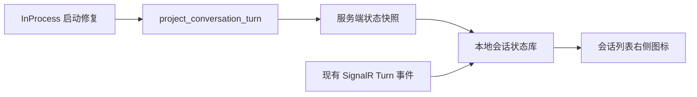

# Conversations 右侧状态指示

## 背景

会话列表需要显示每个会话的执行状态。Web、Desktop 在进入页面等时机获取服务端快照，保存到本地状态库；当前页面持有执行连接的会话，再由已有的 Turn 生命周期事件实时更新。

## 设计目标

### 功能目标

- 会话右侧支持 `idle`、`running`、`failed`、`interrupted` 四种状态。
- 当前页面持有执行连接的会话：Turn 开始时显示旋转圆环，正常结束后隐藏。
- 切换会话后，后台执行的状态继续更新。
- 其他标签页、其他设备、刷新页面前启动的 Turn，在下一次获取快照时更新。
- 进入页面、切换项目、打开会话时，通过快照更新本地状态。

### 技术目标

- 使用现有 SignalR 执行连接接收事件。
- 状态更新不使用轮询。
- 按服务器、项目隔离本地状态。项目只属于一个用户，项目 ID 同时确定所属用户。
- 较早发出的快照不能覆盖请求发出后的本地更新，包括事件、其他快照和清空操作。
- 进程内模式残留的活动 Turn 不能让会话一直显示 `running`。

## 总体设计



快照返回当前项目中状态为 `running`、`failed`、`interrupted` 的会话，响应中没有的会话为 `idle`。当前页面持有执行连接的会话由 Turn 事件实时更新；其他会话在下一次获取快照时更新。

## 数据库设计

复用 `ProjectConversation`、`ProjectConversationTurn` 及现有索引，无需数据库迁移。进程内模式的启动修复在 Host 启动时按状态读取一次 `project_conversation_turn`。

## 详细设计

### 进程内模式残留 Turn 的启动修复

InProcess 模式的 Turn 只存在于 Host 进程内，终态由 `TurnPipeline` 的 `finally` 写入。进程崩溃或被强制终止后，Turn 行保持 `Accepted` 或 `Running`，这个会话的快照会一直返回 `running`。

Host 的 `Execution:Provider` 为 `InProcess`（默认值）时，在 `DurableTurnUpgrade` 之后、`app.StartAsync()` 之前执行 `InProcessTurnRecovery`：

1. 在系统作用域读取候选 Turn 的 ID 和所属用户。候选条件：状态为 `Accepted` 或 `Running`，并且没有同 ID 的活动 `durable_execution` 记录；所属用户取所属会话的 `CreateBy`。读取方法与 `ReadDurableTurnUpgradeCandidatesAsync` 一样放在 `DbSeeder`，只返回 ID 和用户。
2. 按所属用户推入用户身份，调用 `IConversationTurnStore.FinishAsync(turnId, Interrupted, 0, null)`，写入终态、结束时间和最大消息序号。`FinishAsync` 对已经结束的 Turn 保持原结局。

这一步执行时 Host 还没有接受连接，InProcess 模式只运行一个 Host 进程，因此不存在正在运行的 Turn。`InProcessTurnRecovery` 放在 `Agw.Infrastructure/Projects/`，注册方式和调用位置与 `DurableTurnUpgrade` 相同。

### 获取快照并保存

#### 触发时机

以下时机查询一次当前项目的会话状态：

- 进入页面；
- 切换项目；
- 当前会话 ID 变化，包括打开已有会话和新会话被受理；
- 任一执行连接重连成功。`ExecutionSessionManager` 增加 `subscribeReconnected`，在 `handleReconnected` 中通知订阅者。

同一范围同时只有一个快照请求。请求进行期间再次触发时，当前请求结束后再请求一次，合并方式与 `ConversationList.refreshConversations` 相同。

快照请求失败时沿用页面错误提示，保留已有状态。

#### 服务端状态计算

- 验证项目属于当前用户，只读取该项目下当前用户的会话；项目不存在或属于其他用户时返回 `ResourceNotFound`。
- Turn 按 `(FirstSequence, Id)` 降序排序，与 `ConversationTurnQueryService.ListAsync` 相同。没有输入的 Turn 不写入消息，可能与后续 Turn 共用 `first_sequence`。
- 会话存在 `Accepted` 或 `Running` 的 Turn 时返回 `running`，`turnId` 取排序最前的活动 Turn；其余会话按排序最前的 Turn 映射：

| 最新 Turn 状态 | 列表状态 |
|---|---|
| `Completed` 或没有 Turn | `idle`，不在响应中返回 |
| `Failed` | `failed` |
| `Interrupted` | `interrupted` |

#### 本地状态库

在 `@agw/chat-runtime` 增加 `ConversationStatusStore`。`ExecutionSessionManager` 持有唯一实例，通过 `conversationStatuses` 属性提供给调用方。状态库只存在于内存中，刷新页面后清空。

范围是 `(serverId, projectId)`，与 `ExecutionSessionKey` 的前两项相同；范围内以 `conversationId` 保存记录：

```typescript
type ConversationStatus = "idle" | "running" | "failed" | "interrupted";

type ConversationStatusScope = {
  serverId: string;
  projectId: string;
};

type ConversationStatusEntry = {
  turnId: string | null;
  status: ConversationStatus;
  /** 最近一次写入这条记录时的状态库版本。 */
  revision: number;
};
```

状态库维护单调递增的 `revision`。事件、快照、清空和删除每次写入记录时，`revision` 加一并保存到该记录。

快照分两步应用：

1. 发出请求前调用 `beginSnapshot(scope)`，取得当前 `revision` 作为请求版本。
2. 响应返回后调用 `applySnapshot(scope, requestRevision, items)`，逐条处理范围内的会话：
   - 记录的 `revision` 大于请求版本：请求发出后已有本地更新，保留记录；
   - 会话在响应中：写入响应的 `turnId` 和 `status`；
   - 会话有本地记录、不在响应中：设为 `idle`，保留原 `turnId`。

#### 快照请求的发起方

`@agw/chat` 增加 `useConversationStatuses({ serverId, projectId, conversationId })`。它负责上面的触发时机和请求合并，通过 `@agw/projects-core` 的 API helper 发出请求，调用 `beginSnapshot`、`applySnapshot`，并订阅状态库，返回当前范围的 `ReadonlyMap<string, ConversationStatus>`。

### 根据 Turn 事件更新状态

在 `ExecutionSessionManager.handleMessage` 中处理状态更新。当前显示的会话和后台会话都经过这个方法；切换会话只调用 `detach`，后台会话继续更新。

范围取 entry 的 `serverId`、`projectId`。`conversationId`、`turnId` 从 `agw-turn-start`、`agw-turn-finished` 的 `additionalProperties` 读取，读取函数加在 `@agw/execution-core`，与 `getTurnPosition` 放在一起。

服务端 `TurnMessageFactory.CreateFinished(string status)` 生成的结束消息只有 `status`，表示连接上没有 Turn，出现在三种情况：进程内连接没有活动 Turn 时收到中断命令；Durable 连接没有目标 execution 时收到中断命令；Durable 中断当前连接没有订阅的 execution。缺少 `conversationId` 或 `turnId` 的生命周期消息不更新状态库，对应会话由快照更新。

| 收到的事件 | 更新操作 |
|---|---|
| `agw-turn-start` | 保存 `turnId`，设置为 `running` |
| `agw-turn-finished`，`status=completed` | 设置为 `idle` |
| `agw-turn-finished`，`status=failed` | 设置为 `failed` |
| `agw-turn-finished`，`status=interrupted` | 设置为 `interrupted` |

补充规则：

- 开始事件的 `turnId` 与记录相同、并且记录不是 `running` 时忽略，已结束 Turn 的重复开始消息不能恢复为 `running`。
- 结束事件只在记录不存在、或者记录的 `turnId` 与事件相同时写入，防止旧 Turn 的结束消息覆盖新 Turn。
- 重复的结束事件写入相同结果，保持幂等。
- 等待审批或输入期间保持 `running`。
- 连接断开本身不改变 Turn 的业务状态；重连成功后由快照更新。
- `Chat` 在 `clearProjectConversationRecords` 成功后调用 `reset(scope, conversationId)`，记录设为 `{ turnId: null, status: "idle" }`。清空会删除该会话的全部 Turn，之后的快照同样不返回这个会话。
- `ConversationList` 删除单个会话成功后调用新增的 `onConversationDeleted(conversationId)`，删除全部会话成功后调用新增的 `onProjectConversationsCleared()`；`ChatWorkspace` 分别调用 `remove(scope, conversationId)` 和 `removeScope(scope)`。

### 与 ExecutionActivityStore 的分工

- `ExecutionActivityStore` 保持现状：按 `contextId` 记录当前页面持有的执行连接状态，供 Chat 的执行状态、`useExecutionActivity` 的项目状态和 Desktop 活动任务数使用。
- `ConversationStatusStore` 记录服务端 Turn 结果，会话列表右侧图标只读取这个状态库。
- `failed`、`interrupted` 表示会话最新 Turn 的结果，在下一次 Turn 开始或者清空会话记录后消失；打开会话不清除这两种状态。

### 会话右侧展示

| 状态 | 展示 |
|---|---|
| `idle` | 隐藏图标 |
| `running` | 旋转 `LoaderCircle` |
| `failed` | `CircleAlert` |
| `interrupted` | `CircleSlash` |

- 状态位置位于每条会话最右侧，尺寸为 `16×16px`，垂直居中。
- 重命名、删除按钮位于状态位置左侧。
- 提供对应 Tooltip 和无障碍标签。
- `ChatWorkspace` 调用 `useConversationStatuses`，把状态映射作为 `conversationStatuses` 传给 `ConversationList`。`ConversationList` 的 `isExecuting` 属性由 `conversationStatuses` 替代。
- 新会话记录：`ConversationList` 删除当前会话摘要查询的 `refetchInterval`。当前会话不在已加载的分页中时，摘要查询的 query key 包含当前会话记录的 `turnId`，收到开始事件后 key 变化，查询一次。`ConversationTurnStore.AcceptAsync` 要求会话行在受理前已经存在，`agw-turn-start` 在受理事务提交后写出，所以这次查询能取得会话记录。

## 接口文档

### 基础信息

- 使用现有 HTTP 认证与用户作用域。
- 返回 `ApiResult.Ok(...)`。
- DTO 和查询逻辑属于 Projects 模块：接口加在 `ConversationTurnsController`，查询加在 `ConversationTurnQueryService`，DTO 加在 `Agw.Projects/Contracts/ConversationTurnContracts.cs`。

### 接口列表

新增：

```http
GET /api/projects/conversation-activity?projectId={projectId}
```

| 参数 | 位置 | 说明 |
|---|---|---|
| `projectId` | query | 必填，当前用户的项目 ID |

响应 `data` 的 `items` 只包含状态为 `running`、`failed`、`interrupted` 的会话，`turnId` 不为空。示例：

```json
{
  "items": [
    {
      "conversationId": "01994000-0000-7000-8000-000000000002",
      "turnId": "01994000-0000-7000-8000-000000000003",
      "status": "running"
    },
    {
      "conversationId": "01994000-0000-7000-8000-000000000004",
      "turnId": "01994000-0000-7000-8000-000000000005",
      "status": "failed"
    }
  ]
}
```

项目不存在或属于其他用户时返回 `ResourceNotFound`。

客户端在 `@agw/projects-core` 增加 `getConversationActivity(projectId, signal)`，并运行 `pnpm gen:api` 更新接口类型。

SignalR 继续使用现有 `agw-turn-start`、`agw-turn-finished` 消息格式。

## 测试计划

### 单元测试

客户端：

| 用例 | 操作与预期 |
|---|---|
| 快照初始化 | 写入三种非 `idle` 状态，验证按会话正确读取，其他会话为 `idle` |
| 开始执行 | 收到开始事件，状态变为 `running` |
| 执行结束 | 分别接收三种结束结果，映射为对应状态 |
| 快照与事件竞争 | 请求期间收到新事件，快照返回后保留事件状态 |
| 快照之间竞争 | 先发出的快照晚于后发出的快照返回，保留后发出快照的结果 |
| 响应中没有的记录 | 本地为 `running`、响应中没有该会话时设为 `idle` 并保留 `turnId`；请求发出后该记录有更新时保留记录 |
| 旧事件保护 | 新 Turn 开始后收到旧 Turn 结束消息，保持 `running` |
| 重复消息 | 重复开始、结束消息不导致状态错误 |
| 没有 Turn 标识的结束消息 | 只有 `status` 的结束消息不改变任何记录 |
| 清空与删除 | `reset` 后为 `idle`；`remove`、`removeScope` 后记录消失 |
| 范围隔离 | 相同会话 ID 在不同服务器或项目下互不影响 |
| 快照请求合并 | 请求进行期间多次触发，当前请求结束后只追加一次请求 |

服务端（真实数据库）：

| 用例 | 操作与预期 |
|---|---|
| 状态映射 | 最新 Turn 为四种终态或活动状态、以及没有 Turn 的会话，只返回 `running`、`failed`、`interrupted` |
| 活动 Turn 优先 | 最新 Turn 已结束、较早 Turn 仍为 `Running` 时返回 `running` 与该 Turn ID |
| 共用 first_sequence | 两个 Turn 共用 `first_sequence` 时按 `Id` 选取最新 Turn |
| 所属用户 | 其他用户的项目返回 `ResourceNotFound` |
| 启动修复 | 残留的 `Accepted`、`Running` Turn 变为 `Interrupted` 并写入 `FinishedAt`；有活动 `durable_execution` 的 Turn 和已结束的 Turn 保持不变 |

### 集成测试

- 使用真实数据库验证快照查询、状态映射与用户隔离。
- 使用真实执行连接验证 Turn 开始、正常结束、失败和中断。
- 验证切换会话后，后台事件仍能更新列表。
- 验证进入页面、切换项目、打开会话、重连后的快照更新；打开一个快照标记为 `running`、Turn 已经结束的会话后，图标隐藏。
- 验证网络恢复时多个执行连接同时重连，只合并发出快照请求。
- 验证 InProcess Host 在 Turn 运行中被强制终止并重启后，该会话快照返回 `interrupted`；Distributed 模式启动时不执行启动修复。
- 验证新会话在收到开始事件后出现在列表中。
- 验证页面静止期间没有周期性状态查询。

### 回归测试

- Web、Desktop 的右侧图标、长标题及悬停操作。
- 会话选择、分页、清空记录和删除行为。
- Chat 执行状态、项目状态指示和 Desktop 活动任务数。
- 运行相关后端测试、客户端测试、typecheck、lint 和 `pnpm test:boundaries`。
