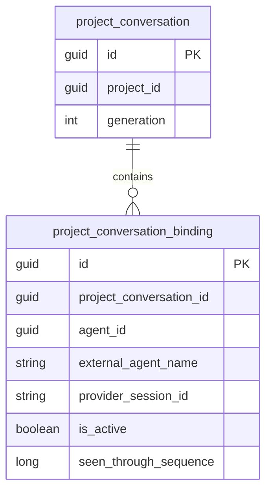

# Engine Sessions 历史查询与归档技术方案

## 名词解释

- **Engine Sessions**：Conversation Settings 中展示 External Agent provider session 绑定的区域名称。
- **绑定组**：由 `(ProjectConversationId, AgentId, ExternalAgentName)` 确定的一组 session 记录。
- **生效 session**：`IsActive = true` 的记录，运行时使用其 `ProviderSessionId` 继续会话。
- **归档 session**：`IsActive = false` 的记录，保留关联信息供历史查询。
- **归档操作**：停用指定记录；该组下一次执行时创建新 session。
- **持久化绑定快照**：Runtime 创建时读取到的生效 `ProviderSessionId`，或本 Runtime 回调成功保存后的 `ProviderSessionId`，用于判断后续 Turn 能否复用该 Runtime。

## 背景

`project_conversation_binding` 当前通过三字段唯一索引限制每组只有一条记录。保存不同的 `ProviderSessionId` 时会覆盖原值。

Conversation Settings 当前展示 conversation 基础信息和客户端设置。用户需要在 Engine Sessions 区域查看当前对话已经产生的全部 provider session 绑定组，并选择归档当前 session。

直接运行的 Claude Code、Codex 和 Pi External Agent 使用 provider session 绑定，执行模式为 InProcess。System Agent 和当前 Agentflow 节点创建流程不产生这类绑定记录。弹窗展示范围以当前 conversation 中已经保存的绑定记录为准。

InProcess 会复用内存中的运行时。归档需要同时影响数据库读取和后续运行时复用，确保下一次执行使用新 session。

## 设计目标

### 功能目标

1. 同一绑定组保存多个 session，同组最多只有一个生效。
2. Conversation Settings 的 Engine Sessions 区域展示当前对话已经产生的全部 External Agent provider session 绑定组，支持展开历史记录。
3. 每个生效 session 提供独立的 `Archive` 按钮，点击后立即提交归档。

归档后保留 conversation 消息、使用量和 session 历史。该组允许暂时没有生效 session，下一次执行创建新 session；该 Agent 的完整旧对话不会自动重放，新输入继续经过现有 Handoff 流程。

### 技术目标

- **关联完整性**：所有展示和操作保留 `AgentId`、`ExternalAgentName`、`ProviderSessionId` 的关联，以绑定记录 `Id` 定位归档目标。
- **一致性**：session 切换在同一事务内完成；归档与执行启动通过现有执行锁协调。
- **并发控制**：数据库保证同组最多一条生效记录；重复归档保持幂等。
- **运行时一致性**：归档成功后，后续执行重新创建对应的外部 Agent 运行时。
- **失败处理**：绑定保存失败向上传播并终止当前执行，该 Runtime 标记为不可复用。
- **用户隔离**：查询和归档均校验当前用户及 project、conversation、binding 的所属关系。
- **数据库兼容**：同时支持 SQLite、PostgreSQL，并生成两套 migrations。
- **执行范围**：External Agent 的 session 恢复与 Runtime 复用通过 InProcess 验证；归档对 durable 活动记录的冲突保护通过持久化层验证。
- **客户端复用**：通过共享的 `@agw/chat` 实现 Web 和 Desktop 的弹窗功能。

## 数据库设计

### ER 图



图中表示逻辑关系，关联完整性由应用维护。

### 表结构与字段说明

继续使用 `project_conversation_binding`，新增 `is_active`。

| 字段 | 类型 | 说明 |
|---|---|---|
| `id` | `Guid` | 绑定记录主键，也是归档操作的目标标识 |
| `project_conversation_id` | `Guid` | 所属 conversation |
| `agent_id` | `Guid` | 关联 Agent |
| `external_agent_name` | `string` | 关联名称，必填，最大长度 200 |
| `provider_session_id` | `string` | session ID，必填，最大长度 200 |
| `is_active` | `bool` | 新增，必填，默认值 `true` |
| `seen_through_sequence` | `long?` | 保留已有值，新记录默认 `null`；当前流程不使用该字段补充上下文 |
| `create_time`、`create_by` | 现有类型 | 首次创建信息 |
| `update_time`、`update_by` | 现有类型 | 状态更新信息 |

每条记录的绑定组和 `ProviderSessionId` 创建后保持稳定。归档只更新 `IsActive` 和更新审计字段。

在 `ProjectConversation` 增加 `Bindings` 集合，EF 关系映射使用 `WithMany(conversation => conversation.Bindings)`。调用 Behavior 前，事务协调器加载目标绑定组的全部记录，包括生效和已归档记录；业务方法只检查和修改该组。

### 索引

| 索引 | 字段 | 规则 |
|---|---|---|
| `ux_project_conversation_binding_session` | `project_conversation_id, agent_id, external_agent_name, provider_session_id` | 唯一，保证同组 session ID 不重复 |
| `ux_project_conversation_binding_active` | `project_conversation_id, agent_id, external_agent_name` | 条件唯一，仅包含 `is_active = true` |

EF 配置通过 `HasDatabaseName` 分别指定上述两个名称，并为生效记录索引设置 `HasFilter("is_active = TRUE")`。两种数据库的模型、migrations 和 SQL 使用一致的索引名称。

历史查询通过四字段唯一索引的 `project_conversation_id` 前缀读取当前 conversation 的记录，绑定组查询使用前三个字段。保留现有 `(external_agent_name, provider_session_id)` 索引。

### Migration SQL

生成 `AddProjectConversationBindingHistory` migrations，并同步两种数据库的 ModelSnapshot。已有记录全部标记为生效，保留原有数据。

以下为核心 `Up` SQL，完整脚本由 EF Core 生成。

**PostgreSQL：**

```sql
BEGIN;

ALTER TABLE project_conversation_binding
    ADD COLUMN is_active boolean NOT NULL DEFAULT TRUE;

DROP INDEX
    ix_project_conversation_binding_project_conversation_id_agent_;

CREATE UNIQUE INDEX ux_project_conversation_binding_session
    ON project_conversation_binding (
        project_conversation_id,
        agent_id,
        external_agent_name,
        provider_session_id
    );

CREATE UNIQUE INDEX ux_project_conversation_binding_active
    ON project_conversation_binding (
        project_conversation_id,
        agent_id,
        external_agent_name
    )
    WHERE is_active = TRUE;

COMMIT;
```

**SQLite：**

```sql
BEGIN;

ALTER TABLE project_conversation_binding
    ADD COLUMN is_active INTEGER NOT NULL DEFAULT 1;

DROP INDEX
    ix_project_conversation_binding_project_conversation_id_agent_id_external_agent_name;

CREATE UNIQUE INDEX ux_project_conversation_binding_session
    ON project_conversation_binding (
        project_conversation_id,
        agent_id,
        external_agent_name,
        provider_session_id
    );

CREATE UNIQUE INDEX ux_project_conversation_binding_active
    ON project_conversation_binding (
        project_conversation_id,
        agent_id,
        external_agent_name
    )
    WHERE is_active = TRUE;

COMMIT;
```

`Down` 在移除新索引和字段之前，首先尝试恢复原三字段唯一索引，整个过程受事务保护。同组存在多条记录时终止降级，保留全部数据及当前 schema；此时继续使用新版本 Host。降级策略不包含自动删除归档记录。

生成 migrations 后，分别检查 SQLite、PostgreSQL 的 `Down` 方法并手工调整操作顺序，确保恢复原唯一索引是第一项 schema 变更。同步检查两个 Provider 生成的降级 SQL，包括 SQLite 可能生成的表重建操作，确认检查唯一性之前没有移除新索引或字段。测试分别执行实际 migrations 和生成的 SQL，验证单记录降级成功、多记录降级失败且完整保留当前 schema 与数据。

实际数据库升级由用户执行：停止全部旧版 Standalone、Control Plane 和 Data Plane Host，备份数据库，执行对应 Provider 的 migrations，再启动新版本 Host。所有访问同一数据库的 Host 使用同一应用版本。

恢复旧版本应用前必须先成功执行对应 Provider 的 `Down`，恢复原表结构和唯一约束。同组已经有多条 session 记录时，保持新版本运行；历史数据整理或备份恢复作为独立的数据维护操作处理。

## 详细设计

### 多个 session 与唯一生效状态

`ProjectConversation.Bindings` 由现有 `ProjectConversationBehavior` 管理状态。`TaskSessionBindingService` 负责授权、参数规范化和调用编排。

在 Projects 的 `Application/Persistence` 声明 `IProjectProviderSessionCoordinator`，由 `Agw.Infrastructure/Projects/ProjectProviderSessionCoordinator` 实现保存事务和归档协调。协调器负责 scope、数据库锁、绑定集合加载、事务及活动执行检查，并调用 Application 传入的操作委托。

操作委托写在 `TaskSessionBindingService` 中，接收协调器加载的 `ProjectConversation`、关联取消令牌，以及绑定到本次 DbContext 和事务的保存委托。`TaskSessionBindingService` 在委托内为本次操作创建 `ProjectConversationBehavior`，完成 session 激活或归档。委托只捕获规范化参数、当前用户和时间，所有状态判断与保存均使用协调器提供的本次操作数据。Application 负责创建和调用 Behavior，状态转换规则由 Behavior 实现；Infrastructure 执行委托及其保存请求。

**操作 scope 与事务**

协调器每次保存或归档均通过 `IServiceScopeFactory.CreateAsyncScope()` 创建独立 scope，在其中解析 `AgwDbContext` 及参与本次操作的持久化服务。锁内加载、Application 委托执行、每次保存和事务提交使用该 scope 中的同一个 DbContext，完成或失败后释放 scope。运行时的持久化绑定快照只保留标识与失败状态。

`UserInfoUtil` 的 `AsyncLocal` 用户上下文随当前异步调用传入新 scope，`IUserInfoService` 和查询过滤器继续读取该上下文。操作仍然校验执行用户与资源所有者，缺少用户上下文时拒绝执行。取得锁之前的归属查询和目标定位使用 `AsNoTracking` 或标量投影；取得数据库写入锁后，再加载用于状态转换的聚合及目标绑定组的全部记录。

保存行为：

| 输入情况 | 处理方式 |
|---|---|
| 绑定组没有记录 | 创建并启用新记录 |
| 保存当前生效的 session ID | 返回原记录，保持幂等 |
| 保存新的 session ID | 同一事务内停用原记录，再创建并启用新记录 |
| 再次保存已归档的 session ID | 返回 `ConversationSessionConflict`，阻止过期回调重新启用归档记录 |

写入继续使用项目锁、Agent 定义锁、用户校验和 `Generation` 校验。协调器在新 scope 中取得数据库写入锁后加载绑定组，再调用 Application 操作委托；委托内创建的 Behavior 判断当前 session、已归档 session 和新 session。

切换 session 时，同一 Application 委托按“Behavior 校验并停用旧记录 → 保存 → Behavior 创建并启用新记录 → 保存”的顺序执行；新记录在第一次保存完成后才加入绑定集合。保存委托调用该 scope 的 `SaveConversationChangesAsync`，两次保存共用协调器开启的外层事务，最后由协调器提交。当前生效 ID 的重复保存直接返回原记录，已归档 ID 在状态转换前返回冲突。

`UpsertAsync` 的保存失败路径直接传播异常，协调器撤销整个事务并释放本次 scope 及其 ChangeTracker，已保存记录的 `ProviderSessionId` 保持不变。同一连接的后续保存创建新的 scope，重新查询数据库并执行完整的校验和事务流程。

运行时的 `GetAsync` 保持 `AsNoTracking`，只查询 `IsActive = true` 的记录。没有生效记录时返回 `null`，外部 Agent 按现有创建流程建立新 session。

### 弹窗展示与历史查询

在现有 `ChatSettingsDialog` 的 `Conversation Information` 下方增加 `Engine Sessions` 区域。

区域展示当前 conversation 中已经保存的全部绑定组，数据来自直接运行的 Claude Code、Codex 和 Pi External Agent。当前 Agentflow 节点执行流程不登记 provider session 绑定；对应 conversation 没有绑定记录时显示空状态。

**展示结构**

每个绑定组独立展示：

- `ExternalAgentName`
- 当前 `ProviderSessionId`
- 当前状态
- 当前记录的 `Archive` 按钮
- 可展开的 `History (数量)`

分组使用 `(AgentId, ExternalAgentName)`。相同 `ExternalAgentName` 对应不同 `AgentId` 时，分别展示。

session ID 使用等宽字体完整显示，支持换行。每条历史记录占一行，只展示 `ProviderSessionId` 和创建时间，组内按创建时间和记录 `Id` 倒序排列。

归档后的分组状态显示 `No active session`，已有历史仍然可以展开查看。

**数据获取**

- 弹窗打开且存在 `projectId`、`conversationId` 时查询全部 session。
- 请求封装在 `@agw/projects`，通过 `@agw/api` 调用后端。
- Query key 包含 `serverId`、`projectId`、`conversationId`。
- 切换服务端、项目或 conversation 时取消旧查询，重新加载对应数据。
- 打开弹窗、归档成功及当前执行结束后刷新 session 数据。
- 加载失败显示错误和重试入口；没有绑定记录时显示空状态。

`Archive` 独立提交。归档成功后保持弹窗打开，并保留其他设置的编辑内容。

### 归档当前 session

**客户端流程**

1. 用户点击具体生效记录旁的 `Archive`。
2. 使用该记录的 `Id` 和当前 project、conversation 标识提交请求。
3. 提交期间禁用归档按钮并显示进行中状态。
4. 成功后刷新 session 查询，更新对应分组和历史列表。
5. 失败时显示服务端错误，保留当前展示内容和其他设置草稿。

已知 conversation 正在执行、排队或等待用户操作时，禁用归档按钮，并说明需要等待执行结束。服务端执行最终校验。

**服务端流程**

`ProjectProviderSessionCoordinator` 在独立操作 scope 中使用 `ConversationExecutionGate` 和 `IDurableExecutionScopeMaintenance`。`TaskSessionBindingService` 通过协调器接口发起操作，并提供执行归档 Behavior 的 Application 委托。

1. 校验用户身份和 project、conversation 所属关系。
2. 使用 `AsNoTracking` 在指定 conversation 中查找 `bindingId`，从该记录获取实际的 `AgentId`、`ExternalAgentName` 和 `ProviderSessionId`。
3. 记录已经归档时返回成功，保持幂等。
4. 读取当前 conversation 的 `Generation`，取得 `ConversationExecutionGate`，随后取得项目生命周期锁和 Agent 定义锁；操作令牌关联请求取消及各 lease 的失效通知。
5. 开启事务，取得项目及 conversation 的数据库写入锁，重新校验所有权、`Generation` 和目标记录。目标已经归档时返回成功。
6. 调用 `RepairAndCheckActiveExecutionsAsync` 校验 conversation 的 durable 活动记录；存在活动记录时返回 `ConversationSessionConflict`。
7. 加载目标绑定组的完整记录，调用 `TaskSessionBindingService` 提供的委托；委托在 Application 中创建 `ProjectConversationBehavior`，将指定记录设为 `IsActive = false`，调用本次操作的保存委托。审计字段通过现有保存流程更新。
8. 协调器提交事务，释放各 lease 和操作 scope。

InProcess 执行期间由 `ConversationExecutionGate` 阻止归档。durable 活动检查沿用 `ClearConversationRecordsAsync` 的维护流程，覆盖 `Queued`、`Running`、`WaitingForHuman` 等非终态记录；该检查在 Infrastructure 内完成。

归档始终针对请求中的具体记录。弹窗打开后如果该组已经产生新 session，针对旧记录的请求只处理旧记录。

**运行时复用**

`AgentRuntime` 持有绑定组、持久化绑定快照和绑定保存失败状态。失败状态保留首次保存异常，以供 SDK 后续回调继续传播。快照记录读取到的生效 `ProviderSessionId`；SDK 回调成功保存后，快照更新为相同的规范化 ID。读取和回调使用同一个 Runtime 所属的状态对象。

首次创建时，Codex 和 Pi 的持久化绑定快照可以为 `null`。Claude Code 预生成的 ID 用于创建 SDK session；快照在初始化回调成功保存绑定后才记录该 ID。归档操作只改变指定绑定组的状态。

`IsRuntimeCurrentAsync` 在现有定义版本检查中加入 External Agent 的绑定快照检查。只有现有目标、配置、workspace、`Generation` 等复用条件均满足，且绑定保存没有失败时，才应用以下匹配规则：

| Runtime 持久化绑定快照 | 当前数据库生效 ID | 复用结果 |
|---|---|---|
| `null` | `null` | 正常初始化状态，允许复用 |
| A | A | 允许复用 |
| A | `null` | 释放并重建 Runtime |
| `null` | B | 释放并重建 Runtime |
| A | B | 释放并重建 Runtime |

检查使用绑定服务的规范化结果。读取绑定失败时传播异常并终止本次执行，读取失败不转换为 `null`。

`InProcessExecutionCoordinator.StartAsync` 的顺序为：

1. 取得目标 conversation 的 `ConversationExecutionGate`，创建关联 lease 失效通知的操作令牌。
2. 在持有 lease 的 `try` 范围内调用 `CanReuseAsync`，由 `IsRuntimeCurrentAsync` 完成定义版本及 session 检查。
3. 检查不通过时，持有 lease 调用 `ReleaseAsync` 释放旧 Host，然后创建新 Runtime。
4. 启动 Turn。lease 持续保持到 `Host.WhenIdleAsync()` 完成；启动前发生异常或未启动 Turn 时，释放 lease 和关联令牌。

校验通过 `IProjectProviderSessionFacade` 读取 Projects 所拥有的绑定数据。Agents.Execution 与 Projects 的调用遵守模块边界；本功能的 External Agent 运行时验证使用 InProcess。

**SDK 通知与保存回调**

三个引擎按各自的通知时机调用同一保存入口：

- Claude Code 的 tracking 实例只领取一次 init 通知权，等待绑定保存完成。
- Pi 在创建新 session 并取得 ID 后调用通知，恢复已有 session 或复用已绑定 session 时不重新通知。通知等待使用 `HistoryPersistenceTimeout`，默认 30 秒，超时向上传播 `TimeoutException`。
- CodexSdk.MAF 10.0.0 的 `notifiedThreadStarted` 在每次 SDK Run 开始时重置；收到 `ThreadStartedEvent` 时通知，执行结束时若尚未成功通知且 `thread.Id` 已知，则使用 `CancellationToken.None` 再次通知。恢复已有 thread 也会进入保存路径，同一 Turn 内的多次 SDK Run 分别遵循该规则。

SDK 回调在独立操作 scope 中完成保存，事务成功提交后才更新持久化绑定快照。相同生效 ID 的重复回调保持记录数量和审计字段稳定。

保存失败时，回调立即保存首次异常、标记 Runtime 不可复用、记录异常并向上传播，当前 Turn 终止。包含 `ConversationSessionConflict` 的预期失败同样遵守此流程。首次异常使用 `ExceptionDispatchInfo` 保留；该 Runtime 再次收到 SDK 回调时立即传播首次异常，数据库和快照均保持失败后的状态。失败状态持续到 Runtime 释放。

Codex 在通知异常后可能再次进入结束阶段通知。回调入口检查上述失败状态，确保再次通知仍然失败。该 Runtime 在后续复用检查中返回不可复用，下一次执行按执行锁保护下的流程释放并重建。正常初始化的双 `null` 匹配只适用于绑定保存未失败的 Runtime。

**Turn 终态与错误信息**

保存异常按现有 `TurnPipeline` 传播规则处理，并明确以下结果：

| 执行与回调结果 | Turn 结果 |
|---|---|
| 保存成功，执行正常完成 | `Completed` |
| 保存成功，执行因 Turn 取消令牌被取消而终止，且没有其他 fatal error | `Interrupted` |
| 保存出现非取消异常，包括数据库错误、`ConversationSessionConflict` 或 Pi 通知超时 | `Failed`，报告保存异常 |
| 保存回调抛出 `OperationCanceledException`，Turn 取消令牌已经取消，且没有其他 fatal error | `Interrupted`，Runtime 保持不可复用 |
| 保存回调抛出 `OperationCanceledException`，Turn 取消令牌尚未取消 | `Failed`，Runtime 保持不可复用 |

Codex 恢复 thread 的执行已经中断或失败时，结束阶段通知仍可能保存绑定。此时发生非取消保存异常，SDK 会向调用方传播该保存异常；Turn 结果为 `Failed`，错误信息来自保存异常。保存成功时，原执行异常继续向上传播。该规则同时适用于流式和非流式 SDK 调用。

日志保留保存异常和绑定组标识，Turn 状态及结束消息沿用现有执行流程。SDK 在结束阶段传播保存异常时，调用方只能取得 SDK 实际暴露的异常，诊断信息据此记录。

**归档后的上下文**

新 provider session 使用该引擎的首次创建流程，旧 provider session 的内部上下文不随归档操作迁移。conversation 的历史消息和使用量继续保留在 Agw 中。

下一次用户输入继续经过 `AgentTurnExecutor.CreateExecutionInputMessagesAsync` 和 `ConversationHandoffProvider`。Handoff 按目标身份及已有消息序号补充符合条件的其他目标消息，不因 provider session 更新而重新发送该 Agent 的完整旧对话。

`SeenThroughSequence` 保留已有数据，新记录为 `null`，本功能不增加该字段的读写或全量历史重放逻辑。界面明确说明该 Agent 的旧消息仍可查看，下一次执行创建新的 provider session。

**历史生命周期**

清空对话记录时删除全部 session 记录。删除 conversation、project 或 Agent 时，沿用对应清理流程删除相关记录。

## 接口文档

### 基础信息

- 服务地址：当前部署的 Agw 服务地址。
- 认证与授权：沿用现有管理 API，用户身份来自请求上下文。
- 请求与响应：JSON，响应使用 Bens.Results。
- 时间：RFC 3339，由客户端显示本地时间。
- 读取参数使用 Query，归档参数使用 Body。

新增 `ProjectProviderSessionsController`，类路由为 `api/projects/conversations/provider-sessions`。查询动作使用 `[HttpGet]` 和 Query DTO；归档动作使用 `[HttpPost("archive")]` 和 Body DTO。两个接口均使用 DTO、现有认证流程和 Bens.Results。

### 接口列表

#### 查询 conversation 的全部 provider session

```http
GET /api/projects/conversations/provider-sessions
```

Query 参数：

```json
{
  "projectId": "019a1234-5678-7000-8000-000000000001",
  "conversationId": "019a1234-5678-7000-8000-000000000002"
}
```

响应示例：

```json
{
  "code": 0,
  "title": "OK",
  "data": [
    {
      "id": "019a1234-5678-7000-8000-000000000012",
      "agentId": "019a1234-5678-7000-8000-000000000003",
      "externalAgentName": "codex",
      "providerSessionId": "22222222-2222-2222-2222-222222222222",
      "isActive": true,
      "createTime": "2026-10-09T03:00:00Z",
      "updateTime": null
    },
    {
      "id": "019a1234-5678-7000-8000-000000000011",
      "agentId": "019a1234-5678-7000-8000-000000000003",
      "externalAgentName": "codex",
      "providerSessionId": "11111111-1111-1111-1111-111111111111",
      "isActive": false,
      "createTime": "2026-10-09T02:00:00Z",
      "updateTime": "2026-10-09T03:00:00Z"
    }
  ]
}
```

返回该 conversation 已有的全部 provider session 记录及完整关联信息，客户端据此分组。有效 conversation 没有绑定记录时返回 `data: []`。

#### 归档指定 provider session

```http
POST /api/projects/conversations/provider-sessions/archive
```

请求：

```json
{
  "projectId": "019a1234-5678-7000-8000-000000000001",
  "conversationId": "019a1234-5678-7000-8000-000000000002",
  "bindingId": "019a1234-5678-7000-8000-000000000012"
}
```

成功响应：

```json
{
  "code": 0,
  "title": "OK"
}
```

重复归档相同记录返回成功。客户端提交时使用查询响应中的 `id`，服务端根据记录确定全部关联字段。

| 条件 | HTTP 状态 | 错误 |
|---|---|---|
| 参数无效 | `400` | `InvalidParam` |
| 未通过认证 | `401` | 沿用现有认证响应 |
| 资源不存在、无权访问或所属关系不匹配 | `404` | `ResourceNotFound` |
| conversation 正在执行或状态发生冲突 | `409` | `ConversationSessionConflict` |

同步更新 OpenAPI、生成的客户端类型，以及 `@agw/projects` 的查询和归档方法。

## 测试计划

### 单元测试

| 测试用例 | 前置条件与操作 | 预期结果 |
|---|---|---|
| `ActivateProviderSession_EmptyBindings_CreatesActiveBinding` | 空绑定组保存 A | A 生效 |
| `ActivateProviderSession_NewSession_PreservesHistory` | A 生效，保存 B | A 保留并归档，B 生效 |
| `ActivateProviderSession_CurrentSession_IsIdempotent` | 重复保存 A | 记录数量和审计信息保持稳定 |
| `ActivateProviderSession_ArchivedSession_RejectsWrite` | A 已归档，再次保存 A | 返回冲突，A 保持归档 |
| `ArchiveProviderSession_ActiveBinding_ArchivesOnlyTarget` | 存在多个绑定组，归档其中一条 | 只更新指定记录 |
| `ArchiveProviderSession_ArchivedBinding_IsIdempotent` | 重复归档 | 状态和审计信息保持稳定 |
| `IsRuntimeCurrentAsync_UnboundSession_AllowsReuse` | 绑定保存未失败，Runtime 快照和数据库生效 ID 均为 `null` | 通过 session 复用检查 |
| `IsRuntimeCurrentAsync_BindingIdentityChanged_RejectsReuse` | 覆盖 A/`null`、`null`/B、A/B 三种组合 | 返回不可复用 |
| `IsRuntimeCurrentAsync_BindingSaveFailed_RejectsReuse` | Runtime 标记绑定保存失败，ID 均为空或相同 | 返回不可复用 |
| `ProviderSessionCallback_SaveSucceeds_UpdatesSnapshot` | SDK 返回新的 ID，绑定成功保存 | Runtime 快照更新为已保存的规范化 ID |
| `ProviderSessionCallback_SaveFails_PropagatesFailure` | 绑定保存发生异常，包括已归档 ID 冲突 | 异常向上传播，Runtime 标记不可复用 |
| `ProviderSessionCallback_ReenteredAfterFailure_PropagatesFirstFailure` | 首次保存失败后，同一 Runtime 再次收到 SDK 通知 | 继续传播首次异常，快照保持不变 |

客户端使用实际分组逻辑验证：相同名称对应不同 Agent、相同 session ID 出现在不同绑定组、全部记录已归档等情况。

### 集成测试

使用真实 SQLite、PostgreSQL 验证：

- 两项唯一约束、显式索引名称、并发保存和事务失败后的数据状态；切换失败时原 session 仍然生效，记录的 `ProviderSessionId` 保持稳定。
- Application 操作委托在协调器的事务和独立 scope 内创建 Behavior；调用前加载目标绑定组的全部记录，归档状态和历史 ID 判断覆盖所有记录。
- 同一执行连接保存 A，经 HTTP 归档 A，推进 `TestTimeProvider` 后保存 B；使用新查询验证 A 的 `UpdateBy`、`UpdateTime` 保持归档时的值，B 为生效记录。再保存 A 必须返回 `ConversationSessionConflict`。
- 在旧记录已保存、新记录加入集合之后，取消第二次保存，使事务撤销；保持执行连接，继续执行一次有效保存。验证失败操作的新增记录和状态修改没有随下一次保存提交，操作 scope 之间没有复用跟踪实体。
- 新 scope 沿用当前用户上下文，其他用户和缺少用户上下文的保存、归档请求均被拒绝。
- 归档请求只能操作指定 conversation 中的 `bindingId`。
- 不同绑定组具有相同 `ProviderSessionId` 时，归档准确作用于指定记录。
- 弹窗数据过期后归档旧记录，新生效记录保持生效。
- 按下面的并发测试步骤控制 `AcquireAsync` 的进入时机，验证归档与下一次 Turn 的复用检查顺序。
- InProcess 执行中和等待用户操作时，归档返回冲突；归档成功后使用已有连接发送下一条消息，创建新 session 并保存为生效记录。
- 参照 `ProjectSessionResetTests.ClearConversationRecordsAsync_QueuedDurableExecution_ReturnsConflict`，向真实数据库写入有效的 durable 执行记录，分别验证 `Queued`、`Running` 和 `WaitingForHuman` 的归档冲突保护。
- 使用实际绑定持久化和 SDK tracking 调用链，验证 Claude Code 的 init 通知、Pi 新建 session 通知，以及 Codex 新建和恢复 thread 的通知。重复通知保持幂等，保存失败终止执行，失败 Runtime 被释放并在下一次执行时重新创建。
- Codex 恢复 thread 的 Run 未收到 `ThreadStartedEvent` 时，中断执行并让结束阶段保存发生真实数据库异常；验证错误信息来自保存异常，Turn 为 `Failed`，Runtime 不可复用。保存成功的对应场景保持 `Interrupted`。流式和非流式 SDK 路径分别验证。
- Codex 首次通知保存失败后，SDK 再次进入结束阶段通知；验证回调继续传播首次异常、实际保存只进入一次、快照保持不变。通过真实数据库失败和命令记录验证保存次数。
- Pi 通知发生实际保存异常，验证异常向上传播，失败 Runtime 被释放；恢复已有 session 和正常复用时，确认不会重复调用新建 session 通知。
- 归档后，该 Agent 的完整旧对话不重放；现有 Handoff 对其他目标消息的筛选及补充保持当前规则，界面历史和使用量完整保留。
- 用户隔离、过期 `Generation` 写入拒绝和全部相关清理流程。
- 全新建库、已有数据升级及降级冲突保护；分别对 EF migration runner 和生成的降级 SQL 验证单记录降级成功、多记录降级失败。使用 SQLite、PostgreSQL 的 schema 查询核对原唯一索引的恢复顺序，以及失败后归档记录、字段和新索引全部保留。

#### 归档与 Turn 启动的并发测试

1. 使用真实数据库、`AgentRuntimeFactory`、`InProcessExecutionCoordinator` 和绑定持久化服务，在同一执行连接完成一次 External Agent Turn，保留使用 A 的 Runtime。
2. 测试通过 `InProcessExecutionCoordinatorFactory` 的 `IConversationExecutionGate` 注入参数，给真实 `ConversationExecutionGate` 增加同步等待入口。入口收到下一次 `AcquireAsync` 调用时发出已到达信号，并等待继续信号；收到继续信号后，原样传入参数调用真实 gate，并返回实际 lease。`InProcessCoordinatorTestKit.CreateFactory` 的 `conversationGate` 参数可参考；本用例直接组装实际 `AgentRuntimeFactory`。
3. 启动下一次 Turn，等待进入该同步入口。此时真实 gate 尚未被调用，100ms 获取超时尚未开始；通过 HTTP 完成 A 的归档，等待归档事务和 lease 释放。
4. 发出继续信号，等待真实 gate 返回 lease，随后执行实际 `IsRuntimeCurrentAsync` 检查。断言 A 不再被复用、旧 Host 已释放、新 Runtime 创建新 session，并在回调后保存 B 为生效记录。

另一个独立用例验证 Turn 先取得 gate 的顺序：在真实 gate 已取得 lease、尚未返回给 `StartAsync` 时暂停；此时通过 HTTP 归档仍然生效的 A，应返回 `ConversationSessionConflict`。继续返回实际 lease，让 Turn 完成并等待 `Host.WhenIdleAsync()`，再验证 A 能够成功归档。

同步入口只控制执行顺序，锁、数据库查询、Behavior、Runtime 复用判断和 SDK 调用均执行生产实现。等待操作支持取消，测试结束时释放同步信号和取得的 lease。

### 回归测试

- 执行 `Agw.Projects.Tests`、`Agw.Agents.Tests`、`Agw.Architecture.Tests`。
- 验证具体 DbContext 和跨模块持久化访问集中在 Infrastructure，运行现有模块边界与 RawPersistence 架构测试。
- 执行相关客户端包的类型检查、测试及依赖边界检查。
- 集成与组件测试通过后，在连接 InProcess 真实后端的 Web、Desktop 中，使用直接运行的 External Agent 验证弹窗展示、历史展开、归档和下一次执行。
- 验证 System Agent 和当前 Agentflow 节点执行不会产生 provider session 绑定，空列表提示与实际数据一致。
- 通过 HTTP 集成测试验证两个新接口的完整路由、Query/Body 参数绑定、认证、用户隔离及 Bens.Results 响应。
- 验证归档操作保留其他设置草稿，`Save Settings` 继续保存原有设置。
- 验证加载失败、归档失败、重复点击和切换 conversation 时的界面状态。
