# Job Scheduler Design

本文档描述 Agw Jobs 模块当前的调度与执行设计，覆盖 `Scheduler`、`SchedulerCoordinator`、`WorkerPool`、`WorkerNode`、`Worker` 等核心组件。

## 目标

Jobs 模块的目标是把持久化的 `Job` 按时间触发执行，并支持从单进程执行平滑扩展到多节点集群执行。

当前设计拆成三层：

- 调度层：发现到期任务、维护内存队列、选择 worker、控制同一项目内串行派发。
- 执行层：执行单个 job，更新持久化状态，写入执行日志，处理重试。
- 协调层：根据运行模式决定本机直接调度，或通过 Redis leader lock 保证集群内只有一个 scheduler 活跃。

## 代码入口

- Hosted service: `src/backend/Agw.Jobs/HostedService/JobHostedService.cs`
- Common scheduler: `src/backend/Agw.Jobs/Executors/Common/JobScheduler.cs`
- Common worker: `src/backend/Agw.Jobs/Executors/Common/JobWorker.cs`
- Abstractions: `src/backend/Agw.Jobs/Executors/Abstractions/`
- Single node implementation: `src/backend/Agw.Jobs/Executors/StandAlone/`
- Redis cluster implementation: `src/backend/Agw.Jobs/Executors/Cluster/`
- Job persistence: `src/backend/Agw.Jobs/Application/Services/IJobStore.cs`
- Repository implementation: `src/backend/Agw.Infrastructure/Repositories/JobRepo.cs`
- DI registration: `src/backend/Agw.Jobs/DependencyInjection.cs`, `src/backend/Agw.Infrastructure/DependencyInjection.cs`
- Runtime config: `src/backend/Agw.Host/appsettings.json`

## 名词解释

| 名词 | 说明 |
| --- | --- |
| `Job` | 持久化的定时任务实体，包含项目、目标 agent、触发方式、下次运行时间、状态、重试次数等信息。 |
| `InMemoryJob` | scheduler 使用的内存调度 DTO。它从 `Job` 映射而来，并带有 `Version`，用于丢弃旧队列项。 |
| `Scheduler` | `IJobScheduler` 实现。负责预取 DB 中的待执行 job、维护内存优先队列、按时间派发到 worker pool。 |
| `SchedulerCoordinator` | `IJobSchedulerCoordinator` 实现。负责决定 scheduler 是否可以运行。单节点模式直接运行；集群模式先竞争 Redis leader lock。 |
| `WorkerPool` | `IJobWorkerPool` 实现。维护可用 worker 列表，并提供 dispatch 能力。单节点模式直接调用本进程 worker；集群模式通过 Redis queue 派发。 |
| `WorkerNode` | `IJobWorkerNode` 实现。代表当前进程作为 worker 加入 worker pool，负责注册、心跳、消费队列和退出注销。 |
| `Worker` | `IJobWorker` 实现。执行单个 job 的业务逻辑，包括抢项目锁、调用 agent、更新 job 状态和写 execution log。 |
| `Project lane` | scheduler 内部按 `ProjectId` 维护的串行执行通道。同一个 project 的 job 不会被 scheduler 并发派发。 |
| `Project execution lock` | worker 执行前获取的项目级分布式锁，当前由 `RedisProjectExecutionLock` 实现。它是跨 scheduler/worker 的最后一道项目并发保护。 |
| `DispatchResult` | worker pool 返回给 scheduler 的派发结果，包含 worker id、job id 和 worker execution result。 |
| `ExecutionResult` | worker 返回给 scheduler 的执行结果，表示是否从内存调度中移除，或用新的 `NextRunTime` / `RetryCount` 重新调度。 |

## 架构总览

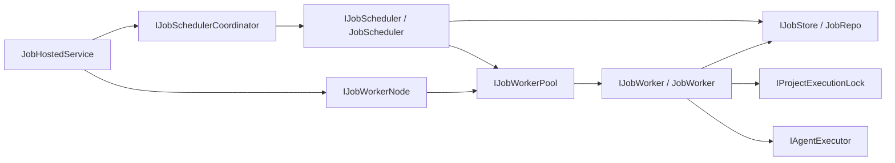

核心约束：

- DB 是持久化事实源，内存队列只负责精确调度和快速派发。
- Scheduler 只负责发现和派发，不直接执行业务。
- Worker 是执行边界，负责持久化状态变更。
- 同一 `ProjectId` 的 job 在 scheduler 侧串行派发，在 worker 侧还会用 Redis 项目锁保护。
- 集群模式下只有 leader scheduler 预取和派发，但所有节点都可以作为 worker 消费任务。

## 生命周期

`JobHostedService` 是 ASP.NET Core hosted service。它不再包含具体调度算法，只协调 scheduler 和 worker node 的生命周期。

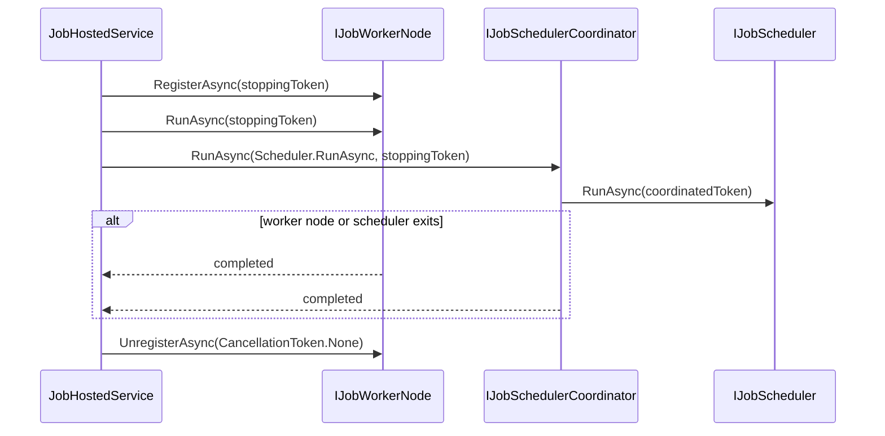

## 单节点模式

默认配置是 `Jobs:WorkerPool:Mode = SingleNode`。

注册关系：

- `IJobScheduler` -> `JobScheduler`
- `IJobWorker` -> `JobWorker`
- `IJobWorkerPool` -> `LocalJobWorkerPool`
- `IJobWorkerNode` -> `LocalJobWorkerNode`
- `IJobSchedulerCoordinator` -> `PassThroughJobSchedulerCoordinator`

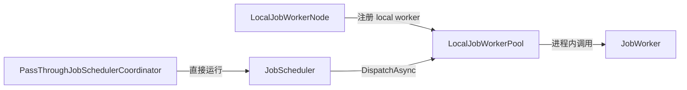

单节点模式没有 Redis dispatch queue。`LocalJobWorkerPool.DispatchAsync` 会检查 worker 是否已注册，然后直接调用同进程的 `IJobWorker.ExecuteAsync`。

## 集群模式

将 `Jobs:WorkerPool:Mode` 配置为 `Cluster` 后，`Agw.Infrastructure` 会覆盖默认注册：

- `IJobWorkerPool` -> `RedisJobWorkerPool`
- `IJobWorkerNode` -> `RedisJobWorkerNode`
- `IJobSchedulerCoordinator` -> `RedisJobSchedulerCoordinator`

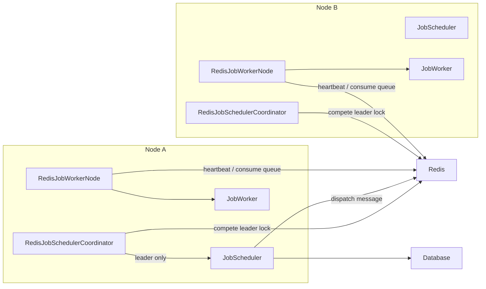

Redis key 约定：

| Key | 用途 |
| --- | --- |
| `agw:jobs:scheduler:leader` | scheduler leader lock。 |
| `agw:jobs:workers` | worker id 集合。 |
| `agw:jobs:workers:{workerId}` | worker descriptor JSON，带 TTL。 |
| `agw:jobs:workers:{workerId}:queue` | 指定 worker 的 dispatch queue。 |
| `agw:jobs:dispatch:result:{dispatchId}` | 单次 dispatch 的结果队列，处理完后删除。 |

### Scheduler leadership

`RedisJobSchedulerCoordinator` 使用 `RedisLock.AcquireLeaseAsync` 获取 leader lock。拿到锁后运行 scheduler，并由 lock lease 后台续约。

如果续约失败，或 Redis 脚本发现 lock value 已经不匹配，lease 的 `Lost` task 会 fault。coordinator 会取消当前 scheduler token，等待 scheduler 停止，然后抛出 `RedisLockLost` 对应的 `AgwException`，外层 leadership loop 记录错误并重新竞争锁。

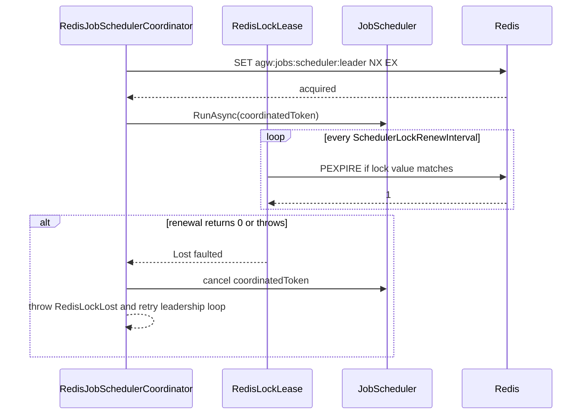

## Scheduler 设计

`JobScheduler` 内部有两个长期循环：

- `RunPrefetchLoopAsync`：周期性从 `IJobStore` 预取未来窗口内的待执行 job。
- `RunDispatchLoopAsync`：从内存优先队列中取出到期 job，派发给 worker pool。

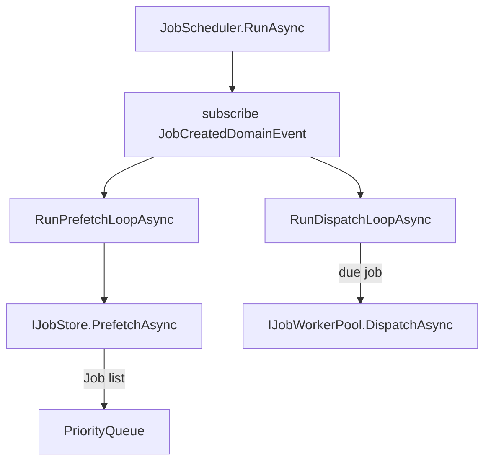

### 预取

预取使用配置：

- `Jobs:Scheduler:PrefetchInterval`
- `Jobs:Scheduler:PrefetchWindow`

流程：

1. 取当前 UTC 时间 `now`。
2. 查询 `[now, now + PrefetchWindow]` 内待运行的 job。
3. 每个 job 映射成 `InMemoryJob`，写入 `_taskMap` 并入优先队列。
4. 等待 `PrefetchInterval`，或被 `_prefetchSignal` 唤醒。

`JobCreatedDomainEvent` 会加速一次性任务的预取：如果新建 job 是 `TriggerType.Once`、enabled、pending，且 `NextRunTime` 在一个 `PrefetchInterval` 内，scheduler 会释放 `_prefetchSignal`。

### 版本化队列

同一个 job 可能被多次放入优先队列，例如失败后重试、周期任务计算出下一次运行时间。scheduler 用 `_taskMap[jobId].Version` 记录最新版本。出队时如果队列项的 `Version` 不是当前版本，就视为旧项并丢弃。

### 项目串行派发

Scheduler 使用 `_runningProjects` 和 `_projectBacklog` 保证同一 `ProjectId` 的 job 串行派发。

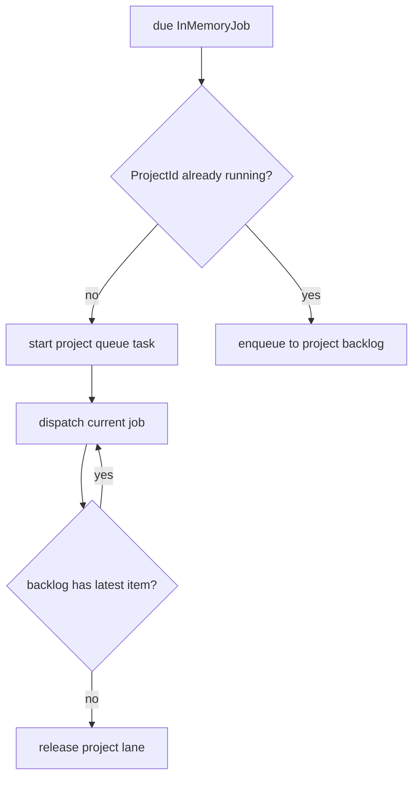

注意：项目串行派发只约束 scheduler 选择和派发顺序。worker 执行前仍会获取 `IProjectExecutionLock`，这是跨节点和异常场景下的并发保护。

### Worker 选择

Scheduler 调用 `IJobWorkerPool.ListAvailableWorkersAsync` 获取可用 worker。没有 worker 时抛出 `JobWorkerUnavailable`。

可用 worker 会按 `WorkerId` 排序，然后用 `_workerSelectionCursor` 做 round-robin 选择。这样 worker 集合稳定时派发顺序可预测，worker 集合变化时也能保持简单的负载分摊。

### 派发失败处理

如果 `DispatchAsync` 失败，scheduler 会：

1. 记录错误。
2. 将当前 job 的 `NextRunTime` 设置为 `UtcNow + DispatchRetryDelay`。
3. 重新写入内存队列。
4. 释放当前 project lane。

这类失败是“派发失败”，不等同于“job 执行失败”，因此不会直接更新 DB 中的 job retry count。job 执行失败由 `JobWorker` 负责处理。

## Worker 设计

`JobWorker` 是单个 job 的执行边界。

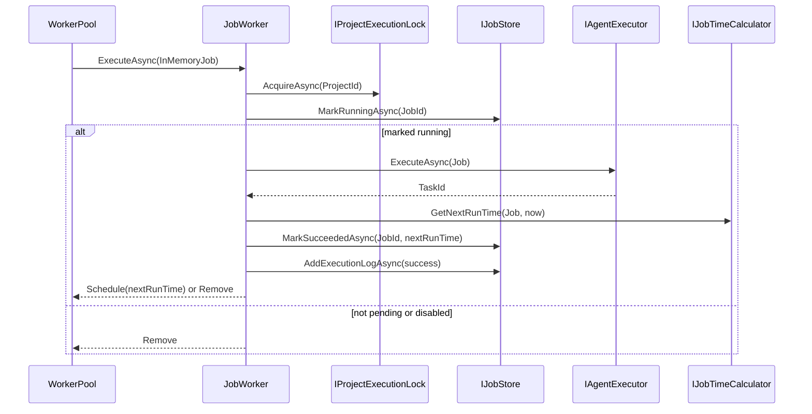

失败处理：

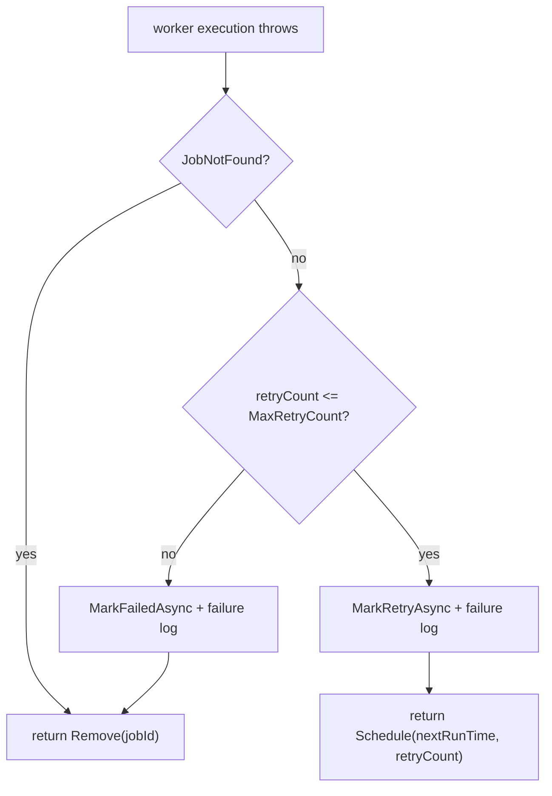

成功处理：

- 如果 `IJobTimeCalculator.GetNextRunTime` 返回时间，worker 会将 job 标回 `Pending`，重置 retry count，并返回 `Schedule`。
- 如果没有下一次运行时间，worker 会禁用 job、状态置为 `Paused`，并返回 `Remove`。

## WorkerPool 设计

`IJobWorkerPool` 是 scheduler 和 worker node 之间的边界。

```csharp
Task RegisterAsync(JobWorkerDescriptor worker, CancellationToken cancellationToken);
Task HeartbeatAsync(JobWorkerDescriptor worker, CancellationToken cancellationToken);
Task UnregisterAsync(string workerId, CancellationToken cancellationToken);
Task<IReadOnlyList<JobWorkerDescriptor>> ListAvailableWorkersAsync(CancellationToken cancellationToken);
Task<JobWorkerDispatchResult> DispatchAsync(JobWorkerDescriptor worker, InMemoryJob job, CancellationToken cancellationToken);
```

### LocalJobWorkerPool

本地实现只维护一个内存字典：

- `RegisterAsync` 写入 worker descriptor。
- `HeartbeatAsync` 更新 `LastSeenAt`。
- `UnregisterAsync` 删除 worker descriptor。
- `ListAvailableWorkersAsync` 返回按 `WorkerId` 排序的本地 worker。
- `DispatchAsync` 直接调用注入的 `IJobWorker.ExecuteAsync`。

### RedisJobWorkerPool

Redis 实现把 worker 注册表和 dispatch 结果队列放到 Redis：

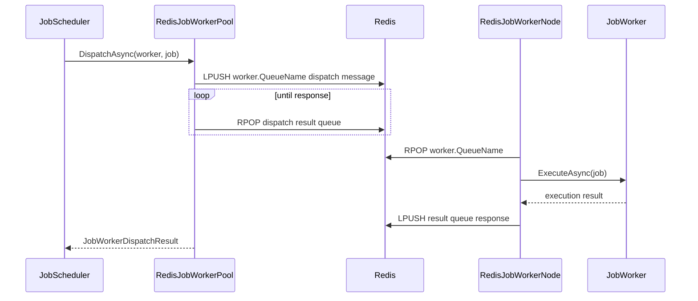

`RedisJobWorkerPool.ListAvailableWorkersAsync` 会：

1. 读取 `agw:jobs:workers` 中的 worker id。
2. 读取每个 `agw:jobs:workers:{workerId}` descriptor。
3. 清理 descriptor 缺失或 `LastSeenAt + WorkerTimeout < now` 的 worker。
4. 返回按 `WorkerId` 排序的可用 worker。

## WorkerNode 设计

`IJobWorkerNode` 表示当前进程作为 worker 加入系统的生命周期。

### LocalJobWorkerNode

单节点 worker node 只负责注册本地 worker，然后等待 host 停止。默认 worker id 是 `{MachineName}-{ProcessId}`，queue name 是 `local`。

### RedisJobWorkerNode

集群 worker node 有两个循环：

- heartbeat loop：按 `HeartbeatInterval` 调用 `IJobWorkerPool.HeartbeatAsync`。
- consume loop：从自身 Redis queue 中取 dispatch message，并发执行 `JobWorker`。

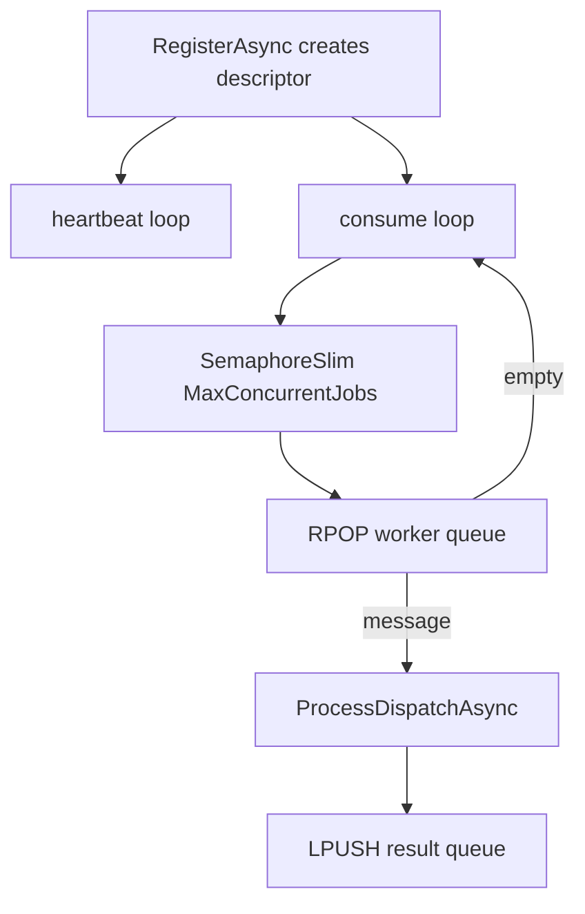

`MaxConcurrentJobs` 控制单个 worker node 的本地执行并发。worker descriptor 中也带有这个值，但当前 scheduler 只按 worker 数量 round-robin，不按并发容量加权。

## 配置

配置位于 `src/backend/Agw.Host/appsettings.json`。

```json
{
  "Jobs": {
    "Scheduler": {
      "PrefetchInterval": "00:01:00",
      "PrefetchWindow": "00:10:00",
      "DispatchRetryDelay": "00:00:30"
    },
    "Worker": {
      "RetryDelay": "00:00:30"
    },
    "WorkerPool": {
      "Mode": "SingleNode",
      "MaxConcurrentJobs": 4,
      "HeartbeatInterval": "00:00:10",
      "WorkerTimeout": "00:00:30",
      "QueuePollInterval": "00:00:00.200",
      "DispatchPollInterval": "00:00:00.200",
      "DispatchResultTtl": "00:10:00",
      "SchedulerLockTtl": "00:00:30",
      "SchedulerLockRetryDelay": "00:00:05",
      "SchedulerLockRenewInterval": "00:00:10"
    }
  }
}
```

| 配置 | 说明 |
| --- | --- |
| `Jobs:Scheduler:PrefetchInterval` | scheduler 预取循环间隔，也是新建临近一次性 job 是否立即唤醒预取的判断窗口。 |
| `Jobs:Scheduler:PrefetchWindow` | 每次预取向未来看的时间窗口。 |
| `Jobs:Scheduler:DispatchRetryDelay` | 派发失败后重新进入内存调度的延迟。 |
| `Jobs:Worker:RetryDelay` | job 执行失败但仍可重试时，下一次运行时间的延迟。 |
| `Jobs:WorkerPool:Mode` | `SingleNode` 或 `Cluster`。 |
| `Jobs:WorkerPool:WorkerId` | 可选。指定当前 worker id；为空时使用 `{MachineName}-{ProcessId}`。 |
| `Jobs:WorkerPool:NodeId` | 可选。指定当前节点 id；为空时使用 `MachineName`。 |
| `Jobs:WorkerPool:MaxConcurrentJobs` | 单个 worker node 本地最大并发执行数。 |
| `Jobs:WorkerPool:HeartbeatInterval` | Redis worker heartbeat 间隔。 |
| `Jobs:WorkerPool:WorkerTimeout` | Redis worker descriptor TTL，也是可用 worker 过期判断窗口。 |
| `Jobs:WorkerPool:QueuePollInterval` | Redis worker queue 为空或消费循环异常后的等待间隔。 |
| `Jobs:WorkerPool:DispatchPollInterval` | Redis worker pool 等待 dispatch result 的轮询间隔。 |
| `Jobs:WorkerPool:DispatchResultTtl` | dispatch result queue 的 TTL。 |
| `Jobs:WorkerPool:SchedulerLockTtl` | Redis scheduler leader lock 的 TTL。 |
| `Jobs:WorkerPool:SchedulerLockRetryDelay` | 未拿到 scheduler leader lock 时的重试间隔。 |
| `Jobs:WorkerPool:SchedulerLockRenewInterval` | 持有 scheduler leader lock 后的续约间隔。 |

## 使用说明

### 默认单节点运行

保持默认配置即可：

```json
{
  "Jobs": {
    "WorkerPool": {
      "Mode": "SingleNode"
    }
  }
}
```

运行 host：

```bash
dotnet run --project src/backend/Agw.Host
```

此时 scheduler 和 worker 都在同一个进程内运行。

### 启用集群模式

每个节点都运行同一个 host，并使用相同的 Redis：

```json
{
  "Redis": {
    "ConnectionString": "localhost:6379,abortConnect=false"
  },
  "Jobs": {
    "WorkerPool": {
      "Mode": "Cluster"
    }
  }
}
```

集群模式下：

- 所有节点都会注册为 Redis worker。
- 所有节点都会竞争 scheduler leader lock。
- 同一时间只有拿到 `agw:jobs:scheduler:leader` 的节点运行 scheduler。
- 如果 leader 失去 Redis lock，当前 scheduler 会被取消，节点会重新进入 leader 竞争。

如果在同一台机器上启动多个进程，默认 worker id 仍包含 process id，因此不会冲突。生产环境也可以通过 `Jobs:WorkerPool:WorkerId` 显式指定稳定 id。

### 测试

Jobs 测试项目当前不在 `Agw.slnx` 中。修改 Jobs 调度、worker、worker pool、Redis coordinator 时应额外运行：

```bash
dotnet test tests/Agw.Jobs.Tests/Agw.Jobs.Tests.csproj
```

修改 `RedisLock` 或 `ErrorCodes` 时也应运行：

```bash
dotnet test tests/Agw.Shared.Tests/Agw.Shared.Tests.csproj
```

## 主要数据流程

### 创建并执行一次性 Job

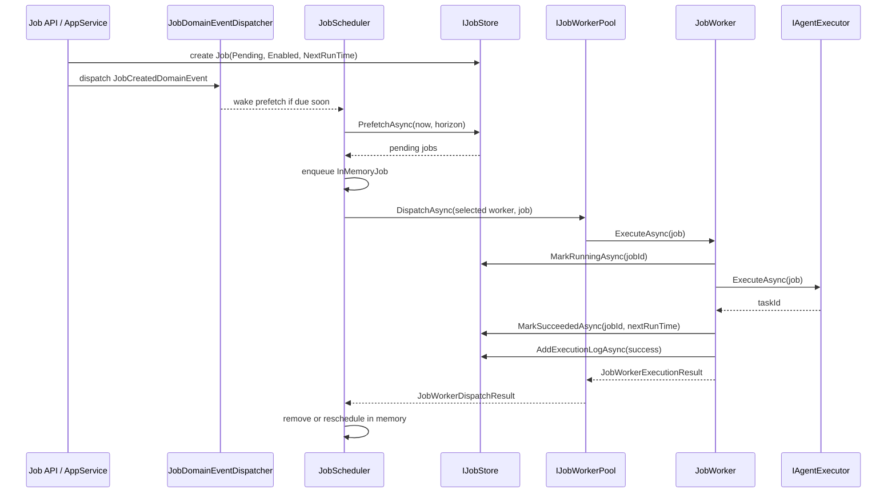

### 周期 Job 成功后的重新调度

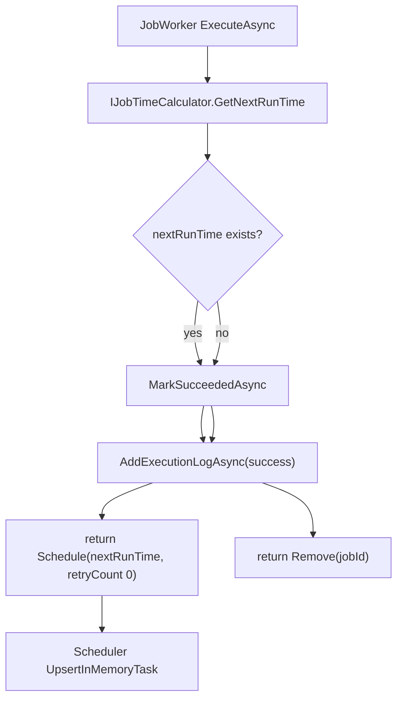

### 执行失败与重试

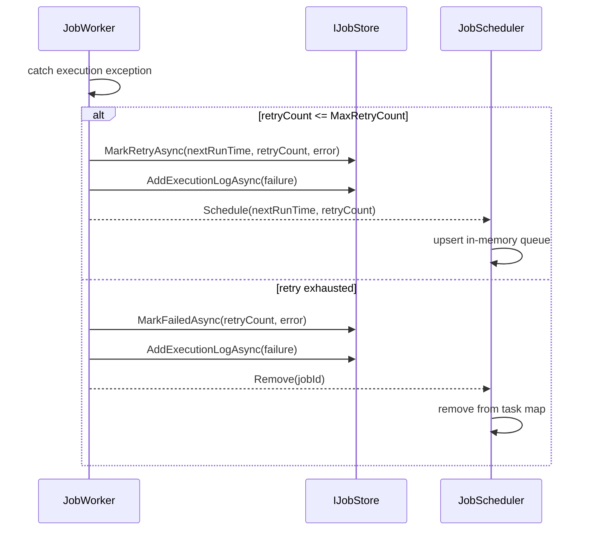

### Redis 集群派发

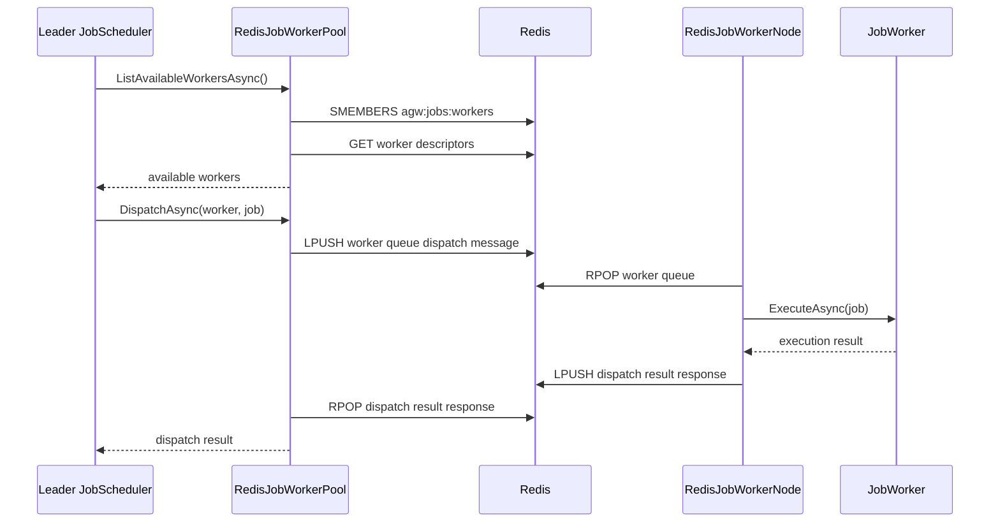

## 一致性与故障边界

| 场景 | 当前行为 |
| --- | --- |
| Scheduler 进程重启 | 内存队列丢失；新 scheduler 从 DB 重新预取 pending job。 |
| Worker 不可用 | `ListAvailableWorkersAsync` 返回空时抛 `JobWorkerUnavailable`，scheduler 按 `DispatchRetryDelay` 重排内存队列。 |
| Redis worker heartbeat 过期 | `RedisJobWorkerPool.ListAvailableWorkersAsync` 清理过期 worker，不再派发给它。 |
| Redis dispatch 响应失败 | pool 抛 `JobWorkerDispatchFailed`，scheduler 视为派发失败并延迟重排。 |
| Worker 执行失败 | worker 更新 DB retry/failure 状态并写 execution log，scheduler 根据 execution result 重排或移除。 |
| Scheduler leader lock 丢失 | coordinator 取消当前 scheduler，抛 `RedisLockLost`，然后重新竞争 leader lock。 |
| 同项目并发 | scheduler 侧 project lane 串行派发，worker 侧 Redis project lock 再保护实际执行。 |

## 扩展建议

新增一种 worker pool 时，应实现：

- `IJobWorkerPool`
- `IJobWorkerNode`
- 如需要多节点 scheduler 协调，实现 `IJobSchedulerCoordinator`

并在 DI 中通过配置替换默认实现。Scheduler 和 Worker 不应依赖具体传输机制。

新增 job 执行行为时，优先放在 `JobWorker` 或其依赖服务中；不要把执行细节放回 `JobScheduler`，否则会破坏调度层和执行层的边界。
