# Job Scheduler Design

This document describes the current scheduling and execution design of the Agw Jobs module. It covers the core components: `Scheduler`, `SchedulerCoordinator`, `WorkerPool`, `WorkerNode`, and `Worker`.

## Goals

The Jobs module schedules persisted `Job` records by time and supports a smooth evolution from single-process execution to multi-node cluster execution.

The current design is split into three layers:

- Scheduling layer: discovers due jobs, maintains the in-memory queue, selects workers, and serializes dispatch for jobs in the same project.
- Execution layer: executes a single job, updates persisted state, writes execution logs, and handles retries.
- Coordination layer: decides whether the scheduler can run based on the runtime mode. Single-node mode runs locally; Redis cluster mode uses a leader lock so only one scheduler is active in the cluster.

## Code Entry Points

- Hosted service: `src/backend/Agw.Jobs/HostedService/JobHostedService.cs`
- Common scheduler: `src/backend/Agw.Jobs/Executors/Common/JobScheduler.cs`
- Common worker: `src/backend/Agw.Jobs/Executors/Common/JobWorker.cs`
- Abstractions: `src/backend/Agw.Jobs/Executors/Abstractions/`
- Single-node implementation: `src/backend/Agw.Jobs/Executors/StandAlone/`
- Redis cluster implementation: `src/backend/Agw.Jobs/Executors/Cluster/`
- Job persistence: `src/backend/Agw.Jobs/Application/Services/IJobStore.cs`
- Repository implementation: `src/backend/Agw.Infrastructure/Repositories/JobRepo.cs`
- DI registration: `src/backend/Agw.Jobs/DependencyInjection.cs`, `src/backend/Agw.Infrastructure/DependencyInjection.cs`
- Runtime config: `src/backend/Agw.Host/appsettings.json`

## Glossary

| Term | Description |
| --- | --- |
| `Job` | Persisted scheduled-job entity. It contains the project, target agent, trigger type, next run time, status, retry count, and related execution data. |
| `InMemoryJob` | In-memory scheduling DTO used by the scheduler. It is mapped from `Job` and carries a `Version` used to discard stale queue entries. |
| `Scheduler` | Implementation of `IJobScheduler`. It prefetches due jobs from the database, maintains an in-memory priority queue, and dispatches jobs to a worker pool by time. |
| `SchedulerCoordinator` | Implementation of `IJobSchedulerCoordinator`. It decides whether the scheduler may run. Single-node mode runs directly; cluster mode first competes for a Redis leader lock. |
| `WorkerPool` | Implementation of `IJobWorkerPool`. It maintains available workers and provides dispatch capability. Single-node mode calls the in-process worker directly; cluster mode dispatches through Redis queues. |
| `WorkerNode` | Implementation of `IJobWorkerNode`. It represents the current process joining the worker pool as a worker. It handles registration, heartbeat, queue consumption, and shutdown unregistering. |
| `Worker` | Implementation of `IJobWorker`. It executes a single job, including acquiring the project lock, invoking the agent, updating job state, and writing execution logs. |
| `Project lane` | A scheduler-owned serial execution lane keyed by `ProjectId`. Jobs in the same project are not dispatched concurrently by the scheduler. |
| `Project execution lock` | A project-level lock acquired before worker execution. Single-node mode uses `LocalProjectExecutionLock`; cluster mode uses `RedisProjectExecutionLock`. It is the final project concurrency guard. |
| `DispatchResult` | Result returned by the worker pool to the scheduler. It contains the worker id, job id, and worker execution result. |
| `ExecutionResult` | Result returned by the worker to the scheduler. It indicates whether the job should be removed from the in-memory schedule or rescheduled with a new `NextRunTime` and `RetryCount`. |

## Architecture Overview

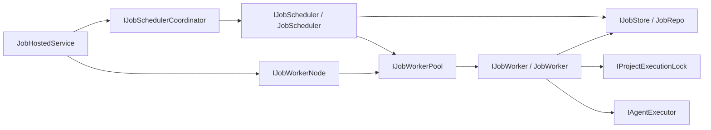

Core constraints:

- The database is the persisted source of truth. The in-memory queue only provides precise scheduling and fast dispatch.
- The scheduler only discovers and dispatches jobs. It does not execute business work directly.
- The worker is the execution boundary and owns persisted state changes.
- Jobs with the same `ProjectId` are dispatched serially by the scheduler, and worker execution is also protected by the configured project lock.
- In cluster mode, only the leader scheduler prefetches and dispatches jobs, but all nodes can consume work as workers.

## Lifecycle

`JobHostedService` is an ASP.NET Core hosted service. It no longer contains the concrete scheduling algorithm. It only coordinates the lifecycle of the scheduler and worker node.

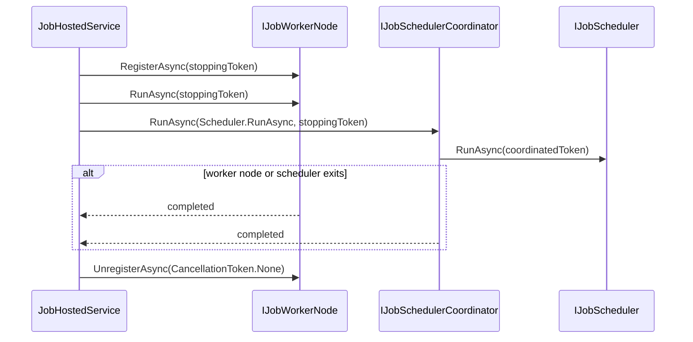

## Single-Node Mode

The default configuration is `Jobs:WorkerPool:Mode = SingleNode`.

Registrations:

- `IJobScheduler` -> `JobScheduler`
- `IJobWorker` -> `JobWorker`
- `IProjectExecutionLock` -> `LocalProjectExecutionLock`
- `IJobWorkerPool` -> `LocalJobWorkerPool`
- `IJobWorkerNode` -> `LocalJobWorkerNode`
- `IJobSchedulerCoordinator` -> `PassThroughJobSchedulerCoordinator`

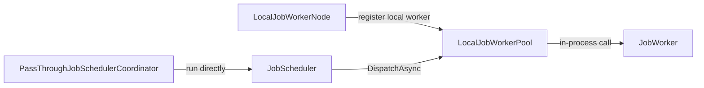

Single-node mode has no Redis dispatch queue. `LocalJobWorkerPool.DispatchAsync` checks that the worker is registered, then directly calls the in-process `IJobWorker.ExecuteAsync`.

## Cluster Mode

After `Jobs:WorkerPool:Mode` is set to `Cluster`, `Agw.Infrastructure` overrides the default registrations:

- `IJobWorkerPool` -> `RedisJobWorkerPool`
- `IJobWorkerNode` -> `RedisJobWorkerNode`
- `IJobSchedulerCoordinator` -> `RedisJobSchedulerCoordinator`
- `IProjectExecutionLock` -> `RedisProjectExecutionLock`

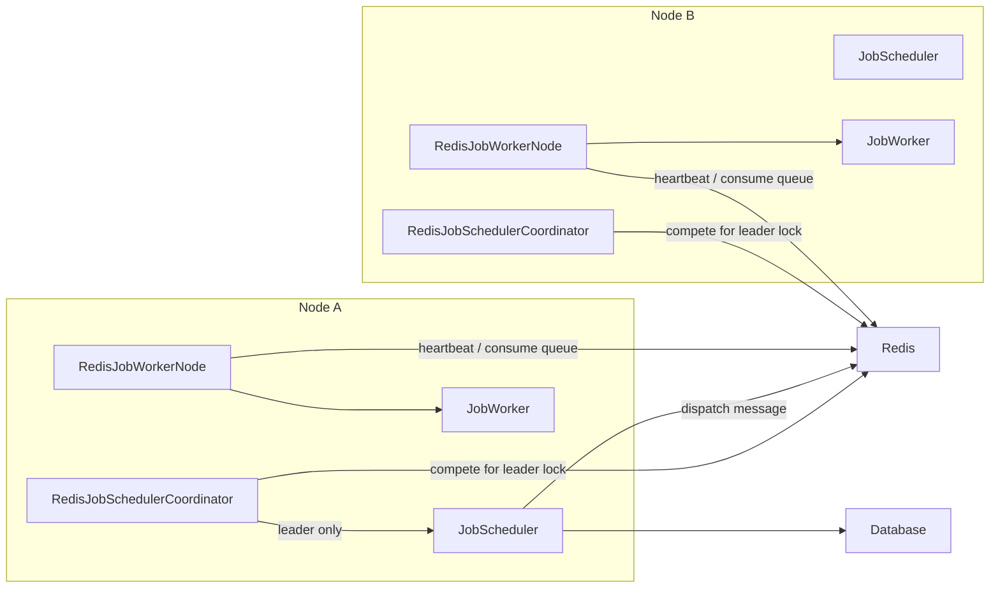

Redis key conventions:

| Key | Purpose |
| --- | --- |
| `agw:jobs:scheduler:leader` | Scheduler leader lock. |
| `agw:jobs:workers` | Worker id set. |
| `agw:jobs:workers:{workerId}` | Worker descriptor JSON with TTL. |
| `agw:jobs:workers:{workerId}:queue` | Dispatch queue for a specific worker. |
| `agw:jobs:dispatch:result:{dispatchId}` | Result queue for a single dispatch. It is deleted after processing. |

### Scheduler Leadership

`RedisJobSchedulerCoordinator` uses `RedisLock.AcquireLeaseAsync` to acquire the leader lock. After the lock is acquired, it runs the scheduler and the lock lease renews in the background.

If renewal fails, or if the Redis script finds that the lock value no longer matches, the lease's `Lost` task is faulted. The coordinator cancels the current scheduler token, waits for the scheduler to stop, then throws the `AgwException` for `RedisLockLost`. The outer leadership loop records the error and competes for the lock again.

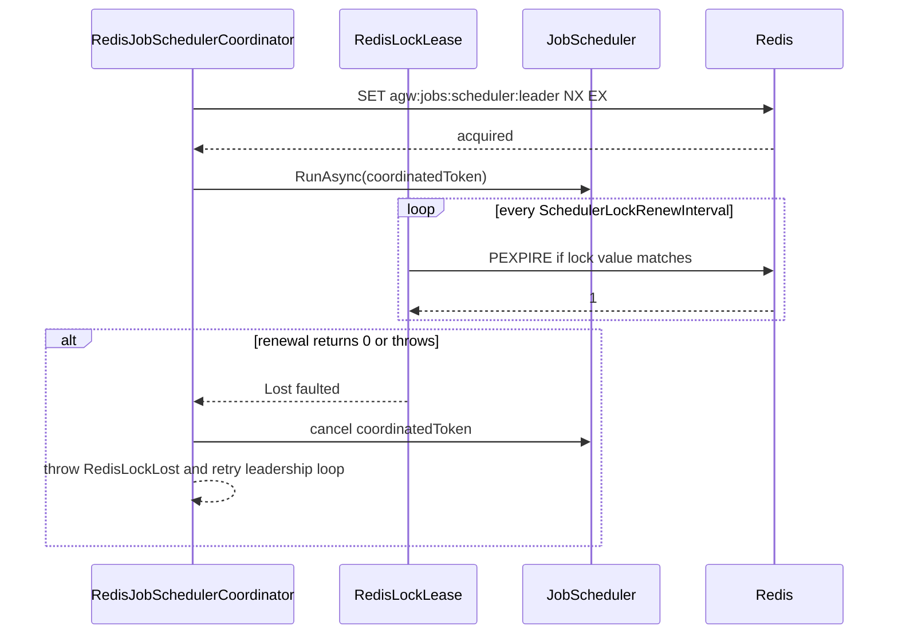

## Scheduler Design

`JobScheduler` has two long-running loops:

- `RunPrefetchLoopAsync`: periodically prefetches due jobs from `IJobStore` within a future window.
- `RunDispatchLoopAsync`: takes due jobs from the in-memory priority queue and dispatches them to the worker pool.

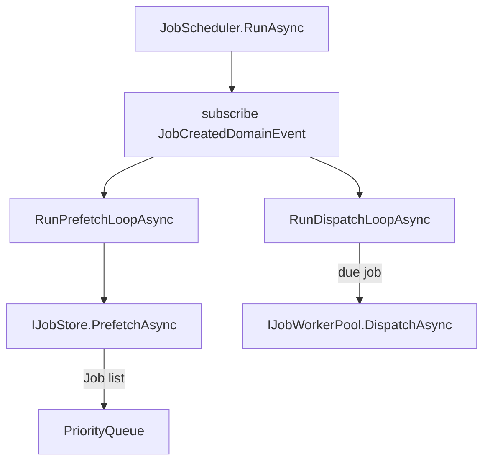

### Prefetching

Prefetching uses these settings:

- `Jobs:Scheduler:PrefetchInterval`
- `Jobs:Scheduler:PrefetchWindow`

Flow:

1. Get the current UTC time as `now`.
2. Query jobs due within `[now, now + PrefetchWindow]`.
3. Map each job into `InMemoryJob`, store it in `_taskMap`, and enqueue it into the priority queue.
4. Wait for `PrefetchInterval`, or wake when `_prefetchSignal` is released.

`JobCreatedDomainEvent` accelerates prefetching for one-shot jobs. If the new job is `TriggerType.Once`, enabled, pending, and its `NextRunTime` is within one `PrefetchInterval`, the scheduler releases `_prefetchSignal`.

### Versioned Queue

The same job can be enqueued multiple times, for example after a failed dispatch retry or after a recurring job calculates its next run time. The scheduler records the latest version in `_taskMap[jobId].Version`. When a queue item is dequeued, it is discarded if its `Version` does not match the current version.

### Serial Dispatch Per Project

The scheduler uses `_runningProjects` and `_projectBacklog` to ensure jobs with the same `ProjectId` are dispatched serially.

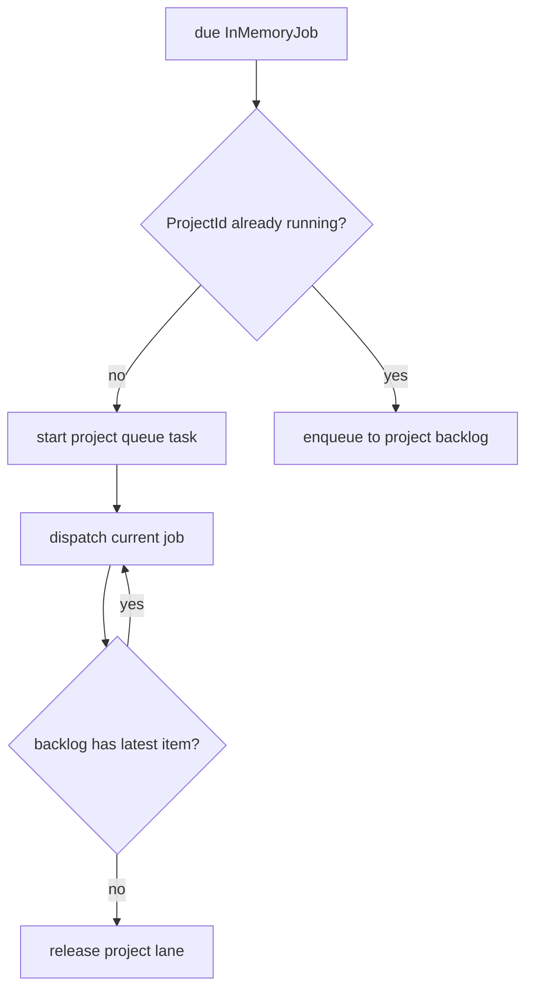

Note: project-lane serialization only controls scheduler selection and dispatch order. Before execution, the worker still acquires `IProjectExecutionLock`, which protects concurrency within the current deployment mode and across exceptional paths.

### Worker Selection

The scheduler calls `IJobWorkerPool.ListAvailableWorkersAsync` to get available workers. If no worker is available, it throws `JobWorkerUnavailable`.

Available workers are sorted by `WorkerId`, then selected round-robin using `_workerSelectionCursor`. This makes dispatch order predictable when the worker set is stable and keeps load distribution simple when the worker set changes.

### Dispatch Failure Handling

If `DispatchAsync` fails, the scheduler:

1. Logs the error.
2. Sets the current job's `NextRunTime` to `UtcNow + DispatchRetryDelay`.
3. Re-enqueues the job into the in-memory queue.
4. Releases the current project lane.

This is a dispatch failure, not a job execution failure. It does not directly update the persisted job retry count. Job execution failures are handled by `JobWorker`.

## Worker Design

`JobWorker` is the execution boundary for a single job.

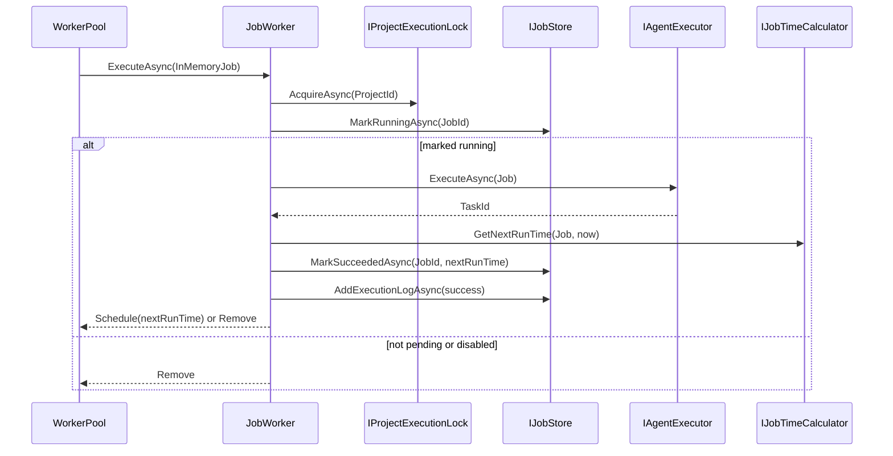

Failure handling:

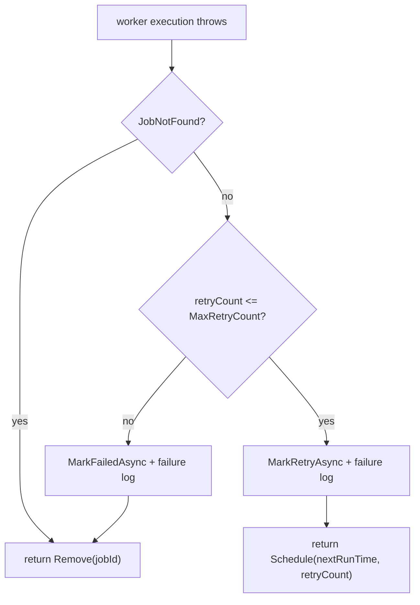

Success handling:

- If `IJobTimeCalculator.GetNextRunTime` returns a time, the worker marks the job back to `Pending`, resets the retry count, and returns `Schedule`.
- If there is no next run time, the worker disables the job, sets its status to `Paused`, and returns `Remove`.

## WorkerPool Design

`IJobWorkerPool` is the boundary between the scheduler and worker nodes.

```csharp
Task RegisterAsync(JobWorkerDescriptor worker, CancellationToken cancellationToken);
Task HeartbeatAsync(JobWorkerDescriptor worker, CancellationToken cancellationToken);
Task UnregisterAsync(string workerId, CancellationToken cancellationToken);
Task<IReadOnlyList<JobWorkerDescriptor>> ListAvailableWorkersAsync(CancellationToken cancellationToken);
Task<JobWorkerDispatchResult> DispatchAsync(JobWorkerDescriptor worker, InMemoryJob job, CancellationToken cancellationToken);
```

### LocalJobWorkerPool

The local implementation only maintains an in-memory dictionary:

- `RegisterAsync` stores the worker descriptor.
- `HeartbeatAsync` updates `LastSeenAt`.
- `UnregisterAsync` removes the worker descriptor.
- `ListAvailableWorkersAsync` returns local workers sorted by `WorkerId`.
- `DispatchAsync` directly calls the injected `IJobWorker.ExecuteAsync`.

### RedisJobWorkerPool

The Redis implementation stores the worker registry and dispatch result queues in Redis:

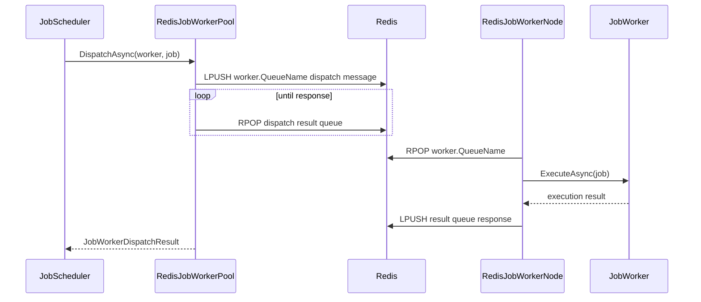

`RedisJobWorkerPool.ListAvailableWorkersAsync`:

1. Reads worker ids from `agw:jobs:workers`.
2. Reads each `agw:jobs:workers:{workerId}` descriptor.
3. Cleans up workers whose descriptor is missing or whose `LastSeenAt + WorkerTimeout < now`.
4. Returns available workers sorted by `WorkerId`.

## WorkerNode Design

`IJobWorkerNode` represents the lifecycle of the current process joining the system as a worker.

### LocalJobWorkerNode

The single-node worker node only registers the local worker, then waits until the host stops. The default worker id is `{MachineName}-{ProcessId}`, and the queue name is `local`.

### RedisJobWorkerNode

The cluster worker node has two loops:

- Heartbeat loop: calls `IJobWorkerPool.HeartbeatAsync` every `HeartbeatInterval`.
- Consume loop: reads dispatch messages from its own Redis queue and executes `JobWorker` concurrently.

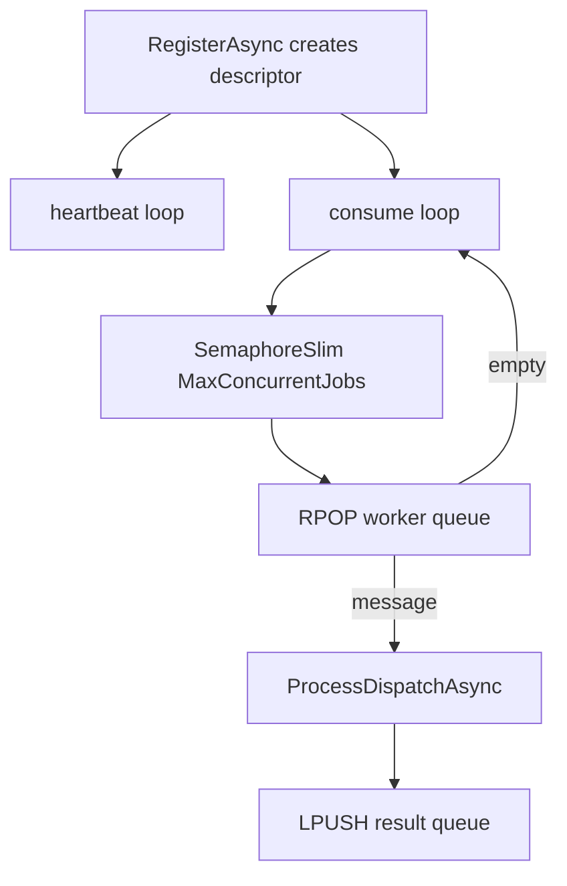

`MaxConcurrentJobs` controls local execution concurrency for a single worker node. The worker descriptor also carries this value, but the current scheduler only round-robins by worker count and does not weight selection by concurrency capacity.

## Configuration

Configuration lives in `src/backend/Agw.Host/appsettings.json`.

```json
{
  "Jobs": {
    "Scheduler": {
      "PrefetchInterval": "00:01:00",
      "PrefetchWindow": "00:10:00",
      "DispatchRetryDelay": "00:00:30"
    },
    "Worker": {
      "RetryDelay": "00:00:30"
    },
    "WorkerPool": {
      "Mode": "SingleNode",
      "MaxConcurrentJobs": 4,
      "HeartbeatInterval": "00:00:10",
      "WorkerTimeout": "00:00:30",
      "QueuePollInterval": "00:00:00.200",
      "DispatchPollInterval": "00:00:00.200",
      "DispatchResultTtl": "00:10:00",
      "SchedulerLockTtl": "00:00:30",
      "SchedulerLockRetryDelay": "00:00:05",
      "SchedulerLockRenewInterval": "00:00:10"
    }
  }
}
```

| Setting | Description |
| --- | --- |
| `Jobs:Scheduler:PrefetchInterval` | Scheduler prefetch loop interval. It is also the window used to decide whether a newly created one-shot job should wake prefetch immediately. |
| `Jobs:Scheduler:PrefetchWindow` | Future time window used by each prefetch. |
| `Jobs:Scheduler:DispatchRetryDelay` | Delay before a dispatch failure is re-enqueued into the in-memory schedule. |
| `Jobs:Worker:RetryDelay` | Delay before the next run when job execution fails but can still be retried. |
| `Jobs:WorkerPool:Mode` | `SingleNode` or `Cluster`. |
| `Jobs:WorkerPool:WorkerId` | Optional. Specifies the current worker id. If empty, `{MachineName}-{ProcessId}` is used. |
| `Jobs:WorkerPool:NodeId` | Optional. Specifies the current node id. If empty, `MachineName` is used. |
| `Jobs:WorkerPool:MaxConcurrentJobs` | Maximum local execution concurrency for a single worker node. |
| `Jobs:WorkerPool:HeartbeatInterval` | Redis worker heartbeat interval. |
| `Jobs:WorkerPool:WorkerTimeout` | Redis worker descriptor TTL. It is also the availability expiration window for workers. |
| `Jobs:WorkerPool:QueuePollInterval` | Wait interval when the Redis worker queue is empty or when the consume loop sees an exception. |
| `Jobs:WorkerPool:DispatchPollInterval` | Polling interval used by the Redis worker pool while waiting for dispatch results. |
| `Jobs:WorkerPool:DispatchResultTtl` | TTL for the dispatch result queue. |
| `Jobs:WorkerPool:SchedulerLockTtl` | TTL for the Redis scheduler leader lock. |
| `Jobs:WorkerPool:SchedulerLockRetryDelay` | Retry interval when scheduler leadership is not acquired. |
| `Jobs:WorkerPool:SchedulerLockRenewInterval` | Renewal interval after the scheduler leader lock is acquired. |

## Usage

### Default Single-Node Run

Keep the default configuration:

```json
{
  "Jobs": {
    "WorkerPool": {
      "Mode": "SingleNode"
    }
  }
}
```

Run the host:

```bash
dotnet run --project src/backend/Agw.Host
```

In this mode, the scheduler and worker run in the same process.

### Enable Cluster Mode

Run the same host on every node and point all nodes at the same Redis instance:

```json
{
  "Redis": {
    "ConnectionString": "localhost:6379,abortConnect=false"
  },
  "Jobs": {
    "WorkerPool": {
      "Mode": "Cluster"
    }
  }
}
```

In cluster mode:

- All nodes register as Redis workers.
- All nodes compete for the scheduler leader lock.
- At any time, only the node holding `agw:jobs:scheduler:leader` runs the scheduler.
- If the leader loses the Redis lock, the current scheduler is canceled and the node re-enters leader competition.

If multiple processes run on the same machine, the default worker id still includes the process id, so it will not conflict. In production, `Jobs:WorkerPool:WorkerId` can also be used to specify a stable id explicitly.

### Tests

The Jobs test project is not currently included in `Agw.slnx`. When changing Jobs scheduling, workers, worker pools, or the Redis coordinator, run it separately:

```bash
dotnet test tests/Agw.Jobs.Tests/Agw.Jobs.Tests.csproj
```

When changing `RedisLock` or `ErrorCodes`, also run:

```bash
dotnet test tests/Agw.Shared.Tests/Agw.Shared.Tests.csproj
```

## Main Data Flows

### Create And Execute A One-Shot Job

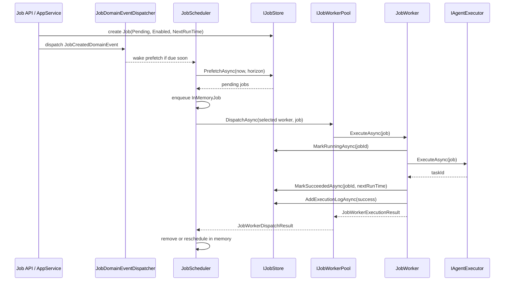

### Reschedule A Recurring Job After Success

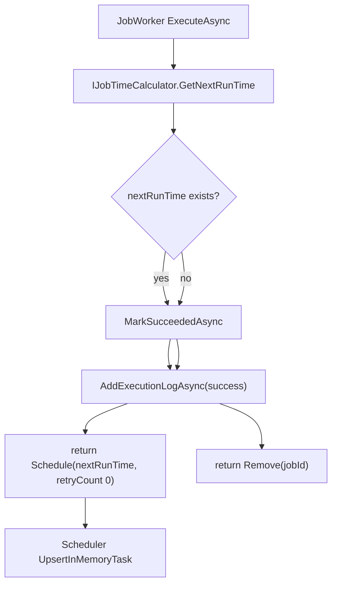

### Execution Failure And Retry

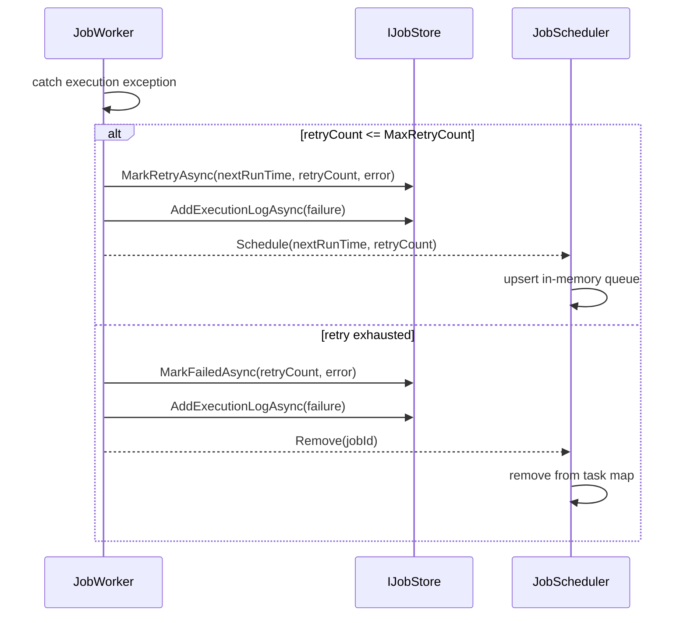

### Redis Cluster Dispatch

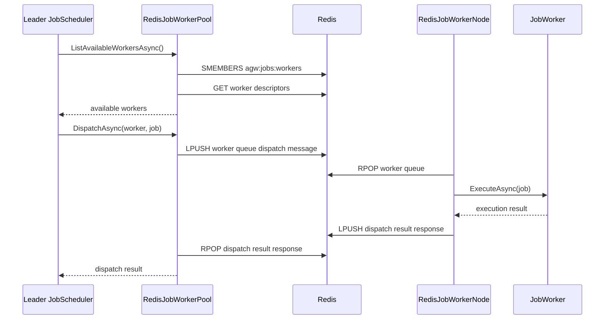

## Consistency And Failure Boundaries

| Scenario | Current behavior |
| --- | --- |
| Scheduler process restarts | The in-memory queue is lost. The new scheduler prefetches pending jobs from the database again. |
| Worker unavailable | If `ListAvailableWorkersAsync` returns no workers, `JobWorkerUnavailable` is thrown and the scheduler reschedules the job in memory after `DispatchRetryDelay`. |
| Redis worker heartbeat expires | `RedisJobWorkerPool.ListAvailableWorkersAsync` cleans up the expired worker and no longer dispatches to it. |
| Redis dispatch response fails | The pool throws `JobWorkerDispatchFailed`; the scheduler treats it as a dispatch failure and reschedules after a delay. |
| Worker execution fails | The worker updates DB retry/failure state and writes an execution log. The scheduler reschedules or removes the in-memory item based on the execution result. |
| Scheduler leader lock is lost | The coordinator cancels the current scheduler, throws `RedisLockLost`, and then competes for the leader lock again. |
| Same-project concurrency | The scheduler-side project lane serializes dispatch, and the worker-side project lock protects actual execution. |

## Extension Guidance

To add a new worker pool, implement:

- `IJobWorkerPool`
- `IJobWorkerNode`
- `IJobSchedulerCoordinator`, if multi-node scheduler coordination is required

Then replace the default implementation through DI configuration. `Scheduler` and `Worker` should not depend on the concrete transport mechanism.

When adding new job execution behavior, prefer placing it in `JobWorker` or one of its dependencies. Do not move execution details back into `JobScheduler`, because that would break the boundary between scheduling and execution.
