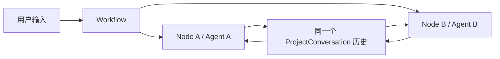
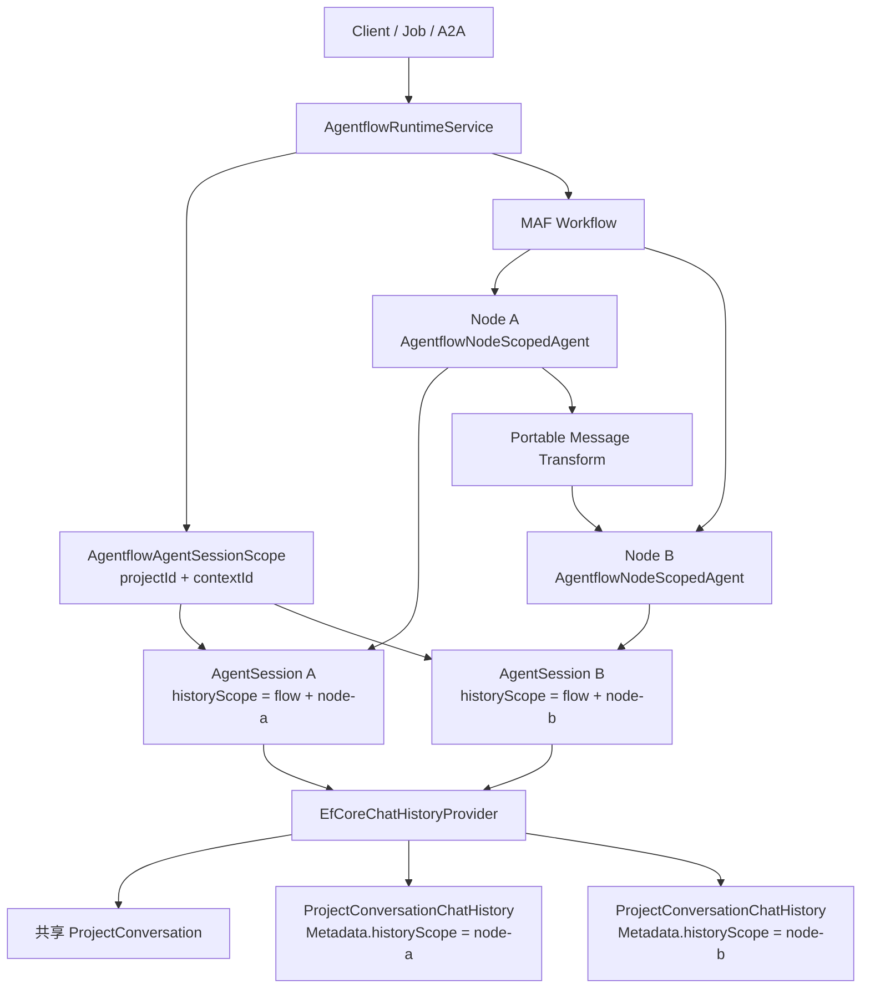
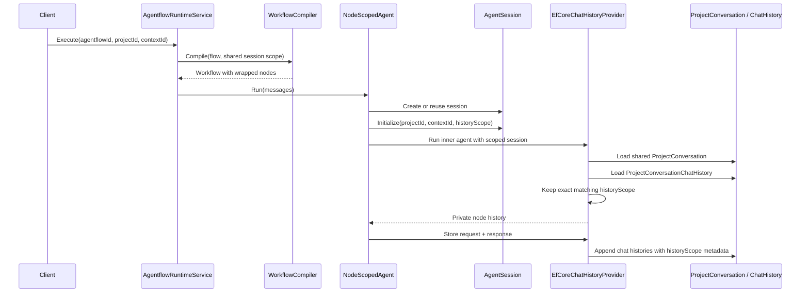
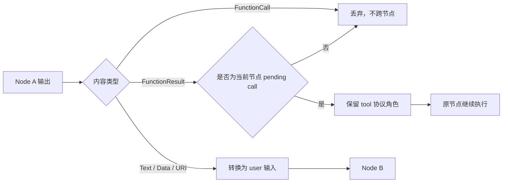
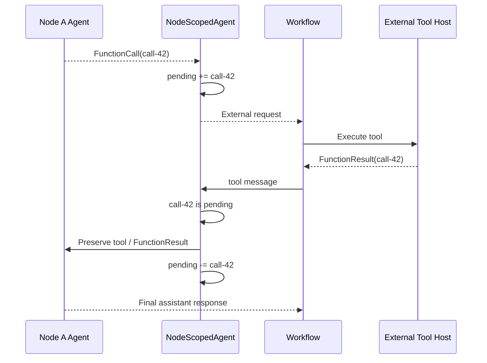

# Agentflow Workflow 上下文分层与节点历史隔离方案

> 状态：已实现并完成回归验证｜日期：2026-07-14｜适用范围：Agw 后端 Agentflow / Workflow 运行时与聊天历史持久化

## 摘要

Agentflow 中的多个 Agent 需要共享同一次 Workflow 的业务上下文，否则任务归属、完整对话、审计记录和执行追踪都会被拆散。但是，共享业务上下文不等于共享模型历史，更不等于可以在不同 Agent 之间直接转发底层工具协议消息。

原实现使用同一组 `projectId/contextId` 作为所有节点的历史查询条件。结果是：一个节点产生的 `assistant.tool_calls`、`tool` / `FunctionResultContent` 等模型协议消息，会进入其他节点的历史；当下游节点或下一轮调用重新加载这些记录时，工具结果可能已经失去与之配对的工具调用，最终触发 OpenAI 的请求校验错误：

```text
HTTP 400 (invalid_request_error)
Messages with role 'tool' must be a response to a preceding message with 'tool_calls'
```

本方案将上下文拆成三个层次：

1. **Workflow 业务上下文**：整个 Workflow 继续共享一个 `ProjectConversation`（由 `projectId + contextId` 标识）。
2. **节点模型历史**：每个 Agentflow 节点中的 Agent 实例使用独立的 `historyScope`。
3. **节点间交接消息**：只传递文本、数据和 URI 等可移植内容，不传递其他节点的工具协议状态。

同时，方案保留同一节点内的外部工具调用续接能力，并在读取旧历史时过滤孤立的 `FunctionResultContent`。整个改造复用 `ProjectConversationChatHistory.Metadata`，不新增表或字段，不需要 EF Core migration。

## 1. 背景与问题

### 1.1 原来的上下文模型

Agentflow 执行时，`AgentflowRuntimeService` 会解析或创建一组：

```text
projectId + contextId + taskId
```

其中 `projectId/contextId` 被写入 Agent 的 `AgentSession`，`EfCoreChatHistoryProvider` 再根据这两个值查找 `ProjectConversation` 和对应的全部 `ProjectConversationChatHistory`。这套设计用于单 Agent 对话是成立的，因为同一个 context 下通常只有一条模型历史。

问题出现在多 Agent Workflow：所有节点都被初始化为同一个 `projectId/contextId`，历史提供器也没有节点维度，因此 Node A、Node B 和 Block 内部参与者加载的是同一批模型消息。



这意味着业务层想要的“共享任务”被错误地实现成了模型层的“共享全部消息”。

### 1.2 工具消息不是普通聊天内容

工具调用消息带有严格的协议约束。一个有效片段通常是：

```text
assistant: FunctionCallContent(callId = call-1)
tool:      FunctionResultContent(callId = call-1)
assistant: 最终回答
```

`tool` 消息不能脱离前面的 `assistant` 工具调用单独存在。不同模型提供商对具体字段的命名略有差异，但这个配对约束基本一致。

在 Workflow 中，Node A 的输出会成为 Node B 的输入。Node B 真正需要的是 Node A 的业务结果，例如“文件内容如下”或“分析完成”，而不是 Node A 与工具运行时之间的内部协议。原实现没有建立这条边界，原始工具消息可能被下游节点再次持久化，形成类似下面的历史：

```text
user: 继续处理任务
tool: FunctionResultContent(callId = call-1)  // 前面没有对应的 FunctionCallContent
```

这段历史在 Web 对话页看起来可能只是多了一条工具记录，但重新提交给 OpenAI 时会在模型真正执行前直接返回 HTTP 400。

### 1.3 为什么只过滤报错消息不够

只在发送请求前删除孤立 `tool` 消息，可以暂时绕开 400，但没有解决两个根本问题：

- 不同节点仍会读取彼此的模型历史，提示词、角色和中间状态继续互相污染。
- 新的跨节点工具协议消息仍会不断写入共享历史，数据污染会持续累积。

因此必须同时治理**历史隔离、消息交接和旧数据防御**，缺一项都只是 workaround。

## 2. 设计目标与边界

### 2.1 目标

- 同一次 Agentflow 执行及其后续轮次继续共享一个 `ProjectConversation`。
- 每个持久化 Agentflow 节点拥有独立、稳定的模型历史。
- Node A 的工具协议不能进入 Node B 的模型上下文。
- Node A 的文本、数据和 URI 输出可以作为普通输入交给 Node B。
- 外部工具结果返回原节点时，仍以合法的 `tool` 消息继续同一次工具调用。
- 旧数据中的孤立工具结果不能再破坏后续模型请求。
- 普通单 Agent 对话保持原来的无作用域历史行为。
- 不增加数据库迁移，不破坏已有 `ProjectConversationChatHistory.Metadata` 内容。

### 2.2 非目标

- 不把每个节点拆成独立 `ProjectConversation`。
- 不尝试让不同 Agent 共享对方的完整推理过程或工具调用栈。
- 不改变 Workflow 图的边、Fan-out、Fan-in、Human Gate 或 Output 语义。
- 不迁移或重写历史 `ProjectConversationChatHistory`。
- 不把 `historyScope` 暴露为用户配置项。

## 3. 核心判断：共享 Workflow Context，隔离 Agent Context

这里容易混淆三个名字相近但职责完全不同的对象。

| 层次                  | 作用                                    | 共享范围            | 当前载体                               |
| --------------------- | --------------------------------------- | ------------------- | -------------------------------------- |
| Workflow 业务上下文   | 任务归属、完整对话、审计、UI 历史、追踪 | 整个 Workflow       | `ProjectConversation(projectId, contextId)` |
| Agent 节点模型历史    | 给某个节点下一轮推理使用的消息          | 单个 Agentflow 节点 | `historyScope` + `AgentSession`        |
| Workflow 运行时上下文 | MAF 执行器之间的调度和消息传递          | 单次运行            | `IWorkflowContext` / Workflow runtime  |

本方案的原则可以压缩成一句话：

> `ProjectConversation` 负责“这是谁的任务”，`historyScope` 负责“这个节点见过什么”，Workflow 边负责“节点之间这次要传什么”。

准确地说，隔离粒度是**持久化节点中的 Agent 实例**，而不是 Agent 定义本身。同一个 Agent 定义如果被放进两个不同节点，会得到两份历史。这样可以避免复用定义时出现隐式共享状态，也更符合 Workflow 图的执行语义。

## 4. 总体架构



这个结构保留了一份完整的 Workflow 业务记录，但模型读取历史时只取自己的分区。节点之间的数据传递不依赖“偷看共享历史”，而是明确经过 Workflow 边和可移植消息转换。

## 5. History Scope 设计

### 5.1 作用域格式

节点历史作用域使用下面的稳定格式：

```text
agentflow:{agentflowId:N}:node:{nodeId}
```

示例：

```text
agentflow:9dbf5ecf44ef45da8dd0374b54d7a29d:node:researcher
agentflow:9dbf5ecf44ef45da8dd0374b54d7a29d:node:reviewer
```

其中：

- `agentflowId:N` 使用 32 位无连字符 GUID，避免不同 GUID 格式产生两个逻辑作用域。
- `nodeId` 使用数据库中持久化的 Agentflow 节点标识。
- 比较采用精确的 `StringComparison.Ordinal`，不做模糊匹配。

作用域包含 Agentflow ID，而不只是 Node ID。这样即使两个不同 Workflow 都有名为 `reviewer` 的节点，也不会共享历史。

### 5.2 为什么 Block 使用持久化 Node ID

Block 内部参与者可能拥有组合运行时 ID，例如：

```text
group-block.participant
```

这个 ID 用于避免执行器重名，但它不是历史归属的稳定身份。如果把它用于历史作用域，同一个持久化节点在普通边和 Block 内被引用时会得到两套历史，Block 结构变化也可能意外重置历史。

因此 `AgentflowNodeScopedAgent` 分开保存两个 ID：

- `_nodeId`：Workflow runtime 中的执行器 ID。
- `_historyNodeId`：用于生成 `historyScope` 的持久化节点 ID。

Block 参与者显式传入 `historyNodeId: participantNode.NodeId`。嵌套 Workflow 则使用各自所属 Agentflow 的 ID 和内部持久化节点 ID，因此外层节点与内层节点仍然相互隔离。

### 5.3 Session State 扩展

`IProviderSessionState` 保留原来的无作用域初始化方法，并要求 Provider 实现带 `historyScope` 的重载：

```csharp
void InitializeSessionState(
    AgentSession session,
    string contextId,
    Guid projectId,
    string historyScope);
```

`nodeName` 后来作为兼容重载加入：默认实现会回落到上述 scoped 方法，`EfCoreChatHistoryProvider` 则同时保存节点名称。只有显示标签可以回落；`historyScope` 本身不能静默退回无作用域历史，否则某个 Provider 会重新加载整个 context。`NodeName` 只影响响应消息归属，不改变历史分区；完整规则见 [Agentflow 指南](../6.Agentflow.md)。

`EfCoreChatHistoryProvider.State` 对应保存可空的 `HistoryScope` 和 `NodeName`：

```text
State
├── ProjectId
├── ContextId
├── HistoryScope?
└── NodeName?
```

普通 Agent 仍使用 `HistoryScope = null`。Agentflow 节点在运行前由 `AgentflowAgentSessionScope.Initialize` 写入非空作用域。

## 6. 持久化模型

### 6.1 复用 ProjectConversationChatHistory.Metadata

历史作用域写入现有 `ProjectConversationChatHistory.Metadata`：

```json
{
  "historyScope": "agentflow:9dbf5ecf44ef45da8dd0374b54d7a29d:node:reviewer"
}
```

如果消息原本已经包含 `targetType`、`targetId` 等 metadata，新的键会合并进去，不覆盖既有内容：

```json
{
  "targetType": "agentflow",
  "targetId": "9dbf5ecf-44ef-45da-8dd0-374b54d7a29d",
  "historyScope": "agentflow:9dbf5ecf44ef45da8dd0374b54d7a29d:node:reviewer"
}
```

这样做的直接收益是无需修改 `ProjectConversationChatHistory` 表结构。SQLite 会按已有转换存储 JSON 文本，PostgreSQL 使用现有 `jsonb` 映射。

### 6.2 写入规则

| 会话类型                   | `historyScope` metadata              |
| -------------------------- | ------------------------------------ |
| 普通单 Agent 会话          | 不写入                               |
| Agentflow Node A           | 写入 Node A scope                    |
| Agentflow Node B           | 写入 Node B scope                    |
| Block 参与者               | 写入持久化 participant node scope    |
| Workflow-as-Agent 外层节点 | 写入外层 Agentflow node scope        |
| 嵌套 Workflow 内部节点     | 写入嵌套 Agentflow 自己的 node scope |

所有记录仍通过 `ConversationId` 指向同一个 `ProjectConversation`，并继续使用全局 `ConversationSequence` 排序。因此 UI、任务查询和审计可以看到完整的跨节点时间线。

### 6.3 读取规则

读取时按“记录作用域与会话作用域完全相等”过滤：

```text
record.Metadata.historyScope == session.State.HistoryScope
```

这条规则同时覆盖两种情况：

- scoped session 只读取完全相同的 scoped record。
- unscoped session 只读取没有 `historyScope` 的旧记录或普通 Agent 记录。

因此普通 Agent 不会误读 Agentflow 新产生的节点历史，Agentflow 节点也不会读取部署前遗留的无作用域 Workflow 历史。

## 7. 完整执行链路

### 7.1 Workflow 创建与节点 Session 初始化

1. `AgentflowRuntimeService` 接收执行请求，解析 `projectId` 和 `contextId`，生成或接收 `taskId`。
2. Runtime 创建共享的 `AgentflowAgentSessionScope`。它只保存项目、context 和 task 信息，不提前绑定节点。
3. `AgentflowWorkflowCompiler` 按图构建节点，并用 `AgentflowNodeScopedAgent` 包装每个真实 Agent、Workflow-as-Agent 和 Block Agent。
4. 节点第一次执行时，包装器创建或复用内层 `AgentSession`。
5. 包装器将当前 `agentflowId` 和持久化 `nodeId` 交给共享 session scope。
6. session scope 生成 `historyScope`，调用 `IProviderSessionState.InitializeSessionState` 写入节点自己的 Session State。
7. 内层 Agent 调用 `EfCoreChatHistoryProvider` 时，历史提供器就能同时获得共享的 `projectId/contextId` 和私有的 `historyScope`。



### 7.2 历史写入链路

`StoreChatHistoryAsync` 会把当前请求消息和响应消息合并，然后：

1. 从 Session State 读取 `ProjectId`、`ContextId` 和 `HistoryScope`。
2. 查找或创建共享 `ProjectConversation`。
3. 计算该 `ProjectConversation` 下的下一个全局 `ConversationSequence`。
4. 为每条消息创建 `ProjectConversationChatHistory`。
5. 保留原 metadata，并追加 `historyScope`。
6. 一次性保存。

节点隔离没有改变业务时间线，只改变模型下一次读取哪些记录。

### 7.3 历史读取链路

`ProvideChatHistoryAsync` 的处理顺序如下：

1. 从 `AgentSession` 读取 Provider State。
2. 根据 `projectId/contextId` 定位共享 `ProjectConversation`。
3. 读取具有 `ConversationPayload` 的 `ProjectConversationChatHistory`。
4. 只保留作用域与当前 Session 完全相同的记录。
5. 按 `ConversationSequence`、`CreateTime`、`Id` 排序并反序列化。
6. 排除只用于 Workflow 最终展示的 `type=result` 消息。
7. 删除没有对应审批响应的旧 `ToolApprovalRequestContent`。
8. 删除仍然孤立的 `FunctionResultContent`，同时保留合法的 call/result 对和普通 Tool 文本。

最后两步是防御性处理。作用域隔离阻止新污染跨节点扩散，读取过滤负责让已有坏数据不再触发模型协议错误。

## 8. 节点间消息交接

### 8.1 可移植内容白名单

进入真实 Agent 前，`AgentflowNodeScopedAgent` 会调用 `CreatePortableAgentInput`。规则如下：

| 输入消息                               | 处理方式                 |
| -------------------------------------- | ------------------------ |
| 非 `assistant` / `tool` 消息           | 原样保留                 |
| 其他 Agent 的 `TextContent`            | 保留，并改成 `user` 角色 |
| 其他 Agent 的 `DataContent`            | 保留，并改成 `user` 角色 |
| 其他 Agent 的 `UriContent`             | 保留，并改成 `user` 角色 |
| `FunctionCallContent`                  | 不跨节点转发             |
| 不属于本节点的 `FunctionResultContent` | 不跨节点转发             |
| `UsageContent`、推理内容等内部内容     | 不作为下游业务输入转发   |

将上游可移植结果改为 `user` 角色，是为了让目标 Agent 把它理解为“这次需要处理的输入”，而不是错误地把它当成自己已经生成过的 assistant 历史。



### 8.2 为什么采用白名单

这里没有做“遇到已知危险类型才删除”的黑名单。AI SDK 会持续增加新的 `AIContent` 类型，黑名单很容易在升级后漏过新的协议内部状态。

白名单只允许明确可作为业务输入的内容跨 Agent 边界。代价是未来如果要传递新的结构化内容，需要显式加入规则，但这个成本比悄悄制造一条无效模型历史低得多。

## 9. 同一节点的外部工具续接

简单删除全部 `FunctionResultContent` 会产生另一个 bug：某些工具调用不是在 Agent 内部立即完成，而是通过 Workflow external request 暂停，等待宿主或用户返回结果。这个结果再次进入的是同一个 Workflow executor，它必须保留 `tool` 角色，否则原 Agent 无法完成工具调用。

为区分“本节点续接”和“其他节点泄漏”，`AgentflowNodeScopedAgent` 在 `AgentSession.StateBag` 中维护：

```text
PendingFunctionCallIds: HashSet<string>
```

状态变化如下：

1. 节点输出 `FunctionCallContent(callId)` 时，将 call ID 加入集合。
2. 外部结果返回时，如果 `FunctionResultContent.callId` 在集合中，则保留 `tool` 角色和结果内容。
3. 结果进入节点后，从 pending 集合删除 call ID。
4. 不在集合中的工具结果按跨节点消息处理，不会进入目标 Agent。



流式与非流式执行都使用同一套 pending call 维护逻辑，避免两个入口行为不一致。

## 10. 旧历史与兼容策略

### 10.1 旧 Agentflow 历史

部署前的 Agentflow 记录没有 `historyScope`。新节点使用非空 scope，因此不会加载这些无作用域记录。实际效果是：

- 旧记录仍在同一个 `ProjectConversation` 下，Web 历史、任务查询和审计数据不丢失。
- 新 Agentflow 节点从一份干净的模型历史开始。
- 不需要猜测旧记录属于哪个节点，也不需要做高风险的数据回填。

这是有意选择的兼容策略。旧记录已经可能存在跨节点污染，自动迁移不仅难以准确归属，还可能把坏的工具协议重新带入新作用域。

### 10.2 普通 Agent 历史

普通 Agent 继续使用 `HistoryScope = null`，并且只读取同样没有 scope 的记录。因此本次改造不会改变普通聊天的历史连续性。

### 10.3 孤立 Function Result 防御

读取历史时维护一个临时 `pendingCallIds`：

- 遇到 assistant 消息时，记录其中的 `FunctionCallContent.callId`。
- 紧随其后的 tool 消息只保留能匹配 pending call 的 `FunctionResultContent`。
- 遇到 user、system 或其他非 tool 角色时清空 pending 状态。
- Tool 消息中的普通文本等非 `FunctionResultContent` 内容继续保留。

因此合法工具调用对不会被破坏，只有无法证明配对关系的结果会被丢弃。

### 10.4 数据库兼容

本方案不需要 migration。回滚旧代码时数据库结构也不会报错，旧版本会忽略 metadata 中的新键。但需要注意：旧代码不会执行 scope 过滤，行为上会重新退回“所有节点共享历史”，因此代码回滚等于恢复原风险，不能视为无损行为回滚。

## 11. 关键实现位置

- [`AgentflowRuntimeService.cs`](../../src/server/Agw.Agents/Execution/Agentflows/AgentflowRuntimeService.cs)：解析共享的 project/context，并把 session scope 传入 Workflow 编译过程。
- [`AgentflowWorkflowCompiler.cs`](../../src/server/Agw.Agents/Execution/Agentflows/AgentflowWorkflowCompiler.cs)：生成 scope 字符串，并为 Agent、Workflow-as-Agent 和 Block 绑定节点包装器。
- [`AgentflowNodeScopedAgent.cs`](../../src/server/Agw.Agents/Execution/Agentflows/AgentflowNodeScopedAgent.cs)：初始化节点 Session、执行消息净化、维护 pending tool call。
- [`AgentflowMessageTransforms.cs`](../../src/server/Agw.Agents/Execution/Agentflows/AgentflowMessageTransforms.cs)：实现跨节点可移植消息白名单。
- [`AgentflowBlockBuildSupport.cs`](../../src/server/Agw.Agents/Execution/Agentflows/Builders/AgentflowBlockBuildSupport.cs)：确保 Block 参与者使用持久化节点 ID 作为历史身份。
- [`IProviderSessionState.cs`](../../src/server/Agw.Shared/Contracts/Projects/IProviderSessionState.cs)：声明 scoped session state 初始化契约。
- [`EfCoreChatHistoryProvider.cs`](../../src/server/Agw.Projects/Domain/Services/EfCoreChatHistoryProvider.cs)：持久化和过滤 `historyScope`，并清理旧的孤立工具结果。

## 12. 测试与验收

### 12.1 关键回归场景

本次改造覆盖以下行为：

1. **共享 ProjectConversation、隔离历史**：Node A、Node B 和普通无作用域会话写入同一 `ProjectConversation`，但各自只能读到自己的消息。

2. **作用域正确持久化**：`ProjectConversationChatHistory.Metadata.historyScope` 按节点写入，不覆盖已有 target metadata。

3. **跨节点只转发可移植内容**：Node A 同时产生 FunctionCall、FunctionResult 和最终文本时，Node B 只收到被重标记为 user 的最终可移植内容。

4. **同节点外部工具续接**：Agent 发出 external FunctionCall，宿主返回匹配结果后，原 Agent 能收到合法的 Tool / FunctionResult 消息并继续执行。

5. **Block 历史身份稳定**：`group.participant` 这样的 runtime ID 不会进入 history scope，scope 使用持久化的 `participant` Node ID。

6. **旧孤立工具结果被过滤**：无匹配调用的 FunctionResult 被排除，合法 call/result 对和普通 Tool 文本保持不变。

7. **普通 Agent 兼容**：未使用 scoped overload 的会话继续读写无作用域历史。

对应测试主要位于：

- [`AgentflowWorkflowCompilerTests.cs`](../../tests/Agw.Agents.Tests/AgentflowWorkflowCompilerTests.cs)
- [`EfCoreChatHistoryProviderTests.cs`](../../tests/Agw.Projects.Tests/EfCoreChatHistoryProviderTests.cs)

当前实现可通过以下命令重复验证：

```bash
dotnet test tests/Agw.Agents.Tests/Agw.Agents.Tests.csproj
dotnet test tests/Agw.Projects.Tests/Agw.Projects.Tests.csproj
dotnet test Agw.slnx
```

### 12.2 验收标准

- 同一 `projectId/contextId` 下的两个 Agentflow 节点不能读取彼此的模型历史。
- Project conversation/history API 仍能看到同一个 context 下的完整记录。
- 下游节点输入中不能出现上游节点的原始 FunctionCall/FunctionResult 协议对。
- 匹配当前节点 pending call 的外部 FunctionResult 必须能够续接。
- 历史中存在孤立 tool result 时，模型请求不能再因此返回 HTTP 400。
- 不产生数据库 migration。

## 13. 取舍、限制与后续空间

### 13.1 当前取舍

**复用 Metadata，而不是新增列。** 这让改造可以无迁移上线，也避免扩大数据模型。但 `EfCoreChatHistoryProvider` 当前先按 `ConversationId` 读取记录，再在内存中按 scope 过滤。context 历史很长时，这不是最优查询路径。

**节点 ID 变化会形成新历史。** `historyScope` 以持久化 Node ID 为身份。如果编辑器删除节点再新建，即使绑定同一个 Agent 定义，也会被视为新的 Agent 实例。这是预期语义，但需要在未来的节点复制、导入和重建功能中保持清晰。

**跨节点结构化内容采用显式白名单。** 当前允许 Text、Data 和 URI。未来如果新增确实需要跨节点传递的内容类型，应先定义其业务语义，再加入白名单，而不是放开所有 `AIContent`。

### 13.2 可选后续优化

如果单个 `ProjectConversation` 的 `ProjectConversationChatHistory` 数量明显增大，可以考虑：

1. 将 `historyScope` 提升为独立可索引列。
2. 为 `(ConversationId, HistoryScope, ConversationSequence)` 建联合索引。
3. 提供后台诊断工具，统计无作用域 Agentflow 记录和孤立工具结果，但不自动迁移。
4. 在 trace 中增加 history scope 标签，方便排查节点历史装载问题；对外展示时仍隐藏内部 scope 字符串。
5. 为新的跨节点结构化数据设计独立 DTO，而不是借用模型工具协议。

这些优化都不影响本方案的核心边界，可以按实际数据规模逐步实施。

## 14. 备选方案与否决原因

### 方案 A：每个节点创建独立 ProjectConversation

隔离最彻底，但会把一次 Workflow 拆成多个 conversation。Web 历史、任务状态、Job 日志和审计查询都需要重新聚合，业务语义也变差，因此不采用。

### 方案 B：所有节点继续共享历史，只做孤立消息清理

实现最少，但只能处理已经变成孤儿的 tool result，无法阻止提示词、assistant 角色和未来协议内容的跨节点污染，因此不采用。

### 方案 C：完整复制上游工具调用对给下游节点

看起来可以满足协议配对，实际上会让 Node B 误以为自己发起过 Node A 的工具调用，还可能再次执行工具或触发审批。工具调用栈属于发起它的 Agent，不应该通过复制“伪造所有权”，因此不采用。

### 方案 D：立即新增 HistoryScope 数据库列

长期查询性能更好，但当前问题不需要 schema change 才能解决。先复用 Metadata 可以降低上线成本；等数据量证明需要索引时再做列迁移更稳妥。

## 15. 结论

Agentflow 的多个节点共享同一个 Project/Context 是合理的，但共享的应该是 Workflow 的业务事实，而不是每个模型调用的私有协议状态。

本方案通过 `ProjectConversation` 共享、`historyScope` 隔离和可移植消息交接三条边界，把“完整任务记录”和“节点可用模型历史”分开。再配合同节点 pending tool call 跟踪与旧历史防御，既修复了 OpenAI tool message 400，也保留了外部工具、Block 和嵌套 Workflow 的正常执行能力。

简单来说：Workflow 仍是一段完整的对话，但其中每个 Agent 只记得自己应该记得的部分。
