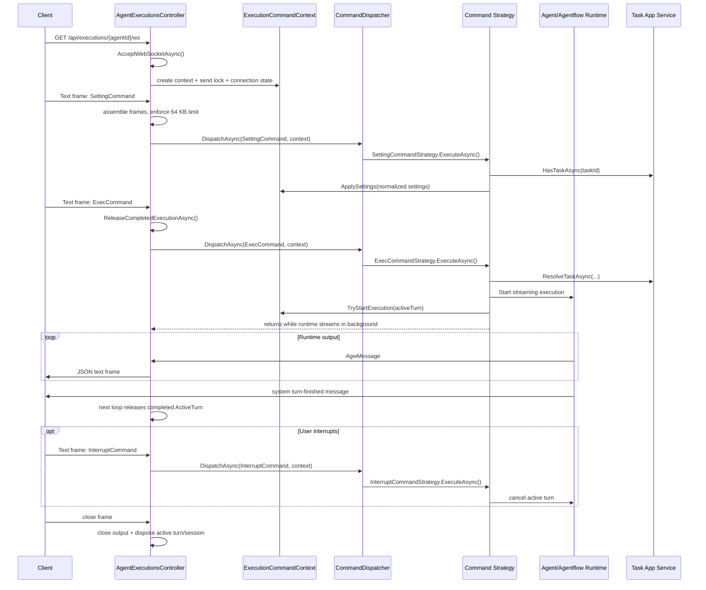

# WebSocket Execution Flow

This document describes the WebSocket architecture and data interaction process used by Agw agent and agentflow execution.

The execution endpoint is:

```text
GET /api/executions/{agentId}/ws
```

The same socket is used for:

- client-to-server execution commands
- server-to-client streamed AI messages
- interruption requests
- system messages and error messages

## Main Components

### Host Wiring

`src/backend/Agw.Host/Program.cs` enables WebSocket support with `app.UseWebSockets()` before controller routing. The execution controller is then reachable through normal MVC controller mapping.

### Backend Controller

`src/backend/Agw.Agents/Controllers/AgentExecutionsController.cs` owns the WebSocket lifetime.

Responsibilities:

- reject non-WebSocket requests with HTTP 400
- accept the WebSocket upgrade
- create one `ExecutionCommandContext` per socket
- read text messages from the client
- deserialize each message into an `AgentRunCommand`
- dispatch each command to the matching command strategy
- close the socket for invalid payloads, invalid message types, oversized requests, request cancellation, and unexpected errors
- interrupt and dispose any active execution when the socket ends

Important limits:

- receive buffer size: 4 KB
- maximum request payload size: 64 KB
- accepted inbound message type: text only

### Command Context

`src/backend/Agw.Agents/Application/Execution/CommandStrategies/ExecutionCommandContext.cs` is the per-socket shared state passed into command strategies.

It contains:

- `AgentId`: agent or agentflow id from the URL
- `CurrentUser`: user name captured from the request, defaulting to `system`
- `CancellationToken`: request lifetime cancellation token
- `WebSocket`: accepted socket
- `SendLock`: semaphore that serializes all server writes
- `ConnectionState`: mutable state for the active turn and settings
- `AgentSession`: reusable session for agent execution
- `CloseConnectionAsync`: controller-owned close callback
- `ObserveTurn`: callback used to observe background streaming tasks

The send lock is important because command strategies and background execution tasks can both write to the same WebSocket. Without serialization, concurrent `SendAsync` calls can corrupt WebSocket frame ordering or fail at runtime.

### Connection State

`src/backend/Agw.Agents/Application/Execution/ExecutionConnectionState.cs` tracks the state that lives for one socket.

Key values:

- `CurrentSettings`: latest `SettingCommand` accepted from the client
- `SessionSettings`: settings used to create or reuse the current agent session
- `ResolvedTask`: task resolved for the current settings
- `ActiveExecution`: active `ActiveTurn`, if any
- `HasRunningExecution`: true while the active turn task has not completed
- `ShouldRefreshSessionImmediately`: true when settings changed and no turn is running

`ActiveTurn` wraps:

- the background execution task
- the linked cancellation source for that turn
- an optional runtime-specific interrupt action

The controller calls `ReleaseCompletedExecutionAsync()` before reading the next command. This disposes a completed `ActiveTurn` and clears it so a later `ExecCommand` can start a new turn.

### Command Dispatcher And Strategies

`src/backend/Agw.Agents/Application/Execution/CommandDispatcher.cs` receives a deserialized `AgentRunCommand` and finds the first registered `IExecutionCommandStrategy` whose `CanHandle` method returns true.

Strategies are registered in `src/backend/Agw.Agents/DependencyInjection.cs`:

- `SettingCommandStrategy`
- `ExecCommandStrategy`
- `InterruptCommandStrategy`

If no strategy handles the command, the dispatcher closes the socket with `InvalidPayloadData`.

## Command Protocol

Client messages are JSON text frames. Polymorphic deserialization uses the `type` discriminator from `src/backend/Agw.Agents/Contracts/ExecutionRequests.cs`.

### SettingCommand

`SettingCommand` updates execution settings for the socket.

Example:

```json
{
  "type": "SettingCommand",
  "projectId": "00000000-0000-0000-0000-000000000000",
  "taskId": "00000000-0000-0000-0000-000000000000",
  "workspace": "~/.agw/temp",
  "settingContent": "{}"
}
```

Backend behavior:

1. `SettingCommandStrategy` verifies `settingContent` is a valid JSON object string.
2. It normalizes the settings.
3. It checks whether the task already exists. If it does, `Resume` is set to true on the normalized settings.
4. The normalized settings are stored as `ConnectionState.CurrentSettings`.
5. If no turn is running and settings differ from the existing session settings, the old `AgentSession` is cancelled, disposed, and cleared.

### ExecCommand

`ExecCommand` starts a streaming agent or agentflow turn.

Example:

```json
{
  "type": "ExecCommand",
  "agentType": 0,
  "input": {
    "messageId": "01J00000000000000000000000",
    "author": "$agw",
    "contents": [
      {
        "type": "TextContent",
        "content": "Hello"
      }
    ]
  }
}
```

`agentType` selects the runtime branch:

- `0`: agent
- `1`: agentflow

Backend behavior:

1. `ExecCommandStrategy` rejects the command with a system error if another turn is already running.
2. It uses `ConnectionState.CurrentSettings` or creates default settings if the client did not send a `SettingCommand`.
3. It refreshes the agent session if settings changed while the connection was idle.
4. It reuses the cached `ProjectTask` when settings are unchanged, otherwise resolves or creates the target task through `ITaskAppService.ResolveTaskAsync`.
5. It starts the selected runtime:
   - agent: `IAgentRuntimeService.CreateSessionAsync` and `ExecuteStreamingAsync`
   - agentflow: `AgentflowRuntimeService.ExecuteStreamingAsync`
6. It registers the resulting task as `ConnectionState.ActiveExecution`.
7. It observes the task in the background so the socket loop can continue reading later commands.

### InterruptCommand

`InterruptCommand` asks the server to stop the current turn.

Example:

```json
{
  "type": "InterruptCommand",
  "reason": "Stop requested by user."
}
```

Backend behavior:

1. If no turn is running, `InterruptCommandStrategy` sends a system message back to the client.
2. If a turn is running, it calls `ActiveTurn.RequestInterrupt(reason)`.
3. `ActiveTurn.RequestInterrupt` marks the turn interrupted, invokes the optional runtime-specific interrupt callback, and cancels the turn cancellation token.

## End-To-End Sequence



## Server-To-Client Messages

Runtime output is serialized as `AgwMessage` JSON.

`AgwMessage` shape:

```json
{
  "messageId": "string",
  "author": "string",
  "role": "assistant",
  "contents": [],
  "additionalProperties": {}
}
```

Content blocks can represent text, reasoning text, function calls, function results, errors, usage, URI data, and binary/data references. Conversion happens through `AgentRunResponseUpdateExtensions`.

### Turn Finished Marker

The backend sends a system message when a runtime turn finishes. It is created by `RuntimServiceBase.CreateTurnFinishedMessage`.

Current shape:

```json
{
  "messageId": "generated-guid",
  "author": "$agw-server",
  "role": "system",
  "contents": [
    {
      "type": "TextContent",
      "content": "",
      "additionalProperties": {
        "type": "turn-finished",
        "status": ""
      }
    }
  ]
}
```

The chat page treats this as the end of the current turn and stops its executing indicator.

## Frontend Interaction Paths

### Generic Helper

`src/frontend/web/src/api/execution-ws.ts` opens a new WebSocket, sends `SettingCommand`, then sends `ExecCommand` when the socket opens.

Flow:

1. Build URL from the current browser origin:
   - `ws://host/api/executions/{id}/ws`
   - `wss://host/api/executions/{id}/ws` on HTTPS
2. On open, send `SettingCommand`.
3. Immediately send `ExecCommand`.
4. On text message, parse runtime output and pass non-terminal payloads to the caller.
5. On close code `1000`, resolve the promise.
6. On non-normal close, reject with the close reason or close code.

Implementation note: this helper also looks for a top-level `message.additionalProperties.status` terminal result. The backend completion marker described above is content-level `additionalProperties.type = "turn-finished"`, so callers should verify which terminal convention they expect.

### Stream Adapter

`src/frontend/web/src/lib/execution-stream.ts` wraps the generic helper.

It:

- creates user text messages
- converts frontend messages into `ExecutionWsUserInput`
- parses inbound JSON into `AiMessage`
- optionally skips echoed user messages
- merges streaming chunks by `messageId`

### Chat Page

`src/frontend/web/src/app/(app)/(interface)/chat/page.tsx` manages a persistent `wsRef`.

Flow:

1. If no socket exists or the existing socket is closing/closed, create a new WebSocket.
2. Wait for the socket to open.
3. Add the local user message to UI state.
4. Send `SettingCommand`.
5. Send `ExecCommand`.
6. On each server message:
   - if it is a `turn-finished` system message, stop the executing indicator
   - otherwise pass the message through the AI message handlers and merge it into UI state
7. On interrupt:
   - send `InterruptCommand`
   - close the client socket with reason `Stop requested by user.`

## State And Session Reuse

The WebSocket connection can carry multiple commands over time. This makes session reuse possible for agent executions.

Settings lifecycle:

1. Client sends `SettingCommand`.
2. Server stores it as `CurrentSettings`.
3. `ExecCommandStrategy` starts an agent session using those settings.
4. When an agent session is ready, server stores those settings as `SessionSettings`.
5. If later settings match `SessionSettings`, the existing `AgentSession` can be reused.
6. If settings differ, the session is disposed before the next execution when no turn is running.

Agentflow executions do not populate a reusable `AgentSession`; they track only the active streaming task.

## Concurrency Model

The design allows the socket read loop to continue after an execution starts.

Important rules:

- only one active execution turn is allowed per socket
- `HasRunningExecution` prevents concurrent `ExecCommand` runs
- background runtime tasks stream messages independently of the receive loop
- all server writes must take `SendLock`
- completed turns are released at the start of the next controller loop iteration

This model lets the client send an `InterruptCommand` while an execution is still streaming.

## Cancellation And Cleanup

Cancellation can come from:

- HTTP request cancellation
- client WebSocket close
- `InterruptCommand`
- server error handling
- controller cleanup in `finally`

Cleanup sequence:

1. If an `ActiveTurn` exists, request interruption.
2. Await the execution task, ignoring expected cancellation.
3. Dispose the active turn cancellation source.
4. If an `AgentSession` exists, cancel the active request.
5. Dispose the agent session.
6. Close the WebSocket if it is still open or close-received.

## Error Handling

Inbound validation:

- non-WebSocket HTTP request: HTTP 400
- close frame from client: normal WebSocket closure
- non-text frame: close with `InvalidMessageType`
- request larger than 64 KB: close with `MessageTooBig`
- invalid JSON or unknown command payload: close with `InvalidPayloadData`
- invalid `settingContent`: send system error message and keep the socket open
- unsupported command type: close with `InvalidPayloadData`

Runtime errors:

- `OperationCanceledException` from request cancellation closes normally
- `WebSocketException` is logged and closes normally
- unexpected exceptions are logged, sent as an error message when possible, then closed with `InternalServerError`

## Typical Message Exchange

```text
Client opens ws://localhost:3000/api/executions/{agentId}/ws

Client -> Server:
  SettingCommand(projectId, taskId, workspace, settingContent)

Server:
  validates settingContent
  stores CurrentSettings
  disposes stale session if needed

Client -> Server:
  ExecCommand(agentType, input)

Server:
  resolves ProjectTask when settings changed, otherwise reuses cached task
  creates or reuses AgentSession for agent execution
  starts runtime streaming task
  registers ActiveTurn

Server -> Client:
  AgwMessage assistant chunks
  AgwMessage tool call/result chunks
  AgwMessage usage/error chunks as produced by runtime
  AgwMessage system turn-finished marker

Optional Client -> Server:
  InterruptCommand(reason)

Server:
  cancels ActiveTurn and runtime request

Either side:
  closes socket
```

## Design Implications

- `SettingCommand` and `ExecCommand` are separate so settings can be updated without immediately starting a turn.
- The socket is stateful; a single connection carries settings, active execution, and possible reusable agent session state.
- Agent and agentflow execution share the same transport but differ in session handling.
- The receive loop and streaming task are intentionally decoupled so interrupts can arrive while output is still streaming.
- The send lock is required because output can originate from several code paths on the same socket.
- The backend treats invalid transport/payload conditions as close-worthy, while domain-level validation such as invalid settings can be returned as a system message.
