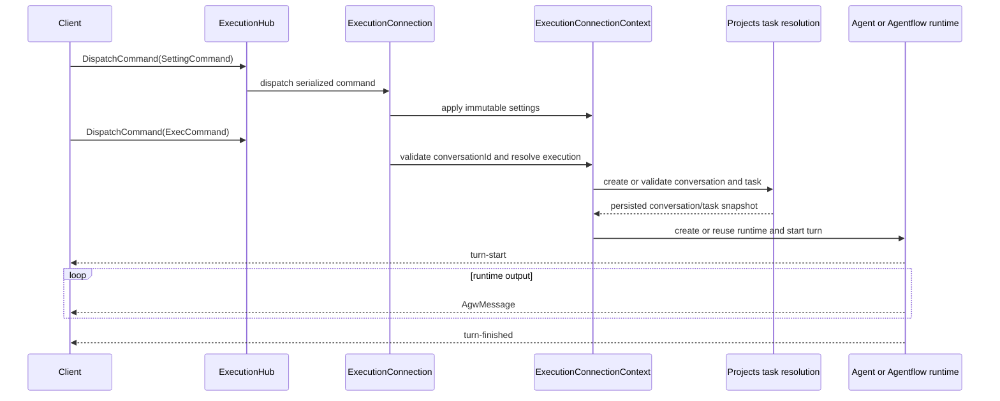

# Agent execution flow

Agw exposes the authenticated SignalR Hub at `/api/hubs/exec`. The Hub is a transport adapter over connection-scoped command handling and either the in-process or distributed execution provider. Detailed state ownership, extension rules, checkpoint storage, and distributed recovery are documented in the [Execution subsystem README](../src/server/Agw.Agents.Execution/README.md).

## Hub contract

Clients dispatch the polymorphic `AgentRunCommand` family through:

```text
DispatchCommand(AgentRunCommand)
```

The Hub also exposes provider/checkpoint queries and InProcess recovery operations:

```text
GetExecutionProvider() -> "InProcess" | "Distributed"
GetAgentflowCheckpoints(agentflowId) -> AgentflowCheckpointAvailability[]
FindInProcessExecution(projectId, contextId) -> originalConnectionId | null
RecoverInProcessExecution(originalConnectionId, interrupt) -> boolean
```

Runtime, control, and lifecycle output uses one typed callback:

```text
ReceiveMessage(AgwMessage)
```

`ExecutionHub` owns no mutable execution state. `ExecutionConnectionRegistry` maps each SignalR connection ID and authenticated user ID to an `ExecutionConnection`. Each connection owns an independent dependency-injection scope and serialized command gate; `ExecutionConnectionContext` owns settings, task, workspace, target, runtime attachment, and message sink. Background output uses `IHubContext`, never a captured Hub instance.

## Commands

Commands are registered through the typed handler and JSON-discriminator seam. The current command set is:

| Command | Purpose |
| --- | --- |
| `SettingCommand` | Sets Project, context, environment variables, and the initial permission policy. |
| `ExecCommand` | Selects an Agent or Agentflow and starts a turn. Clients must supply a client-generated, non-empty GUID `conversationId` (official clients use UUIDv7); distributed clients also supply a stable `executionId`, and distributed execution requires `stream=true`. |
| `InterruptCommand` | Interrupts the active in-process turn or the identified durable execution. |
| `SetModeCommand` | Changes the mode of an Agent that supports runtime modes. |
| `SetPermissionModeCommand` | Selects the next turn's permission mode. The active turn and pending interactions keep their original snapshot; an external runtime is rebuilt before the next turn when its permission version changes. |
| `HumanResponseCommand` | Supplies a typed `response` (`kind` plus `interactionId`) for Tool approval, a workflow gate, or user input; durable commands also include `executionId`. |
| `SubscribeExecutionCommand` | Reattaches the connection to an existing durable execution and resumes output after an optional cursor. |
| `ResumeCheckpointCommand` | Starts a new Agentflow branch from one exact checkpoint occurrence. |

`SettingCommand.Resume` and `ExecCommand.ResumeCheckpoint` are Server-only properties and are not part of the wire contract. Without a prior Setting command, the Server uses the built-in Project, a generated context, no environment variables, and the default permission mode.

`conversationId` is the persisted Project Conversation identity. `contextId` remains the runtime continuity identity used by Agent sessions, provider sessions, traces, usage, and checkpoints; it is validated against the conversation but is not used as a substitute resource ID.

This is a breaking wire-contract change: the removed conversation-creation POST and the required `ExecCommand.conversationId` mean the Server and Web, Desktop, and Mobile clients must be upgraded together. Older clients are not supported by this contract.

## Permission capabilities

Query the authenticated management endpoint before offering a permission choice:

```http
GET /api/agents/permission-capabilities?type=0&id={agentId}
GET /api/agents/permission-capabilities?type=1&id={agentflowId}
```

The endpoint returns a Bens.Results envelope. After unwrapping, `supportedPermissionModes` contains `fullAccess`, `alwaysAsk`, or `allowSameArguments`; `reason` explains a restriction when present. System Agents and Claude Code support all three. Codex and Pi support only `fullAccess`. Agentflows intersect the capabilities of their Agent and nested-Agentflow targets. Foreign/missing targets are unavailable; explicitly requesting an unsupported mode fails validation.

`permission-status` messages report `activePermissionMode`, `nextPermissionMode`, and `permissionChangePending`. A change affects the next turn, including when made during a durable wait; it must not hide or auto-answer an existing approval. User input and explicit HumanGate requests still need a response under Full access.

## Turn lifecycle

Each active turn receives an immutable `RuntimeTurnContext` containing settings, task, target, Project/context/Agent identifiers, authenticated user ID, absolute Project workspace, and the transport-neutral message sink. Mutable connection state never enters `AsyncLocal`; only this per-turn snapshot does.



Turn state is part of the `AgwMessage` protocol:

- `additionalProperties.type = "turn-start"` precedes runtime output.
- `interaction-request` messages carry typed requests with `kind = tool-approval | workflow-gate | user-input` and a stable `interactionId`. `HumanResponseCommand.response` must match both fields; each variant carries its own decision or response data.
- `additionalProperties.type = "turn-finished"` carries `status = completed | interrupted | failed`.
- Durable lifecycle messages also carry `executionId`; streamed messages use a stable scope so replay and checkpoint branches merge with the correct user turn.

When `stream=false`, the in-process provider buffers ordinary output until completion but forwards human-interaction control messages immediately. The distributed provider rejects non-streaming execution because a durable buffer across multiple human-interaction segments has no defined compatibility contract.

## Provider-specific recovery

`Execution:Provider` is selected once at Server startup:

- `InProcess` keeps the runtime and Human-in-the-loop state in the current process. An idle disconnected connection is disposed. A running turn may finish and persist without a subscriber, but a turn waiting for a human response is interrupted because that response can no longer arrive through the detached connection. While the original process survives, recovery operations expose whether the original connection is still executing or releasing resources and allow the same owner to stop it. They do not replay disconnected output.
- `Distributed` stores user-owned execution state, checkpoints, pending interactions, and responses in PostgreSQL. Disconnecting only detaches the current subscription. Another connection can send `SubscribeExecutionCommand` with the same authenticated user ID and replay cursor; a worker resumes runnable segments under a PostgreSQL distributed lock. Output replay uses PostgreSQL by default or Redis when configured.

After reopening an existing InProcess conversation, call `FindInProcessExecution(projectId, contextId)` before enabling Send. When it returns an original connection ID, retain that ID across subsequent reconnects and poll `RecoverInProcessExecution(id, false)` until it returns `false`. To stop the work, call it with `interrupt=true` and continue checking until resource cleanup finishes. Foreign and missing connections both return `false` without affecting another user's work. Query failures keep recovery pending with a retry option; loading history or receiving a model diagnostic is not proof of completion. Only `turn-finished` or a successful idle result clears the active state. Recovery does not survive a Server restart.

Distributed execution is at-least-once, not exactly-once. A Tool with external side effects must use `executionId`, request identity, or a business idempotency key. There is no separate active-execution REST lifecycle; start, subscribe, interrupt, human response, and checkpoint resume remain Hub operations.

## Agentflow checkpoint branches

Checkpoint markers emit visible `agentflow-checkpoint` messages and persist occurrence metadata. `GetAgentflowCheckpoints` reports whether each occurrence is still resumable. `ResumeCheckpointCommand` validates the authenticated user, current Project/context, Agentflow ID, definition fingerprint, and snapshot before removing history after the saved boundary and starting the new branch. In-process occurrences require the original runtime to remain alive; distributed occurrences survive reconnects and Server restarts.
