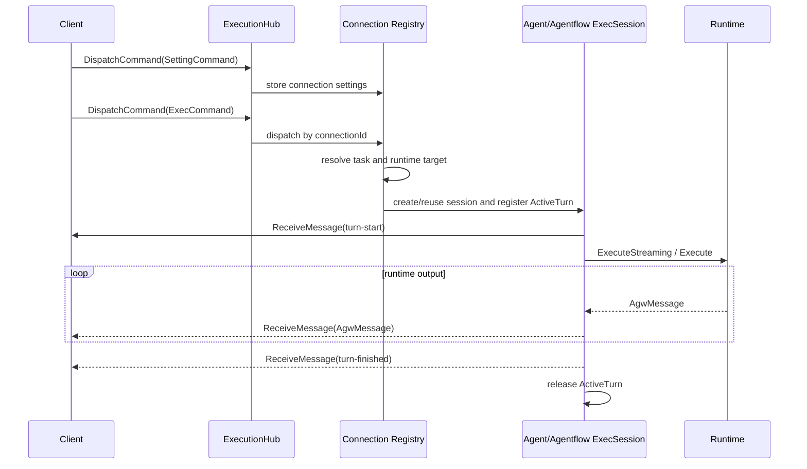

# Agent execution transports

Agw exposes two authenticated real-time execution transports:

- SignalR Hub at `/api/hubs/exec`, used by `clients/web`.
- Legacy WebSocket at `GET /api/executions/{agentId}/ws`, retained for existing clients.

Both transports use the `AgentRunCommand` command family and return raw `AgwMessage` values. They share the runtime starter, runtime sessions, and turn lifecycle, but their connection-disconnect behavior is intentionally different.

## SignalR command flow

The Hub exposes one client method:

```text
DispatchCommand(AgentRunCommand)
```

The server sends every runtime and control message through one typed client callback:

```text
ReceiveMessage(AgwMessage)
```

`ExecutionHub` does not retain mutable execution state. SignalR creates Hub instances for invocations, so `HubExecutionConnectionRegistry` owns a connection entry keyed by `Context.ConnectionId`. Each entry has an independent DI scope, serialized command gate, settings, resolved task, runtime session, and message sink. Background work sends through `IHubContext<ExecutionHub, IExecutionHubClient>` rather than capturing a Hub instance or `Clients.Caller`.



### Commands

`SettingCommand` remains a transport-neutral settings snapshot:

```json
{
  "type": "SettingCommand",
  "projectId": "00000000-0000-0000-0000-000000000000",
  "contextId": "conversation-id",
  "environmentVariables": {}
}
```

It does not contain `agentId` or `agentType`. SignalR creates a connection-level settings shell when it receives the command. The concrete Agent or Agentflow runtime session is created by the first `ExecCommand`, because the target and first user input are required to resolve the task. `SettingCommand.Resume` keeps its existing server-only `[JsonIgnore]` behavior.

```json
{
  "type": "ExecCommand",
  "agentId": "00000000-0000-0000-0000-000000000000",
  "agentType": 0,
  "stream": true,
  "input": {
    "messageId": "message-id",
    "author": "$agw",
    "contents": []
  }
}
```

For SignalR, `agentId` is required. `stream` defaults to `true`. Without an earlier Setting command, the server creates default settings using the built-in project, a generated context, and no environment variables. A different target on a later idle turn disposes the old runtime session and creates a new one while retaining the conversation task.

`InterruptCommand` calls `ActiveTurn.RequestInterrupt()` and leaves the runtime session available for later turns. `HumanResponseCommand` is forwarded only to the active turn's HumanGate coordinator.

### Turn messages

Turn state remains part of the raw `AgwMessage` protocol:

- `additionalProperties.type = "turn-start"` before runtime output.
- Existing `human-gate-*` messages for approval control.
- `additionalProperties.type = "turn-finished"` with `status` equal to `completed`, `interrupted`, or `failed`.

With `stream=false`, normal runtime messages are buffered until the run completes. HumanGate control messages are still forwarded immediately so the client can respond.

### Disconnect behavior

- An idle SignalR connection is disposed immediately.
- A running turn continues without a subscriber, persists its runtime/history state, and releases its connection scope after completion.
- A disconnected turn waiting for HumanGate is interrupted because no response can arrive.
- Host shutdown interrupts and disposes all connection sessions.

There is no execution id, replay buffer, active-execution REST endpoint, automatic reconnect, or cross-process recovery in this protocol.

## Legacy WebSocket flow

The legacy endpoint continues accepting one JSON command per WebSocket message. The route supplies `agentId`, so old `ExecCommand` payloads may omit it; an omitted `stream` remains equivalent to `true`.

The controller receives and dispatches Setting, Exec, Interrupt, and HumanResponse commands while the socket stays open. Runtime output is written directly as serialized `AgwMessage` values. Consecutive Agent turns reuse the runtime session when settings are unchanged.

Unlike SignalR, closing the legacy WebSocket cancels the active turn and disposes its runtime session. This preserves the endpoint's existing disconnect-cancels behavior.
