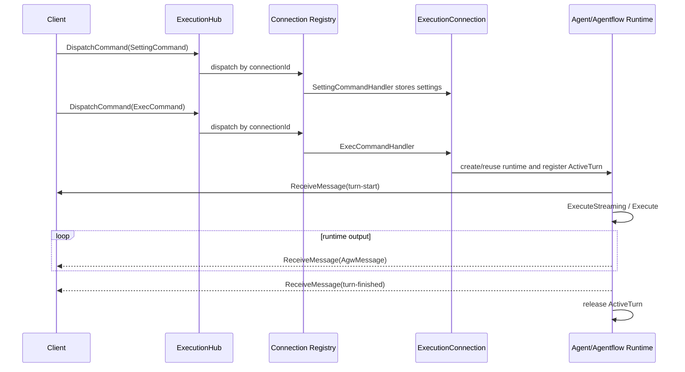

# Agent execution flow

Agw exposes the authenticated SignalR Hub at `/api/hubs/exec` for real-time agent execution. The Hub accepts the `AgentRunCommand` command family and returns raw `AgwMessage` values.

## SignalR command flow

The Hub exposes one client method:

```text
DispatchCommand(AgentRunCommand)
```

The server sends every runtime and control message through one typed client callback:

```text
ReceiveMessage(AgwMessage)
```

`ExecutionHub` does not retain mutable execution state. SignalR creates Hub instances for invocations, so `ExecutionConnectionRegistry` owns an `ExecutionConnection` keyed by `Context.ConnectionId`. Each connection has an independent DI scope, serialized command gate, settings, resolved task, runtime, and message sink. `ExecutionCommandDispatcher` routes each command to its registered handler. Background work sends through `IHubContext<ExecutionHub, IExecutionHubClient>` rather than capturing a Hub instance or `Clients.Caller`.

Each active turn receives an immutable `RuntimeTurnContext` containing its settings snapshot, user, expanded absolute project workspace, and transport-neutral message sink. `RuntimeBase` exposes that snapshot through `RuntimeTurnContextAccessor` only for the lifetime of the asynchronous turn; mutable connection state remains on `ExecutionConnection` and is never stored in `AsyncLocal`.



### Commands

`SettingCommand` remains a transport-neutral settings snapshot:

```json
{
  "type": "SettingCommand",
  "projectId": "00000000-0000-0000-0000-000000000000",
  "contextId": "conversation-id",
  "environmentVariables": {}
}
```

It does not contain `agentId` or `agentType`. SignalR stores a connection-level settings snapshot when it receives the command. The concrete `AgentRuntime` or `AgentflowRuntime` is created by the first `ExecCommand`, because the target and first user input are required to resolve the task. `SettingCommand.Resume` keeps its existing server-only `[JsonIgnore]` behavior.

```json
{
  "type": "ExecCommand",
  "agentId": "00000000-0000-0000-0000-000000000000",
  "agentType": 0,
  "stream": true,
  "input": {
    "messageId": "message-id",
    "author": "$agw",
    "contents": []
  }
}
```

For SignalR, `agentId` is required. `stream` defaults to `true`. Without an earlier Setting command, the server creates default settings using the built-in project, a generated context, and no environment variables. A different target on a later idle turn disposes the old runtime and creates a new one while retaining the conversation task.

`InterruptCommand` calls `ActiveTurn.RequestInterrupt()` and leaves the runtime available for later turns. `HumanResponseCommand` is forwarded only to the active turn's HumanGate coordinator.

### Turn messages

Turn state remains part of the raw `AgwMessage` protocol:

- `additionalProperties.type = "turn-start"` before runtime output.
- Existing `human-gate-*` messages for approval control.
- `additionalProperties.type = "turn-finished"` with `status` equal to `completed`, `interrupted`, or `failed`.

With `stream=false`, normal runtime messages are buffered until the run completes. HumanGate control messages are still forwarded immediately so the client can respond.

### Disconnect behavior

- An idle SignalR connection is disposed immediately.
- A running turn continues without a subscriber, persists its runtime/history state, and releases its connection scope after completion.
- A disconnected turn waiting for HumanGate is interrupted because no response can arrive.
- Host shutdown interrupts and disposes every connection-owned runtime.

There is no execution id, replay buffer, active-execution REST endpoint, automatic reconnect, or cross-process recovery in this protocol.
