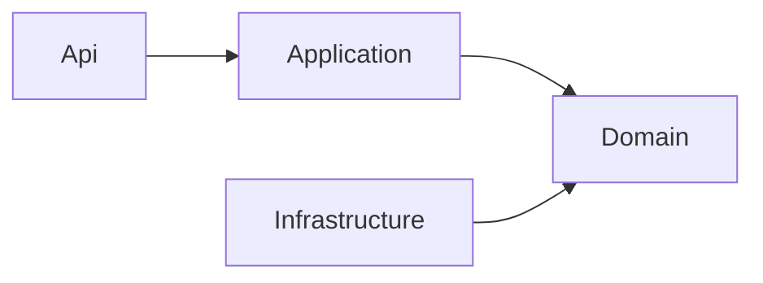

Prerequisite: a working source setup. Identify the business owner of a use case before tracing cross-module capabilities through Contracts.

## Backend organization

AGW is a modular monolith. `Agw.Host` supplies shared hosting; Control Plane, Data Plane, and Standalone compose the modules they need. Business modules follow `Api → Application → Domain ← Infrastructure`, creating only necessary layers.

| Layer | Responsibility | What to inspect |
| --- | --- | --- |
| Api | Receive requests and return responses | Routes, inputs, and outputs |
| Application | Complete a business operation | Authorization, queries, transactions, and call order |
| Domain | Hold business data and express rules | Data structures, Policies, Decisions, and Behaviors |
| Infrastructure | Connect databases and external systems | Persistence and concrete adapters |

Domain entities hold data only. A Policy evaluates complex rules and returns a data-only Decision. Application constructs a concrete Behavior to apply it to the loaded root and its children. Ordinary CRUD stays in Application without creating a Behavior for every entity.

## Data ownership

Each table has one owning module. Sharing entity types and a database does not permit direct access to another module’s tables; use that module’s published interfaces.

Each module that owns tables declares its persistence interface `I<Module>DbContext` in `Application/Persistence`. There are nine: Agents, Auth, Integrations, Jobs, Projects, Providers, Settings, Skills, and Tools. Files, Setup, and A2A own no tables and have no such interface. Within a request, one `AgwDbContext` instance implements these interfaces. Modules share database resources while limiting the data each can access. Cross-module calls use Contracts; approved Infrastructure adapters handle cross-module transactions.

`Agw.Agents.Execution → Agw.Agents` is one-way; both assemblies belong to the Agents module. Selective DDD for Agentflows does not extend to ordinary CRUD modules.

## Example: updating an Agentflow

Api receives the request. Application checks access and loads the flow with all nodes and edges. Policy validates the proposed graph and returns a Decision. Behavior applies valid changes to the loaded objects, then Application saves them.

For edge rules, inspect the Agentflow Policy and Topology. For authorization or loading and saving order, inspect Application. For database implementation, inspect Infrastructure. This separates business rules from network and storage details and makes them easier to test independently.

## Clients

Web and Desktop own independent route shells and builds. Business packages live in `src/clients/packages`. `chat-core` owns message semantics, `chat-runtime` owns execution connections and state, and `chat` owns DOM rendering. Mobile uses `chat-native` and RN-safe packages rather than DOM packages.

Identify the owning module and public entry point before adding a feature. Run `pnpm test:boundaries` and the backend architecture tests, `dotnet test tests/Agw.Architecture.Tests`, after boundary changes.

## Implementation and references

- [Architecture](https://github.com/zxyao145/agw/blob/main/docs/2.Architecture.md)
- [Module organization](https://github.com/zxyao145/agw/blob/main/docs/3.Module%20Organization.md)
