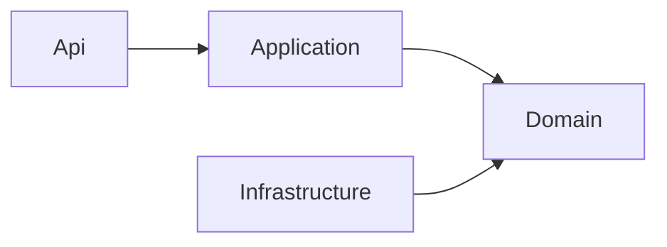

本页帮助开发者判断一项改动应放在哪个模块、哪一层。AGW 按业务拆分代码，例如 Agents、Projects 和 Jobs；它们可以共享一个部署进程和数据库，但各自负责自己的数据和操作。

先完成[源码运行]()，再选择一个具体功能沿请求追踪，通常比一次阅读所有项目更容易理解。

## 后端组织

AGW 是模块化单体。`Agw.Host` 提供共享 Hosting，Control Plane、Data Plane 和 Standalone 组合所需模块。业务模块遵守 `Api → Application → Domain ← Infrastructure`，只创建实际需要的层。

| 层 | 负责什么 | 阅读时关注什么 |
| --- | --- | --- |
| Api | 接收请求并返回响应 | 路由、输入和返回值 |
| Application | 完成一次业务操作 | 身份检查、查询、事务和调用顺序 |
| Domain | 保存业务数据并表达规则 | 数据结构、Policy、Decision 和 Behavior |
| Infrastructure | 连接数据库和外部系统 | 持久化、外部服务适配和具体实现 |

Domain 中的实体只保存数据，不把验证、状态变化等方法写进实体。复杂规则由 Policy 判断并返回纯数据 Decision，再由 Application 创建具体的 Behavior，将决定应用到当前对象及其子项。普通增删改查保留在 Application，无需为每个实体创建 Behavior。

## 数据所有权

每张表只有一个负责它的模块。即使多个模块共用实体类型和数据库，也要通过所属模块提供的接口访问数据，不能直接查询或修改其他模块的表。

拥有数据表的模块在 `Application/Persistence` 中声明自己的持久化接口 `I<Module>DbContext`，目前共有九个：Agents、Auth、Integrations、Jobs、Projects、Providers、Settings、Skills 和 Tools；Files、Setup 和 A2A 不拥有数据表，也没有这类接口。同一次请求中，这些接口由同一个 `AgwDbContext` 实例实现。这样既能共用数据库连接和事务，又能限制模块可见的数据范围。跨模块调用使用 Contracts 中的公开约定，必要的跨模块事务放在经过批准的 Infrastructure 适配器中。

`Agw.Agents.Execution → Agw.Agents` 单向依赖，两程序集属于同一 Agents 模块。Agentflow 的选择性 DDD 不扩展到普通 CRUD 模块。

## 以修改 Agentflow 为例

请求先进入 Api，再由 Application 检查用户能否访问该流程，并加载流程及全部节点和连线。Policy 判断新图是否符合规则，返回 Decision；Behavior 将有效变更应用到已加载的对象，最后由 Application 保存。

因此，修改连线规则时应查看 Agentflow 的 Policy 和 Topology；调整权限、加载或保存顺序时应查看 Application；修改数据库实现时再进入 Infrastructure。这个分工让业务规则与网络、数据库细节分开，也便于分别测试。

## 客户端

Web 与 Desktop 各自拥有路由壳和构建，业务包位于 `src/clients/packages`。`chat-core` 负责消息语义，`chat-runtime` 负责执行连接和状态，`chat` 负责 DOM 呈现。Mobile 通过 `chat-native` 与 RN-safe 包接入，不直接依赖 DOM 包。

增加功能前确认所属模块与公开入口；修改边界后运行 `pnpm test:boundaries` 和后端架构测试 `dotnet test tests/Agw.Architecture.Tests`。

## 实现与参考

- [Architecture](https://github.com/zxyao145/agw/blob/main/docs/2.Architecture.md)
- [Module organization](https://github.com/zxyao145/agw/blob/main/docs/3.Module%20Organization.md)
