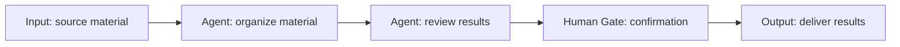

## Arrange defined steps into a workflow

Agentflow means Agent Workflow. **Agents reason and act; Agentflow routes work and executes predefined steps.** Connect nodes on the canvas to define what happens first, who receives each result, and where human confirmation is required.

For example, an organizing agent decides which information to retain, and a reviewing agent checks for omissions and unclear wording. Agentflow sets the sequence: organize, review, then request human confirmation.

## Route work between steps

| Task requirement | How Agentflow arranges it |
| --- | --- |
| Follow a fixed sequence | Direct passes results to the next step |
| Select a path by condition | Switch checks conditions in order and selects the first matching branch |
| Run independent tasks together | FanOut distributes work across branches; a Concurrent block calls its members in parallel |
| Wait for branch results | FanInBarrier waits for all sources in the same group before continuing |
| Request confirmation or more information | Human Gate pauses the workflow for a human response |

Agents interpret content, generate text, and call tools. Agentflow defines the connections and branching rules between steps, making it possible to inspect whether required reviews and confirmations are included.

## Example 1: Coding, review, and commit

Coding tasks often follow a defined sequence: implement, review, revise if needed, then commit after confirmation. Agentflow lets different agents work in the same Project workspace while a person decides whether to proceed.

{caption="Coding Agentflow: human feedback routes work back to Coding for revisions or onward to the Commit Agent. Click to enlarge."}

The workflow assigns these responsibilities:

1. **Coding** uses Codex to implement changes in the current workspace.
2. **Checkpoint and Clear Messages** mark a recovery boundary and discard upstream messages passed downstream, allowing the reviewer to inspect the workspace diff under its own instructions.
3. **Code Review** uses Claude Code to review changes and report issues, followed by another Checkpoint.
4. **Human Gate** asks a person whether further changes are needed. Revisions return to Coding; completed work proceeds to the Commit Agent.
5. **Commit Agent** creates a Git commit according to the confirmed requirements.

Configure Codex, Claude Code, and Git in the execution environment, and confirm that each node accesses the same Project workspace. Give implementation, review, and commit nodes distinct instructions. Verify the complete path with a small change, then test the revision path.

Express revisions through human feedback and Switch conditions: for example, “revise” returns to Coding and “done” proceeds to the commit. With Approval mode, provide that feedback when approving. **Rejecting approval stops the workflow; it does not automatically take the revision branch.** The loop must have an explicit exit path.

Agentflow fixes responsibilities, order, and human decision points. You still need to check tests, resolved review findings, and the final diff. See the [Agentflow guide]() for checkpoint recovery conditions.

## Example 2: Extract locations from Xiaohongshu notes

A travel planning application can split “import a note and show its places on a map” into three data processing steps. Agentflow connects those steps and returns location data to the business system; the frontend handles the map display.

{caption="Location extraction: general-agent retrieves the note, location-extractor extracts addresses, and amap-poi-search matches coordinates."}

| Step | Processing | Result passed onward |
| --- | --- | --- |
| Retrieve note details | An agent uses `xhs-explore` from `xiaohongshu-skills` to read a Xiaohongshu URL | Note content |
| Extract candidate places | The model interprets the content and extracts place names and addresses | Candidate places and addresses |
| Match locations | An agent calls the Amap MCP service to search for POIs (points of interest, such as attractions or restaurants) | Places and coordinates for the business system |

Prepare and configure the example's Skill, Amap MCP service, and required accounts or credentials. Verify that the execution nodes can call them. These are dependencies of the example; creating an Agentflow alone does not provide those service capabilities.

Start with a note containing clearly identified places. Check that the content was retrieved, the extracted places came from the note, and each POI matches the correct city and address. Duplicate place names, incomplete addresses, and missing search results require more information or human review before treating candidate coordinates as confirmed locations.

Tools retrieve notes and query locations, the model interprets text and extracts places, and Agentflow passes results between steps in order. The business UI remains responsible for displaying the map.

## Get started

1. Prepare and individually verify the agents you need, such as an organizer and a documentation reviewer.
2. Open the Agentflows editor and connect Input, two Agent nodes, Human Gate, and Output.
3. Define each Agent node's task. Set Human Gate to Approval and write the confirmation prompt.
4. Save, select the Agentflow in Chat, and submit a short passage. Check execution order, human confirmation, and the final output.
5. Add conditional branches or parallel work after the basic path succeeds, then verify each path.

## The workflow rules are predefined

Predefined steps do not mean the model returns identical answers on every run. Agents still assess their inputs, and conditional branches select paths from runtime results. Rejecting a Human Gate approval stops the workflow.

Agentflow also supports dynamic collaboration through blocks such as Handoff and Magentic. Use explicit sequential edges when every step must execute; choose dynamic orchestration when the task calls for handoffs or planning.

[Read the Agentflow guide]() · [Explore custom agents]()
