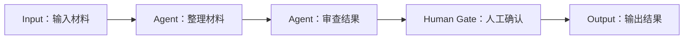

## 把确定的步骤编排成流程

Agentflow 是 Agent Workflow（Agent 工作流）。**Agent 负责判断与执行，Agentflow 负责编排路由、执行预先确定的步骤。** 你在画布上连接节点，定义先做什么、结果交给谁，以及何时需要人工确认。

例如，材料整理 Agent 判断哪些信息值得保留，审查 Agent 检查遗漏和表述问题；Agentflow 则安排“先整理、再审查、最后人工确认”的执行顺序。

## 管理步骤之间的路由

| 任务需要 | Agentflow 如何编排 |
| --- | --- |
| 按固定顺序处理 | Direct 把上一步结果交给下一步 |
| 按条件选择路径 | Switch 按顺序检查条件，选择第一个匹配分支 |
| 同时开展独立任务 | FanOut 分发到多个分支，或用 Concurrent 编排块并行调用成员 |
| 等待分支结果 | FanInBarrier 等待同组来源到齐，再继续下游步骤 |
| 让人确认或补充信息 | Human Gate 暂停流程，等待人工回应 |

需要判断内容含义、生成文字或调用工具的工作交给 Agent；步骤之间的连接和分支规则在 Agentflow 中配置。这样可以直接查看流程是否包含必要的审查与确认环节。

## 示例 1：Coding，从实施到审查与提交

代码任务通常有一条明确的处理顺序：先实施，再检查；发现问题就返工，确认完成后再提交。把这些步骤放进 Agentflow，可以让不同 Agent 在同一个 Project 工作区中接力，由人决定是否进入下一阶段。

{caption="Coding Agentflow：人工反馈决定返回 Coding 继续修改，或进入 Commit Agent。点击图片可放大查看。"}

这条流程中的职责分配是：

1. **Coding**：使用 Codex 完成实现，修改当前工作区中的代码。
2. **Checkpoint 与 Clear Messages**：标记恢复边界，并清除传给下游的上游消息，让审查节点按自己的指令检查工作区中的 diff。
3. **Code Review**：使用 Claude Code 审查改动，给出问题与建议，再经过一个 Checkpoint。
4. **Human Gate**：由人判断是否还需要修改。需要返工时返回 Coding，完成后进入 Commit Agent。
5. **Commit Agent**：按已确认的要求执行 Git 提交。

开始前，需要在运行环境中配置好 Codex、Claude Code 和 Git，并确认各节点访问同一个 Project 工作区。为实施、审查和提交节点分别写清职责，先用一项小改动验证完整路径，再测试返工路径。

返工应通过 Human Gate 的人工回复和 Switch 条件表达，例如约定“继续修改”返回 Coding、“完成”进入提交；使用 Approval 模式时，应在批准时提交反馈。**拒绝审批会停止流程，不会自动进入返工分支。** 循环必须有明确的退出路径。

Agentflow 固定职责、顺序和人工决定的位置；测试是否通过、审查问题是否解决、最终 diff 是否符合预期，仍需要逐项核对。Checkpoint 的恢复条件见 [Agentflow 使用指南]()。

## 示例 2：从小红书笔记中提取地点位置

旅游规划应用可以把“导入一篇笔记，在地图上展示地点”拆成三个数据处理步骤。Agentflow 串起处理过程，最后把地点数据交给业务系统，由前端负责地图展示。

{caption="地点提取流程：general-agent 获取笔记，location-extractor 提取地址，amap-poi-search 匹配经纬度。"}

| 步骤 | 处理方式 | 交给下一步的结果 |
| --- | --- | --- |
| 获取笔记详情 | Agent 使用 `xiaohongshu-skills` 中的 `xhs-explore`，根据小红书地址读取笔记 | 笔记内容 |
| 提取候选地点 | 模型理解内容，提取地点名称和地址信息 | 候选地点与地址 |
| 匹配地理位置 | Agent 调用高德地图 MCP 搜索 POI（兴趣点，如景点、餐厅），匹配对应地点 | 可供业务系统使用的地点与经纬度 |

开始前，需自行准备并配置示例使用的 Skill、高德地图 MCP 及其所需账号或凭据，确认执行节点可以调用它们。这些是示例依赖，不能仅凭创建 Agentflow 就获得相应服务能力。

先用一篇地点明确的笔记验证：是否成功读取内容，提取的地点是否来自原文，POI 是否匹配到正确城市和地址。同名地点、地址不完整或搜索无结果时，需要补充信息或人工核对，不能把候选坐标直接当作确定结果。

这里的分工很直接：工具负责获取笔记和查询位置，模型负责理解文本并提取地点，Agentflow 负责按顺序传递结果；地图展示仍由业务 UI 完成。

## 开始使用

1. 先准备并单独验证需要的 Agent，例如材料整理和文档审查。
2. 打开 Agentflows 编辑器，连接 Input、两个 Agent 节点、Human Gate 和 Output。
3. 为每个 Agent 节点写清任务，为 Human Gate 选择 Approval 并填写确认提示。
4. 保存后在 Chat 中选择该 Agentflow，输入一段材料，检查节点执行顺序、人工确认和最终输出。
5. 基础路径通过后，再添加条件分支或并行处理，并验证各条路径。

## 确定的是流程规则

预先确定步骤，不意味着模型每次都会给出相同答案。Agent 仍会根据输入作出判断；条件分支也会根据运行时结果选择路径。Human Gate 的审批被拒绝时，流程会停止。

Agentflow 还支持 Handoff 和 Magentic 等动态协作编排。若每一步都必须执行，应使用明确的顺序连线；若任务需要动态交接或规划，再选择相应编排块。

[查看 Agentflow 使用指南]() · [了解自定义 Agent]()
