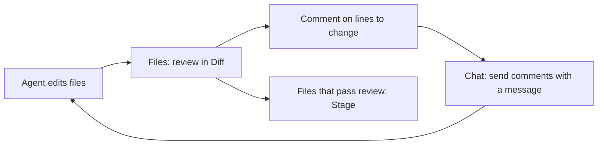

## Review agent changes next to the conversation

After an agent edits code, you need to see which files changed and whether each edit is what you expected. Switch to **Files** in the Chat workspace to browse the Project workspace, inspect Git changes, and turn the spots that need work into line comments for the agent, all without opening a separate editor or terminal.

{caption="AGW Files view: browse Project files and Git changes on the left, view file content or a diff on the right, and comment on code lines."}

## Inspect changes

Turn on the **Diff** switch at the top of the file tree to show only files with Git changes, grouped into **Staged** and **Unstaged**. A file with both staged and unstaged edits appears once in each group. The letter next to a file name shows the change type: `A` added, `M` modified, `D` deleted, `U` untracked.

Select a file to see its old and new content side by side. The Staged group compares `HEAD → Staged`; the Unstaged group compares `Staged → Working Tree`. Turn off Diff to browse the full directory tree and view each file's current content.

| Action | Where | Effect |
| --- | --- | --- |
| Stage / Unstage | In Diff mode, hover over a file or directory and click `+` or `-` | Stage or unstage that file, or every change under that directory |
| Reset to HEAD | A file's context menu | Restore both the index and working copy of that file to `HEAD` |
| Delete | A file or directory's context menu, after confirmation | Delete the file, or delete the directory recursively |

Reset to HEAD and Delete change files on disk and cannot be undone from the UI. Make sure nothing you need will be lost before running them.

## Send line comments to the agent

In file content or a diff, hover over a line and click the `+` button at the end of it to write a comment. Press Ctrl/Shift+Enter to submit or Esc to cancel. In a diff, you can comment on the old side and the new side separately.

Comments wait above the Chat input, which shows how many are pending, such as “2 code comments”. Switch back to **Chat**, describe what you want, and send the message. Each comment's file path, line number, side (old or new), and group travel with that message to the agent. Once the Server accepts the execution, the sent comments leave the pending list. Click `×` next to the count to discard all pending comments.

For example, after an agent finishes a refactor, open Diff and check the Unstaged group. Comment “Read the retry count from configuration” on the new retry logic and “This branch is missing an error log” on another line, then send “Apply the comments and explain each change.” Stage files that pass review. When the agent edits them again, the new edits appear in the Unstaged group, which keeps reviewed and unreviewed changes apart.

## Get started

1. Choose a Project whose workspace is inside a Git repository. You can browse files in a directory outside Git, but change views and Git actions are unavailable there.
2. Click **Files** in the Chat workspace. If the Project has additional directories, choose the one to browse from the dropdown above the file tree.
3. Turn on **Diff**, select a file in the Staged or Unstaged group, and review the changes.
4. Comment on lines that need work, switch back to **Chat** to send a message, then return to Files to review the agent's new edits.

## Scope

- The file tree, diffs, and Git actions apply only to the selected directory. Changing the browsing directory does not change the agent's default working directory; the agent still starts in the primary workspace.
- Files does not create commits or switch branches. Ask the agent to do that, or use a terminal.
- Pending comments exist only in the current page. Switching Projects or reloading the page clears them.
- Mobile can browse files, view diffs, and reset or delete files. Staging, unstaging, and sending line comments to the agent are available in Web and Desktop.

[Configure Project directories]() · [Read the Chat guide]()
