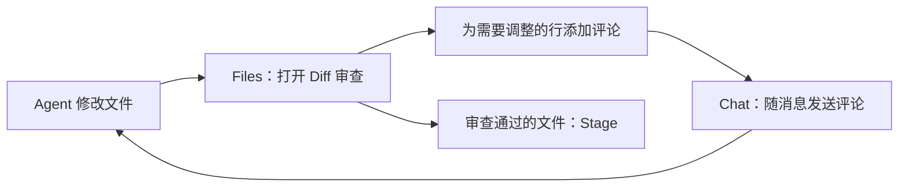

## 在对话旁边检查 Agent 的修改

Agent 修改代码后，需要确认它改了哪些文件、每处改动是否符合预期。在 Chat 工作区切换到 **Files**，可以浏览 Project 工作目录中的文件、查看 Git 变更，并把需要调整的地方写成行评论交给 Agent，整个过程无需另开编辑器或终端。

{caption="AGW Files 页面：左侧浏览项目文件与 Git 变更，右侧查看文件内容或 diff，并为代码行添加评论。"}

## 查看变更

打开文件树顶部的 **Diff** 开关后，文件树只显示有 Git 变更的文件，并分为 **Staged** 和 **Unstaged** 两组。一个文件同时包含已暂存和未暂存的改动时，会在两组中各出现一次。文件名旁的字母表示变更类型：`A` 新增、`M` 修改、`D` 删除、`U` 未跟踪。

选中文件后，右侧左右对照显示改动前后的内容。Staged 分组对比 `HEAD → Staged`，Unstaged 分组对比 `Staged → Working Tree`。关闭 Diff 开关后，文件树显示完整目录，右侧显示文件的当前内容。

| 操作 | 入口 | 效果 |
| --- | --- | --- |
| Stage / Unstage | Diff 模式下，鼠标移到文件或目录上，点击 `+` 或 `-` | 暂存或取消暂存该文件、该目录下的全部变更 |
| Reset to HEAD | 文件的右键菜单 | 把该文件的暂存区和工作区内容都恢复为 `HEAD` 版本 |
| Delete | 文件或目录的右键菜单，确认后执行 | 删除文件，或递归删除整个目录 |

Reset to HEAD 和 Delete 直接修改磁盘上的文件，界面中无法撤销，执行前应确认没有需要保留的改动。

## 用行评论交给 Agent 修改

在文件内容或 diff 中，把鼠标移到某一行，点击行尾出现的 `+` 按钮即可写评论，按 Ctrl/Shift+Enter 提交，按 Esc 取消。Diff 视图的左右两侧可以分别评论改动前和改动后的内容。

写好的评论会暂时保存，Chat 输入框上方显示待发送的评论数量，例如 “2 code comments”。切回 **Chat** 写下总体要求并发送后，每条评论的文件路径、行号、评论所在一侧（改动前或改动后）和所在分组会随这条消息一起交给 Agent。Server 接受这次执行后，已发送的评论会从待发送列表中移除；点击数量旁的 `×` 可以放弃全部待发送评论。

例如，Agent 完成一次重构后，打开 Diff 查看 Unstaged 分组：在新增的重试逻辑处评论“重试次数改为读取配置项”，在另一处评论“这个分支缺少错误日志”，然后在 Chat 中发送“请按评论修改，完成后说明每处改动”。审查通过的文件可以先 Stage，Agent 下一次修改这些文件时，新改动会出现在 Unstaged 分组中，便于区分已审查和待审查的内容。

## 开始使用

1. 选择一个工作目录位于 Git 仓库中的 Project。不在 Git 仓库中的目录也能浏览文件，但没有变更视图和 Git 操作。
2. 在 Chat 工作区点击 **Files**。Project 配置了附加目录时，用文件树顶部的下拉框选择要浏览的目录。
3. 打开 **Diff** 开关，在 Staged 或 Unstaged 分组中选择文件，检查改动。
4. 为需要调整的行添加评论，切回 **Chat** 发送消息，再回到 Files 检查 Agent 的新改动。

## 适用范围

- 文件树、diff 和 Git 操作只作用于当前选择的目录。切换浏览目录不会改变 Agent 的默认工作目录，Agent 仍从主工作目录开始工作。
- Files 页面不创建提交，也不切换分支；需要这些操作时，可以交给 Agent，或在终端中完成。
- 待发送的评论只保存在当前页面中，切换 Project 或刷新页面后会清空。
- Mobile 可以浏览文件、查看 diff，并重置或删除文件；Stage、Unstage 以及把行评论发送给 Agent 在 Web 和 Desktop 中使用。

[配置 Project 的工作目录]()；[查看 Chat 使用指南]()。
