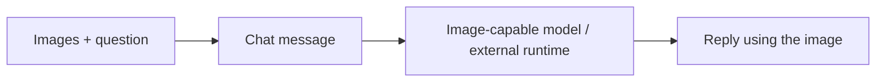

## Add visual context

Attach images when asking about a UI problem, design, or chart. For example, send an error screenshot with the steps that led to it, or ask a vision-capable model to inspect a page layout.

## Ask a specific question

For example: “The Save button is obscured in this screenshot. Identify possible layout problems and tell me what else you need to know.” When comparing images, label the expected design and the current page so the agent can focus on the difference.

To change code, also provide the Project and file access. A screenshot supplies visual information alone.

## Get started

1. Choose a model and execution target that support image understanding.
2. Add images in Chat: paste them into the message box in Web and Desktop, or choose them from the photo library on Mobile. Then explain what the agent should focus on.
3. Check the attachments, send the message, and verify that the reply interprets the image correctly.

| Item | Supported range |
| --- | --- |
| Formats | JPEG, PNG, GIF, WebP |
| Images per message | Up to 5 |
| Size per image | Up to 5 MB |
| Total attachments | Up to 10 MB per message |

Image understanding depends on the selected model and external runtime. Adding an attachment does not mean every model can interpret it. If screenshot text is small or unclear, include the key text and a specific question in your message.

[Read the Chat guide]()
