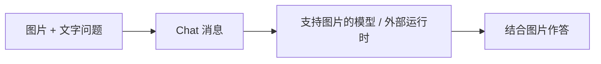

## 用图片补充文字

遇到界面问题、设计稿或图表时，可以直接把图片附在消息中，让 Agent 结合图片和文字理解任务。例如，附上错误截图并说明操作步骤，或让支持视觉的模型检查页面布局。

## 把问题说具体

例如，附上页面截图后可以问：“这张图中保存按钮被遮住了，请指出可能的布局问题，并说明还需要哪些信息。”比较两张图时，注明哪张是预期效果、哪张是当前页面。这样 Agent 更容易围绕同一个问题回答。

如果希望修改代码，还需要提供对应项目及文件访问能力；一张截图本身只提供视觉信息。

## 开始使用

1. 选择支持图片理解的模型和执行目标。
2. 在 Web、Desktop 或 Mobile 的 Chat 中添加图片，并写明希望 Agent 关注的部分。
3. 确认附件后发送，检查回复是否正确理解了图片内容。

| 项目 | 支持范围 |
| --- | --- |
| 图片格式 | JPEG、PNG、GIF、WebP |
| 每条消息 | 最多 5 张图片 |
| 单张大小 | 最多 5 MB |
| 附件总大小 | 每条消息最多 10 MB |

图片能否被理解，取决于所选模型及外部运行时的支持情况；成功添加附件不代表所有模型都能识别图片。截图中的文字过小或内容不清晰时，补充关键文字和具体问题通常更有效。

[查看 Chat 使用指南]()。
