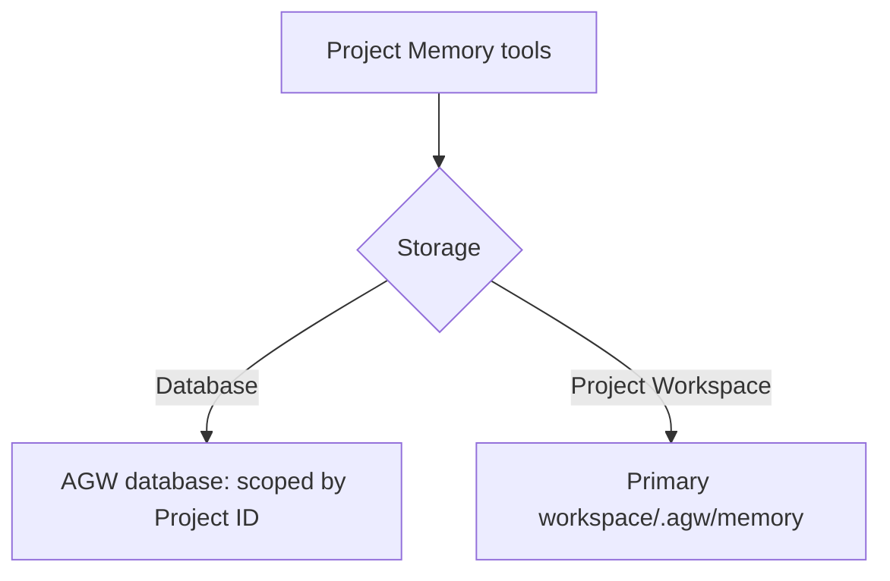

## Keep information worth reusing

A conversation may end while working preferences and project knowledge remain useful. AGW provides two kinds of Memory for later work.

| Memory | Good for | Scope |
| --- | --- | --- |
| User Memory | Personal preferences, writing conventions, lasting background | The current user, across Projects |
| Project Memory | Project conventions, decisions, working notes | The project’s working context |

Configure the appropriate Memory capability on an Agent or Project, then ask the agent to save information and check or update it in later conversations. Memory needs deliberate maintenance; it does not automatically retain and inject every chat message forever. User Memory is isolated by user. Project Memory scope also depends on the project and storage choice; filesystem memory is shared when workspaces are shared.


{caption="AGW Desktop: configure User Memory, Project Memory, and Background Agents as tool capabilities."}

## Two storage modes for Project Memory

Project Memory offers **Database** and **Project Workspace (.agw/memory)** storage. Both expose the same tools for saving, finding, reading, and updating project knowledge. They differ in where content lives, how it is shared, and how you back it up.

| Comparison | Database (default) | Project Workspace (filesystem) |
| --- | --- | --- |
| Location | The database used by AGW | `.agw/memory/` under the primary workspace |
| Scope | Project ID | The actual workspace directory |
| Agents / conversations in one Project | Share memory when using Database mode | Share memory when using the same workspace and filesystem mode |
| Two Projects with one workspace | Keep separate database memories | Read and write the same memory directory |
| Backup | Part of the AGW database backup | Part of the project files, including the hidden `.agw/memory/` directory |
| Useful for | Central management without memory files in the workspace | Direct file inspection or moving memory with the workspace |

### Database: managed centrally by AGW

With **Database**, memory content is stored in AGW’s configured database. Content is still organized by file name, but no corresponding memory files are created in the workspace. Agents read these records through Project Memory tools.

Memory is scoped by Project ID. Agents using Database mode in the same Project can reuse it. Another Project pointing to the same workspace retains its own database memory. Changing the primary workspace does not change which Project owns the database memory.

This mode suits deployments that manage and back up data centrally. Follow AGW’s backup procedure to retain the database and required encryption keys; copying the code directory alone does not include database memory. In a multi-node deployment, the shared database lets execution nodes access the same project memory, subject to project access checks.

### Project Workspace: files in the project directory

With **Project Workspace (.agw/memory)**, memory lives in the primary workspace on the execution host. For example, a Workspace of `/work/demo` produces this memory directory:

```text
/work/demo/
└── .agw/
    └── memory/
        ├── coding-conventions.md
        ├── coding-conventions_description.md
        └── memories.md
```

Here, `coding-conventions.md` is the content, `coding-conventions_description.md` is the optional description supplied when saving, and `memories.md` is the index maintained by AGW. This directory stays under the primary workspace; selecting an additional directory in Files does not change it.

This mode makes files easy to inspect. You can decide whether to include them in Git or project backups; AGW does not commit them automatically. Make sure backups and transfers include the hidden directory. Writes and deletions through memory tools maintain the index. Direct file edits may leave it out of date, so prefer memory tools for routine maintenance.

Two Projects pointing to the same actual workspace share its `.agw/memory/`, even with different Project IDs. Changing Workspace makes the agent use memory at the new location; existing files are not moved automatically. Persist the workspace with a mount in Docker. Across execution nodes, the directory contents must be shared; identical path strings alone are not enough.



## Configure and verify

Prerequisites: a working custom Agent and Project. Filesystem mode also requires the execution host to be able to read and write the primary workspace.

1. Open **Tools** on the Agent or Project and select the **Project Memory** ToolBlock.
2. In the expanded card’s **Storage** selector, choose **Database** or **Project Workspace (.agw/memory)** and save. Prefer configuring it on the Project when you want a consistent project-wide choice.
3. In a new turn in that Project, ask the agent to save a concrete convention, such as: “Save our project convention to use UTC in `time-conventions.md`, with a short description.” Writes remain subject to mode and approval settings.
4. Open a new conversation in the same Project with an agent that has the memory capability and matching storage mode. Ask it to list and read the entry. It should retrieve the saved content.
5. In filesystem mode, you can also inspect the files in `.agw/memory/`. Database mode creates no files there; verify through memory tools instead.

The modes are separate data sources. **Changing Storage does not automatically copy, merge, or delete memory in the other mode.** To migrate, back up the source, read the content and descriptions you want to keep, switch modes, and write them through memory tools before verifying the results. Test configuration changes in a new turn; active turns retain their starting configuration.

## How agents use saved memory

Project Memory supplies an index to the model, and the agent reads relevant content as needed. The generated index currently contains up to 50 entries; additional memories remain discoverable through list and search tools. Full memory contents are not sent with every request.

Keep each entry focused on one topic, with a clear filename and short description. Update existing entries when conventions change and remove obsolete information to avoid contradictory guidance. User Memory is always stored in the database and isolated by user; this Storage setting does not affect it.

## Implementation and references

- [Project Memory storage selection](https://github.com/zxyao145/agw/blob/main/src/server/Agw.Tools/Impl/ToolBlocks/ProjectMemory/ProjectMemoryToolBlock.cs)
- [Memory tools and index](https://github.com/zxyao145/agw/blob/main/src/server/Agw.Tools/Impl/ToolBlocks/ProjectMemory/ProjectMemoryProvider.cs)
- [Backup and upgrades]()
