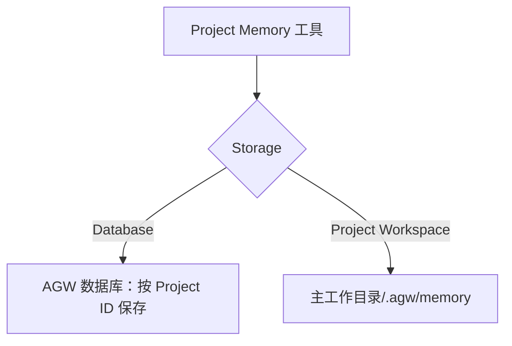

## 保留值得长期使用的信息

对话可以结束，但工作习惯和项目知识往往需要继续保留。AGW 提供两类 Memory，让 Agent 在后续工作中使用已保存的信息。

| 记忆 | 适合保存 | 使用范围 |
| --- | --- | --- |
| User Memory | 个人偏好、常用表达方式、长期背景 | 当前用户，可跨 Project 使用 |
| Project Memory | 项目约定、关键决策、工作说明 | 当前项目的工作上下文 |

为 Agent 或 Project 配置相应的 Memory 能力后，可以让 Agent 保存需要复用的信息，并在后续会话中检查或更新。记忆需要明确维护，不等于自动永久保存和注入全部聊天记录。User Memory 按用户隔离；Project Memory 的范围还取决于项目及所选存储方式，共用工作目录的文件型记忆也会共用。External Agent（Claude Code、Codex、Pi）只会读到已有的 User Memory（最多 50 条）作为上下文，没有记忆工具，不能保存或更新记忆；在 Agent 或 Project 上配置的 Project Memory 对它们不生效。


{caption="AGW Desktop：User Memory、Project Memory 和 Background Agents 可在工具能力中配置。"}

## Project Memory 的两种存储模式

Project Memory 提供 **Database** 和 **Project Workspace (Primary directory: .agw/memory)** 两种存储方式，默认使用 Project Workspace。两者都让 Agent 使用同一组记忆工具来保存、查找、读取和更新项目知识，区别在于内容保存在哪里、如何共享及备份。

| 对比项 | Database（数据库） | Project Workspace（文件系统，默认） |
| --- | --- | --- |
| 保存位置 | AGW 使用的数据库 | 主工作目录下的 `.agw/memory/` |
| 记忆归属 | 按 Project ID 区分 | 按实际工作目录区分 |
| 同一 Project 的不同 Agent / 会话 | 使用相同数据库模式时共享记忆 | 使用相同工作目录和文件系统模式时共享记忆 |
| 两个 Project 使用同一工作目录 | 仍分别保存各自的数据库记忆 | 会读写同一个记忆目录 |
| 备份方式 | 随 AGW 数据库备份 | 随项目文件备份，包含隐藏目录 `.agw/memory/` |
| 适合场景 | 希望由 AGW 集中管理，不在项目目录生成记忆文件 | 希望直接查看文件，或让记忆随工作目录一起迁移 |

### Database：由 AGW 集中保存

选择 **Database** 后，记忆内容保存在 AGW 当前配置的数据库中。它仍以文件名组织内容，但不会在项目工作目录中生成对应的记忆文件；Agent 通过 Project Memory 工具读取这些记录。

记忆按 Project ID 区分。同一个 Project 中使用数据库模式的 Agent 可以复用已有记忆；即使另一个 Project 指向同一个工作目录，也不会因此共用这份数据库记忆。修改主工作目录不会改变数据库记忆所属的 Project。

这种方式适合希望统一备份和管理数据的部署。备份时应按 AGW 数据备份流程保留数据库及所需的加密密钥；只复制代码目录不会带走数据库记忆。在多执行节点部署中，共享数据库也意味着这些节点可以访问同一份项目记忆，仍须通过项目访问权限检查。

### Project Workspace：保存为项目目录中的文件

选择 **Project Workspace (Primary directory: .agw/memory)** 后，记忆保存在实际执行主机的主工作目录中。例如，Project 的 Workspace 为 `/work/demo`，记忆目录就是：

```text
/work/demo/
└── .agw/
    └── memory/
        ├── coding-conventions.md
        ├── coding-conventions_description.md
        └── memories.md
```

上例中，`coding-conventions.md` 是记忆正文，`coding-conventions_description.md` 是保存时提供的可选说明，`memories.md` 是 AGW 维护的记忆索引。目录固定在主工作目录下，不会随 Files 界面选择的附加目录而改变。

这种方式方便直接查看文件，也可以自行决定是否将记忆纳入 Git 或项目文件备份。AGW 不会自动提交这些文件；备份和迁移时要确认没有遗漏隐藏目录。通过记忆工具写入或删除内容会同步维护索引；直接修改文件后，索引不一定随之更新，因此日常维护优先使用记忆工具。

两个 Project 如果指向同一个实际工作目录，会共用其中的 `.agw/memory/`，即使它们的 Project ID 不同。修改 Workspace 后，Agent 会使用新位置下的记忆，原目录里的文件不会自动搬过去。在 Docker 中，应持久化挂载工作目录；在多节点部署中，各执行节点需要看到同一份目录内容，仅有相同的路径字符串并不足够。



## 如何配置与验证

前提：已有可运行的自定义 Agent 和 Project；文件系统模式还需要执行主机能够读写主工作目录。

1. 打开 Agent 或 Project 的 **Tools** 配置，选中 **Project Memory** ToolBlock。
2. 在卡片展开后的 **Storage** 中选择 **Database** 或 **Project Workspace (Primary directory: .agw/memory)**，保存配置。希望项目内统一使用时，优先在 Project 中配置。
3. 在该 Project 的新回合中，让 Agent 保存一条明确的项目约定，例如：“将项目统一使用 UTC 的约定保存到 `time-conventions.md`，并添加简短说明。”写入操作仍受模式与审批设置约束。
4. 新建同一 Project 下的会话，使用具有相应记忆能力且存储模式一致的 Agent，让它列出并读取这条记忆。应能读到之前保存的内容。
5. 文件系统模式可同时检查 `.agw/memory/` 中的文件；数据库模式不会在那里生成文件，应通过记忆工具验证。

两种模式是独立的数据来源，**切换 Storage 不会自动复制、合并或删除另一种模式中的记忆**。需要迁移时，先备份原存储，读取要保留的正文和说明，再切换模式并通过记忆工具重新写入，最后核对内容。修改配置后使用新回合验证，已经运行的回合仍使用开始时的配置。

## Agent 如何使用已保存的记忆

Project Memory 会向模型提供记忆索引，再由 Agent 按需读取相关正文。当前自动生成的索引最多包含 50 条，更多记忆仍可通过列表和搜索工具查找；并不是每次请求都会发送全部记忆正文。

建议每份记忆围绕一个主题，使用清楚的文件名和简短说明。约定变化后更新原条目，过期信息及时删除，避免多份互相矛盾的说明影响后续任务。User Memory 则始终保存在数据库中，按用户隔离，不受这里的 Storage 选项影响。

## 实现与参考

- [Project Memory 存储选择](https://github.com/zxyao145/agw/blob/main/src/server/Agw.Tools/Impl/ToolBlocks/ProjectMemory/ProjectMemoryToolBlock.cs)
- [记忆工具与索引](https://github.com/zxyao145/agw/blob/main/src/server/Agw.Tools/Impl/ToolBlocks/ProjectMemory/ProjectMemoryProvider.cs)
- [备份与升级]()
