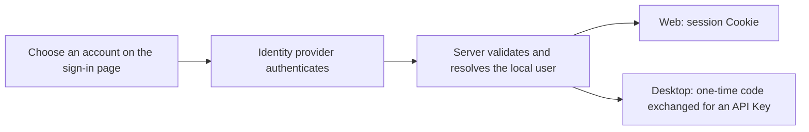

## Use an existing account to reach your own workspace

Once an operator enables identity providers on Server, the sign-in page shows “Continue with …” buttons. Authenticate with an organization account such as Keycloak, Microsoft Entra ID, or Google, or with an OAuth2 service such as GitHub, and you reach AGW without a shared administrator password.

The first sign-in with an account creates an isolated local user and prepares its default Project. From then on, its agents, projects, conversations, integration connections, and API Keys belong to that user and stay invisible to others. The administrator account is unchanged.

## Sign-in methods

| Method | Client | Resulting credential |
| --- | --- | --- |
| Third-party account | Web | Browser session Cookie |
| Third-party account | Desktop | API Key issued by Server |
| Administrator password | Web | Browser session Cookie |
| API Key | Desktop, Mobile, automation | Manually configured API Key |

With no provider configured, the administrator password and API Keys remain available. Mobile connects with an API Key.

## Get started

1. Ask the operator to enable a provider on Server and register AGW's callback URL at that provider.
2. Web: open the Server URL, choose the account button on the sign-in page, and return to the page you requested.
3. Desktop: choose “Sign in with …” in the Server profile, complete authentication in the system browser, and return to the Desktop window.
4. Check that the Project list holds that account's data. The Desktop Server profile then offers a “Sign out” button.

Desktop authenticates in the system browser. Server hands a one-time code back through `agw-desktop://auth/complete`, and Desktop exchanges it, together with its own verifier, for an API Key. The code is valid for two minutes and can be used once; the API Key is kept in the system credential store. Signing out in Desktop revokes that API Key.

## Scope and limits

The same person signing in through two providers becomes two separate users: identity comes from the provider's issuer and account identifier, never from a matching email address. There are no roles, administrator elevation, or per-key permission scopes; a third-party account receives ordinary user access.

Disabling a provider blocks new sign-ins and pending Desktop exchanges. Cookies and API Keys already issued are handled separately. Remote deployments require HTTPS URLs.

[Configure identity providers]() · [Connect Web, Desktop, and Mobile]()
