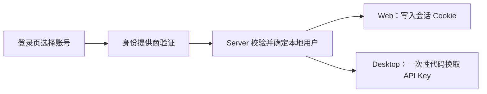

## 用已有账号进入自己的工作区

部署者在 Server 上启用身份提供商后，登录页会出现“Continue with …”按钮。你用组织账号（例如 Keycloak、Microsoft Entra ID、Google）或 OAuth2 服务（例如 GitHub）完成验证，就能进入 AGW，不需要再记一个管理员密码。

第一次用某个账号登录时，AGW 会为它创建一个独立的本地用户，并准备好默认 Project。此后 Agent、Project、对话记录、集成连接和 API Key 都归这个用户所有，其他用户看不到。管理员账号保持不变。

## 登录方式对照

| 方式 | 客户端 | 得到的凭据 |
| --- | --- | --- |
| 第三方账号 | Web | 浏览器会话 Cookie |
| 第三方账号 | Desktop | 由 Server 签发的 API Key |
| 管理员密码 | Web | 浏览器会话 Cookie |
| API Key | Desktop、Mobile、自动化程序 | 手动配置的 API Key |

身份提供商未配置时，管理员密码和 API Key 继续可用。Mobile 目前使用 API Key 连接。

## 开始使用

1. 请部署者在 Server 上启用身份提供商，并在提供商侧登记 AGW 的回调地址。
2. Web：打开 Server 地址，在登录页选择对应的账号按钮，完成验证后回到原来要访问的页面。
3. Desktop：在 Server 配置中选择“Sign in with …”，系统浏览器打开后完成验证，再回到 Desktop 窗口。
4. 检查 Project 列表是否为该账号的数据；Desktop 的 Server 配置中会出现“Sign out”按钮。

Desktop 使用系统浏览器完成验证，Server 通过 `agw-desktop://auth/complete` 把一次性代码交回 Desktop，Desktop 再用自己保存的校验值向 Server 换取 API Key。该代码两分钟内有效且只能使用一次，API Key 保存在系统凭据存储中。在 Desktop 中退出登录会撤销这个 API Key。

## 适用范围

同一个人在不同提供商下的账号是两个独立用户，AGW 按提供商签发者和账号标识判断身份，不按邮箱合并。当前不提供角色、管理员授权范围和 API Key 权限范围的设置；第三方账号登录得到的是普通用户身份。

停用某个提供商会阻止新的登录和尚未完成的 Desktop 换取，已经签发的 Cookie 和 API Key 需要单独处理。远程部署需要 HTTPS 地址。

[配置身份提供商]() · [连接 Web、Desktop 与 Mobile]()
