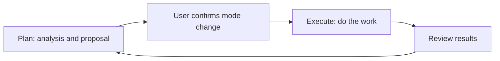

## Plan before taking action

Before changing code or starting a complex task, ask an agent to assess the situation and propose an approach. Configure the Mode ToolBlock on a custom agent or a Project to give custom agents Plan and Execute modes; on a Project, every custom agent running in that Project receives it.

| Mode | Useful for | Tool behavior |
| --- | --- | --- |
| Plan | Inspecting the situation, analyzing problems, proposing an approach | Only tools explicitly allowed in Plan are available |
| Execute | Carrying out an agreed approach | Configured tools remain subject to permissions and approval rules |

## Example: revising documentation

In Plan, ask: “Read the documentation and identify unclear terms and missing examples. Propose changes first.” Review the scope, then switch to Execute and ask the agent to apply the agreed changes. Inspect the diff to confirm that facts and limits were preserved.

Reading and editing still require the configured tools. Switching modes does not add missing file capabilities.

## Get started

1. Configure the Mode ToolBlock and required tools in the **Tools** tab of a custom agent or Project.
2. New turns start in Execute. In the Chat input, click **+** and choose **Plan mode**. When the **Plan** chip appears in the input, ask the agent to analyze the problem.
3. The proposal appears as a **Plan** card that you can copy. After agreeing on the approach, click × on the Plan chip to return to Execute. Respond in the UI when the agent requests a mode change.
4. Review the changes and results; return to Plan for further discussion if needed.

Plan restrictions depend on tool declarations and execution checks, not a prompt alone. Execute does not automatically approve every operation: working mode determines which tools can run, while approval settings determine whether a call needs confirmation. External agents have their own supported modes and permissions, which may differ from custom agents.

[Learn about tool approval]() · [Configure Tools and Skills]()
