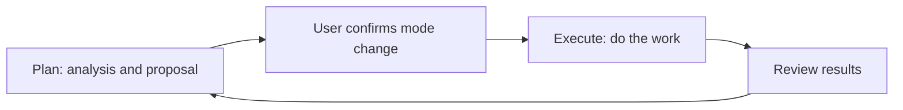

## Plan before taking action

Before changing code or starting a complex task, ask an agent to assess the situation and propose an approach. Custom agents configured with the Mode ToolBlock support Plan and Execute modes.

| Mode | Useful for | Tool behavior |
| --- | --- | --- |
| Plan | Inspecting the situation, analyzing problems, proposing an approach | Only tools explicitly allowed in Plan are available |
| Execute | Carrying out an agreed approach | Configured tools remain subject to permissions and approval rules |

## Example: revising documentation

In Plan, ask: “Read the documentation and identify unclear terms and missing examples. Propose changes first.” Review the scope, then switch to Execute and ask the agent to apply the agreed changes. Inspect the diff to confirm that facts and limits were preserved.

Reading and editing still require the configured tools. Switching modes does not add missing file capabilities.

## Get started

1. Configure the Mode ToolBlock and required tools on a custom agent.
2. Ask it to analyze the problem in Plan mode, confirm the current mode, and review its proposal.
3. Switch to Execute after agreeing on the approach. Respond in the UI when the agent requests a mode change.
4. Review the changes and results; return to Plan for further discussion if needed.

Plan restrictions depend on tool declarations and execution checks, not a prompt alone. Execute does not automatically approve every operation: working mode determines which tools can run, while approval settings determine whether a call needs confirmation. External agents have their own supported modes and permissions, which may differ from custom agents.

[Learn about tool approval]() · [Configure Tools and Skills]()
