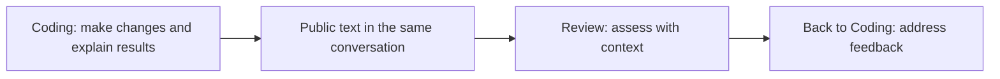

## Let agents build on each other’s work

Use different agents to analyze requirements, write code, and review results. When you switch targets within the same conversation in a Project, AGW supplies the receiving agent with new public text from the other targets, reducing the need to copy background information and progress updates.

For example, let Coding make a change, switch to Review to assess it using the discussion so far, then switch back to Coding to address the feedback.

## Get started

1. Prepare two working agents, such as Coding and Review.
2. Select a Project in Chat and start a conversation with Coding.
3. Wait for the current turn to finish, switch to Review in the same conversation, and explain the next task.
4. Check that its reply follows the discussion; repeat important constraints in your new message if needed.

## State the next task

After switching, try: “Review the changes described above for omissions and list only issues that need correction.” The receiving agent gets reusable public text, but still needs a clear request for its next step.

Briefly repeat important paths, acceptance criteria, and conclusions. To retain project conventions across conversations, use [Project Memory]().

## What carries over

Handoff carries public conversation text, not private reasoning, tool-call protocols, or an external tool’s entire internal state. Unfinished messages from interrupted or failed turns are not handed off either. It is limited to 32,000 characters, so older content may be left out. Files must still be accessible in the receiving agent’s environment. A new conversation does not automatically inherit another conversation’s discussion.

[Read the Chat guide]() · [Configure external agents for different purposes]()
