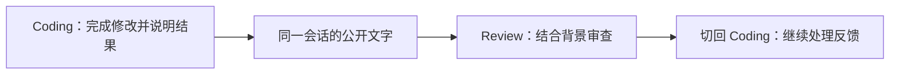

## 让不同 Agent 接力

分析需求、编写代码和审查结果可以交给不同 Agent。在同一个 Project 的同一个会话中切换目标时，AGW 会把其他目标新增的公开文字提供给接手的 Agent，减少反复复制背景和解释进度的工作。

例如，先让 Coding 完成修改，再切换到 Review，让它结合已有讨论审查结果；发现问题后，还可以切回 Coding 继续处理。

## 开始使用

1. 准备两个可运行的 Agent，例如 Coding 和 Review。
2. 在 Chat 中选择 Project，使用 Coding 开始会话。
3. 等待当前回合结束，在同一会话中切换到 Review，说明接下来要做什么。
4. 检查回复是否接上之前的讨论；重要约束可以在新消息中再次强调。

## 交接时说明下一步

切换 Agent 后，可以发送：“请根据上面的修改说明检查遗漏，只列出需要修正的问题。”接手的 Agent 会得到可复用的公开文字，但仍需要知道这一次的任务是什么。

重要的文件路径、验收条件和结论可以在交接消息中简要重述。若需要长期跨会话保留项目约定，可使用[项目记忆]()。

## 复用范围

复用的是会话中的公开文字，不包括私有推理、工具调用协议或外部工具的全部内部状态；被中断或失败的回合中未完成的消息也不会交接。交接内容最多 32,000 个字符，较早内容可能不在本次交接范围内；需要处理的文件仍须在接手 Agent 的工作环境中可访问。新建会话不会自动继承另一个会话的讨论。

[查看 Chat 使用指南]()；[为不同用途配置外部 Agent]()。
