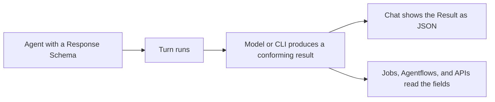

## Make replies readable by programs

Agents return Markdown text by default, which reads well but is awkward to parse. Configure a Response Schema on an agent and its final reply becomes a JSON object matching the JSON Schema you supply, so Jobs, Agentflows, and API callers can read named fields directly.

For example, a documentation reviewer can return an `issues` array whose entries contain `original`, `problem`, and `suggestion`. A scheduled run can then file each entry as a ticket instead of searching through prose.

## What you configure

Response Schema is a tab in the agent create and edit dialog. Its content is a JSON Schema object:

```json
{"type":"object","properties":{"answer":{"type":"string"}},"required":["answer"]}
```

Validation on save:

| Input | Result |
| --- | --- |
| Empty | Structured output is off; replies stay plain text |
| A valid JSON object | Saved and applied on the next turn |
| Invalid JSON, an array, or a scalar | Inline error; the save button stays disabled |

**JSON Schema draft-07** is recommended. Anthropic models require `type` set to `object`, `properties` as an object, and `required` as an array; use `"required": []` when every field is optional. A custom agent using an Anthropic Provider fails before sending the model request when any of these is missing.

## Supported targets

| Execution target | How the schema is passed |
| --- | --- |
| Custom agent (System) | Response format of the model request |
| Claude Code | The CLI's `--json-schema` argument |
| Codex | The turn's output schema |
| Pi | Not supported |

AGW passes the schema to the model or CLI, which generates the result; AGW itself does not validate each field against the schema. For a custom agent with Generate Turn Summary enabled, AGW requires exactly one valid JSON object or array in the turn's last complete reply; otherwise the turn fails and keeps its execution record. When a Result marked as JSON cannot be parsed, Chat shows “Invalid structured result: expected one JSON object or array.”

## Get started

1. Open Agents, edit an agent, and switch to Response Schema.
2. Paste a JSON Schema object, confirm no validation error appears, and save.
3. Run a small task in Chat and check that the final result is the JSON you expect.
4. Once the structure is stable, use that agent in a Job or an Agentflow step.



When a custom agent also has “Generate Turn Summary” enabled, AGW extracts that JSON from the turn's last complete reply as the turn's Result and does not call the Summary Model Provider. Chat shows this Result as literal JSON without Markdown rendering. Without that switch, the model still returns JSON text that follows the schema, but it is an ordinary reply rendered as Markdown and produces no Result, so **Only Stream Turn Result** in Conversation Settings has no effect on it. Claude Code and Codex produce a Result on every turn. The selected Summary Model Provider is preserved and applies again once the schema is cleared.

A schema describes the result structure only. It is never executed as code, and remote `$ref` targets are not fetched. Whether fields are filled correctly still depends on the selected model and the instructions, so review the content even when the JSON is well-formed.

[Create a custom agent]() · [Review external agent differences]()
