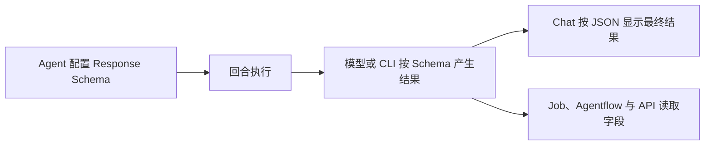

## 让回复可以被程序读取

Agent 默认返回 Markdown 文本，适合阅读，却不便于程序提取字段。在 Agent 上配置 Response Schema 后，最终回复会按你提供的 JSON Schema 返回一个 JSON 对象，Job、Agentflow 和调用 API 的程序可以直接读取其中的字段。

例如，审查文档的 Agent 可以返回 `issues` 数组，每一项包含 `original`、`problem` 和 `suggestion`；定时运行时把结果写入工单系统，无需再从整段文字里查找内容。

## 配置内容

Response Schema 是 Agent 创建和编辑对话框中的一个 Tab，内容为一个 JSON Schema 对象：

```json
{"type":"object","properties":{"answer":{"type":"string"}},"required":["answer"]}
```

保存时的校验规则：

| 输入 | 结果 |
| --- | --- |
| 留空 | 关闭结构化响应，保持文本回复 |
| 合法的 JSON 对象 | 保存并在下一回合生效 |
| 非法 JSON、数组或单个值 | 显示错误，保存按钮不可用 |

推荐使用 **JSON Schema draft-07**。Anthropic 模型要求 Schema 写明 `type` 为 `object`、`properties` 为对象、`required` 为数组；全部字段都可选时写成 `"required": []`。

## 支持范围

| 执行目标 | 传递方式 |
| --- | --- |
| 自定义 Agent（System） | 模型请求的响应格式 |
| Claude Code | CLI 的 `--json-schema` 参数 |
| Codex | Turn 的输出 Schema |
| Pi | 暂不支持 |

配置了 Schema 的回合必须产生符合 Schema 的结果。模型或 CLI 无法产生结构化结果时，该回合报错结束，保留原有的执行记录。

## 开始使用

1. 打开 Agents，编辑一个 Agent，切换到 Response Schema。
2. 粘贴 JSON Schema 对象，确认没有出现校验错误后保存。
3. 在 Chat 中运行一个小任务，检查最终结果是否为预期的 JSON。
4. 确认结构稳定后，把该 Agent 用于 Job 或 Agentflow 步骤。



自定义 Agent 开启“Generate Turn Summary”时，结构化模式直接使用这份最终 JSON，不再调用 Summary Model Provider；已选择的 Summary Model Provider 会保留，关闭 Schema 后继续生效。

Schema 只用于描述结果结构，不会被当作代码执行，也不会自动请求 `$ref` 指向的远程地址。字段能否被正确填写取决于所选模型的能力和指令写法，结构正确的 JSON 仍需要核对内容。

[配置自定义 Agent]() · [了解外部 Agent 的差异]()
