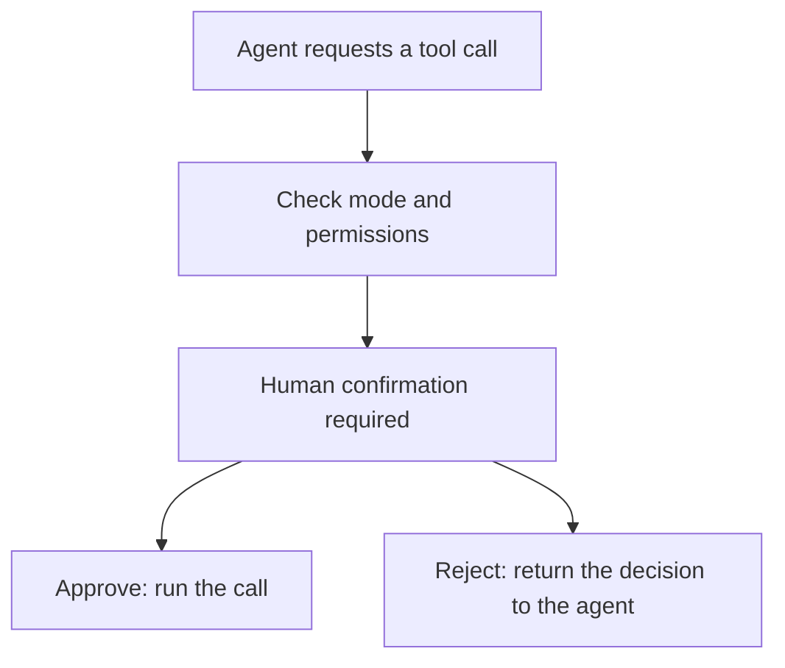

## Confirm before an operation

When an agent calls a tool, AGW can ask for confirmation according to your permission settings. Inspect the tool name and arguments before deciding whether it should proceed, particularly for file changes or command execution.

| Permission mode | Ordinary write and execution tools |
| --- | --- |
| Always ask | Ask for confirmation on every call |
| Allow same arguments | After approval, reuse a matching argument grant within the current session |
| Full access | Automatically approve ordinary tool calls |

Ordinary read-only tools generally need no execution approval. Approval requirements come from the tool’s declared permission, not whether its name or command looks harmless.

## Choose a permission mode

Use Always ask to inspect the arguments when first trying a write tool. For repeated operations in one session, Allow same arguments reuses approval only when the arguments match; changed arguments do not reuse that grant.

Before choosing Full access, check the agent’s tools and workspace. It reduces ordinary approval prompts, but results still need review.

## Get started

1. Select an agent that supports approval and choose a suitable permission mode in Chat.
2. Start a task. When an approval request appears, inspect the tool, arguments, and target paths.
3. Approve to continue, or reject the call and explain what you want changed.
4. Check the tool result against your expectations.

Full access does not bypass Plan restrictions or answer user-input requests and workflow HumanGates for you. Claude Code supports a native tool-approval bridge. The current Codex and Pi integrations support Full access only; the UI displays the modes supported by the target.

[Check external agent permissions]() · [Learn about workflow approvals]()
