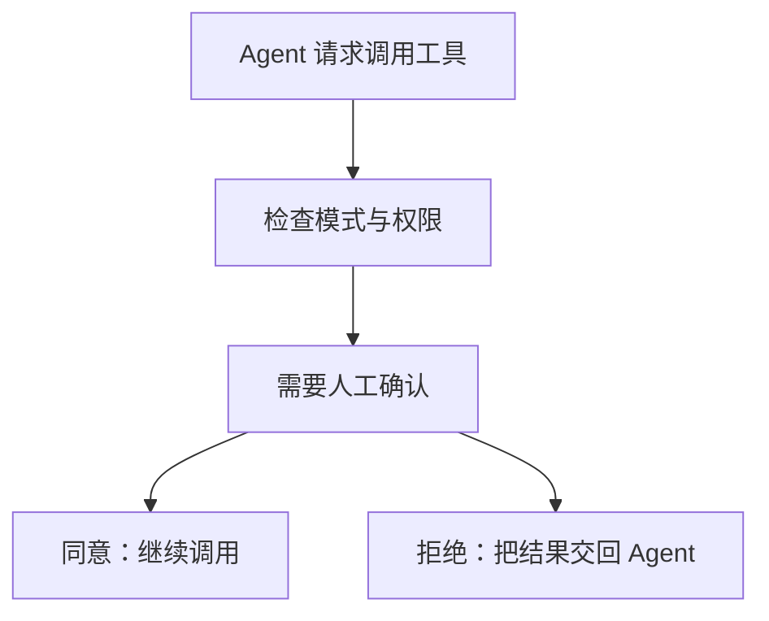

## 在操作前确认

Agent 调用工具时，AGW 可以根据权限设置请求你的确认。你可以先查看工具名称和参数，再决定是否继续，适合需要检查文件修改或命令执行的任务。

| 权限模式 | 普通写入与执行工具的行为 |
| --- | --- |
| Always ask | 每次调用都请求确认 |
| Allow same arguments | 首次确认后，在当前会话中复用匹配参数的授权 |
| Full access | 自动批准普通工具调用 |

普通只读工具通常不需要执行审批。工具的权限声明决定是否需要审批，不是根据名称或命令看起来是否安全来判断。

## 怎样选择权限模式

第一次使用某项写入工具时，可以选择 Always ask，逐次查看它实际提交的参数。需要在同一会话重复相同操作时，Allow same arguments 可以复用已经确认且参数匹配的授权；参数改变后不能沿用这份授权。

选择 Full access 前，应先确认 Agent 的工具范围和工作目录。它减少普通工具调用的确认步骤，但任务结果仍需要核对。

## 开始使用

1. 选择支持审批的 Agent，并在 Chat 中选择合适的权限模式。
2. 发起任务；出现审批请求时，检查工具、参数与目标路径。
3. 同意后继续执行，或拒绝该调用并补充你的要求。
4. 检查工具结果，确认实际操作符合预期。

Full access 不会跳过 Plan 的工具限制，也不会替你回答用户输入问题或工作流中的 HumanGate。Claude Code 支持原生工具审批桥接；当前 Codex 和 Pi 接入仅支持 Full access，界面只显示目标支持的权限模式。

[查看外部 Agent 的权限差异]() · [了解工作流人工审批]()
