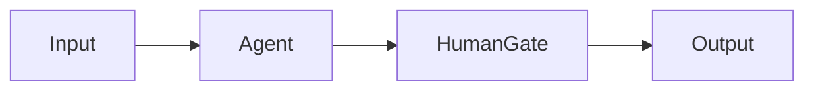
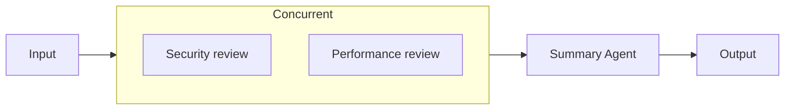

Agentflow means **Agent Workflow**: a workflow that connects several processing steps. One agent might prepare material, another review it, and a person approve the result. The canvas shows the steps, their inputs and outputs, and their order.

Verify each agent independently before connecting it. Start with one path from input to output, then add branches and approvals once it works.

## Build the first flow

1. Open the Agentflows editor and start with its single Input node.
2. Add an Agent node, select a verified agent, and connect Input to Agent.
3. Add and connect Output, save, then select the Agentflow in Chat and run it.
4. After the basic path works, introduce HumanGate, branches, or parallel nodes.

The editor canvas has **Undo** and **Redo** buttons at its top right, also available as Cmd/Ctrl+Z, Cmd/Ctrl+Shift+Z, or Ctrl+Y. Drag the dividers to resize the node palette and Inspector. With unsaved edits, the dialog shows **Unsaved changes** and asks **Discard unsaved changes?** before closing; unsaved drafts are not kept after the dialog closes.

Each flow in the Agentflows list has an **Enabled** switch and Run, Edit, Copy, View Mermaid chart, and Delete actions. Run opens Chat in a side drawer using the built-in default Project, which suits a quick trial; to run it in another Project, select the Agentflow in Chat. Disabled agents and agentflows are not offered in the editor's selectors.



HumanGate pauses for a person. Input mode shows a Response box with Submit and Interrupt buttons, and the submitted reply can drive downstream predicates. Approval mode offers only Approve and Reject. Interrupt and Reject both stop the workflow.


{caption="AGW Desktop: an existing Agentflow in the editor, showing nodes, edges, the node palette, and inspector. The flow was not run."}

## Primitive Nodes

Primitive nodes handle one step: receiving input, calling an Agent, adjusting messages, waiting for a person, or returning results. Select a node on the canvas, configure it in the Inspector, and connect it to its upstream and downstream steps.

### Input: enter the flow

Input passes the current user request into the graph. For example, “Review these changes” enters here when sent from Chat.

Every flow has exactly one Input with the fixed ID `input` and no incoming edges. Connect it to one step or use Fan Out to send input to multiple branches.

### Agent: perform a task

Select a configured Agent and optionally set the node name and instructions describing how to handle upstream results. For example, a code-review node can inspect incoming code and return problems and suggested fixes.

The node receives upstream content, runs the selected Agent, and passes its results downstream. The same Agent definition can appear in several nodes, each with its own model conversation history. Edges transfer task content rather than merging another node’s complete model session.

Verify the Agent’s model, tools, and workspace before adding it to a flow. Node instructions should also match the configuration supported by that Agent type.

### Workflow as Agent: reuse a subflow

Use **Select workflow** to choose an existing Agentflow as a step. Upstream messages become its input, and its output returns to the parent flow. This suits reusable processes such as collecting material and producing a summary.

Verify the subflow independently before adding it to a parent flow or block. References between flows cannot be recursive: A cannot call B if B calls A. Separate branches may reuse the same subflow.

### Prompt Adapter: add instructions

Use **System Prompt / Instructions** to describe how downstream content should be handled, such as “Respond with background, findings, and recommendations.” The node prepends these instructions to the current messages and forwards them.

Prompt Adapter does not call a model or perform translation, summarization, or data conversion itself. Connect an Agent after it to generate new content.

### Clear Messages: discard upstream messages

Clear Messages discards arriving messages and continues downstream with an empty message payload. No model configuration is needed. For example, once an earlier step has written results to project files, the next step can read those files without carrying a large amount of upstream text.

It does not delete Chat records or clear a downstream Agent’s existing session history. The next step needs clear instructions or accessible source material and cannot rely on the discarded content.

### Human Gate: request input or approval

Insert Human Gate where a person needs to confirm a result or provide information:

| Field | Usage |
| --- | --- |
| Human Step Mode | Choose Input to request information or Approval to request approval |
| Human Prompt | Explain what to supply or approve, such as “Confirm the release scope and list modules to exclude” |

Execution pauses until the request is handled through an interactive interface. In Input mode, a person writes a reply in Response and clicks Submit; the flow continues, and outgoing edge conditions can test that reply. In Approval mode, Approve continues the flow without any text. Interrupt and Reject both stop the flow. To return upstream for changes, use Input mode with a human reply and conditional routing.

For example, `Agent → Human Gate → Output` confirms a result. Conditions can also use agreed reply text to choose between revision and completion. Human nodes require a channel that can receive and answer interaction requests.

### Checkpoint: save a recovery boundary

The Checkpoint node is called `CheckpointMarker` in code. Set a recognizable **Checkpoint Name**, such as “Research complete,” and place it where execution progress should be saved.

After this node, the system saves a complete workflow checkpoint at the end of the corresponding execution stage. Chat shows each saved checkpoint as a card marked **Checkpoint**; click **Resume** on the card to restore that save. The button is disabled with “This checkpoint is unavailable” when it cannot be resumed. Resuming selects one specific saved occurrence, creates a new execution branch from that state, and removes conversation records after the saved boundary.

Resume requires the same user, Project, conversation, and Agentflow, an unchanged flow definition, and no conflicting execution. InProcess checkpoints remain resumable only while the original runtime still holds the occurrence. Distributed mode persists checkpoints in PostgreSQL and supports recovery across disconnects or Server restarts. A checkpoint is neither a database backup nor a button to rerun any arbitrary node.

### Output: return results and optionally summarize

Output emits arriving messages as flow results. A simple flow can connect `Agent → Output` directly.

A new Output node starts with **Generate Summary** on, and the flow cannot be saved until a **Summary Model Provider** is selected; turn the switch off when no summary is needed. With it on, an additional model call turns the results entering Output into a conclusion appended after them. Without it, the received messages pass through unchanged.

## Orchestration Blocks

Blocks organize multiple participants into one step. Participants can be Agents or nested Agentflows. The node palette lists the four blocks as **Concurrent Block**, **Handoff Group**, **GroupChat Room**, and **Magentic Team**. Add a block, use its member controls to add participants, then click **Open** to inspect members and configure their names and responsibilities. Parent-flow edges connect to the block, which schedules its members internally.

| Block | Collaboration | Suitable tasks |
| --- | --- | --- |
| Concurrent | Process the same input in parallel and wait for all results | Independent analysis or reviews from different perspectives |
| Handoff | Start with the first participant and transfer work as needed | Triage and specialist routing |
| Group Chat | Participants speak in order | Bounded discussion and iterative improvement |
| Magentic | A Manager plans and coordinates the team | Tasks requiring dynamic planning and delegation |

### Concurrent: work in parallel

Add participants that can work independently, such as security and performance reviewers. The block sends the same input to every member concurrently, waits for all of them to finish, and combines their response messages for the next step.

Combining messages does not deduplicate opinions or generate a unified conclusion. Add a summarizing Agent afterward or enable Output summarization if needed. Use sequential edges for dependent steps, and avoid conflicting writes when members work on the same files.



Both reviewers receive the same input. The summary Agent processes their results after both finish.

### Handoff: transfer work as needed

The first participant receives the task and can transfer it to another member according to their responsibilities. For example, a triage Agent routes a question to a billing or technical specialist. When the block finishes, its results continue downstream in the parent flow.

| Field | Purpose |
| --- | --- |
| Handoff Instructions | Explain when to transfer work and which participant should receive it |
| Return To Previous | Allow a transfer back to the previous participant |
| Autonomous Mode | Enable automatic continuation |
| Autonomous Turn Limit | Bound continuation turns in autonomous mode |
| Continuation Prompt | Prompt used for automatic continuation |

Define clear responsibilities and transfer conditions, and set a reasonable autonomous limit. Handoff does not guarantee that every participant runs. If every step must execute, sequential parent-flow edges are more direct.

### Group Chat: take turns

Add participants and check their order. The current implementation schedules them in Round Robin order to contribute to the incoming task, stopping at **Max Rounds**.

For example, an author proposes a solution, a reviewer identifies problems, and the author revises it. `Max Rounds` bounds scheduling iterations; it does not mean that every member speaks that many times. The current default is 10 when unset.

Group Chat suits bounded collaboration with clear discussion rules. It does not automatically wait for consensus. Add a summary Agent afterward when a single conclusion is needed.

### Magentic: coordinate through a Manager

Add participants and select a **Manager**. If none is specified, the first participant is the Manager and the others form the team. The Manager plans and assigns work based on the task. This suits work where initial research determines which follow-up analyses are needed.

| Field | Purpose |
| --- | --- |
| Manager | Participant responsible for planning and coordination |
| Max Rounds | Overall scheduling-round limit |
| Max Stalls | Limit tolerance for lack of progress |
| Max Resets | Bound replanning or resets |
| Require Plan Signoff | Require confirmation of the plan |

Give the Manager clear goals, completion criteria, and member responsibilities. Set round, stall, and reset limits appropriate to the task. Plan signoff requires an interactive execution entry point. After coordination completes, block output continues downstream. Execution does not guarantee a fixed participant order or a call to every member.

Planning and coordination usually require additional model calls compared with fixed sequential or parallel execution. When the steps are already clear, ordinary node connections or Concurrent are easier to verify.

## Advanced Config JSON

Advanced Config JSON is the JSON representation of a node’s additional settings. It edits the same configuration as the Inspector controls. Start with the form, then use JSON to inspect or adjust the complete settings.

Use double quotes, literal `true` or `false` for switches, and unquoted numbers. Do not include comments or trailing commas. Enter one object, such as `{}`, rather than an entire workflow. Names, Agent or workflow selections, and System Prompt / Instructions have separate fields and do not belong here.

### Primitive node fields

| Node | JSON fields | How to configure |
| --- | --- | --- |
| Input | None | Fixed entry; no advanced configuration field |
| Agent | No dedicated fields currently | Leave empty or use `{}`; use the Agent selector and instructions |
| Workflow as Agent | No dedicated fields currently | Leave empty or use `{}`; select the subflow separately |
| Prompt Adapter | No dedicated fields currently | Leave empty or use `{}`; enter instructions separately |
| Clear Messages | None | No advanced configuration field |
| Human Gate | `humanMode`, `humanPrompt` | Interaction mode and user-facing prompt |
| Checkpoint | `checkpointName` | Use Checkpoint Name; no advanced configuration field |
| Output | None (configured through the Generate Summary UI) | Use Generate Summary and Summary Model Provider; no advanced JSON editor is shown |

Human Gate example:

```json
{
  "humanMode": "approval",
  "humanPrompt": "Confirm the review results before continuing."
}
```

Use `input` to request information or `approval` for approval. When unset, both the editor and the runtime treat the mode as `approval`. `humanPrompt` is the text shown to the user.

Checkpoint Name is stored as:

```json
{ "checkpointName": "Research complete" }
```

The Output runtime configuration currently has one field, `enableSummary`, but Output does not show an Advanced Config JSON editor. Configure it directly through the **Generate Summary** controls in the Inspector:

- `true` (the value for a new Output node): after the main flow succeeds, use the selected Model Provider to append a Markdown summary to the final output.
- `false`: pass through the messages entering the Output without an extra model call. The Server also treats a missing field as `false`.

When summary generation is enabled, both conditions below must hold, or the editor's save button stays disabled:

1. The Output Inspector has a valid **Summary Model Provider** selected.
2. The workflow has exactly one Output node; otherwise the editor shows “Summary requires exactly one Output node”.

The summary model receives the messages entering that Output. The editor provides no Instructions field for Output. The Model Provider is workflow configuration; adding `modelProviderId` or `summaryModelProviderId` to node JSON does not replace it, and arbitrary additional keys do not add Output capabilities.

### Block members

All four blocks use `participantNodeIds`: **canvas node IDs**, not Agent definition IDs or display names. The editor provides Members, Max Rounds, Manager, and the other block-specific controls, so orchestration blocks do not show an Advanced Config JSON editor. The JSON below documents the shape those controls save; users do not need to enter it manually.

Replace the example IDs `node-a` and `node-b` with real Agent or Workflow as Agent node IDs in the current graph. Concurrent requires at least one member; Handoff, Group Chat, and Magentic require at least two.

### Concurrent

Specify parallel members. There are no round-limit or Manager settings:

```json
{ "participantNodeIds": ["node-a", "node-b"] }
```

### Handoff

```json
{
  "participantNodeIds": ["node-a", "node-b"],
  "handoffInstructions": "The first member triages the question and transfers specialist work to the other member.",
  "enableReturnToPrevious": true,
  "autonomous": true,
  "autonomousTurnLimit": 6,
  "continuationPrompt": "Continue working on the unfinished task."
}
```

The first member receives the task. `handoffInstructions` describes transfer rules; `enableReturnToPrevious` allows returning to the previous member; `autonomous` enables automatic continuation. The last two fields apply only when autonomous is true and specify its turn limit and continuation prompt. Both switches remain off when omitted. The example number is not a default.

### Group Chat

```json
{
  "participantNodeIds": ["node-a", "node-b"],
  "maxRounds": 6
}
```

Members take turns in array order. Set `maxRounds` to a positive integer limiting scheduling iterations; AGW uses 10 when omitted. It is not a separate speaking allowance for each member.

### Magentic

```json
{
  "participantNodeIds": ["node-a", "node-b"],
  "managerNodeId": "node-a",
  "maxRounds": 10,
  "maxStalls": 3,
  "maxResets": 2,
  "requirePlanSignoff": true
}
```

`managerNodeId` must identify a listed member; the first member is used when omitted. `maxRounds` limits scheduling rounds, `maxStalls` controls tolerance for lack of progress, and `maxResets` bounds replanning or resets. Enter positive integers in the editor. `requirePlanSignoff` requests plan confirmation. These are illustrative values; omitted optional limits and signoff settings use the underlying workflow framework’s defaults.

### Before saving

Check that member IDs exist, value types are correct, and each setting belongs to the current node. Advanced Config JSON is not a script entry point; arbitrary keys do not add capabilities. After editing JSON, check that the Inspector form shows what you expect, then save and verify with a small task.

Branch predicates go in an **edge’s** **Predicate JSON**. If / Else If edges do not show Advanced Config JSON; set branch order with **Move branch up** and **Move branch down**. Neither belongs in node Advanced Config JSON.

## Routing and constraints

Exactly one Input must have ID `input` and no incoming edges. Runtime-visible nodes must be reachable from it. Node and edge IDs must be unique, with valid references.

Connections determine which steps run after a node finishes. Choose one in the edge's **Edge Type**:

| Routing | Meaning | Design consideration |
| --- | --- | --- |
| Direct | Continue to the next step | Use for a fixed sequence |
| Fan Out | Send input to several branches; every branch whose predicate matches runs | Branches should process the input independently |
| If / Else If | Check conditions in order and send the message only to the first match | Add an Else edge to handle unmatched conditions |
| Fan-in Barrier | Wait for every source in the group before continuing | Every required branch must be able to arrive |

Do not mix Direct, Fan Out, and If / Else If from one source. For example, If / Else If selects only one branch; a later barrier waiting for all branches may never receive everything it needs.

Controlled cycles are supported when graph safety rules are met. Verify exit conditions before adding nested workflows, orchestration blocks, and checkpoints so failures remain easy to locate.

## Verify and inspect history

Test success, unmatched conditions, human rejection, and waiting paths separately. While the flow runs, Chat shows the input each node receives as its own input bubble in the current turn, keeping the upstream node attribution, so you can check execution order. CheckpointMarker identifies a full MAF checkpoint boundary; recovery is not an arbitrary restart at a chosen node. Keep a working flow before editing, and inspect execution records for node attribution.

## Implementation and references

- [Graph contract](https://github.com/zxyao145/agw/blob/main/docs/approachs/2.Agentflow.md)

- [Node and block configuration](https://github.com/zxyao145/agw/blob/main/src/clients/packages/agents/src/ui-web/pages/agentflows/components/visual-agentflow-builder.tsx)
- [Orchestration block execution](https://github.com/zxyao145/agw/tree/main/src/server/Agw.Agents.Execution/Agentflows/Workflows/Builders)
