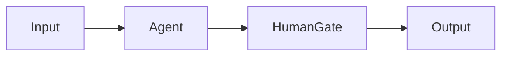
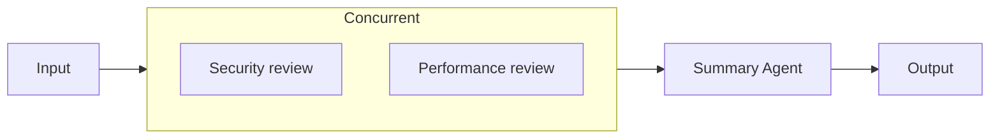

Agentflow 把多个处理步骤连接成工作流。例如，先由一个 Agent 整理材料，再由另一个 Agent 审查，最后请人确认结果。各步骤的输入、输出和先后关系都可以在画布中查看。

先单独验证每个 Agent 能完成自己的任务，再把它们接成流程。第一版建议只保留一条从输入到输出的路径，验证后再添加分支和审批。

## 创建第一个流程

1. 打开 Agentflows 编辑器，从唯一的 Input 节点开始。
2. 添加一个 Agent 节点，选择已验证的 Agent，连接 Input 与 Agent。
3. 添加 Output 并连接输出，保存后在 Chat 中选择该 Agentflow 运行。
4. 基础路径通过后，再加入 HumanGate、分支或并行节点。

HumanGate 暂停并请求人工批准；批准后的回复可用于下游条件判断，拒绝会停止流程。

{caption="AGW Desktop：一个已有 Agentflow 的编辑视图，展示节点、连线、节点面板和属性检查器；此图未运行流程。"}

## Primitive Nodes（基础节点）

基础节点负责一个明确步骤：接收输入、调用 Agent、调整消息、等待人工处理或输出结果。在画布中选中节点后，在右侧 Inspector 配置其属性，再用连线确定前后关系。

### Input：流程入口

Input 将本次用户输入传入流程。例如，在 Chat 中发送“审查这次修改”，这条请求会从 Input 进入下游节点。

每个流程只有一个 Input，ID 固定为 `input`，不能接收入边。可以从它连向一个节点，也可以通过 Fan Out 将输入分发给多个分支。

### Agent：执行一项任务

选择一个已配置的 Agent，并按需填写节点名称和指令，说明它如何处理上游结果。例如，让“代码审查”节点检查上游提交的代码，并列出问题与修改建议。

节点接收上游内容，调用所选 Agent，再把执行结果传给下游。同一个 Agent 定义可以出现在多个节点中，各节点的模型会话历史分别保存；连线会传递任务内容，不会把另一个节点的完整模型会话合并过来。

先单独验证所选 Agent 的模型、工具和工作目录，再接入流程。节点指令也应符合该 Agent 类型支持的配置方式。

### Workflow as Agent：复用子流程

通过 **Select workflow** 选择已有 Agentflow，将它作为一个步骤使用。上游消息成为子流程输入，子流程输出返回主流程，适合复用“收集资料 → 整理摘要”这样的固定过程。

先确认子流程可以独立运行，再将它放入主流程或编排块。流程之间不能形成递归引用，例如 A 调用 B、B 又调用 A；同一个子流程可以在不同分支中复用。

### Prompt Adapter：补充处理指令

在 **System Prompt / Instructions** 中填写下游需要遵循的说明，例如“根据以下材料，按背景、问题、建议三个部分回答”。节点会把这段指令加到当前消息前面，再传给下游。

Prompt Adapter 本身不调用模型，也不会直接完成翻译、摘要或数据转换。要实际生成新内容，需要在后面连接 Agent。

### Clear Messages：清除上游消息

Clear Messages 丢弃到达该节点的消息，以空消息继续下游流程，无需配置模型。例如，前一步已经把结果写入项目文件，下一步只需从文件重新读取，就可以用它避免继续携带前一步的大段文本。

它不会删除 Chat 记录，也不会清空下游 Agent 已有的会话历史。下游需要明确的任务指令或可读取的资料，不能再依赖已被丢弃的上游内容。

### Human Gate：人工输入或审批

在需要人确认或补充信息的位置插入 Human Gate，并配置：

| 字段 | 如何使用 |
| --- | --- |
| Human Step Mode | 选择 Input 收集补充信息，或选择 Approval 请求审批 |
| Human Prompt | 写清需要人提供什么或批准什么，例如“请确认发布范围，并填写需要排除的模块” |

流程到达这里会暂停，在交互界面等待处理。批准后继续执行，人工回复可以用于下游连线的条件判断；拒绝会停止流程。因此，“需要修改”若应返回上游继续处理，应通过批准时的反馈和条件分支表达。

例如：`Agent → Human Gate → Output` 用于确认结果；也可以根据人工回复中的约定文字选择“修改”或“完成”分支。使用人工节点时，需要能够接收和回应请求的交互通道。

### Checkpoint：保存恢复边界

Checkpoint 节点在代码中称为 `CheckpointMarker`。在 **Checkpoint Name** 中填写易于辨认的名称，例如“资料收集完成”，并将它放在希望保留执行进度的位置。

经过该节点后，系统在对应执行阶段结束时保存完整工作流检查点。恢复时选择的是一次具体保存记录，会从该状态创建新的执行分支，并移除当前会话中保存边界之后的记录。

恢复要求仍是同一用户、Project、会话和 Agentflow，流程定义未改变，且没有冲突的执行。单机 InProcess 检查点只在原运行时仍持有该记录时可恢复；Distributed 模式将检查点持久化到 PostgreSQL，可以跨断线或 Server 重启恢复。它不等于数据库备份，也不是任意节点的重新运行按钮。

### Output：输出结果与可选总结

Output 将到达它的消息作为流程结果输出。简单流程可直接连接 `Agent → Output`。

若希望将多个结果整理成一份结论，可以启用节点的总结选项，配置总结使用的 Model Provider，并填写总结要求。启用后会额外调用模型，在原有结果后追加总结；未启用时直接输出收到的消息。

## Orchestration Blocks（编排块）

编排块把多个参与者组织成一个步骤，参与者可以是 Agent 或子 Agentflow。添加编排块后，通过成员选择控件加入参与者；点击 **Open** 查看块内成员，分别配置名称和职责。主流程的连线连接到编排块，由块内部安排成员执行。

| 编排块 | 协作方式 | 适合场景 |
| --- | --- | --- |
| Concurrent | 多个参与者同时处理相同输入，等待全部结果 | 多角度审查、独立分析 |
| Handoff | 从首个参与者开始，根据任务需要交接 | 分诊、专家转交 |
| Group Chat | 参与者按顺序轮流发言 | 多轮讨论、交替改进 |
| Magentic | Manager 制订计划并协调团队 | 需要动态拆解和调度的任务 |

### Concurrent：并行处理

加入多个能够独立完成工作的参与者，例如安全审查 Agent 和性能审查 Agent。块会把相同输入交给所有成员并发执行，等待全部完成后，将各自的响应消息合在一起传给下游。

这种合并不会自动消除重复意见或生成统一结论。如需汇总，可以再连接一个 Agent，或启用 Output 的总结。成员之间有先后依赖时，应使用顺序连线；多个成员操作同一批文件时，还需避免互相覆盖。

图中两个审查成员接收相同输入，汇总 Agent 在它们全部完成后处理结果。

### Handoff：按需交接

第一个参与者是入口，负责先接收任务，再根据职责交给其他成员。例如，分诊 Agent 判断用户问题属于账单还是技术问题，然后转交对应专家。块完成后，结果继续传给主流程下游。

| 字段 | 作用 |
| --- | --- |
| Handoff Instructions | 说明何时交接，以及应交给哪类参与者 |
| Return To Previous | 允许交接后返回上一个参与者 |
| Autonomous Mode | 启用自动继续执行的模式 |
| Autonomous Turn Limit | 限制自治模式继续执行的轮次 |
| Continuation Prompt | 自动继续时使用的提示词 |

应为成员写清职责和交接条件，并为自治模式设置合理上限。Handoff 不保证每个成员都会被调用；如果每一步都必须执行，使用主流程的顺序连线更直接。

### Group Chat：轮流讨论

加入参与者并确认成员顺序。当前实现按 Round Robin（轮询）顺序安排发言，成员围绕传入的任务轮流贡献结果，达到 **Max Rounds** 限制后结束。

例如，作者提出方案，审查者指出问题，再由作者修订。`Max Rounds` 限制调度迭代次数，不要理解成“每个成员都发言这么多次”；未配置时当前实现使用 10。

Group Chat 适合有明确讨论规则的有限轮协作。它不会自动等到所有成员达成共识；需要统一结论时，可以在块后增加总结 Agent。

### Magentic：Manager 协调团队

加入参与者，并选择 **Manager**。未指定时使用第一个参与者，其余成员组成执行团队。Manager 根据输入任务安排计划和成员工作，适合需要在执行过程中调整分工的任务，例如调研后再决定需要哪些补充分析。

| 字段 | 作用 |
| --- | --- |
| Manager | 负责计划与协调的参与者 |
| Max Rounds | 整体调度轮次上限 |
| Max Stalls | 控制无进展状态的容忍次数 |
| Max Resets | 限制重新规划或重置的次数 |
| Require Plan Signoff | 要求对计划进行确认 |

为 Manager 写清目标、完成标准及成员职责，并根据任务设置轮次、停滞和重置上限。启用计划确认时，需要可交互的执行入口。Manager 完成协调后，块的输出继续交给主流程下游；任务不保证按固定成员顺序执行，也不保证每个成员都会被调用。

与固定顺序或并行执行相比，这种模式通常需要额外的模型调用来规划和协调。若步骤已经明确，先采用普通节点连线或 Concurrent 更容易检查结果。

## 路由与约束

必须恰好有一个 ID 为 `input` 的 Input，且无入边；可运行节点必须从它可达。节点、边 ID 必须唯一，引用必须有效。

连线决定一个节点结束后，哪些步骤继续执行：

| 连线方式 | 含义 | 设计时注意 |
| --- | --- | --- |
| Direct | 直接交给下一步 | 适合固定顺序 |
| FanOut | 同时分发给多个分支 | 各分支应能独立处理输入 |
| Switch | 按顺序检查条件，选择第一个匹配分支 | 可以配置 Default，在条件都不匹配时使用 |
| FanInBarrier | 等待同组的各个来源到齐，再继续 | 每个被等待的分支都必须有机会到达 |

同一来源节点不要混用 Direct、FanOut 和 Switch。例如，Switch 只会选择一条分支，却让后续汇合点等待所有分支，就可能一直等不到结果。

工作流允许符合安全规则的受控循环。需要重复处理时，先验证退出条件，再增加嵌套流程、编排块或检查点，避免一次加入太多分支而难以定位问题。

## 验证与历史

分别测试正常路径、条件不匹配、人工拒绝及需要等待的路径。CheckpointMarker 标记完整 MAF 检查点的边界；恢复不是随意从某个节点重新开始。修改流程前保留可工作的版本，查看执行记录确认节点归属。

## 实现与参考

- [Graph contract](https://github.com/zxyao145/agw/blob/main/docs/6.Agentflow.md)

- [Node and block configuration](https://github.com/zxyao145/agw/blob/main/src/clients/packages/agents/src/ui-web/pages/agentflows/components/visual-agentflow-builder.tsx)
- [Orchestration block execution](https://github.com/zxyao145/agw/tree/main/src/server/Agw.Agents.Execution/Agentflows/Workflows/Builders)
